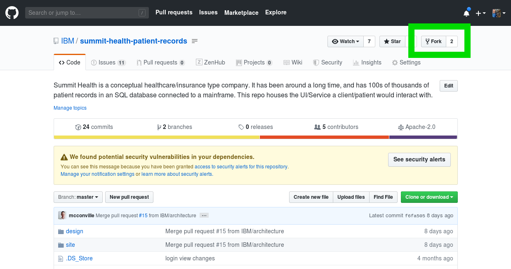
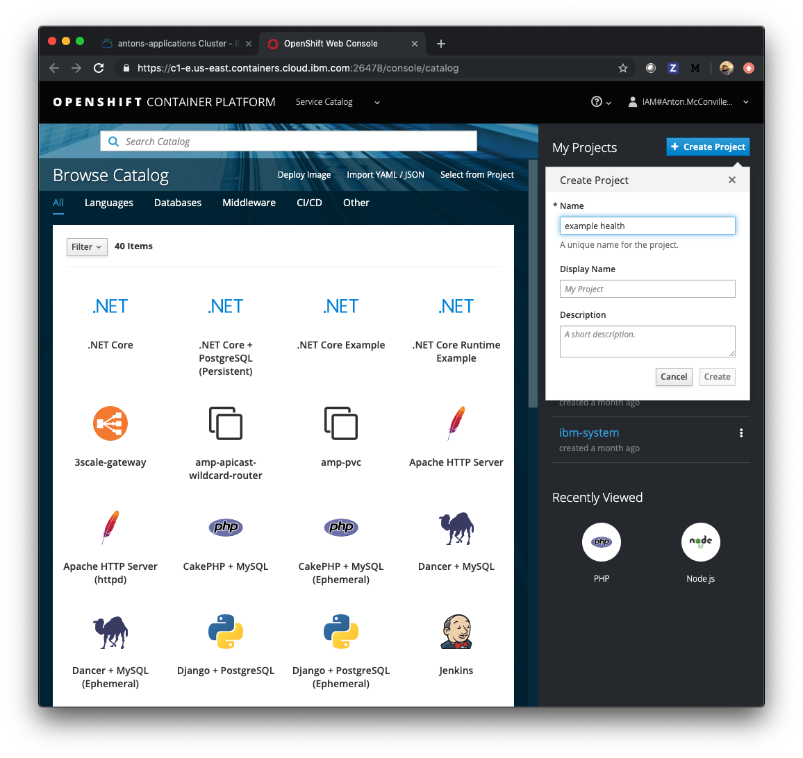
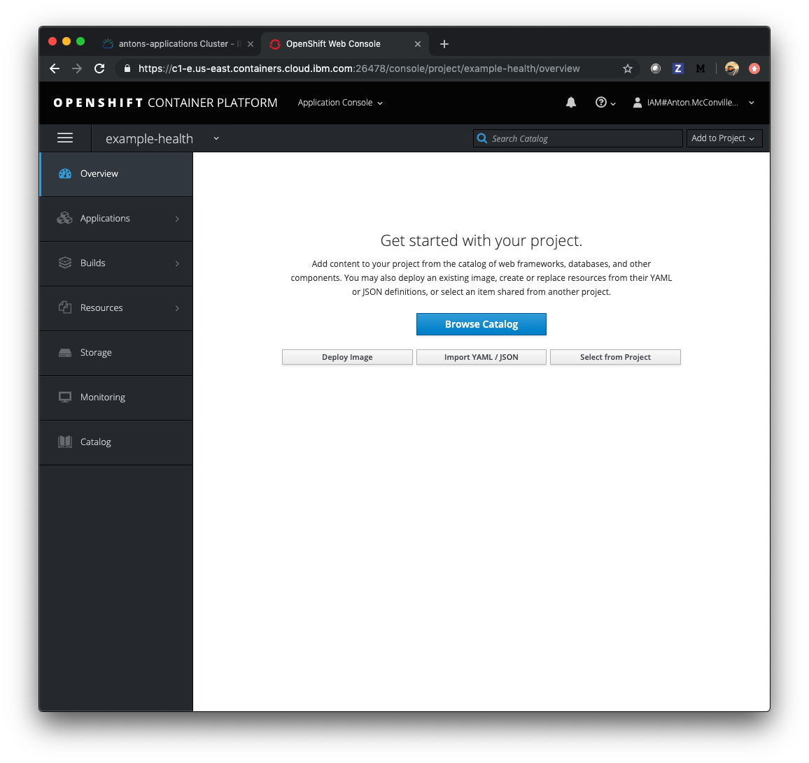
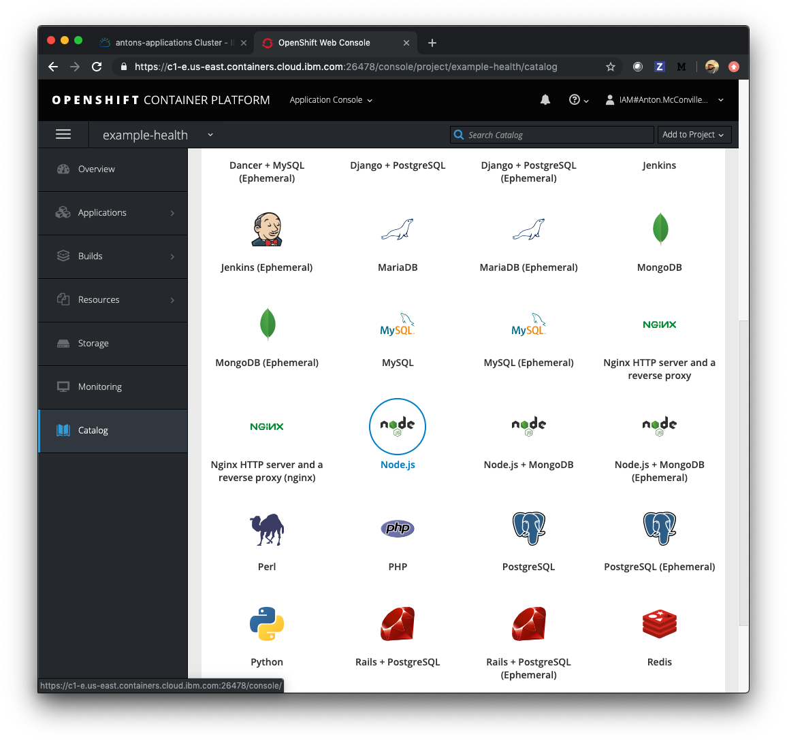
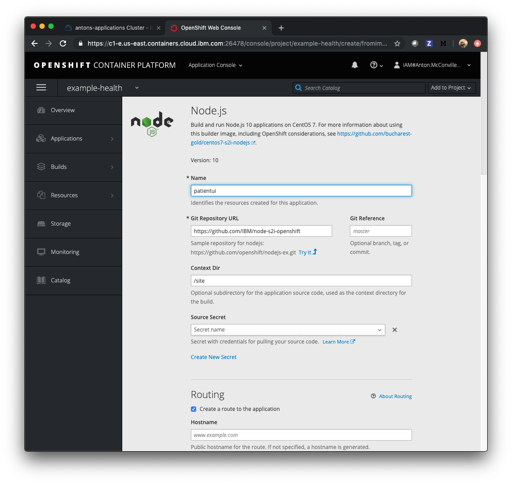
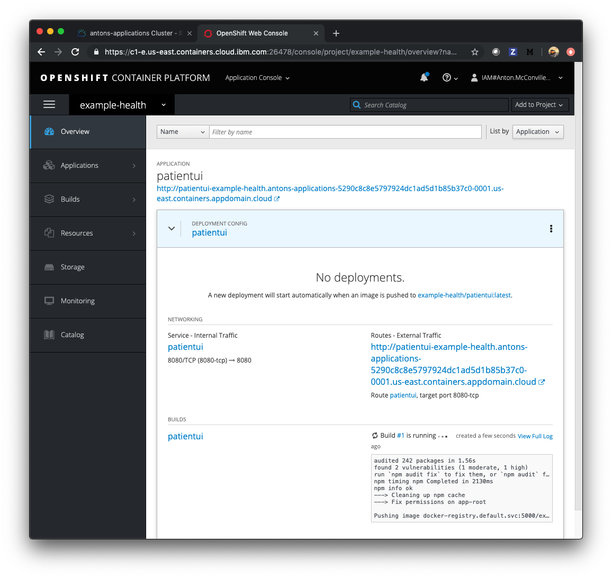
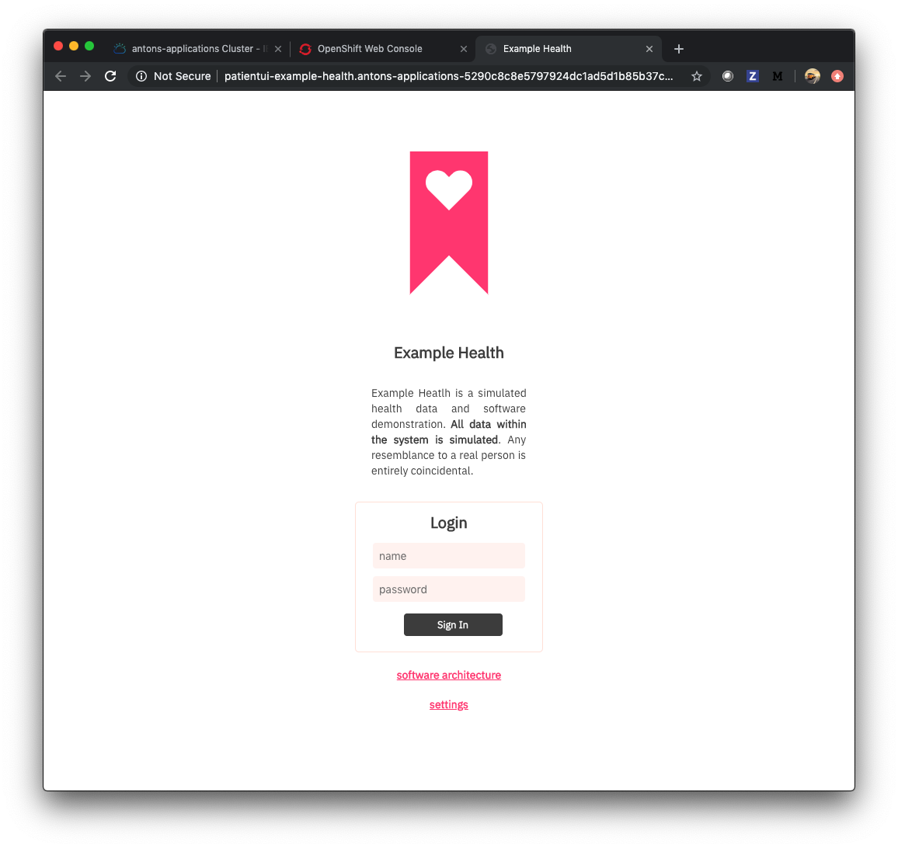

# Patient Health Records - App Modernization with RedHat OpenShift

This project is a patient records user interface for a conceptual health records system. The UI is programmed with open standards JavaScript and modern, universal CSS, and HTML5 Canvas for layout.

The UI is served by a simple Node.JS Express server, and the overall project goals are:

- to use the project to show a step by step guide of deploying the app on OpenShift Source to Image ( S2I )
- to illustrate the versatility of Kubernetes based micro services for modernizing traditional applications - for instance mainframe based applications, or classic Java app server applications
- to experiment and explore open standards front end technologies for rendering custom charts, and for responsive design

This project stands alone in test mode, or integrates with associated projects [ paths to other projects ]

#### Example Health Background Story

Example Health is a pretend, conceptual healthcare/insurance type company. It is imagined to have been around a long time, and has 100s of thousands of patient records in an SQL database connected to a either a mainframe, or a monolithic Java backend.

The business rules for the system is written in COBOL or Java. It has some entitlement rules, prescription rules, coverage rules coded in there.

Example's health records look very similar to the health records of most insurance companies.

Here's a view a client might see when they log in:

Example Health business leaders have recently started understanding how machine learning using some of the patient records, might surface interesting insights that would benefit patients. There is lots of talk about this among some of the big data companies.

https://ai.googleblog.com/2018/05/deep-learning-for-electronic-health.html

https://blog.adafruit.com/2018/04/16/machine-learning-helps-to-grok-blood-test-results/

[ concept screenshot to come ]

Example has also heard a lot about cloud computing. There is a lot of traditional code in the mainframe and in classic Java app servers. It works well for now ... but some of the software architects think it may be complimentary to explore some machine learning, and to accelerate development of new user interfaces in the cloud ( either public or private )

#### Project aims

In this repo there is a patient user interface. It is written using plain HTML, CSS and JavaScript served from a Node.js microservice. The code runs by default with test/demo data, that doesn't rely on a more sophisticated server. The following installation steps can help you easily deploy this using OpenShift S2I ( source to image ).

### Installation

First, you'll need a cluster. [Follow the directions](https://cloud.ibm.com/docs/containers?topic=containers-openshift_tutorial#openshift_create_cluster) to create a Red Hat OpenShift on IBM Cloud cluster.

Next, you will need a fork of this repository. Scroll back up to the top of this page and click on the Fork button.

Select your github user name from the pop-up window.

To deploy your just-forked repository, go to the Web Console for your OpenShift cluster and create a project:

Click on your new project. You should see a view that looks like this:

Click on the browse catalog button to see the images available to build with and scroll down to the Node.js image. Click on the 'Node.js' icon.

Click through to the second step for configuration, and choose advanced options (a hyperlink on the bottom line).

You'll see an advanced form like this:

Enter your forked Git Repository URL and `/site` for the Context Dir. Click 'Create' at the bottom of the window to build and deploy the application. Scroll through to watch the build deploying:

When the build has deployed, click the External Traffic Route and you should see the login screen:

You can enter any strings for username and password, for instance test/test... because the app is just running in demo mode.

And you've deployed a Node.js app to Kubernetes using OpenShift S2I.
