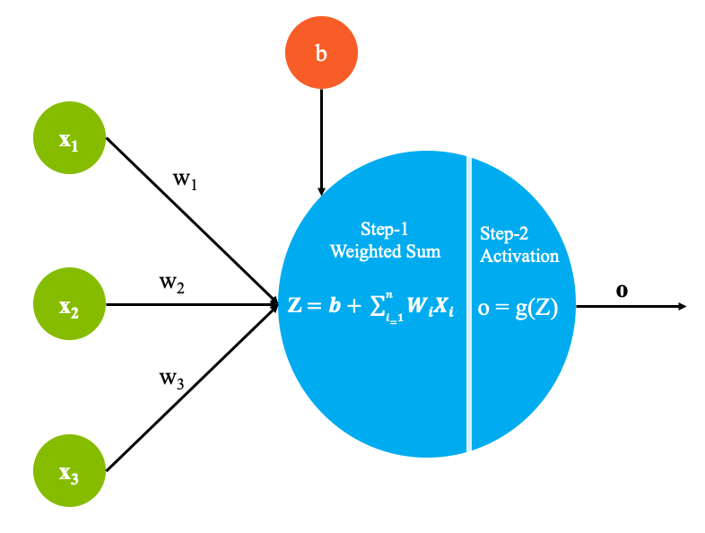
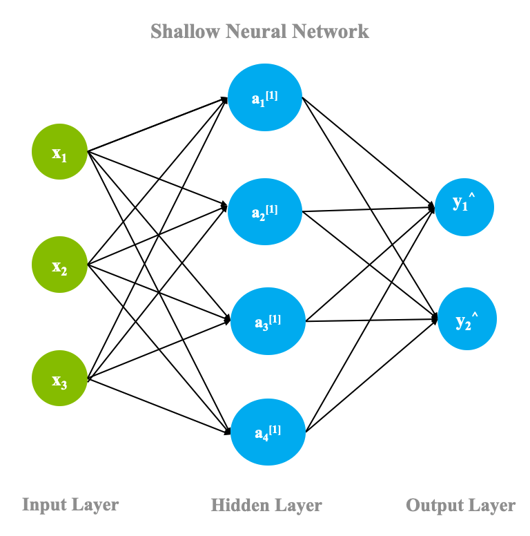
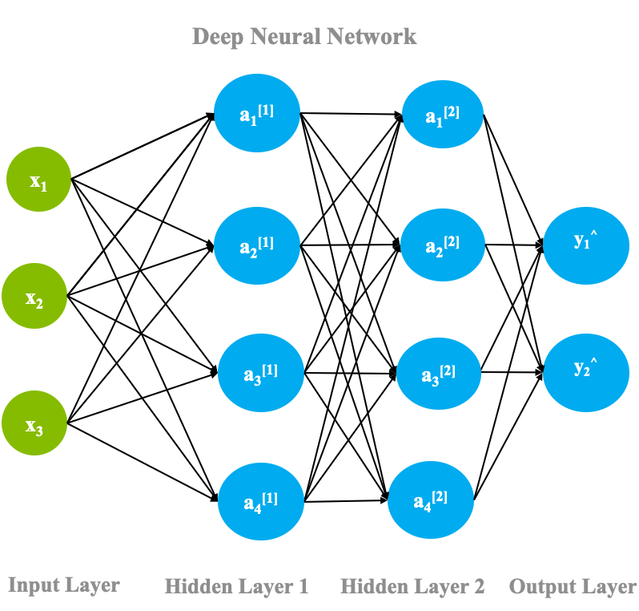

人工知能（AI）の黎明期には、専門家が定義したルールに基づいて予測を行うルールベースのシステムが主流でした。しかし、これらのシステムは「専門家の意見」に頼っていたために脆く、やがて廃れていきました。データの規模や量が増えるにつれ、これらの手法はよりデータに基づいたアプローチである*機械学習*に取って代わられました。

## 機械学習と深層学習の比較

機械学習は、機械がデータ内のパターンを理解し、この基本的な構造を利用して、与えられたタスクに関する推論を行うためのアルゴリズムとツールの集合体です。機械がこれらの基本的なパターンを理解するためには、さまざまな方法があります。しかし、機械学習は深層学習とどのように関連しているのでしょうか。この記事では、深層学習がこの領域にどのように当てはまるのかを概観し、その応用と課題についても触れています。

深層学習は、機械学習領域の競合技術であるという誤解が広がっています。この記事では、これらの神話のいくつかについて説明し、深層学習が機械学習とどのように関連しているか、また特定のアプリケーションで深層学習アルゴリズムを使用する利点について説明します。

物事を整理すると、深層学習は機械学習のサブドメインです。深層学習アルゴリズムは、加速された計算能力と大規模なデータセットにより、データ内の隠れたパターンを自己学習し、予測を行うことができます。

つまり、深層学習とは、大量のデータを使って学習し、多くの計算ユニットが連携して予測を行う機械学習の一分野だと考えることができます。

## 深層学習と人間の脳

人間の学習方法と同じように学習するシステムを作るために、深層学習の基礎となるアーキテクチャは、人間の脳の構造にヒントを得ています。そのため、深層学習の基本的な用語の多くは、神経学に対応しています。脳の基本的な構成要素であるニューロンと同様に、深層学習のアーキテクチャには、パーセプトロンと呼ばれる非線形関数をモデル化する計算ユニットが含まれています。

ディープラーニングの魔法は、このパーセプトロンから始まります。パーセプトロンは、人間の脳にある「ニューロン」が神経系全体に電気パルスを伝達するのと同じように、入力信号のリストを受け取り、それを出力信号に変換します。

パーセプトロンは、入力の一部を理解するために、多くの層を積み重ねてデータ表現を理解することを目的としています。層は、繰り返し発生する値を検出することを学習する計算ユニットの集合体と考えることができます。

パーセプトロンの各層は、データの中の特定のパターンを解釈する役割を果たします。これらのパーセプトロンのネットワークは、脳のニューロンがネットワークを形成する様子を模倣しているため、そのアーキテクチャはニューラルネットワーク（または人工ニューラルネットワーク）と呼ばれている。

## 人工ニューラルネットワーク

ここでは、ディープラーニングを支えるアーキテクチャである人工ニューラルネットワーク（ANN）の概要と、重要な用語について説明します。

下図に示すように、各パーセプトロンは以下のパーツで構成されています。

### ステップ1 - 加重和の計算

* Xiは、データセットのi番目のエントリを表します。データセットの各エントリーは、*n*個の従属変数を含んでいます。
* 重みw1からwnまでは行列Wで表されます。
* 定数であるバイアス項b

* ## ステップ 2 - アクティベーション関数

ステップ1の出力は、今度は、_活性化関数_に渡されます。活性化関数_g_は、次の層に送られる前に、出力を所望の非線形形式に変換することができる数学関数です。活性化関数_g_は、次の層に送られる前に、出力を望ましい非線形形式に変換する数学的関数です。これは、ニューロンを発射する必要があるかどうかを識別するのに役立ちます。

例えば、シグモイド関数は、値を[0,1]の範囲にマッピングします。これは、システムで確率を予測したい場合に便利です。このようにして、複雑な非線形の決定境界をモデル化することができます。

### シャローニューラルネットワーク

前節では、各パーセプトロンの中で行われる計算を見ました。ここでは、これらのパーセプトロンがネットワークの中でどのように組み合わされ、どのような流れで完成するのかを見ていきましょう。

ニューラルネットワークは、最も基本的な形として、3つの層から成り立っています。*入力層*、隠蔽層*、出力層*です。次の図のように、隠れ層を1つだけ持つネットワークを「shallow neural network_」と呼びます。

前のセクションで説明した計算は、出力層を含むニューラルネットワークのすべてのニューロンで行われ、そのような1つのパスは、*forward propagation*として知られています。フォワードパスが1回完了すると、出力層はその結果を実際のグランドトゥルースラベルと比較し、グランドトゥルースと予測値の差に基づいて重みを調整しなければなりません。このプロセスは、ニューラルネットワークのバックワードパスであり、*バックプロパゲーション*と呼ばれています。バックプロパゲーションの背後にある数学はこの記事の範囲外ですが、プロセスの基本は次のように説明できます。

* ネットワークは目的関数を最小化するように動作します。例えば、データサンプルのすべてのポイントで発生するエラーなどです。
* 出力層では、すべてのデータポイントの合計誤差（実際の値と予測値の差）を計算し、その層の重みに対する微分を取る必要があります。誤差関数の重みに対する微分を、その層の「勾配」と呼びます。

* その層の重みは、勾配に基づいて更新されます。この更新は、勾配そのものであったり、勾配の係数であったりします。この係数は _learning rate_ と呼ばれ、重みを変更する際のステップの大きさを制御します。

* このプロセスは、1つ前の層に対しても繰り返され、最初の層に到達するまで続きます。

* この過程では、前の層の勾配の値を再利用することができるため、勾配の計算を効率的に行うことができます。

順伝播と逆伝播の1回の処理の結果、ネットワークの各層の重みが変更され、システムは与えられたデータセットのモデル化に近づきます。このプロセスでは、全体的な誤差を最小化するために勾配を使用するため、ニューラルネットワークのパラメータを最適な状態に収束させるプロセスは「勾配降下法」と呼ばれています。

### ディープニューラルネットワーク

ディープニューラルネットワークは、浅いニューラルネットワークに複数の隠れ層を設けただけのものです。隠れ層の各ニューロンは、他の多くのニューロンに接続されています。各矢印には重みのプロパティが付いていて、そのニューロンの活性化が他のニューロンにどれだけ影響するかを制御します。

深層学習の「深層」という言葉は、この深い隠れ層に起因しており、そこからその効果を得ています。隠れ層の数の選択は、問題の性質やデータセットのサイズによって異なります。次の図は、2つの隠れ層を持つディープニューラルネットワークを示しています。

このセクションでは、人工ニューラルネットワークの仕組みについて、ハイレベルな概要を取り上げました。もっと詳しく知りたい方は、[how neural networks works from scratch](/articles/neural-networks-from-scratch/)の記事をご覧ください。また、[this neural networks deep dive](/articles/cc-cognitive-neural-networks-deep-dive/)では、ニューラルネットワークをより深く知ることができます。

## アプリケーション

深層学習は、ヘルスケア、金融、画像認識など、ほとんどすべての分野で応用されています。ここでは、いくつかの応用例を紹介します。

* 健康管理。高速化されたGPUへのアクセスが容易になり、膨大な量のデータを利用できるようになったことで、ヘルスケアのユースケースはディープラーニングの適用に最適なものとなっています。画像認識を用いて、MRI画像やX線からのがん検出は、人間のレベルを超える精度を実現しています。  また、創薬、臨床試験のマッチング、ゲノミクスなども、ヘルスケア分野のアプリケーションとして人気があります。

* 自律走行車。自動運転車は自動化するにはリスクの高い分野ですが、最近では実現に向けて動き出しています。停止線の認識から道路上の歩行者の確認まで、深層学習ベースのモデルを学習し、シミュレーション環境下で試して進捗を確認します。

* Eコマース。製品の推奨は、深層学習の最も人気があり、収益性の高いアプリケーションの一つです。よりパーソナライズされた正確なレコメンデーションにより、顧客は探しているアイテムを簡単に購入することができ、選択可能なすべてのオプションを表示することができます。これはまた、販売を加速させ、結果として売り手にも利益をもたらします。

* パーソナルアシスタント：ディープラーニングの分野での進歩により、パーソナルアシスタントを持つことは、AlexaやGoogleアシスタントのようなデバイスを購入するだけで簡単にできるようになりました。これらのスマートアシスタントは、パーソナライズされた音声やアクセントの認識、パーソナライズされた推薦、テキストの生成など、さまざまな面でディープラーニングを使用しています。

明らかに、これらはディープラーニングを適用できる膨大なアプリケーションのごく一部に過ぎません。株式市場の予測や天気予報なども、深層学習が役立っている分野として同様に人気があります。

## 深層学習の課題

深層学習は、ここ10年ほどで急速に普及した手法ですが、そのアイデアは1950年代半ばにフランク・ローゼンブラットがIBM&reg;704のマシンでパーセプトロンを発明した時からありました。これは2層構造の電子機器で、形状を検出して推論を行う機能を持っていました。近年のこの分野の進歩は、主にコンピューティングパワーと高性能なGPU（Graphical Processing Unit）の増加に加えて、これらのモデルが自由に学習できるデータの量が大幅に増加したこと、そして研究を継続するためのコミュニティからの関心と資金提供によるものである。ここ数年で急速に普及した深層学習ですが、コミュニティが解決に向けて努力している課題もあります。

### データの必要性

 現在普及している深層学習手法は、非常にデータを必要とし、言語翻訳のような複雑な問題の多くは、洗練されたデータセットが利用できません。低リソース言語との間でニューラル機械翻訳を行う深層学習手法は、パフォーマンスが低いことが多く、[domain adaptation](https://arxiv.org/abs/1806.00258)（高リソースのシステム開発で得られた学習内容を低リソースのシナリオに適用する）などの手法が近年期待されています。姿勢推定のような問題では、このような大量のデータを生成するのは骨が折れます。モデルが最終的に学習する合成データは、モデルが最終的に実行しなければならない「in-the-wild」の設定とは実際には大きく異なります。

### 説明可能性と公平性

深層学習のアルゴリズムは人間レベルの精度を上回ることが証明されているにもかかわらず、各予測の背景にある理由をバックトラックして提供する明確な方法がありません。そのため、融資の承認・不承認のたびにその理由を提示することが義務付けられている金融などの用途には使いづらいものとなっています。

また、データ自体の偏りが問題となることもあり、データの重要な部分でモデルのパフォーマンスが低下することがあります。報酬ベースのメカニズムを使用する学習エージェントは、システムエラーを最小化するために必要なことは、自分が獲得する報酬を最大化することであるため、倫理的な行動をやめてしまうことがあります。[この例](https://openai.com/blog/faulty-reward-functions/)では、エージェントが単にゲームをするのをやめてしまい、報酬ポイントを集める無限ループに陥ってしまいました。ゲームのシナリオでは許容されるかもしれませんが、間違った、または非倫理的な決定は、現実の世界では重大なマイナスの影響を与えます。モデルがバランスよく学習できるようにすることが強く求められています。

IBMはオープンソースのツールキットである[AI360](https://aif360.mybluemix.net/)を用意しており、これは深層学習アルゴリズムのバイアスを検出、調査、緩和するためのツールキットです。深層学習の研究者としては、これらの課題を念頭に置いて、実験を設計・実施することが重要だと思います。

## 今後の展開

この記事のすべての情報で武装したあなたは、深層学習の旅に深く入る準備ができています。人工ニューラルネットワークにはいくつかのバリエーションや追加機能があり、さまざまな用途で見たことのないレベルの精度を達成するのに役立ちます。このシリーズの他の記事にもご期待ください。