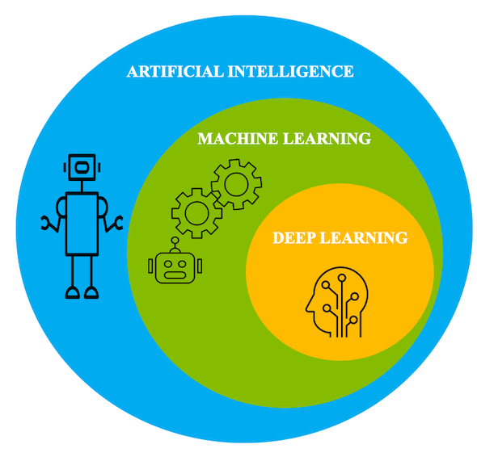
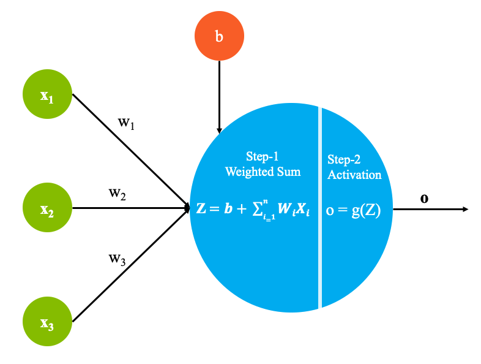
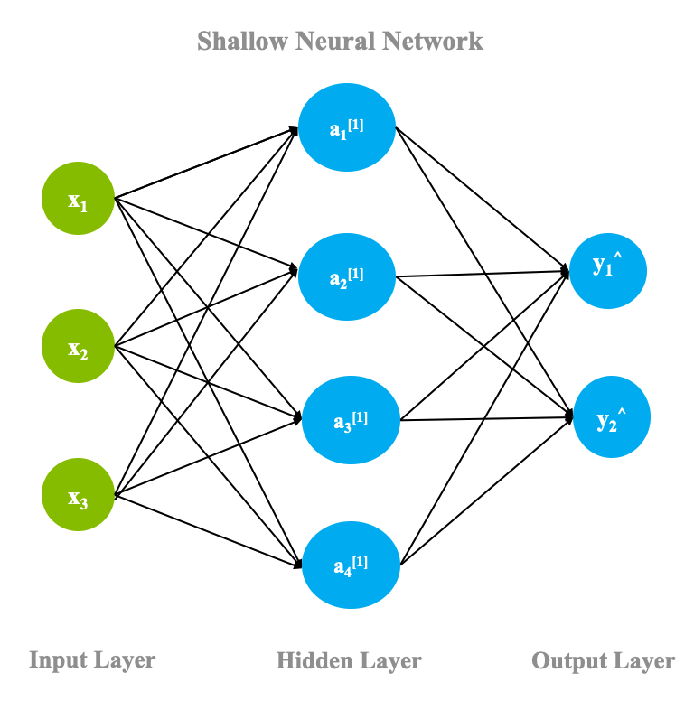
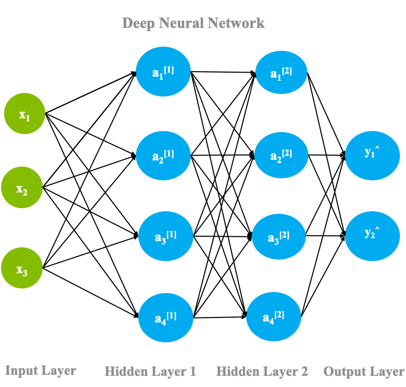

In its nascent years, artificial intelligence (AI) focused heavily on rule-based systems that would make predictions using predefined sets of rules that had to be provided by a subject matter expert. However, these systems were brittle and relied on these "expert opinions," which eventually caused them to fall out of fashion. As the scale and amount of data increased, these methods were replaced by a more data-driven approach, *machine learning*.

## Machine learning versus deep learning

Machine learning is a collection of algorithms and tools that help machines understand patterns within data and use this underlying structure to perform reasoning about a given task. There are many ways that machines aim to understand these underlying patterns. But how does machine learning relate to deep learning? In this article, we provide an overview of how deep learning fits into this realm and also discuss some of its applications and challenges.

There is a growing misconception that deep learning is a competitve technology to the machine learning domain. In this article, we discuss some of these myths and explain how deep learning is related to machine learning and the advantages of using deep learning algorithms in certain applications.

To put things in perspective, deep learning is a subdomain of machine learning. With accelerated computational power and large data sets, deep learning algorithms are able to self-learn hidden patterns within data to make predictions.

In essence, you can think of deep learning as a branch of machine learning that's trained on large amounts of data and deals with many computational units working in tandem to perform predictions.

## Deep learning and human brain

In an effort to create systems that learn similar to how humans learn, the underlying architecture for deep learning was inspired by the structure of a human brain. For this reason, quite a few fundamental terminologies within deep learning can be mapped back to neurology. Similar to how neurons form the fundamental building blocks of the brain, deep learning architecture contains a computational unit that allows modeling of nonlinear functions called *perceptron*.

The magic of deep learning starts with the humble perceptron. Similar to how a "neuron" in a human brain transmits electrical pulses throughout our nervous system, the perceptron receives a list of input signals and transforms them into output signals.

The perceptron aims to understand data representation by stacking together many layers, where each layer is responsible for understanding some part of the input. A layer can be thought of as a collection of computational units that learn to detect a repeating occurrence of values.

Each layer of perceptrons is responsible for interpreting a specific pattern within the data. A network of these perceptrons mimics how neurons in the brain form a network, so the architecture is called neural networks (or artificial neural networks).

## Artificial neural network

This section provides an overview of the architecture behind deep learning, artificial neural networks (ANN), and discusses some of the key terminology.

As shown in the following figure, each perceptron is made up of the following parts:

### Step 1 - Calculate weighted sum

* Inputs x1 through xn, which can also be denoted by a vector X. Xi represents the ith entry from the data set. Each entry from the data set contains *n* dependent variables.
* Weights w1 through wn, which can be denoted as a matrix W
* A bias term b, which is a constant

### Step 2 - Activation function

The output of step 1 is now passed through an _activation function_. The activation function _g_ is a mathematical function that lets you transform the outputs to a desired non-linear format before it is sent to the next layer. It maps the summation result to a desired range. This helps in identifying whether the neuron needs to be fired.

For example, a sigmoid function maps values to the range [0,1], which is useful if you want your system to predict probabilities. Doing so lets you model complex non-linear decision boundaries.

### Shallow neural network

In the previous section, you saw the calculations that happen within each perceptron. Now, you'll see how these perceptrons fit inside the network and how the flow is completed.

In its most basic form, a neural network contains three layers: *input layer*, *hidden layer*, and *output layer*. As shown in the following figure, a network with just one hidden layer is termed a _shallow neural network_.

The computations discussed in the previous sections happen for all neurons in a neural network including the output layer, and one such pass is known as *forward propagation*. After one forward pass is completed, the output layer must compare its results to the actual ground truth labels and adjust the weights based on the differences between the ground truth and the predicted values. This process is a backward pass through the neural network and is known as *backpropagation*. While the mathematics behind back propagation are outside the scope of this article, the basics of the process can be outlined as follows:

* The network works to minimize an objective function, for example, the error incurred across all points in a data sample.
* At the output layer, the network must calculate the total error (difference between actual and predicted values) for all data points and take its derivative with respect to weights at that layer. The derivative of error function with respect to weights is called the _gradient_ of that layer.

* The weights for that layer are then updated based on the gradient. This update can be the gradient itself or a factor of it. This factor is known as the _learning rate_, and it controls how large the steps are that you take to change your weights.

* The process is then repeated for one layer before it and continues until the first layer is reached.

* During this process, values of gradients from previous layers can be reused, making the gradient computation efficient.

The result of one pass of forward propagation and backpropagation is a change to the network layers' weights and brings the system closer toward modeling the data set provided to it. Because this process uses the gradient to minimize the overall error, the process of converging the neural networks' parameters to the optimum is called _gradient descent_.

### Deep neural networks

A deep neural network is simply a shallow neural network with more than one hidden layer. Each neuron in the hidden layer is connected to many others. Each arrow has a weight property attached to it, which controls how much that neuron's activation affects the others attached to it.

The word 'deep' in deep learning is attributed to these deep hidden layers and derives its effectiveness from it. Selecting the number of hidden layers depends on the nature of the problem and the size of the data set. The following figure shows a deep neural network with two hidden layers.

In this section, we covered a high-level overview of how an artificial neural network works. To learn more, see the article on [how neural networks work from scratch](/articles/neural-networks-from-scratch/). You can also take a deeper look at neural networks in [this neural networks deep dive](/articles/cc-cognitive-neural-networks-deep-dive/).

## Applications

Deep learning has a plethora of applications in almost every field such as health care, finance, and image recognition. In this section, let's go over a few applications.

* Health care: With easier access to accelerated GPU and the availability of huge amounts of data, health care use cases have been a perfect fit for applying deep learning. Using image recognition, cancer detection from MRI imaging and x-rays has been surpassing human levels of accuracy.  Drug discovery, clinical trial matching, and genomics have been other popular health care-based applications.

* Autonomous vehicles: Though self-driving cars is a risky field to automate, it has recently taken a turn towards becoming a reality. From recognizing a stop sign to seeing a pedestrian on the road, deep learning-based models are trained and tried under simulated environments to monitor progress.

* e-commerce: Product recommendations has been one of the most popular and profitable applications of deep learning. With more personalized and accurate recommendations, customers are able to easily shop for the items they are looking for and are able to view all of the options that they can choose from. This also accelerates sales and thus, benefits sellers.

* Personal assistant: Thanks to advancements in the field of deep learning, having a personal assistant is as simple as buying a device like Alexa or Google Assistant. These smart assistants use deep learning in various aspects such as personalized voice and accent recognition, personalized recommendations, and text generation.  

Clearly, these are only a small portion of the vast applications to which deep learning can be applied. Stock market predictions and weather predictions are also equally popular fields in which deep learning has been helpful.

## Challenges in deep learning

Though deep learning methods gained immense popularity in the last 10 years or so, the idea has been around since the mid-1950s when Frank Rosenblatt invented the perceptron on an IBM&reg; 704 machine. It was a two-layer-based electronic device that had the ability to detect shapes and do reasoning. Advancements in this field in recent years are primarily because of the increase in computing power and high-performance graphical processing units (GPUs), coupled with the large increase in the wealth of data these models have at their disposal for learning, as well as interest and funding from the community for continued research. Though deep learning has taken off in the last few years, it does come with its own set of challenges that the community is working hard to resolve.

### Need for data

 The deep learning methods prevalent today are very data hungry, and many complex problems such as language translation don't have sophisticated data sets available. Deep learning methods to perform neural machine translation to and from low-resource languages often perform poorly, and techniques such as [domain adaptation](https://arxiv.org/abs/1806.00258) (applying learnings gained from developing high-resource systems to low-resource scenarios) have shown promise in recent years. For problems such as pose estimation, it can be arduous to generate such a high volume of data. The synthetic data the model ends up training on differs a lot in reality from the "in-the-wild" setup in which the model ultimately needs to perform.

### Explainability and fairness

Even though deep learning algorithms have proven to beat human-level accuracy, there is no clear way to backtrack and provide the reasoning behind each prediction that's made. This makes it difficult to use in applications such as finance where there are mandates to provide the reasoning behind every loan that is approved or rejected.

Another dimension that tends to be an issue is the underlying bias in the data itself, which can lead to poor performance of the model on crucial subsets of the data. Learning agents that use a reward-based mechanism sometimes stop behaving ethically because all they require to minimize system error is to maximize the reward they accrue. [This example](https://openai.com/blog/faulty-reward-functions/) shows how the agent simply stopped playing the game and ended up in an infinite loop of collecting reward points. While it might be acceptable in a game scenario, wrong or unethical decisions can have a profound negative impact in the real world. A strong need exists to allow models to learn in a balanced fashion.

IBM has an open source toolkit, [AI360](https://aif360.mybluemix.net/), which is a toolkit to detect, investigate, and mitigate bias in deep learning algorithms. As deep learning researchers, it's important for us to keep these challenges in mind while designing and conducting these experiments.

## Going forward

Armed with all the information in this article, you are now ready to go deeper into your journey of deep learning. There are several variations and additions to the artificial neural network that help with achieving unseen levels of accuracy for different applications. Stay tuned for more articles in this series.