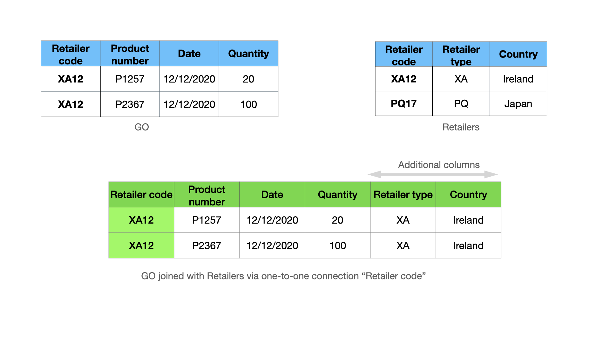
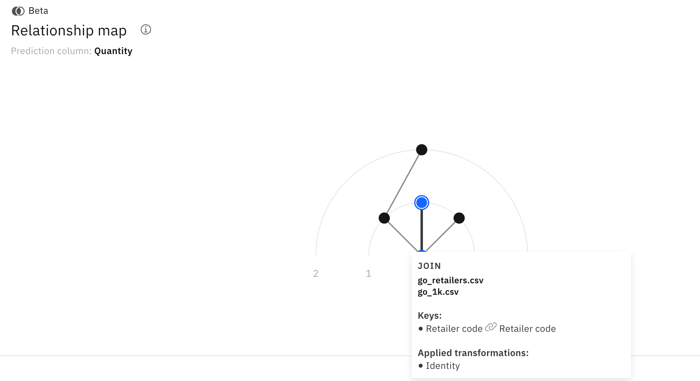
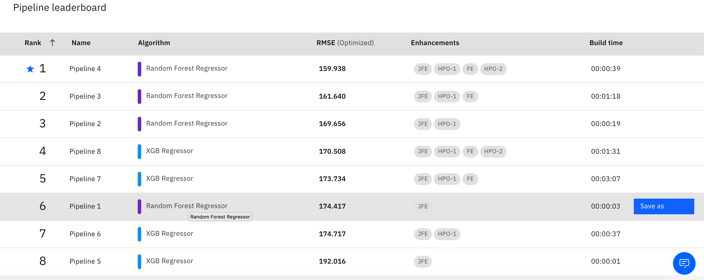
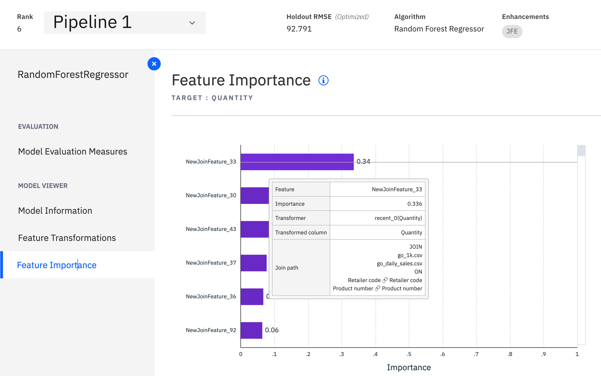
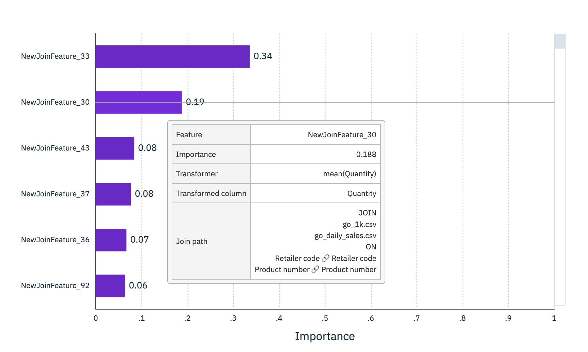

---
also_found_in:
- learningpaths/explore-autoai/
authors: ''
check_date: '2022-03-15'
completed_date: '2021-03-15'
components:
- cloud-pak-for-data
- watson-studio
draft: false
excerpt: IBM Cloud Pak for DataのIBM AutoAIを使用して、フィーチャー・エンジニアリング・タスクを自動的かつ数分で実行する方法を紹介します。
meta_description: IBM Cloud Pak for DataのIBM AutoAIを使用して、フィーチャー・エンジニアリング・タスクを自動的かつ数分で実行する方法を紹介します。
meta_keywords: machine learning, AutoAI, Watson Studio, model building, models
meta_title: リレーショナルデータの自動化されたフィーチャリングを探る
primary_tag: artificial-intelligence
related_content:
- slug: cloud-pak-for-data-learning-path
  type: learningpaths
- slug: watson-studio-auto-ai
  type: tutorials
- slug: get-started-watson-studio
  type: learningpaths
subtitle: IBM Cloud Pak for Dataに搭載されたIBM AutoAIにより、フィーチャー・エンジニアリング・タスクを自動的に数分で実行します。
tags:
- machine-learning
title: リレーショナルデータの自動化されたフィーチャリングを探る
---

機械学習モデルにとっての特徴は、建物にとってのレンガのように重要であるため、特徴エンジニアリングは最も重要なデータ準備作業の一つです。特に、入力データが複数のデータソースに保管されている生のフォーマットで提供されている場合は、データサイエンスプロジェクトの中でも最も面倒な作業の一つです。フィーチャーエンジニアリングは、ETL（Extract Transform and Load）プロセスの一部であり、データエンジニアやデータサイエンティストがSQLライクなクエリを書いて、異なるソースからのデータを結合・集約し、有用な特徴を探し出します。通常、テーブルの結合や集約を検討するには多くのオプションがあり、満足のいく結果が得られるまで試行錯誤を繰り返すため、この作業を手作業で行うには数週間から数ヶ月を要します。

この記事では、IBM Cloud Pak for DataのIBM AutoAIを使ってフィーチャー・エンジニアリングを自動的に実行する方法を学びます。AutoAI の助けを借りれば、このタスクは数分で完了し、最高のパフォーマンス結果を得ながら、数週間の手作業を節約することができます。この記事の例には、時系列データを用いた売上予測に関するものと、コールセンター・データを用いたユーザー・エクスペリエンス分析に関するものという、2つの興味深い実世界のユースケースが含まれています。

現在のAutoAIのバージョンで提供されている主な機能は以下の通りです。

* リレーショナルデータのためのエンド・ツー・エンドの自動フィーチャーエンジニアリングと機械学習パイプラインの最適化
* テーブル間をドラッグ＆ドロップで接続し、外部キーの関係を宣言するユーザーフレンドリーなUI
* 時系列、イベントシーケンス、凹凸のある時系列、アイテムセットデータなどのマルチモーダルデータのサポート
* Sparkを利用して、モデル学習用のエクゼキュータやメモリを追加してスケールアップが可能
* 数回のクリックでデプロイメントとバッチスコアリングが可能

## リレーショナルデータに関する基本概念

リレーショナルデータはテーブルの集合で構成されており、各テーブルには、商品、小売店、店舗での商品の売り上げなどのエンティティに関する情報が含まれています。予測対象の列を含む「メイン」のテーブルがあると仮定し、その他のテーブルはコンテキストテーブルと呼ばれます。下図は、Great Outdoor（GO）社のデータベースの例で、以下のテーブルがあります。

* Go:小売店での商品の一日の販売数量である予測対象列(Quantity)を持つメインソース
* デイリーセールス。日販：各小売店における各商品の日販の履歴データ
* 小売店。小売店の静的な情報
* Products:商品：商品の静的な情報
* 注文方法。購入方法のコード
 

_外国語キーの接続_。2つのテーブルで共有されている列。例えば、「Go」と「Daily」の間では、「Retail code」と「Product number」の2つの列が1つのコネクションを形成することができます。さらに、2つのテーブル間で複数の接続を持つことも可能です。例えば、Retail code 列は単独でそれらの間に別の接続を形成することができます。

エンティティ・リレーション・ダイアグラム（ERD）_。ノードがテーブルで、コネクションがテーブル間の外部キーのコネクションであるグラフ。前述の図は、GOデータベースの完全なERDです。

_時系列データ_。テーブルには、テーブル内の対応するレコードが作成された時点を示すタイムスタンプ列を1つ持つことができる。テーブルにタイムスタンプ列が関連付けられていると、レコードは与えられたタイムスタンプに従って並べられます。例えば、Daily salesテーブルは、Dateカラムによって時間順に並べられます。AutoAIでは、テーブルの列をタイムスタンプとして宣言することで、データが時間順に並んでいることをAutoAIに知らせることができます。この情報は、AutoAIが時系列の特徴を抽出するのに役立ち、また、データの漏洩を避けるためにこの情報を使用するので重要です。

## ジョインとアグリゲートとしてのフィーチャーエンジニアリング

フィーチャーエンジニアリングとは、データサイエンティストが文脈上のソースから価値のある情報を結合・集約することで、メインのソースに新たな特徴（カラム）を追加するプロセスである。一般的にフィーチャリングは、まずメインテーブルとコンテキストテーブルを結合し、続いて「groupby」と「aggregation」の操作を行い、結合したテーブルをフィーチャにします。テーブル間の接続の種類に応じて，異なる集約関数を使用することができます．接続の種類は2つあります。

* 一対一の関係
* 一対多の関係

#### 一対一の関係の接続

一対一の関係接続とは、左のテーブルのキーカラムの1つの値が、右のテーブルのキーカラムの1つの値と一致することです。例えば、「GO」と「小売店」の間の「小売店コード」を使った接続は、1対1の接続です。(下図参照) 1対1の関係接続では、「Retailerコード」を使ってGOとRetailersを左結合すると、下図のようにメインソースの行数を維持したまま、列が追加された新しいテーブルができます。

したがって、1対1の接続の場合、AutoAIは単純にRetailersから追加の列を取得し、メインテーブルに追加します。これは、結合結果に同一性変換を適用することと同じです。

#### 一対多のリレーション接続

一対多の接続は、左のテーブルのキーカラムの1つの値が、右のテーブルのキーカラムの複数の値と一致する場合に起こります。たとえば、「GO」と「Daily sales」の間の、「Retailer code」と「Product number」の値を使った接続は、一対多の接続です。次の図では、Daily sales テーブルで Retailer code XA12 と Product number P1257 が 3 回一致しています。このような状況で、これらの列を使用してGOとDaily salesを左結合すると、追加の列だけでなく、追加の行を含む新しいテーブルになります。

このケースでは、AutoAI は結合されたテーブルのマッチしたレコードを、Store XA12 の Product P1257 と P2367 にそれぞれ対応する 2 つのグループにグループ化します。そして、各グループに関連する集約関数を適用して、ストア内の各製品の特徴を抽出します。例えば、最初のグループには3つのレコード{R1, R2, R3}があります。以下は、AutoAIでサポートされているいくつかの集計関数を使って抽出された特徴量です。

* Quantity列にmean集約関数を適用すると、値`mean(2, 4, 18) = 8`が得られます。この値は、店舗 XA12 における商品 P1257 の平均販売数量に相当します。

* Unit priceに`max aggregation`関数を適用すると、`max(5, 9, 8) = 9$`となります。この機能は、ストアXA12における商品P1257の最大販売価格に関係します。

抽出された2つの特徴は、1つ目は移動平均の販売数量に関係し、2つ目は販売価格の上昇に関係するため、将来のストアXA12における商品P1257の販売を予測するための良い指標となります。

### 時系列データの集計

前述の例では、メインテーブルのDateを予測を行うべき時期を示すカットオフタイムの列に、Daily salesのDateを販売記録が作成された時期を示すタイムスタンプの列に指定すると、AutoAIはカットオフ以降に発生した各グループの記録をフィルタリングします。これは、機能エンジニアリングプロセスにそれらを含めると、データリークと呼ばれる誤った結果につながるためです。トレーニングされたモデルは、2020年12月21日に作成されたR1の情報を使用して、1週間以上前の2020年12月12日の販売を予測します。

R1を除外した後、最初のグループには、小売店XA12の商品P1257について、カットオフである2020年12月2日以前に発生した履歴データに対応する2つのレコード{R2, R3}が含まれています。さらに、グループ内のレコードはタイムスタンプで並べられています。そのため、AutoAIは時系列とシーケンスに関連した集約を適用します。例として[Join feature engineering details](https://www.ibm.com/docs/en/cloud-paks/cp-data/latest?topic=preview-join-feature-engineering-details-tech)を見てみましょう。
 
* この特徴は、時系列分析ではラグ-1と呼ばれ、自己相関により数量を予測するのに役立ちます。

* Price unit trend は、最新の値を Unit price の合計で割ったもので、この例では 9/(9+7) となっています。この機能は、単価の上昇または下降傾向を示し、販売数量の予測に役立ちます。

## Great Outdoor セール予測例

ここまでで、リレーショナルデータにおける特徴量エンジニアリングの基本的な考え方を学んできました。ここでは、各小売店の各商品の販売数量を予測するGOサンプルデータを使って、このタスクを実行するためのAutoAIの設定方法を説明します。データはギャラリーで公開されており、[ダウンロード](https://dataplatform.cloud.ibm.com/exchange/public/entry/view/dcf7b09bd340e6ff9a2d1869631f3753?cm_sp=ibmdev-_-developer-articles-_-cloudreg)も可能です。

この例では、以下の方法を説明します。

* ERD宣言のためのテーブルのドラッグ
* 時間情報を設定することで、時間に関連した機能を有効にし、データの漏洩を防ぐことができます。
* 自動化された機能エンジニアリング・プロセスをオンザフライで観察する
* AutoAIによって自動的に作成された最も重要な機能を探索し、いくつかのインサイトを得る
* モデルとバッチスコアリングのデプロイ

デモビデオをご覧になれば、ステップの詳細をご確認いただけます。

<iframe width="560" height="315" src="https://video.ibm.com/embed/channel/23952663/video/wml-autoai-join-tutorial" style="border:0;" webkitallowfullscreen allowfullscreen frameborder="no" width="480" height="270" referrerpolicy="no-referrer-when-downgrade"></iframe> （英語

以下のセクションでは、主な設定手順をまとめています。

### ERD宣言

AutoAIの実験に.csvファイルを追加し、予測対象列を持つメインソースを選択した後、エンティティ・リレーション・ダイアグラムの宣言のための結合を設定するよう求められます。AutoAIでは、テーブルをキャンバスにドラッグして、テーブル間の接続を作成することで、エンティティ・リレーション・ダイアグラムを宣言することができます。次の図は、GOサンプルデータセットの完全なERDの例です。

ERD 宣言 UI の興味深い機能をいくつか紹介します。

* 自動キー提案。一致する名前に基づいて、自動的にキーを提案します。
* 複数の接続。2つのテーブル間では、多くの接続が可能です。
* 複数の列。複数列：1つの接続に複数の列をキーとして含めることができます。
* 任意のグラフ。任意のグラフ：AutoAIは、グラフを探索するための最適な方法を自動的に選択します。

新しい接続を作成する際の重要な質問は、"AutoAIがその接続から何をもたらすことを期待しているのか "です。この質問に対する答えは、データセットをある程度理解している必要があります。例えば、GOのサンプルデータセットでは、メインソースとRetailersの間の接続は、Retailersに関する追加の静的情報をもたらし、Productsテーブルとの接続は、製品に関する静的情報をもたらします。これらのテーブルを接続する方法は1つしかなく、接続は1対1であるため、これらは簡単なケースです。
 
しかし、Daily salesテーブルの例はもっと複雑です。Daily salesテーブルには、小売店の各商品の過去の時系列データが含まれていることを思い出してください。小売店コードと商品番号の2つの列があるので、これらのテーブルを接続するには少なくとも3つの選択肢があります。

* 小売店コードと商品番号の両方の列を使用すると、特定の店舗の商品に特化した機能が集約されます。

* 小売店コードの列を使用すると、店舗の販売状況を伝える機能が作成されます。

* 商品番号列を使用することで、データベース内の全店舗の全商品の販売状況に関する特徴が抽出されます。

接続に含めるキーを選択することで、集約したい情報をコントロールすることができます。デモビデオでは、最初のオプションが選択されていますが、他のオプションでも、店舗レベルでの集計や、店舗間の商品ごとの集計など、有用な機能が得られます。これらのオプションを使って、接続を追加したり削除したりして、最終的な予測結果にどのような影響があるかを実験で試してみることをお勧めします。

### タイムスタンプの設定

これまで説明してきたように、タイムスタンプはAutoAIが時間に関連する有用な特徴を抽出し、データの漏洩を防ぐために重要な役割を果たします。データにタイムスタンプがある場合は、その情報をAutoAIに提供する必要があります。タイムスタンプの設定は、次の図のように、データソースの設定の中にあります。メインテーブルとデイリーセールステーブルにタイムスタンプを設定することができます。

タイムスタンプのカラムを指定する際には、`SimpleDateFormat`に従ったフォーマットを指定する必要があります。

タイムスタンプの設定以外にも、以下のようなオプションパラメータを指定することができます。

* スライディングウィンドウ。Sliding windows: 指定したスライディングウィンドウ内の最近のデータのみにフィーチャーエンジニアリングを制限します。

* Join limit: 結合データをサンプリングして、結合サイズが大きすぎる場合に結合サイズを小さくします。

### コンピューティングの設定と実験の実行

ランタイムの設定で、大規模データへの実験のスケールアップのために、提供されるSparkクラスタの計算実行者の数を増やすことが可能です。

すべての設定が完了したら、実験を開始し、プログレスバーで機能が生成されていく様子を見ることができます。結合が完了すると、対応する接続を参照して、接続の種類や、指定された接続から特徴を生成するために使用された集約（変換）のリストを見ることができます。

例えば、次の図では、mainテーブルとRetailersテーブルの間の接続は1対1の接続であるため、Applied transformationのリストには、identity transformation（値をそのままにする）のみが含まれています。

  
一方、メインテーブルのGOと、RetailerコードとProduct numberを使ったDaily salesテーブルとの間の接続は1対多の接続であり、これらのテーブルに関連付けられたタイムスタンプがあるので、タイムスケールに関連するすべての集約のリストを見ることができます。

## 機能探求

パイプラインがリーダーボードに表示されるようになったら、より多くのインサイトを得るためにパイプラインの探索を始めることができます。AutoAIでは、パイプラインのリーダーボードのEnhancements欄にJFEと表示されている、結合と集約によるフィーチャーエンジニアリングの他に、JPEフィーチャーに追加の数学的関数を適用することで、さらにフィーチャーエンジニアリング（FE）を強化することができます。

この記事では、JFE機能に焦点を当てています。そのため、JFEフィーチャーのみのパイプライン1を選択して探索を行いました。フィーチャーインポータンスプロットを見ると、モデル予測への貢献度に応じてソートされたフィーチャーのリストが表示されています。

NewJoinFeature_33の上にあるウィンドウには、そのフィーチャーがどのように生成されたかの詳細情報が表示されています。このウィンドウから、最も重要な特徴は、「Daily sales」テーブルの「Quantity」時系列のラグ1の値であることがわかります。これは、次の日の販売量が前の日の販売量と強く相関しているという強い自己相関がデータにあるためです。AutoAIは、小売店コードと商品番号のキーを使用してGOテーブルと日次売上テーブルを結合し、recent_0変換を使用して集計することにより、この機能を自動的に作成します。  

また、NewJoinFeature_30は、GOテーブルとDaily salesテーブルをRetailer codeとProduct numberキーを使って結合し、mean変換を使って集計することで作成されたもので、過去のデータにおける販売の移動平均に関する情報を伝えています。

### デプロイとバッチスコアリング

リーダーボードの任意のパイプラインの横にある**Save as**をクリックすることで、AutoAIを使ってパイプラインをデプロイすることができます。スコアリングの際には、最新のコンテキストテーブルと新しいレコードを含む新しいメインテーブルを含む.csvファイルを提供する必要があります。
 
## What's next?

私たちの[ドキュメントページ](https://www.ibm.com/docs/en/cloud-paks/cp-data/latest?topic=baejdtp-tutorial-build-multiclass-data-join-model-tech-preview)のチュートリアルに従った後、[コールセンターデータ](https://dataplatform.cloud.ibm.com/exchange/public/entry/view/013c690997e27f3a8d91332653378c93?context=cpdaas#?cm_sp=ibmdev-_-developer-articles-_-cloudreg)を使った別の興味深い顧客体験分析を試してみることをお勧めします。

IBM AutoAIを使った分析のデモ・ビデオを見てみましょう。また、[ドキュメント](https://www.ibm.com/docs/en/cloud-paks/cp-data/latest?topic=preview-join-feature-engineering-details-tech)では、AutoAIがサポートしているすべてのタイプのデータに対する集計関数のリストについての詳細な説明をご覧いただけます。

<iframe width="560" height="315" src="https://video.ibm.com/embed/channel/23952663/video/wml-autoai-join-user-ex" style="border:0;" webkitallowfullscreen allowfullscreen frameborder="no" width="480" height="270" referrerpolicy="no-referrer-when-downgrade"></iframe>。

## その他のリソース

アルゴリズムの技術的な詳細や比較研究については、以下の出版物をご参照ください。

1. Hoang Thanh Lam, Johann Michael-Thiebaut, Mathieu Sinn, Bei Chen, Tiep Mai and Oznur Alkan.One button machine for automating feature engineering in relational databases.Arxiv 2017. https://arxiv.org/abs/1706.00327

1. Hoang Thanh Lam, Beat Buesser, Hong Min, Tran Ngoc Minh, Martin Wistuba, Udayan Khurana, Gregory Bramble, Theodoros Salonidis, Dakuo Wang and Horst Samulowitz.Automated Data Science for Relational Data.IEEE ICDE 2021でのデモ論文。