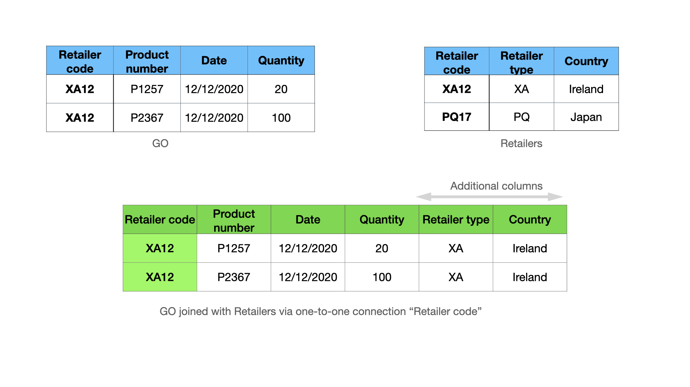
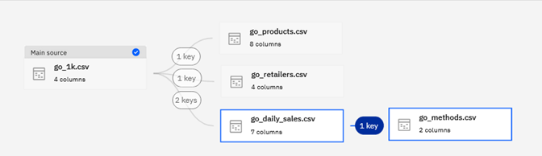
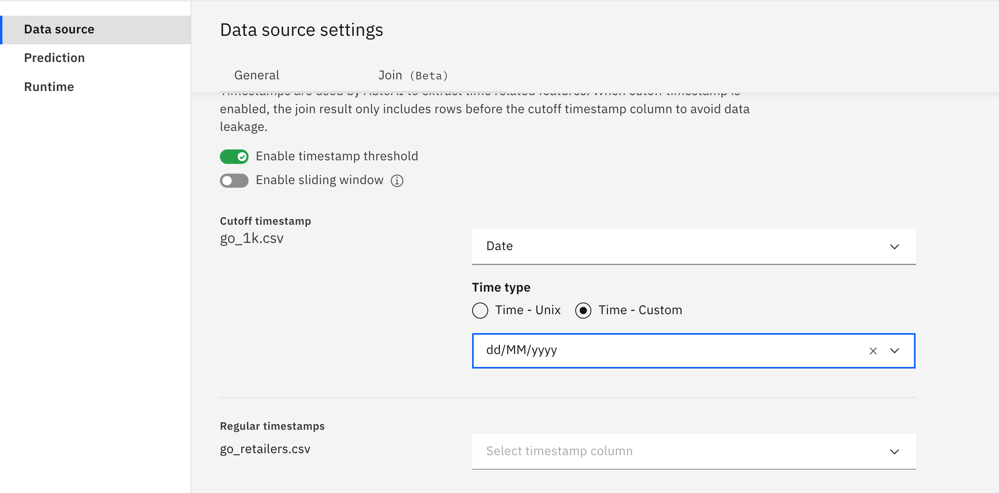
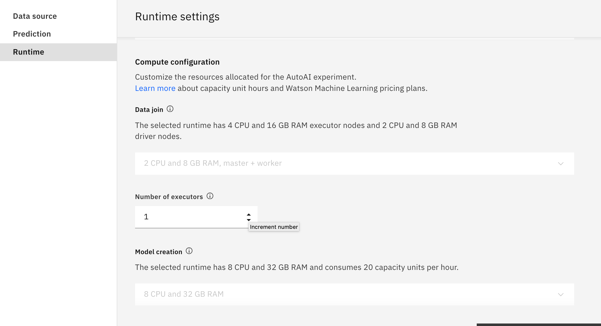
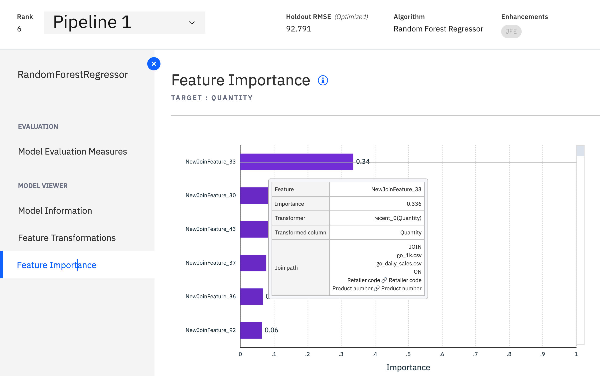
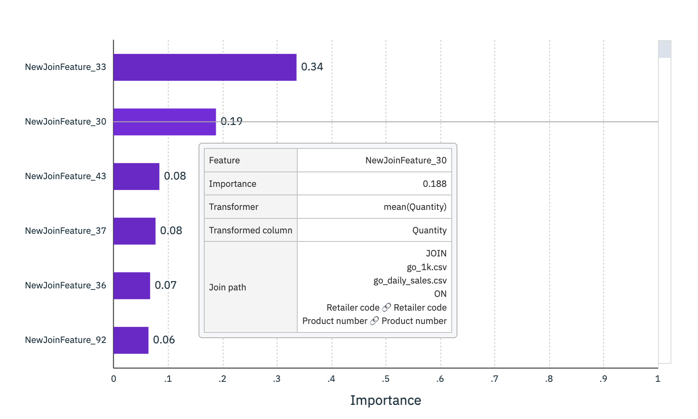

---
also_found_in:
- learningpaths/explore-autoai/
authors: ''
check_date: '2022-03-15'
completed_date: '2021-03-15'
components:
- cloud-pak-for-data
- watson-studio
draft: false
excerpt: Learn how to perform feature engineering tasks automatically and in minutes
  with IBM AutoAI in IBM Cloud Pak for Data.
meta_description: Learn how to perform feature engineering tasks automatically and
  in minutes with IBM AutoAI in IBM Cloud Pak for Data.
meta_keywords: machine learning, AutoAI, Watson Studio, model building, models
meta_title: Explore automated feature engineering for relational data
primary_tag: artificial-intelligence
related_content:
- slug: cloud-pak-for-data-learning-path
  type: learningpaths
- slug: watson-studio-auto-ai
  type: tutorials
- slug: get-started-watson-studio
  type: learningpaths
subtitle: Perform feature engineering tasks automatically and in minutes with IBM
  AutoAI in IBM Cloud Pak for Data
tags:
- machine-learning
title: Explore automated feature engineering for relational data
---

Feature engineering is one of the most important data preparation tasks because features to machine learning models are as important as bricks to buildings. It's one of the most tedious tasks in data science projects, especially when the input data is provided in a raw format that is kept in multiple data sources. Feature engineering is a part of the Extract Transform and Load (ETL) process, where data engineers and data scientists write SQL-like queries to join and aggregate data from different sources to hunt for useful features. Typically, it takes weeks or even months to complete this task manually because there are many options for exploring table joining and aggregation, mostly in a trial-and-error manner, until satisfactory results have been achieved.

In this article, learn how to perform feature engineering automatically with IBM AutoAI in IBM Cloud Pak for Data. With the help of AutoAI, this task can be done in minutes, saving you weeks of manual effort while achieving top performance results. The examples in the article include two interesting real-world use cases, one concerning sales prediction with time series data and another related to user experience analysis with call center data. 

The main functions provided with the current version of AutoAI include:

* End-to-end automated feature engineering and machine learning pipeline optimization for relational data
* User-friendly UI for drag-and-drop connections between tables to declare foreign-key relations
* Support multi-modal data such as time series, event sequences, uneven time series, and itemset data
* Scale up using Spark by adding more executors and memory for model training
* Deployment and batch scoring with a few clicks

## Basic concepts about relational data

Relational data consists of a set of tables, with each table containing information about an entity such as a product, a retail store, or sales of products in stores. It is assumed that there is a "main" table that contains a prediction target column, while the other tables are called contextual tables. The following figure shows an example of the database for the Great Outdoor (GO) company with the following tables:

* Go: The main source with a prediction target column (Quantity), which is the daily sales quantity for a product in a retail store
* Daily sales: Historical daily sales data in each retail store for every product
* Retailers: The retailer's static information
* Products: The product's static information
* Order methods: The purchase method code
 

_Foreign-key connections_: Columns that are shared by two tables. For example, between the Go and Daily sales, the two columns Retail code and Product number can form a single connection. Additionally, it's possible to have multiple connections between two tables. For example, the Retail code column can alone form another connection between them. 

_Entity relation diagram (ERD)_: A graph where nodes are tables, and connections are foreign-key connections between the tables. The previous figure is a complete ERD of the GO database.

_Timeseries data_: A table can have one timestamp column indicating the time point when the corresponding record in the table was created. When the table is associated with a timestamp column, the records are ordered according to the given timestamp. For instance, the Daily sales table is time-ordered by the Date column. In AutoAI, you can declare a column in a table as a timestamp to inform AutoAI that the data is time-ordered. This information is important because it helps AutoAI extract time-series features and also uses this information to avoid data leakage.

## Feature engineering as join and aggregate 

Feature engineering is the process where data scientists add new features (columns) to the main source by joining and aggregating valuable information from the contextual sources. In general, feature engineering is done by first joining the main table with contextual tables, followed by a `groupby` and `aggregation` operations to turn the joined table into features. Depending on the type of connections between tables, different aggregation functions can be used. Two types of connections are:

* One-to-one relation
* One-to-many relation

#### One-to-one relation connections

A one-to-one relation connection is when one value of the key columns in the left table matches with one value of the key columns in the right table. For example, the connection between GO and Retailers using the "Retailer code" is a one-to-one connection. (See the following image.) With one-to-one relation connections, left-joining GO and Retailers using the Retailer code results in a new table that has additional columns, while preserving the number of rows of the main source as shown in the following figure.

Therefore, for one-to-one connections, AutoAI simply grabs additional columns from the Retailers and adds them to the main table. This is equivalent to applying identity transformations on the join results.

#### One-to-many relation connections

One-to-many connections happen when one value of the key columns in the left table matches with several values of the key columns in the right table. For example, the connection between GO and Daily sales using the Retailer code and Product number values is a one-to-many connection. In the following figure, the Retailer code XA12 and the Product number P1257 match three times in the Daily sales table. Under that circumstance, left-joining GO and Daily sales using these columns results in a new table that contains not only additional columns but also additional rows.

In this case, AutoAI groups the matched records in the joined table into two groups that correspond to the Product P1257 and P2367 in the Store XA12, respectively. Then, it applies relevant aggregation functions on each group to extract features for each product in the store. For example, the first group has three records {R1, R2, R3}. Following are some features that are extracted with some aggregation functions supported in AutoAI:

* Apply the mean aggregation function on the Quantity column results in value `mean(2, 4, 18) = 8`. This value corresponds to the average sale quantity for Product P1257 in Store XA12.

* Apply the `max aggregation` function on the Unit price results in `max(5, 9, 8) = 9$`. This feature concerns the max sale price for Product P1257 in Store XA12.

Both extracted features can be a good indicator for predicting the sale of Product P1257 in Store XA12 in the future because the first one concerns the moving average sale quantity while the second one concerns sale price increases.

### Timeseries data aggregation

Using the previous example, if you specify Date in the main table as the cutoff time column indicating when the prediction should be made and Date in Daily sales as a timestamp column indicating when the sale records were created, then AutoAI filters the records in each group that happen after the cutoff. That's because including them in the feature engineering process leads to incorrect results known as data leakage, where the trained models use information from R1 created on 21/12/2020 to predict the sale more than a week before on 12/12/2020.

After filtering out R1, the first group now contains two records {R2, R3} corresponding to historical data happening before the cutoff of 2/12/2020 for Product P1257 in Retail store XA12. Moreover, the records in the group are now ordered by timestamps. Therefore, AutoAI applies timeseries- and sequence-related aggregations. Take a look at [Join feature engineering details](https://www.ibm.com/docs/en/cloud-paks/cp-data/latest?topic=preview-join-feature-engineering-details-tech) for examples.
 
* The most recent value of the Quantity column (with respect to the cutoff time 12/12/2020) is 4. This feature is called lag-1 in timeseries analysis and is useful for predicting the quantity thanks to auto-correlation. 

* The Price unit trend is obtained by dividing the most recent value to the sum of the Unit price and is 9/(9+7) in this example. This feature indicates an increasing or decreasing unit price trend, which is a good predictor for sales quantities.

## Great Outdoor sale prediction example

So far, you've learned the basic concepts of feature engineering in relational data. In this section, I explain how to configure AutoAI to perform this task with GO sample data for predicting sales quantities of every product in each retail store. The data is available in the gallery, and also can be [downloaded](https://dataplatform.cloud.ibm.com/exchange/public/entry/view/dcf7b09bd340e6ff9a2d1869631f3753?cm_sp=ibmdev-_-developer-articles-_-cloudreg). 

In this example, I explain how to:

* Drag tables for ERD declaration
* Configure time information to enable advance time-related features and to avoid data leakage
* Observe automated feature engineering process on the fly
* Explore the most important features automatically created by AutoAI to get some insights
* Deploy the model and batch scoring

You can watch the entire demo video to see a detailed walk-through of the steps.

<iframe width="560" height="315" src="https://video.ibm.com/embed/channel/23952663/video/wml-autoai-join-tutorial" style="border: 0;" webkitallowfullscreen allowfullscreen frameborder="no" width="480" height="270" referrerpolicy="no-referrer-when-downgrade"></iframe>

The following sections summarize the main configuration steps.

### ERD declaration

After adding .csv files to the AutoAI experiments and choosing the main source with the prediction target column, you're asked to configure the join for declaration of the entity relation diagram. In AutoAI, you can declare the entity relation diagram by dragging tables to the canvas and creating connections between them. The following figure provides an example of the complete ERD for the GO sample data set. 

Some interesting features of the ERD declaration UI are:

* Automatic key suggestion: Automatically suggest keys based on matching names.
* Multiple connections: Between two tables many connections are possible.
* Multiple columns: A connection can include multiple columns as keys.
* Arbitrary graph: AutoAI automatically chooses the best way to explore the graph.

An important question you should ask when you create a new connection is "what do I expect AutoAI to bring from that connection?" Answers to that question require some understanding of the data set. For example, in the GO sample data set, the connection between the main source and Retailers brings additional static information about Retailers, while the connection with the Products table brings static information about the products. These are straightforward cases because there is only one way to connect these tables and the connections are one-to-one. 
 
An example with the Daily sales table is more complicated. Recall that the Daily sales table includes historical timeseries data for each product in a retail store. With two columns, Retailer code and Product number, there are at least three options to connect these tables:

* Use both the Retailer code and Product number columns, which results in features aggregated specific to a product in a specific store.

* Use the Retailer code column, which creates features conveying information about the sales status of the stores.

* Use the Product number column, in which the extracted features concern the sales status of every product across all of the stores in the database.

By choosing keys to include in a connection, you control what information you want to aggregate. In the demo video, you see that the first option was chosen, but the other options also bring useful features aggregated at store levels or for every product across stores. We encourage you to try these options in your experiments by adding and removing the connections to see the impact on the final prediction results.

### Timestamp configuration

As I have discussed, timestamps play an important role in helping AutoAI extract useful time-related features and avoiding data leakage. If the data has timestamps, you should provide AutoAI with this information. Timestamp configuration can be found in the Data source settings, as shown in the following figure. You can set timestamps for the main table and the Daily sales table.

When you specify a timestamp column, you must specify its format, which follows the `SimpleDateFormat`.

Besides timestamp configuration, you can also specify the following optional parameters:

* Sliding windows: Limit the feature engineering to only recent data in the given sliding windows.

* Join limit: Sample the join data to reduce the join size when it is too large, which is useful for working with large tables.

### Computing configuration and experiment running

It is possible to increase the number of computing executors in the provided Spark cluster to scale-up the experiment to large data in the Runtime settings.

After you've completed all of the configurations, you can start the experiment and watch the progress of the features being generated through a progress bar. When a join is done, you can browse the corresponding connection to see the type of connections and the list of aggregations (transformations) used to generate features from the given connection.

For instance, in the following figure, the connection between the main table and the Retailers table is a one-to-one connection, so the Applied transformations list includes only the identity transformation (keep the value as-is).

  
On the other hand, the connection between the main table GO and the Daily sales table using Retailer code and Product number is a one-to-many connection, and there are timestamps that are associated with those tables, so you can see a list of all timeseries-related aggregations. 

## Feature exploration

When pipelines are available in the leaderboard, you can start exploring them to get more insights. In AutoAI, besides feature engineering by join and aggregation, denoted as JFE in the Enhancements column of the pipeline leaderboard, you also have additional feature engineering (FE) enhancement by applying additional mathematical functions on JPE features.

In this article, I focus on the JFE features. Therefore, Pipeline 1 with only JFE features was selected for the exploration. Looking at the feature importance plot, you can see a list of features sorted according to their contribution to the model prediction. 

A window over NewJoinFeature_33 shows detailed information about how the given feature was generated. From this window, you learn that the most important feature is the lag 1 value of the Quantity timeseries in the Daily sales table. This makes sense because there is a strong auto-correlation in the data where the sales quantity of the next day is highly correlated with the sales quantity of the previous date. AutoAI creates this feature automatically by joining the GO table with the Daily sales table using Retailer code and Product number keys, and aggregating using the recent_0 transformation.  

Another feature in the list that makes sense is NewJoinFeature_30, which was created by joining the GO table with the Daily sales table using Retailer code and Product number keys, and aggregating using the mean transformation, which conveys information about the moving average of the sale in historical data.

### Deploy and batch scoring

You can use AutoAI to deploy a pipeline by clicking **Save as** next to any pipeline in the leaderboard. During scoring, you must supply the .csv files, including up-to-date contextual tables and the new main table with new records. 
 
## What's next?

You're encouraged to try another interesting customer experience analysis with [call center data](https://dataplatform.cloud.ibm.com/exchange/public/entry/view/013c690997e27f3a8d91332653378c93?context=cpdaas#?cm_sp=ibmdev-_-developer-articles-_-cloudreg) after following the tutorial in our [documentation page](https://www.ibm.com/docs/en/cloud-paks/cp-data/latest?topic=baejdtp-tutorial-build-multiclass-data-join-model-tech-preview).

Take a look at the demo video about the analysis with IBM AutoAI. Also, you can find [documentation](https://www.ibm.com/docs/en/cloud-paks/cp-data/latest?topic=preview-join-feature-engineering-details-tech) with detailed descriptions on the list of aggregation functions for every type of data that is supported by AutoAI.

<iframe width="560" height="315" src="https://video.ibm.com/embed/channel/23952663/video/wml-autoai-join-user-ex" style="border: 0;" webkitallowfullscreen allowfullscreen frameborder="no" width="480" height="270" referrerpolicy="no-referrer-when-downgrade"></iframe>

## Additional resources

For technical details about the algorithms and comparative studies please refer to the following publications:

1. Hoang Thanh Lam, Johann Michael-Thiebaut, Mathieu Sinn, Bei Chen, Tiep Mai and Oznur Alkan. One button machine for automating feature engineering in relational databases. Arxiv 2017. https://arxiv.org/abs/1706.00327

1. Hoang Thanh Lam, Beat Buesser, Hong Min, Tran Ngoc Minh, Martin Wistuba, Udayan Khurana, Gregory Bramble, Theodoros Salonidis, Dakuo Wang and Horst Samulowitz. Automated Data Science for Relational Data. Demo paper at IEEE ICDE 2021.