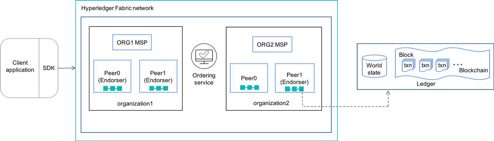

ブロックチェーン技術は、イノベーションのための豊富な機会を提供します。商取引の方法を根本的に変えることで、ビジネスに革命を起こす力があります。

では、開発者がブロックチェーンネットワークのコード開発を始めるには、どのような方法があるのでしょうか。私は、Hyperledger Fabricプロジェクトをしっかりと理解することから始めることをお勧めします。

[Hyperledger](https://www.hyperledger.org/)は、ビジネス利用のための業界横断的なブロックチェーン技術を推進するために作られたオープンソースの共同作業です。このグローバルなコラボレーションは、The Linux Foundationが主催しています。

Hyperledgerは、さまざまなブロックチェーンビジネス技術、フレームワーク、ライブラリ、アプリケーションのインキュベーションとサポートを行っています。[Hyperledger project](https://www.hyperledger.org/projects)は、Hyperledger Fabricを含むいくつかのブロックチェーンフレームワークをホストしています。この記事では、Hyperledger Fabricとは何か、ソリューションを構築するためにHyperledger Fabricをどのように使用するか、Hyperledger Fabricでどのようにトランザクションが実行されるかについて概要を説明しています。

## Hyperledger Fabricとは？

[Hyperledger Fabric](https://www.hyperledger.org/projects/fabric)は、メンバーのアイデンティティと役割が他のメンバーに知られている、プライベートで許可されたビジネスネットワークのためのオープンソースのフレームワーク実装です。このフレームワークは、モジュール式のアーキテクチャを持つソリューションを開発するための基盤として設計されています。台帳データベース、コンセンサスメカニズム、メンバーシップサービスなどのコンポーネントをプラグアンドプレイで構築することができます。コンテナ技術を活用し、エンタープライズレベルのネットワークセキュリティ、スケーラビリティ、および機密性を実現します。

Hyperledger Fabricのネットワークには、以下のようなコンポーネントがあります。

* **アセット**。アセットとは、価値のあるものを指します。アセットは、状態と所有権を持ちます。アセットは、Hyperledger Fabricでは、キーとバリューのペアのコレクションとして表現されます。
* **Shared ledger**.アセットの状態と所有権を記録するのが台帳です。台帳は2つのコンポーネントで構成されています。

  * _world state_ は、ある時点での台帳の状態を表します。これは元帳のデータベースです。
  * _blockchain_ は、すべての取引を記録する取引ログ履歴です。

* **スマートコントラクト**。Hyperledger Fabricのスマートコントラクトは、_chaincode_と呼ばれています。チェーンコードは、資産と関連する取引を定義するソフトウェアで、言い換えれば、システムのビジネスロジックを含んでいます。Chaincodeは、アプリケーションが台帳と対話する必要があるときに呼び出されます。ChaincodeはGolangやNode.jsで書くことができます。
* **Peerノード**。ピアは、元帳やスマートコントラクトをホストするため、ネットワークの基本的な要素です。ピアはChaincodeを実行し、元帳データにアクセスし、トランザクションを承認し、アプリケーションとのインターフェースを行います。ピアの中には、_endorsing peer_（エンドーサー）となるものもあります。すべてのChaincodeはエンドースメントポリシーを指定することができ、それは有効なトランザクションエンドースメントの必要条件と十分条件を定義します。
* **チャネル**.チャンネルとは、ピアの集合体によって形成される論理構造のことです。この機能により、ピアのグループが独立したトランザクションの元帳を作成することができます。
* **組織**.Hyperledger Fabricのネットワークは、ネットワークのメンバーである様々な組織が所有し、貢献したピアから構築されています。ネットワークは、組織が個々のリソースを集合的なネットワークに提供することで成り立っています。ピアは、その所有する組織のメンバーシップ・サービス・プロバイダによって割り当てられたアイデンティティ（デジタル証明書）を持っています。異なる組織のピアが同じチャンネルに参加することができます。
* **メンバーシップ・サービス・プロバイダ（MSP）**.MSPは、メンバーのアイデンティティと役割を認証するための証明書を管理する_認証局として実装されています。MSPは、Hyperledger Fabricのネットワーク上で、未知のIDによる取引はできません。MSPは、ユーザーIDを管理し、ネットワーク上のすべての参加者を認証することで、Hyperledger FabricをPrivate and Permissionedなネットワークにします。
* **オードリングサービス**.Ordering Serviceは、チャネル上のピアに配信されるトランザクションをブロックにパッケージ化します。このサービスは、ネットワーク上でのトランザクションの配信を保証します。また、ピアやエンドーシング・ピアと通信します。オーダリングサービスは、SoloとKafkaに対応しています。

**図1.Hyperledger Fabricネットワークの構成要素（わかりやすくするため、チャンネルは表示していません）**。

## ブロックチェーンソリューションの仕組み

ブロックチェーンソリューションでは、Hyperledger Fabricネットワークがバックエンドとして機能し、アプリケーションのフロントエンドがネットワークと通信します。SDKは、Node.js SDKやJava SDKなど、フロントエンドとバックエンドの通信を設定するのに役立ちます。SDKは、ユーザーのチェーンコードを実行したり、ネットワーク内のトランザクションを実行したり、イベントを監視するなどの機能を提供します。

ブロックチェーンアプリケーションを書くには、以下のことが必要です。

1. Goのようなサポートされたプログラミング言語でチェーンコードを書く。
2.ChaincodeをHyperledger Fabricネットワークにデプロイする。
3.3.SDKを使ってクライアントアプリケーションを開発する。

## ブロックチェーンのトランザクションが実行されるまで

Hyperledger Fabricネットワークにおけるトランザクションのハイレベルなリクエストフローは次のようになります。

1. クライアントは、Node.jsまたはJava&trade; SDKを使用してHyperledger Fabricネットワークに接続します。SDKのAPIを使用して、クライアントはトランザクションを作成し、エンドースするピアに送信します。
2.エンドースメント・ピアがクライアントの署名を検証し、トランザクションをシミュレートし、エンドースメント署名を送信します。
3.3. トランザクションがエンドースされた場合、クライアントはそのトランザクションを注文サービスに提出します。そうでなければ、その取引はキャンセルされる。
4.4. オーダー・サービスは、ピアにトランザクションを配信する。すべてのピアは、同じシーケンスのトランザクションをコミットして適用し、その状態を更新する。

## まとめ

Hyperledger Fabricは、ブロックチェーンフレームワークの実装です。IBM BlockchainソリューションとBlockchain Platform as a Service on IBM Cloudは、いずれもHyperledger Fabricを活用しています。Hyperledger Fabricとは何か、どのように機能するのかを理解した上で、ブロックチェーン・アプリケーションの開発を開始する準備ができましたので、さっそく実験してみましょう

## 次のステップ

* [**IBM Blockchain Platform**](https://www.ibm.com/blockchain/getting-started)を使って、今すぐブロックチェーンネットワークをキックスタートさせましょう。

* IBM Developerにある多くのブロックチェーン[**コードパターン**](/patterns/category/blockchain/)をチェックします。これらのパターンは、ブロックチェーン技術で複雑な問題を解決するためのロードマップを提供しており、アーキテクチャ・ダイアグラム、コード・レポ、および追加の読み物が含まれています。

* [**IBM Developer Blockchain hub**](/technologies/blockchain/)に立ち寄ってください。[**IBM Developer Blockchain hub**](/technologies/blockchain/)では、ビジネス向けのブロックチェーン・ソリューションを開発・展開するための無料ツールやチュートリアル、コードやコミュニティのサポートを提供しています。

## もっと詳しく

* [A deep dive into Hyperledger Fabric architecture](https://hyperledger-fabric.readthedocs.io/en/release-1.4/arch-deep-dive.html)
* [What is Hyperledger?](https://blockgeeks.com/guides/what-is-hyperledger/)