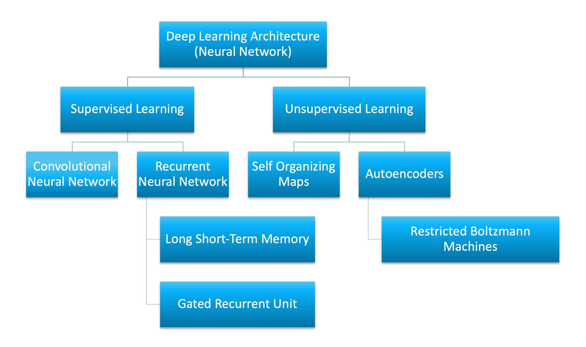
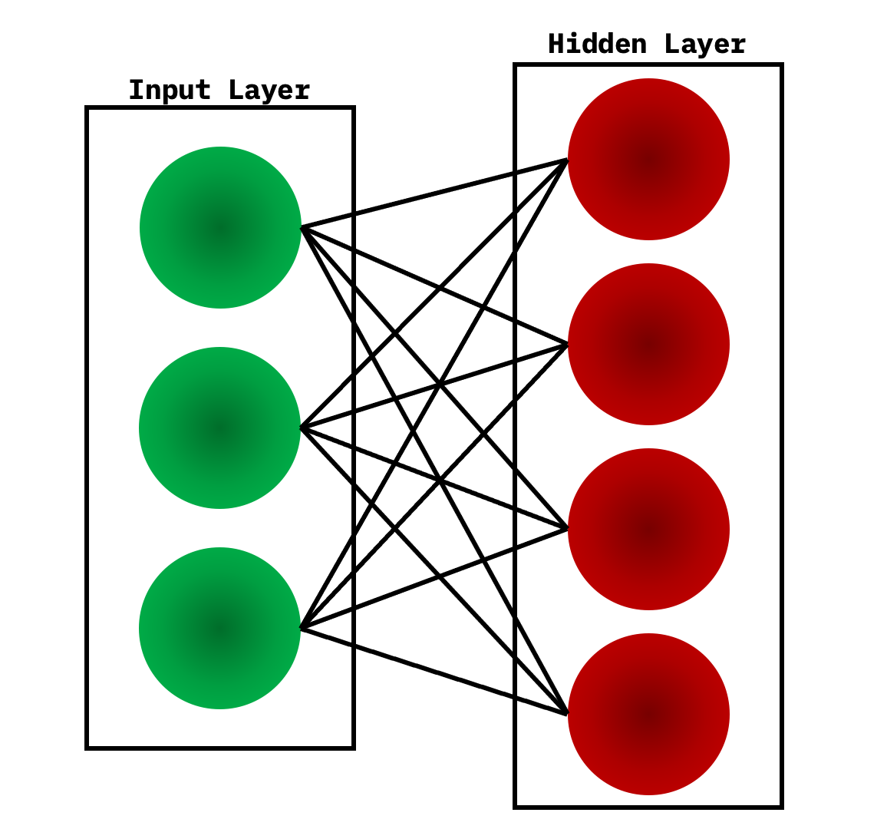

コネクショニスト・アーキテクチャーは70年以上前から存在していましたが、新しいアーキテクチャーとGPU（Graphical Processing Unit）によって、人工知能の最前線に登場しました。ディープラーニングは単一のアプローチではなく、アルゴリズムとトポロジーのクラスであり、幅広い問題に適用することができます。

深層学習は確かに新しいものではありませんが、深く階層化されたニューラルネットワークと、その実行を高速化するためのGPUの使用が交差することで、爆発的な成長を遂げています。また、ビッグデータもこの成長を後押ししています。深層学習は、例となるデータを用いてニューラルネットワークを学習し、その成功に応じて報酬を与えることで成り立っているため、データが多ければ多いほど、深層学習の構造を構築するのに適しています。

深層学習に使用されるアーキテクチャやアルゴリズムの数は多岐にわたります。ここでは、過去20年にわたる深層学習のアーキテクチャのうち、6つのアーキテクチャを紹介する。注目すべきは、長短期記憶（LSTM）と畳み込みニューラルネットワーク（CNN）は、このリストの中で最も古いアプローチの2つであると同時に、さまざまなアプリケーションで最も使用されている2つでもある。

この記事では、深層学習アーキテクチャを教師あり学習と教師なし学習に分類し、人気のある深層学習アーキテクチャである、畳み込みニューラルネットワーク、リカレントニューラルネットワーク（RNN）、長短期記憶/ゲートリカレントユニット（GRU）、自己組織化マップ（SOM）、オートエンコーダー（AE）、制限付きボルツマンマシン（RBM）を紹介しています。また、深層信念ネットワーク（DBN）と深層スタッキングネットワーク（DSN）についても概観している

人工ニューラルネットワーク（ANN）は、深層学習を支える基盤となるアーキテクチャです。ANNをベースに、いくつかのバリエーションのアルゴリズムが考案されています。深層学習と人工ニューラルネットワークの基礎については、[深層学習入門](https://developer.ibm.com/technologies/artificial-intelligence/articles/an-introduction-to-deep-learning/)の記事をお読みください。

## 教師ありディープラーニング

教師あり学習とは、学習に使用するデータの中に予測対象が明確にラベル付けされている問題空間のことを指します。

このセクションでは、教師付き深層学習の代表的なアーキテクチャである、畳み込みニューラルネットワークとリカレントニューラルネットワークの2つのアーキテクチャと、それらのバリエーションを紹介します。

### 畳み込みニューラルネットワーク

CNNは、動物の視覚野にヒントを得て開発された多層ニューラルネットワークです。畳み込みニューラルネットワークは、動物の視覚野に生物学的なヒントを得て開発された多層ニューラルネットワークです。最初のCNNはYann LeCunによって開発されましたが、当時は郵便番号などの手書き文字の認識に焦点を当てたアーキテクチャでした。深層ネットワークとして、初期の層はエッジなどの特徴を認識し、後期の層はこれらの特徴を入力のより高いレベルの属性に組み替える。

LeNet CNNのアーキテクチャは、特徴抽出と分類を行ういくつかの層で構成されています（次の画像を参照）。画像は受容野に分割され、それが畳み込み層に入り、入力画像から特徴を抽出します。次のステップはプーリングで、抽出された特徴の次元を（ダウンサンプリングによって）減らしつつ、最も重要な情報を（通常、最大プーリングによって）保持します。その後、別の畳み込みとプーリングのステップが実行され、完全に接続されたマルチレイヤー・パーセプトロンに入力されます。このネットワークの最終的な出力層は、画像の特徴を識別するノードのセットです（ここでは、識別された数字ごとにノードがあります）。ネットワークの学習には、バックプロパゲーションを使用します。

[ 典型的なLeNet CNNアーキテクチャの図](images/figure06.png)

深層処理層、畳み込み層、プーリング層、そして完全連結の分類層を使用することで、深層学習ニューラルネットワークのさまざまな新しいアプリケーションへの扉が開かれました。画像処理に加えて、CNNはビデオ認識や自然言語処理におけるさまざまなタスクへの応用に成功している。

****応用例です。*画像認識、動画解析、自然言語処理*など

## リカレントニューラルネットワーク

RNNは、他の深層学習アーキテクチャの基礎となるネットワークアーキテクチャの1つです。一般的な多層ネットワークとリカレントネットワークの主な違いは、完全なフィードフォワード接続ではなく、前の層（または同じ層）にフィードバックされる接続があることです。このフィードバックにより、RNNは過去の入力の記憶を保持し、問題を時間的にモデル化することができる。

RNNは、さまざまなアーキテクチャで構成されています（次に、LSTMと呼ばれる一般的なトポロジーを見てみましょう）。差別化の鍵となるのは、ネットワーク内のフィードバックであり、それは隠れた層、出力層、またはそれらの組み合わせから現れます。

RNNは、時間的に展開され、標準的なバックプロパゲーションを用いて学習することができますが、バックプロパゲーションの変形として、時間的バックプロパゲーション（BPTT）と呼ばれる方法もあります。

*アプリケーション例音声認識、手書き文字認識*など

#### LSTMネットワーク

LSTMは、1997年にHochreiterとSchimdhuberによって考案されましたが、様々な用途のRNNアーキテクチャとして、近年人気が高まっています。スマートフォンなどの身近な製品にもLSTMが搭載されています。IBMはLSTMをIBM Watson&reg;に応用し、画期的な会話型音声認識を実現しました。

LSTMは、一般的なニューロンベースのニューラルネットワークのアーキテクチャから脱却し、メモリーセルという概念を導入しました。メモリセルは、入力の関数として短時間または長時間その値を保持することができ、最後に計算された値だけでなく、何が重要であるかを記憶することができます。

LSTMのメモリセルには、情報の出入りを制御する3つのゲートがあります。入力ゲートは、新しい情報がいつメモリに流入するかを制御します。忘却ゲートは、既存の情報が忘れ去られ、セルが新しいデータを記憶できるようにすることを制御します。最後に、出力ゲートは、セルに含まれる情報が、セルからの出力に使用されるタイミングを制御する。また、セルには、各ゲートを制御する重みが含まれている。学習アルゴリズム（一般的にはBPTT）は、ネットワークの出力誤差の結果に基づいて、これらの重みを最適化する。

 最近のCNNやLSTMの応用例としては、画像や動画に自然言語でキャプションを付ける画像・動画キャプションシステムがある。CNNは画像やビデオの処理を実行し、LSTMはCNNの出力を自然言語に変換するように学習される。

* 応用例です。画像や映像のキャプションシステム

#### GRUネットワーク

2014年、LSTMを単純化したgated recurrent unitと呼ばれるモデルが登場した。このモデルは、LSTMモデルに存在する出力ゲートを取り除いて、2つのゲートを持っています。そのゲートとは、アップデートゲートとリセットゲートである。更新ゲートは、前のセルの内容をどれだけ維持するかを示します。リセットゲートは、新しい入力を前のセルの内容にどのように組み込むかを定義します。GRUは、リセットゲートを1に、アップデートゲートを0に設定するだけで、標準的なRNNをモデル化することができます。

GRUは、LSTMよりも単純で、より早く学習でき、より効率的な実行が可能である。しかし、LSTMの方が表現力が高く、より多くのデータがあれば、より良い結果を得ることができます。

*応用例自然言語テキストの圧縮、手書き認識、音声認識、ジェスチャー認識、画像キャプション*。

## 教師なしの深層学習

教師なし学習とは、学習に使用するデータの中にターゲットラベルが存在しない問題空間を指します。

ここでは、自己組織化マップ、オートエンコーダー、制限付きボルツマンマシンの3つの教師なし深層学習アーキテクチャについて説明します。また、ディープビリーフネットワークやディープスタッキングネットワークがどのように構築されるかについても説明します。

### 自己組織化マップ

自己組織化マップ（Self-Organized Map: SOM）は、1982年にTeuvo Kohonen博士によって発明され、Kohonenマップとして親しまれてきました。SOMは、教師なしのニューラルネットワークで、入力されたデータセットの次元を下げることでクラスターを作成します。SOMは、従来の人工ニューラルネットワークとは異なる点が多くあります。

最初の大きな違いは、重みがノードの特性として機能することです。入力が正規化された後、まずランダムな入力が選ばれる。ゼロに近いランダムな重みが、入力レコードの各特徴に初期化される。これらの重みが入力ノードを表します。これらのランダムな重みのいくつかの組み合わせは、入力ノードのバリエーションを表します。これらの出力ノードのそれぞれと入力ノードとの間のユークリッド距離が計算される。この距離が最も小さいノードが、入力の最も正確な表現として宣言され、*best matching unit*または*BMU*としてマークされます。これらのBMUを中心点として、他のユニットも同様に計算され、その距離に応じたクラスタに割り当てられます。
BMUの重みを中心とした点の半径は、近さに基づいて更新されます。半径は縮小されます。

次に、SOMでは、活性化関数は適用されず、比較対象となるターゲットラベルがないため、誤差の計算やバックプロポゲーションの概念もありません。

****応用例です。*次元削減、高次元入力から2次元出力へのクラスタリング、ラジアスグレードの結果、クラスタの可視化*。

### オートエンコーダ

オートエンコーダがいつ発明されたかは定かではありませんが、最初に使われたのは1987年にLeCunが発見したオートエンコーダです。オートエンコーダーは、入力層、隠れ層、出力層の3層で構成される*ANN*の変形です。

まず、入力層が適切な符号化関数を用いて隠れ層に符号化される。隠れ層のノード数は、入力層のノード数よりもはるかに少ない。この隠れ層には、元の入力の圧縮された表現が含まれる。出力層は、デコーダ関数を使用して入力層を再構築することを目的としている。

学習段階では、入力層と出力層の差を誤差関数を用いて計算し、その誤差を最小化するように重みを調整します。従来の教師なし学習では、出力を比較するデータがないため、オートエンコーダは後方伝搬により継続的に学習します。このような理由から、オートエンコーダは「自己教師付き」アルゴリズムに分類される。

* 応用例としては次元削減、データ補間、データ圧縮・解凍など。

### 制限付きボルツマンマシン

RBMが普及したのはかなり後のことですが、もともとは1986年にPaul Smolensky氏が発明したもので、*Harmonium*と呼ばれていました。

RBMは、2層構造のニューラルネットワークです。層とは、入力層と隠れ層のことです。次の図に示すように、RBMでは、隠れた層のすべてのノードが、見える層のすべてのノードに接続されています。従来のボルツマンマシンでは、入力層と隠れ層内のノードも接続されています。*制限付き*ボルツマンマシンでは、計算の複雑さのため、層内のノードは接続されません。

RBMは、学習段階で、確率的なアプローチを用いて学習セットの確率分布を計算します。学習が始まると、各ニューロンはランダムに活性化されます。また、モデルには隠れたバイアスと見えるバイアスが含まれています。隠れバイアスはフォワードパスで活性化を構築する際に使用され、可視バイアスは入力の再構築に役立ちます。

RBMでは、再構成された入力は常に元の入力とは異なるため、*再生モデル*としても知られています。

また、RBMにはランダム性があるため、同じ予測値でも異なる出力が得られます。実はこの点が、決定論的モデルであるオートエンコーダーとの最も大きな違いなのです。

****応用例。*次元削減、協調フィルタリング*など

### Deep belief networks

DBN は、典型的なネットワークアーキテクチャですが、新しい学習アルゴリズムを含んでいます。DBNは、多層ネットワーク（典型的には深く、多くの隠れ層を含む）で、接続された各層のペアはRBMです。このように、DBN は RBM のスタックとして表現されます。

DBNでは、入力層が生の感覚入力を表し、各隠れ層がこの入力の抽象的な表現を学習します。出力層は、他の層とは多少異なる扱いを受けますが、ネットワークの分類を実行します。学習は、教師なしのプレトレーニングと教師ありのファインチューニングの2つのステップで行われます。

教師なしの事前学習では、各RBMは入力を再構成するように学習されます（例えば、最初のRBMは入力層から第1隠れ層までを再構成します）。次のRBMも同様に学習されますが、第1隠れ層は入力（または可視）層として扱われ、第1隠れ層の出力を入力としてRBMが学習されます。このプロセスは、各層の事前学習が終わるまで続きます。事前学習が完了すると，微調整が始まります．この段階では、出力ノードにラベルを付けて意味を持たせます（ネットワークの文脈で何を表しているか）。その後、勾配降下法またはバックプロパゲーション法を用いて、ネットワークの完全なトレーニングを行い、トレーニングプロセスを完了します。

* 応用例画像認識、情報検索、自然言語理解、故障予知など。

###ディープスタッキングネットワーク

最後のアーキテクチャはDSNで、深層凸型ネットワークとも呼ばれます。DSNは、従来の深層学習フレームワークとは異なり、深層ネットワークで構成されているものの、実際にはそれぞれの隠れた層を持つ個々のネットワークの深層集合であることが特徴です。このアーキテクチャは、深層学習の問題点の一つである学習の複雑さに対応したものです。深層学習アーキテクチャの各層は、トレーニングの複雑さを指数関数的に増加させるため、DSNはトレーニングを単一の問題としてではなく、個々のトレーニング問題のセットとして捉えています。

DSNは一連のモジュールで構成されており、各モジュールはDSNの全体的な階層におけるサブネットワークである。このアーキテクチャの1つの例では、DSNのために3つのモジュールが作成されています。各モジュールは、入力層、単一の隠れ層、出力層で構成されています。モジュールは1つずつ積み重ねられ、モジュールの入力は、前の層の出力と元の入力ベクトルで構成されます。このようにモジュールを重ねることで、単一のモジュールでは実現できないような複雑な分類をネットワーク全体で学習することができます。

DSNでは、個々のモジュールを分離して学習することができるため、並行して学習することができ、効率的です。教師付き学習は、ネットワーク全体に対するバックプロパゲーションではなく、各モジュールに対するバックプロパゲーションとして実装されている。多くの問題で、DSNは典型的なDBNよりも優れた性能を発揮し、一般的で効率的なネットワークアーキテクチャとなっています。

* 応用例としては情報検索、連続音声認識など

## さらに詳しく

深層学習は、様々な問題領域に対するソリューションを構築することができるアーキテクチャのスペクトラムで表されます。これらのソリューションには、フィードフォワードネットワークや、以前の入力を考慮できるリカレントネットワークがあります。この種の深層アーキテクチャの構築は複雑ですが、Caffe、Deeplearning4j、TensorFlow、DDLなど、さまざまなオープンソースソリューションが用意されているので、すぐに実行できます。