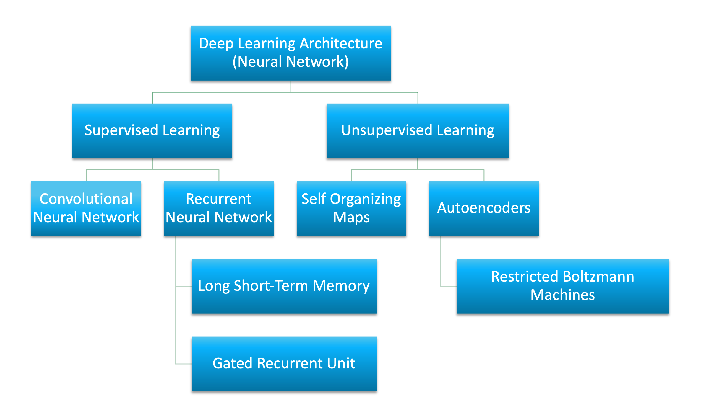
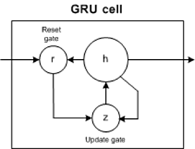
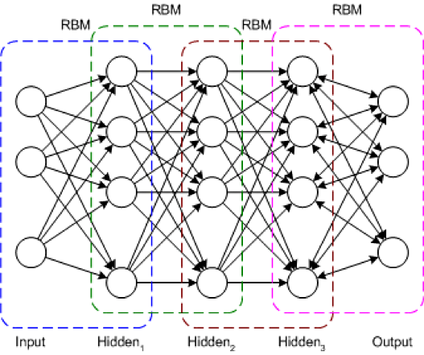

Connectionist architectures have existed for more than 70 years, but new architectures and graphical processing units (GPUs) brought them to the forefront of artificial intelligence. Deep learning isn't a single approach but rather a class of algorithms and topologies that you can apply to a broad spectrum of problems.

While deep learning is certainly not new, it is experiencing explosive growth because of the intersection of deeply layered neural networks and the use of GPUs to accelerate their execution. Big data has also fed this growth. Because deep learning relies on training neural networks with example data and rewarding them based on their success, the more data, the better to build these deep learning structures.

The number of architectures and algorithms that are used in deep learning is wide and varied. This section explores six of the deep learning architectures spanning the past 20 years. Notably, long short-term memory (LSTM) and convolutional neural networks (CNNs) are two of the oldest approaches in this list but also two of the most used in various applications.

This article classifies deep learning architectures into supervised and unsupervised learning and introduces several popular deep learning architectures: convolutional neural networks, recurrent neural networks (RNNs), long short-term memory/gated recurrent unit (GRU), self-organizing map (SOM), autoencoders (AE) and restricted Boltzman machine (RBM). It also gives an overview of deep belief networks (DBN) and deep stacking networks (DSNs)

Artificial neural network (ANN) is the underlying architecture behind deep learning. Based on ANN, several variations of the algorithms have been invented. To learn about the fundamentals of deep learning and artifical neural networks, read the [introduction to deep learning](https://developer.ibm.com/technologies/artificial-intelligence/articles/an-introduction-to-deep-learning/) article.

## Supervised deep learning

Supervised learning refers to the problem space wherein the target to be predicted is clearly labelled within the data that is used for training.

In this section, we introduce at a high-level two of the most popular supervised deep learning architectures - convolutional neural networks and recurrent neural networks as well as some of their variants.

### Convolutional neural networks

A CNN is a multilayer neural network that was biologically inspired by the animal visual cortex. The architecture is particularly useful in image-processing applications. The first CNN was created by Yann LeCun; at the time, the architecture focused on handwritten character recognition, such as postal code interpretation. As a deep network, early layers recognize features (such as edges), and later layers recombine these features into higher-level attributes of the input.

The LeNet CNN architecture is made up of several layers that implement feature extraction and then classification (see the following image). The image is divided into receptive fields that feed into a convolutional layer, which then extracts features from the input image. The next step is pooling, which reduces the dimensionality of the extracted features (through down-sampling) while retaining the most important information (typically, through max pooling). Another convolution and pooling step is then performed that feeds into a fully connected multilayer perceptron. The final output layer of this network is a set of nodes that identify features of the image (in this case, a node per identified number). You train the network by using back-propagation.

 

The use of deep layers of processing, convolutions, pooling, and a fully connected classification layer opened the door to various new applications of deep learning neural networks. In addition to image processing, the CNN has been successfully applied to video recognition and various tasks within natural language processing.

*Example applications: Image recognition, video analysis, and natural language processing*

### Recurrent neural networks

The RNN is one of the foundational network architectures from which other deep learning architectures are built. The primary difference between a typical multilayer network and a recurrent network is that rather than completely feed-forward connections, a recurrent network might have connections that feed back into prior layers (or into the same layer). This feedback allows RNNs to maintain memory of past inputs and model problems in time.

RNNs consist of a rich set of architectures (we'll look at one popular topology called LSTM next). The key differentiator is feedback within the network, which could manifest itself from a hidden layer, the output layer, or some combination thereof.

RNNs can be unfolded in time and trained with standard back-propagation or by using a variant of back-propagation that is called back-propagation in time (BPTT).

*Example applications: Speech recognition and handwriting recognition*

#### LSTM networks

The LSTM was created in 1997 by Hochreiter and Schimdhuber, but it has grown in popularity in recent years as an RNN architecture for various applications. You'll find LSTMs in products that you use every day, such as smartphones. IBM applied LSTMs in IBM Watson&reg; for milestone-setting conversational speech recognition.

The LSTM departed from typical neuron-based neural network architectures and instead introduced the concept of a memory cell. The memory cell can retain its value for a short or long time as a function of its inputs, which allows the cell to remember what's important and not just its last computed value.

The LSTM memory cell contains three gates that control how information flows into or out of the cell. The input gate controls when new information can flow into the memory. The forget gate controls when an existing piece of information is forgotten, allowing the cell to remember new data. Finally, the output gate controls when the information that is contained in the cell is used in the output from the cell. The cell also contains weights, which control each gate. The training algorithm, commonly BPTT, optimizes these weights based on the resulting network output error.

 Recent applications of CNNs and LSTMs produced image and video captioning systems in which an image or video is captioned in natural language. The CNN implements the image or video processing, and the LSTM is trained to convert the CNN output into natural language.

*Example applications: Image and video captioning systems*

#### GRU networks

In 2014, a simplification of the LSTM was introduced called the gated recurrent unit. This model has two gates, getting rid of the output gate present in the LSTM model. These gates are an update gate and a reset gate. The update gate indicates how much of the previous cell contents to maintain. The reset gate defines how to incorporate the new input with the previous cell contents. A GRU can model a standard RNN simply by setting the reset gate to 1 and the update gate to 0.

The GRU is simpler than the LSTM, can be trained more quickly, and can be more efficient in its execution. However, the LSTM can be more expressive and with more data can lead to better results.

*Example applications: Natural language text compression, handwriting recognition, speech recognition, gesture recognition, image captioning*

## Unsupervised deep learning

Unsupervised learning refers to the problem space wherein there is no target label within the data that is used for training.

This section discusses three unsupervised deep learning architectures: self-organized maps, autoencoders, and restricted boltzmann machines. We also discuss how deep belief networks and deep stacking networks are built based on the underlying unsupervised architecture. 

### Self-organized maps

Self-organized map (SOM) was invented by Dr. Teuvo Kohonen in 1982 and was popularly known as the Kohonen map. SOM is an unsupervised neural network that creates clusters of the input data set by reducing the dimensionality of the input. SOMs vary from the traditional artificial neural network in quite a few ways.

The first significant variation is that weights serve as a characteristic of the node. After the inputs are normalized, a random input is first chosen. Random weights close to zero are initialized to each feature of the input record. These weights now represent the input node. Several combinations of these random weights represent variations of the input node. The euclidean distance between each of these output nodes with the input node is calculated. The node with the least distance is declared as the most accurate representation of the input and is marked as the *best matching unit* or *BMU*. With these BMUs as center points, other units are similarly calculated and assigned to the cluster that it is the distance from. 
Radius of points around BMU weights are updated based on proximity. Radius is shrunk.

Next, in an SOM, no activation function is applied, and because there are no target labels to compare against there is no concept of calculating error and back propogation.

*Example applications: Dimensionality reduction, clustering high-dimensional inputs to 2-dimensional output, radiant grade result, and cluster visualization*

### Autoencoders

Though the history of when autoencoders were invented is hazy, the first known usage of autoencoders was found to be by LeCun in 1987. This variant of an *ANN* is composed of 3 layers: input, hidden, and output layers.

First, the input layer is encoded into the hidden layer using an appropriate encoding function. The number of nodes in the hidden layer is much less than the number of nodes in the input layer. This hidden layer contains the compressed representation of the original input. The output layer aims to reconstruct the input layer by using a decoder function.

During the training phase, the difference between the input and the output layer is calculated using an error function, and the weights are adjusted to minimize the error. Unlike traditional unsupervised learning techniques, where there is no data to compare the outputs against, autoencoders learn continuosly using backward propagation. For this reason, autoencoders are classified as *self supervised* algorithms.

*Example applications: Dimensionality reduction, data interpolation, and data compression/decompression*

### Restricted Boltzmann Machines

Though RBMs became popular much later, they were originally invented by Paul Smolensky in 1986 and was known as a *Harmonium*.

An RBM is a  2-layered neural network. The layers are input and hidden layers. As shown in the following figure, in RBMs every node in a hidden layer is connected to every node in a visible layer. In a traditional Boltzmann Machine, nodes within the input and hidden layer are also connected. Due to computational complexity, nodes within a layer are not connected in a *Restricted* Boltzmann Machine.

During the training phase, RBMs calculate the probabilty distribution of the training set using a stochastic approach. When the training begins, each neuron gets activated at random. Also, the model contains respective hidden and visible bias. While the hidden bias is used in the forward pass to build the activation, the visible bias helps in reconstructing the input.

Because in an RBM the reconstructed input is always different from the original input, they are also known as *generative models*.

Also, because of the built-in randomness, the same predictions result in different outputs. In fact, this is the most significant difference from an autoencoder, which is a deterministic model.

*Example applications: Dimensionality reduction and collaborative filtering*

### Deep belief networks

The DBN is a typical network architecture, but includes a novel training algorithm. The DBN is a multilayer network (typically deep and including many hidden layers) in which each pair of connected layers is an RBM. In this way, a DBN is represented as a stack of RBMs.

In the DBN, the input layer represents the raw sensory inputs, and each hidden layer learns abstract representations of this input. The output layer, which is treated somewhat differently than the other layers, implements the network classification. Training occurs in two steps: unsupervised pretraining and supervised fine-tuning.

In unsupervised pretraining, each RBM is trained to reconstruct its input (for example, the first RBM reconstructs the input layer to the first hidden layer). The next RBM is trained similarly, but the first hidden layer is treated as the input (or visible) layer, and the RBM is trained by using the outputs of the first hidden layer as the inputs. This process continues until each layer is pretrained. When the pretraining is complete, fine-tuning begins. In this phase, the output nodes are applied labels to give them meaning (what they represent in the context of the network). Full network training is then applied by using either gradient descent learning or back-propagation to complete the training process.

*Example applications: Image recognition, information retrieval, natural language understanding, and failure prediction*

### Deep stacking networks

The final architecture is the DSN, also called a deep convex network. A DSN is different from traditional deep learning frameworks in that although it consists of a deep network, it's actually a deep set of individual networks, each with its own hidden layers. This architecture is a response to one of the problems with deep learning, the complexity of training. Each layer in a deep learning architecture exponentially increases the complexity of training, so the DSN views training not as a single problem but as a set of individual training problems.

The DSN consists of a set of modules, each of which is a subnetwork in the overall hierarchy of the DSN. In one instance of this architecture, three modules are created for the DSN. Each module consists of an input layer, a single hidden layer, and an output layer. Modules are stacked one on top of another, where the inputs of a module consist of the prior layer outputs and the original input vector. This layering allows the overall network to learn more complex classification than would be possible given a single module.

The DSN permits training of individual modules in isolation, making it efficient given the ability to train in parallel. Supervised training is implemented as back-propagation for each module rather than back-propagation over the entire network. For many problems, DSNs can perform better than typical DBNs, making them a popular and efficient network architecture.

*Example applications: Information retrieval and continuous speech recognition*

## Going further

Deep learning is represented by a spectrum of architectures that can build solutions for a range of problem areas. These solutions can be feed-forward focused or recurrent networks that permit consideration of previous inputs. Although building these types of deep architectures can be complex, various open source solutions, such as Caffe, Deeplearning4j, TensorFlow, and DDL, are available to get you up and running quickly.