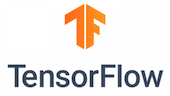

---
also_found_in:
- learningpaths/get-started-with-deep-learning/
authors: ''
check_date: '2021-03-11'
completed_date: '2021-03-12'
components:
- tensorflow
- keras
- pytorch
draft: false
excerpt: While each deep learning framework comes with its pros and cons, picking
  the right deep learning framework based on your individual workload is an essential
  first step every developer, deep learning practitioner, or data scientist must take.
meta_description: While each deep learning framework comes with its pros and cons,
  picking the right deep learning framework based on your individual workload is an
  essential first step every developer, deep learning practitioner, or data scientist
  must take.
meta_keywords: deep learning frameworks, artificial intelligence, TensorFlow, Keras
meta_title: Compare deep learning frameworks
primary_tag: deep-learning
related_content:
- slug: an-introduction-to-deep-learning
  type: articles
- slug: cc-machine-learning-deep-learning-architectures
  type: articles
subtitle: Picking the right deep learning framework based on your individual workload
  is an essential first step in deep learning
tags:
- machine-learning
- artificial-intelligence
title: Compare deep learning frameworks
---

Deep learning has gained immense popularity recently, and the various [deep learning architectures](/articles/cc-machine-learning-deep-learning-architectures/) make the field all the more widespread. To support the implementation of each of these architectures for different use cases, several frameworks are available. While each of these frameworks comes with its pros and cons, picking the right deep learning framework based on your individual workload is an essential first step every developer, deep learning practitioner, or data scientist must take.

This article provides an overview of six of the most popular deep learning frameworks: TensorFlow, Keras, PyTorch, Caffe, Theano, and Deeplearning4j. Over the past few years, three of these deep learning frameworks - Tensorflow, Keras, and PyTorch - have gained momentum because of their ease of use, extensive usage in academic research, and commercial code and extensibility. In this article, We'll also compare and contrast TensorFlow and PyTorch.

## TensorFlow

In the context of machine learning, _tensor_ refers to the multidimensional array used in the mathematical models that describe neural networks. In other words, a tensor is usually a higher-dimension generalization of a matrix or a vector.

Through a simple notation that uses a rank to show the number of dimensions, tensors allow the representation of complex `_n_-dimensional` vectors and hyper-shapes as `_n_-dimensional` arrays. Tensors have two properties: a datatype and a shape.

*TensorFlow* is an open source deep learning framework that was released in late 2015 under the Apache 2.0 license. Since then, it has become one of the most widely adopted deep learning frameworks in the world (going by the number of GitHub projects based on it).

TensorFlow traces its origins from Google DistBelief, a proprietary production deep learning system developed by the Google Brain project. Google designed TensorFlow from the ground up for distributed processing and to run optimally on Google's custom application-specific integrated circuit (ASIC) called the Tensor Processing Unit (TPU) in its production data centers. This design makes TensorFlow efficient for deep learning applications.

The framework can run on the CPU, GPU, or TPU on servers, desktops, and mobile devices. Developers can deploy TensorFlow on multiple operating systems and platforms either locally or in the cloud. Many developers consider TensorFlow to have better support for distributed processing and greater flexibility and performance for commercial applications than similar deep learning frameworks such as Torch and Theano, which are also capable of hardware acceleration and widely used in academia.

Deep learning neural networks typically consist of many layers. They transfer data or perform operations between layers using multidimensional arrays. A tensor flows between the layers of a neural network, thus, the name TensorFlow.

The main programming language for TensorFlow is Python. C++, the Java&reg; language, and the Go application programming interface (API) are also available without stability promises, as are many third-party bindings for C#, Haskell, Julia, Rust, Ruby, Scala, R, and even PHP. Google has a mobile-optimized TensorFlow-Lite library to run TensorFlow applications on Android.

This section provides an overview of the TensorFlow system, including the framework's benefits and applications.

### Benefits of TensorFlow

TensorFlow offers developers:

* **Eager execution.** TensorFlow 2 supports eager execution with which operations are evaluated immediately and concrete values are returned, without building graphs. This helps with kick-starting model building and debugging models.

* **Computational graph model.** TensorFlow uses data flow graphs called directed graphs to express computational models. This makes it intuitive for developers who can easily visualize what's going on within the neural network layers by using built-in tools and to perfect their neural network models by adjusting parameters and configurations interactively.

* **Simple-to-use API.** Python developers can use either the TensorFlow raw, low-level API, or core API to develop their own models, or use the higher-level API libraries for built-in models. TensorFlow has many built-in and contributed libraries, and it's possible to overlay a higher-level deep learning framework such as Keras to act as a high-level API. Many of the previous APIs have either been removed or updated to TensorFlow 2.0.

* **Flexible architecture.** A major advantage of using TensorFlow is that it has a modular, extensible, and flexible design. Developers can easily move models across CPU, GPU, or TPU processors with few code changes. Although originally designed for large-scale distributed training and inference, developers also can use TensorFlow to experiment with other machine learning models and system optimization of existing models.

* **Distributed processing.** Google Brain designed TensorFlow from the ground up for distributed processing on its custom ASIC TPU. In addition, TensorFlow can run on multiple NVIDIA GPU cores. Developers can take advantage of the Intel Xeon and Xeon Phi-based x64 CPU architectures or ARM64 CPU architectures. TensorFlow can run on multi-architecture and multicore systems as well as a distributed process that farms out compute-intensive processing as worker tasks. Developers can create clusters of TensorFlow servers and distribute the computational graph across those clusters for training. TensorFlow can perform distributed training either synchronously or asynchronously, both within the graph and between graphs and can share the common data in memory or across networked compute nodes.

* **Performance.** Performance is often a contentious topic, but most developers understand that any deep learning framework depends on the underlying hardware to run optimally to achieve high performance with a low-energy cost. Typically, the native development platform of any framework would achieve the best optimization. TensorFlow performs best on Google TPUs, but it manages to achieve high performance on various platforms-not just servers and desktops but also embedded systems and mobile devices. The framework supports a surprising number of programming languages, as well. Although another framework running natively, such as IBM Watson on the IBM platform, might sometimes outperform TensorFlow, it's still a favorite with developers because artificial intelligence (AI) projects can span platforms and programming languages targeting multiple end applications, all of which need to produce consistent results.

### TensorFlow applications

This section looks at the applications that TensorFlow is good at. Obviously, because Google was using its proprietary version of TensorFlow for text and voice search, language translation, and image search applications, the major strengths of TensorFlow are in classification and inference. For example, Google implemented RankBrain, the engine that ranks Google search results, in TensorFlow.

TensorFlow can be used to improve speech recognition and speech synthesis by differentiating multiple voices or filtering speech in high-ambient-noise environments, mimicking voice patterns for more natural-sounding text to speech. Additionally, it handles sentence structure in different languages to produce better translations. It can be used for image and video recognition as well as classification of objects, landmarks, people, sentiments, or activities. This has resulted in major improvements in image and video search.

Because of its flexible, extensible, and modular design, TensorFlow doesn't limit developers to specific models or applications. Developers have used TensorFlow to implement not only machine learning and deep learning algorithms but also statistical and general computational models. For more information about applications and contributed models, see [TensorFlow case studies](https://www.tensorflow.org/about/case-studies).

## Keras

[Keras](https://keras.io/) is a Python-based deep learning library that is different from other deep learning frameworks. Keras functions as a high-level API specification for neural networks. It can serve both as a user interface and to extend the capabilities of other deep learning framework back ends that it runs on.

Keras started as a simplified front end for the academically popular Theano framework. Since then, the Keras API has become a part of Google TensorFlow. Keras officially supports Microsoft Cognitive Toolkit (CNTK), Deeplearning4J, and Apache MXNet. Because of this widespread support, Keras has gained the position of the de facto tool for migration between frameworks. Developers can port not only deep learning neural network algorithms and models, but also pretrained networks and weights.

Keras is an open source Python package released under the Massachusetts Institute of Technology (MIT) license, with François Chollet, Google, Microsoft, and other contributors holding some of the software's copyrights.

A Keras front end enables rapid prototyping of neural network models in research. The API is easy to learn and use and has the added advantage of easily porting models between frameworks.

Because Keras is self-contained, you can use it without having to interact with the back-end framework on which it's running. Keras has its own graph data structures for defining computational graphs: It doesn't rely on the graph data structures of the underlying back-end framework. This approach frees you from having to learn to program the back-end framework, which is why Google chose to add the Keras API to its TensorFlow core.

However, with Keras 2.4.0, Keras has discontinued multi-backend Keras and focuses exclusively on TensorFlow.

### Benefits of Keras

So, why use Keras? There are a number of benefits, including:

* **Better user experience (UX) for deep learning applications.** The Keras API is user friendly. The API is well-designed, object oriented, and flexible, which makes for a better user experience. Researchers can define new deep learning models without needing to work with potentially complex back ends, resulting in simpler and leaner code.

* **Seamless Python integration.** Keras is a native Python package, which allows easy access to the entire Python data science ecosystem. For example, the Python scikit-learn API can also use Keras models. Developers familiar with back ends such as TensorFlow can use Python to extend Keras, as well.

* **Large, portable body of work and strong knowledge base.** Researchers have used Keras with the Theano back end for some time now. The result is a large body of work and a strong community knowledge base, which deep learning developers can easily port from Theano back ends to TensorFlow back ends. Even the weights are portable between back ends, which means that pretrained models can swap back ends easily with just a few tweaks. Keras and Theano research stays relevant for TensorFlow and other back ends. In addition, Keras makes many learning resources, documentation, and code samples freely available.

### Keras applications

Keras features, such as fit generators, data preprocessing, and real-time data augmentation, allow developers to train powerful image classifiers with smaller training data sets. Keras comes with built-in pretrained image classifier models, including: [Inception-ResNet-v2](https://github.com/fchollet/keras/blob/master/keras/applications/inception_resnet_v2.py), [Inception-v3](https://github.com/fchollet/keras/blob/master/keras/applications/inception_v3.py), [MobileNet](https://github.com/fchollet/keras/blob/master/keras/applications/mobilenet.py), [ResNet-50](https://github.com/fchollet/deep-learning-models/blob/master/resnet50.py), [VGG16](https://github.com/fchollet/keras/blob/master/keras/applications/vgg16.py), [VGG19](https://github.com/fchollet/keras/blob/master/keras/applications/vgg19.py), and [Xception](https://github.com/fchollet/keras/blob/master/keras/applications/xception.py).

**Note:** Several different licenses govern the use of the weights for these models because the models originate from diverse sources.

Using Keras, you can define sophisticated models with a few lines of code. Keras is particularly useful for training convolutional neural networks using a small training data set. Although Keras has seen more use in image classification applications, it is also useful for natural language processing (NLP) applications for both text and speech.

## Demystifying the relation between TensorFlow 2 and Keras

Keras and TensorFlow are often wrongly assumed as competitive frameworks. Keras is a high-level API for developing neural network models and does not handle low-level computations. For these low-level computations, Keras relied on other back-end engines such as Theano, Tensorflow, and CNTK. However, as per the latest release of Keras, Keras will mainly focus on its integration with the TensorFlow core API while continuing to support fixes for Theano/CNTK.

Keras is essentially a part of TensorFlow. The tf.keras submodule/package is the implementation of the Keras API for TensorFlow. Moving forward, all deep learning practitioners are now encouraged to switch their code to TensorFlow 2.0 and the tf.keras package because the original Keras package will be mainly supporting bug fixes.

## PyTorch

[PyTorch](http://pytorch.org/) is an open source Python package released under the modified Berkeley Software Distribution license. Facebook, the Idiap Research Institute, New York University (NYU), and NEC Labs America hold the copyrights for PyTorch. Although Python is the language of choice for data science, PyTorch is a relative newcomer to the deep learning arena.

This section provides an overview of the PyTorch system and gives more details about the following topics:

* Background of PyTorch
* Benefits of using PyTorch
* Typical PyTorch applications

Neural network algorithms typically compute peaks or troughs of a loss function, with most using a gradient descent function to do so. In Torch, PyTorch's predecessor, the Torch Autograd package, contributed by Twitter, computes the gradient functions. Torch Autograd is based on Python Autograd.

The primary use case for PyTorch is research. Facebook uses PyTorch for innovative research and switches to Caffe2 for production. A format called [Open Neural Network Exchange](https://onnx.ai/) allows users to convert models between PyTorch and Caffe2 and reduces the lag time between research and production.

Python packages such as Autograd and Chainer both use a technique known as _[tape-based auto-differentiation](http://pytorch.org/docs/master/autograd.html)_ to calculate gradients. As such, those packages heavily influenced and inspired the design of PyTorch.

Tape-based auto-differentiation works just like a tape recorder in that it records operations performed, and then replays them to compute gradients—a method also known as _[reverse-mode auto-differentiation](https://arxiv.org/pdf/1509.07164.pdf)._ PyTorch Autograd has one of the fastest implementations of this function.

Using this feature, PyTorch users can tweak their neural networks in an arbitrary manner without overhead or lag penalties. As a result, unlike in most well-known frameworks, PyTorch users can dynamically build graphs, with the framework's speed and flexibility facilitating the research and development of new deep learning algorithms.

Some of this performance comes from the modular design used in the PyTorch core. PyTorch implements most of the tensor and neural network back ends for CPUs and GPUs as separate and lean C-based modules, with integrated math acceleration libraries to boost speed.

PyTorch integrates seamlessly with Python and uses the Imperative coding style by design. Moreover, the design keeps the extensibility that made its Lua-based predecessor popular. Users can program by using C/C++ with an extension API that is based on the C Foreign Function Interface (cFFI) for Python.

### What is Torch

Torch is a modular, open source library for machine learning and scientific computing. Researchers at NYU first developed Torch for academic research. The library's use of the LuaJIT compiler improves performance, and C-based NVIDIA CUDA extensions enable Torch to take advantage of GPU acceleration.

Many developers use Torch as a GPU-capable NumPy alternative; others use it to develop deep learning algorithms. Torch has gained prominence because of its use by Facebook and Twitter. The Google DeepMind AI project started out using Torch, and then switched to TensorFlow.

### What are Lua and LuaJIT

Lua is a lightweight scripting language that supports multiple programming models; it has its origins in application extensibility. Lua is compact and written in C, which makes it able to run on constrained embedded platforms. The Pontifical Catholic University of Rio de Janeiro in Brazil first introduced Lua in 1993.

LuaJIT is a Just-in-time (JIT) compiler with platform-specific optimizations to improve the performance of Lua. It also extends and enhances the C API of standard Lua.

### What is PyTorch

Two PyTorch variants exist. Originally, Hugh Perkins developed "pytorch" as a Python wrapper for the LuaJIT-based Torch framework. However, the PyTorch variant discussed here is a completely new development. Unlike the older variant, PyTorch no longer uses the Lua language and LuaJIT. Instead, it is a native Python package.

PyTorch redesigns and implements Torch in Python while sharing the same core C libraries for the back-end code. PyTorch developers tuned this back-end code to run Python efficiently. They also kept the GPU-based hardware acceleration as well as the extensibility features that made Lua-based Torch popular with researchers.

### Benefits of PyTorch

PyTorch has many benefits. Let's look at some of the major items.

* **Dynamic computational graphs.** Most deep learning frameworks that use computational graphs generate and analyze graphs before runtime. In contrast, PyTorch builds graphs at runtime by using reverse-mode auto-differentiation. Therefore, arbitrary changes to a model do not add runtime lag or overhead to rebuild the model. PyTorch has one of the fastest implementations of reverse-mode auto-differentiation. Apart from being easier to debug, dynamic graphs allow PyTorch to handle variable-length inputs and outputs, which is especially useful in natural language processing for text and speech.

* **Lean back end.** Rather than using a single back end, PyTorch uses separate back ends for CPU and GPU and for distinct functional features. For example, the tensor back end for CPU is TH, while the tensor back end for GPU is THC. Similarly, the neural network back ends are THNN and THCUNN for CPU and GPU, respectively. Individual back ends result in lean code that is tightly focused for a specific task running on a specific class of processor with high memory efficiency. Use of separate back ends makes it easier to deploy PyTorch on constrained systems, such as those used in embedded applications.

* **Python-first approach.** Although it is a derivative of Torch, PyTorch is a native Python package by design. It does not function as a Python language binding but rather as an integral part of Python. PyTorch builds all its functions as Python classes. Hence, PyTorch code can seamlessly integrate with Python functions and other Python packages.

* **Imperative programming style.** Because a direct change to the program state triggers computation, code execution isn't deferred and produces simple code, avoiding many asynchronous executions that could cloud how the code executes. When manipulating data structures, this style is intuitive and easy to debug.

* **Highly extensible.** Users can program using C/C++ by using an extension API that is based on cFFI for Python and compiled for CPU or with CUDA for GPU operation. This feature allows the extension of PyTorch for new and experimental uses and makes it attractive for research use. For example, the PyTorch audio extension allows the loading of audio files.

### Typical PyTorch applications

Torch and PyTorch share the same back-end code, and there's often a lot of confusion between Lua-based Torch and PyTorch in the literature. As a result, it's difficult to distinguish between the two unless you look at the timeline. For example, the Google DeepMind AI project used Torch before switching to TensorFlow. Because the switch happened before the advent of PyTorch, one cannot consider it an example of a PyTorch application. Twitter was a Torch contributor and now uses TensorFlow and PyTorch to fine-tune its ranking algorithms on timelines.

Both Torch and PyTorch have seen heavy use at Facebook to research NLP for text and speech. Facebook has released many open source PyTorch projects, including ones related to:

* Chatbots
* Machine translation
* Text search
* Text to speech
* Image and video classification

The PyTorch Torchvision package gives users access to model architectures and pretrained models of popular image classification models such as AlexNet, VGG, and ResNet.

Because of its flexible, extensible, and modular design, PyTorch doesn't limit you to specific models or applications. You can use PyTorch as a NumPy replacement or to implement machine learning and deep learning algorithms. For more information about applications and contributed models, see the PyTorch examples page at [https://github.com/pytorch/examples](https://github.com/pytorch/examples).

## TensorFlow versus PyTorch

This section compares two of the currently most popular deep learning frameworks: TensorFlow and PyTorch.

* **Ease of use.** TensorFlow was often criticized because of its incomprehensive and difficult-to-use API, but things changed significantly with TensorFlow 2.0 where Keras was incorporated into the core project. Since Keras was incorporated, multiple redundancies and inconsistencies have been removed, and the framework provides a stable and clean working environment. PyTorch offers a comparatively low-level environment that gives you more freedom to write customized layers and leverage the full power of Python. Overall, the PyTorch framework is more tightly integrated with the Python language and feels more native most of the time. When you write in TensorFlow, sometimes you feel that your model is behind a brick wall with several tiny holes to communicate over, and that's precisely what the Keras integration takes care of.

* **Static computational graphs versus dynamic computational graphs.** TensorFlow works on a static graph concept. This means that the user first must define the computation graph of the model and then run the machine learning model. PyTorch offers an advantage by using dynamic computation graphs. This means that in Tensorflow, all communication with external entities is performed through the `tf.Session` object and `tf.Placeholder`, which are tensors. In PyTorch, everything is more dynamic; you can define, alter, and execute nodes as you go, with no special session interfaces or placeholders.

* **Debugging and introspection.** Computation graphs in PyTorch are defined at runtime and you can use any of your favorite Python debugging methods, which makes the debugging experience much simpler for Python developers. Unfortunately, this isn't the case with Tensorflow. Developers must familiarize themselves with `tfdbg` (TensorFlow debugger), which helps in evaluating TensorFlow expressions at runtime.

* **Data visualizations.** TensorBoard is a tool that enables you to visualize your machine learning models. It also helps you to spot any errors quickly. This tool is useful for debugging and comparing different training runs. On the other hand, PyTorch uses a tool called `visdom`, but it doesn't have all of the features and is a bit more incomplete. There are integrations available that let you use TensorBoard with PyTorch, but it's not supported natively.

* **Data parallelism.** This is one of the biggest features that differentiate PyTorch from TensorFlow, declarative data parallelism. You can use `torch.nn.DataParallel` to wrap any module and it will be parallelized over batch dimension. This way, you can use multiple GPUs with little effort. In comparison, TensorFlow allows fine-tuning operations to be run on specific devices. Nonetheless, defining data parallelism in Tensorflow is more difficult, manual, and requires a lot of effort.

* **Deployment.** With TensorFlow, you have TensorFlow-Serve to deploy your models seamlessly and also to manage different versions of it.
However, when it comes to PyTorch, there's a newly introduced package called PyTorch-Serve that was released in June 2020, but it's yet to mature. You can deploy TensorFlow Lite (a lighter version of the original TensorFlow models) on mobile and IoT devices. TensorFlow models can also run on the browser with TensorFlow.js. In PyTorch, the only mobile support is with PyTorch Mobile.

* **Community support.** In terms of community support, both of the frameworks have massive support with a large number of active users and developers. However, looking at it from the the production side, the TensorFlow community is much larger and more active. Moving to the research industry, PyTorch is best suited for it. In terms of courses, learning resources, and tutorials, Tensorflow has more content because PyTorch is a relatively newer framework - but it is now gaining a lot of momentum in the deep learning industry.

## Caffe

Another popular deep learning framework is Caffe. Caffe was originally developed as part of a Ph.D. dissertation but is now released under the Berkeley Software Distribution license. Caffe supports a wide range of deep learning architectures, including CNN and LSTM, but notably does not support RBMs or DBMs (although, Caffe2 will include such support).

Caffe has been used for image classification and other vision applications, and it supports GPU-based acceleration with the NVIDIA CUDA Deep Neural Network library. Caffe supports Open Multi-Processing (OpenMP) for parallelizing deep learning algorithms over a cluster of systems. Caffe and Caffe2 are written in C++ for performance and offer a Python and MATLAB interface for deep learning training and execution.

## Theano

Theano is a low-level Python library that is used to target deep learning tasks that are related to defining, optimizing, and evaluating mathematical expressions. While it has quite an impressive computing performance, there are many complaints regarding the interface and error messages. Therefore, Theano is mainly used in combination with wrappers such as Keras, Lasagne, and Blocks, three high-level frameworks aimed at fast prototyping.

## Deeplearning4j

Deeplearning4j is a popular deep learning framework that is focused on Java technology, but it includes application programming interfaces for other languages such as Scala, Python, and Clojure. The framework is released under the Apache license and includes support for RBMs, DBNs, CNNs, and RNNs. Deeplearning4j also includes distributed parallel versions that work with Apache Hadoop and Spark (big data processing frameworks).

Deeplearning4j has been applied to various problems, including fraud detection in the financial sector, recommender systems, image recognition, and cybersecurity (network intrusion detection). The framework integrates with CUDA for GPU optimization and can be distributed with OpenMP or Hadoop.

## Conclusion

In this article, we gave an overview of six of the most popular frameworks: TensorFlow, Keras, PyTorch, Caffe, Theano, and Deeplearning4j. We discussed the relationship between TensorFlow and Keras and also provided a comparative study between TensorFlow and Pytorch.