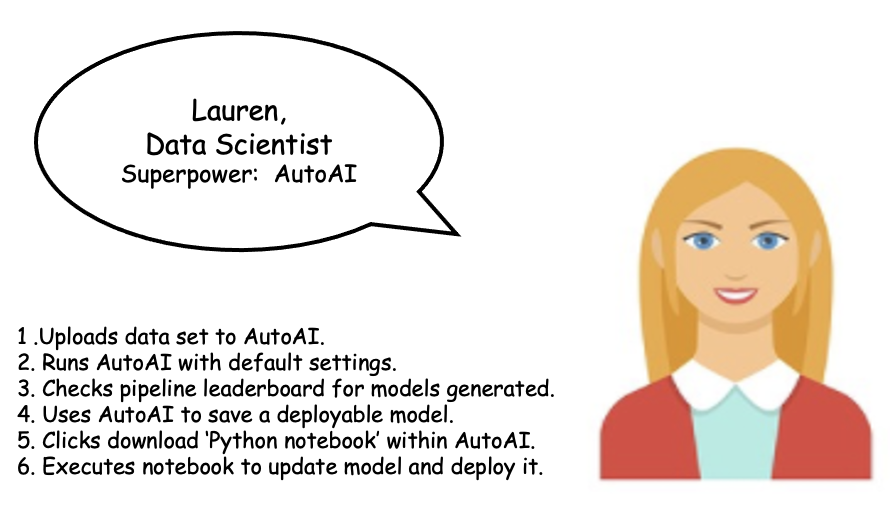

---
also_found_in:
- learningpaths/explore-autoai/
authors: ''
check_date: '2021-10-19'
completed_date: '2020-10-21'
draft: false
excerpt: AutoAIの助けを借りた場合と借りない場合の、予測モデルを構築する2つの方法を見てみましょう。
last_updated: '2020-10-21'
meta_description: AutoAIの助けを借りた場合と借りない場合の、予測モデルを構築する2つの方法を見てみましょう。
meta_keywords: AutoAI, models, machine learning, AutoML
meta_title: AutoMLを使った機械学習モデルの構築、およびAutoMLを使わない機械学習モデルの構築
primary_tag: artificial-intelligence
related_content:
- slug: explore-autoai
  type: learningpaths
- slug: learning-path-machine-learning-for-developers
  type: series
- slug: autoai-code-generation
  type: patterns
subtitle: 予測モデルを構築する2つの方法を、AutoAIの助けを借りた場合と借りなかった場合の両方で見てみましょう。
tags:
- machine-learning
- data-science
title: AutoMLを使った機械学習モデルの構築、およびAutoMLを使わない機械学習モデルの構築
---

データサイエンティストは、多くの人が憧れる職業ですが、その分、責任や課題も大きくなります。例えば、ユースケースに最適なアルゴリズムを選択し、何度も繰り返して修正したり、適切なハイパーパラメータのセットを特定して何度も調整した後にデフォルトに戻したり、モデルの最後のエポックが終了するのを待ったりすることがあります。

大変な作業ではありますが、自分が作った機械学習モデルが期待通りの精度を出したときにはやりがいを感じます。「開発者はコーディングをやりすぎて、必要以上のことをするのが好きだ」という神話があります。しかし、開発者がプログラムを書く理由は、プロセスの自動化と効率化が中心ではないでしょうか。データサイエンティストが優れたスキルを持っていることは議論の余地がありませんが、データサイエンティストが行うプロセスやステップの多くは、反復可能で時間がかかり、人為的なミスが起こりやすいため、自動化の理想的な候補となります。

AutoML（Automated Machine Learning）は、ほとんど知識のないユーザーでも、数回のボタンクリックで複数の機械学習モデルを生成することができます。また、熟練したデータサイエンティストは、AutoMLを使うことで、モデル開発の手間を省き、問題解決の核心に迫ることができます。これらの理由から、AutoMLは最近人気が高まっています。

この記事では、AIのライフサイクル管理を簡素化する機械学習の自動化ツールである[AutoAI](https://www.ibm.com/jp-ja/cloud/watson-studio/autoai)について説明し、その特徴を紹介します。また、2人のデータサイエンティストの経験をもとに、AutoAIを使用した場合と使用しない場合の予測モデルの構築を比較検討します。

## AutoAIを使わない機械学習モデルの構築

ボブはドイツの銀行に勤めるシニアデータサイエンティストです。現在、彼は顧客への融資を承認する際にリスクがあるかどうかを予測する機械学習モデルを構築しています。

まず、Bobがこのモデルを構築するために行ったいくつかのステップを説明します。彼はまず、Jupyter、Python、scitkit-learnなどの様々なツールやライブラリをインストールするという面倒な作業を行います。そして、Pythonでコードを書き、データを分析して視覚化します。何度かデータを修正した後、リスク分析のバイナリ分類問題を解決するための適切なアルゴリズムを選択します。また、データを適切に前処理するためのコードを書きます。これには、欠落しているデータや十分に表現されていないデータの処理、カテゴリー変数の処理などのステップが含まれます。

次に、scikit-learnライブラリの適切なAPIを使用して、データをトレーニングデータセットとテストデータセットに分割し、トレーニングデータに基づいてモデルを構築します。モデルの準備ができると、学習プロセスが開始されます。データのサイズや使用するプロセッサによっては、数時間かかることもあります。テストセットで評価した後、必要な精度が得られない場合、ボブはさらにデータを分析し、ハイパーパラメータを調整して、モデルが期待通りの性能を発揮するまで前のプロセスをやり直さなければならない。

ボブが書いた完全なPythonコードは、Pythonノートブックとして公開されています。[AutoAI Manual Asset](static/AutoAI_Manual_Asset.ipynb)と呼ばれており、ダウンロードして実行することができます。詳しい実装は、チュートリアルの[Build and test your first machine learning model using Python and scikit-learn](/tutorials/build-and-test-your-first-machine-learning-model-using-python and-scikit-learn/)を参照してください。

## AutoAIによる機械学習モデルの構築

ボブの同僚であるローレンは、シニアデータサイエンティストでもあります。彼女はAutoMLを研究し、Bobが構築しているのと同じリスクモデルを構築するための理想的なツールとしてAutoAIを特定します。

Laurenは、信用リスクのデータセットを取り、AutoAIツールにアップロードします。そして彼女は、モデルによって予測される列を選択します。この時点で、AutoAIはすでにそれがバイナリ分類問題であると判断し、問題解決に使用できるいくつかのアルゴリズムをリストアップしています。デフォルトでは、上位2つのアルゴリズムが選択されますが、Lauren氏はこれらの選択を上書きして、最大4つのアルゴリズムを検討することができます。各アルゴリズムは、それぞれのバリエーションである4つのパイプラインを生成します。

舞台裏では、AutoAIは以下のステップを実行して、それぞれのパイプラインモデルを生成します。

1. データの前処理
1. モデルの自動選択
1. フィーチャーエンジニアリングの自動化
1. ハイパーパラメータの最適化

[generate machine learning model pipelines to choose the best model for your problem using AutoAI](/tutorials/generate machine-learning-model-pipelines-to-choose-the-best-model-for-your-problem-autoai/)のチュートリアルでは、Laurenがどのようにして信用リスクモデルを開発したのかを詳しく説明しています。

AutoAIでは、ローレンはパイプラインをノートブックとしてフォーマットされたPythonコードとしてダウンロードすることもできます。[Generate a Python notebook for pipeline models using AutoAI](/patterns/autoai-code-generation/)のコードパターンでは、ノートブックを生成し、モデルを実行してWatson Machine Learningにデプロイする手順を説明しています。

## AutoAIを使ったモデル構築と使わないモデル構築の比較

ボブとローレンがリスク予測モデルの開発に使用したのと同じ信用リスクデータセットを使用すると、さまざまな主要指標に大きな違いが見られます。次の表では、ボブとローレンのモデル開発戦略に基づく経験と成果を示しています。

この表から、AutoAIを使用して機械学習モデルを構築することで、Lauren氏が大幅に時間と労力を節約できたことがわかります。彼女は、生成された複数のモデルにアクセスし、自分の評価基準に最も適したモデルを選択することができます。また、Laurenさんは、Watson Machine Learning内で展開できるモデルにREST APIとしてアクセスできます。パイプラインモデルの生成に使用されたPythonコードもノートブックとしてダウンロードできます。

## まとめ

AutoAI を使用して機械学習モデルを構築すると、同じモデルを手動で構築するよりも大幅に時間と労力を節約できます。繰り返し行うことができ、時間がかかり、人為的なミスが発生しやすいステップは、自動化の理想的な候補となります。