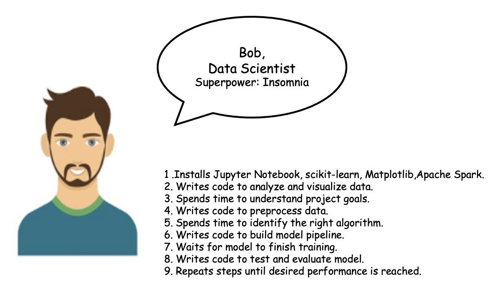
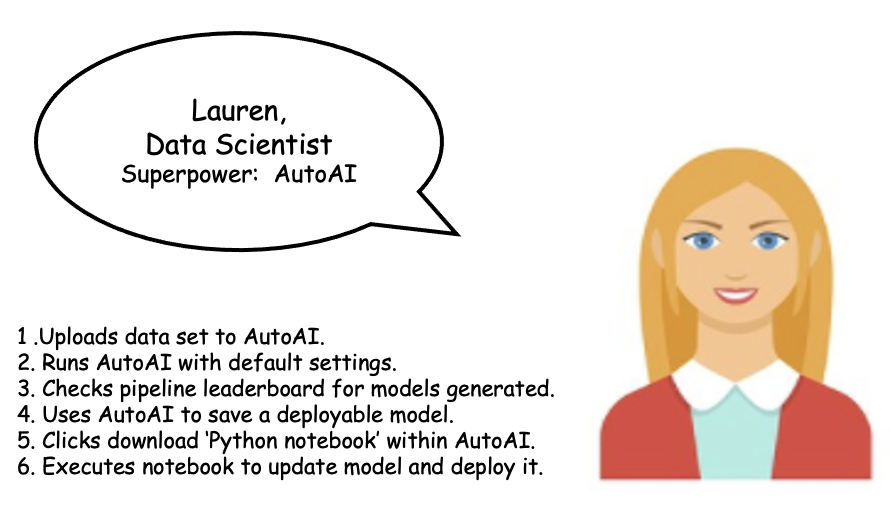
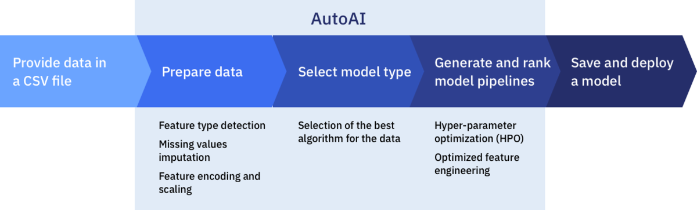
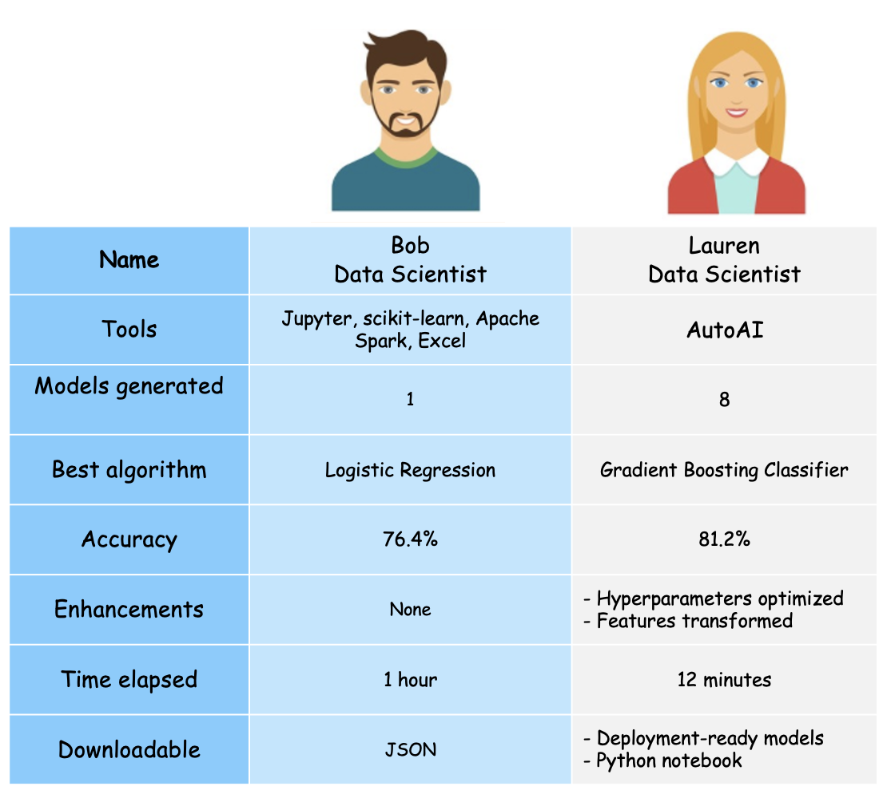

---
also_found_in:
- learningpaths/explore-autoai/
authors: ''
check_date: '2021-10-19'
completed_date: '2020-10-21'
draft: false
excerpt: Look at two ways to build predictive models, both with and without the help
  of AutoAI.
last_updated: '2020-10-21'
meta_description: Look at two ways to build predictive models, both with and without
  the help of AutoAI.
meta_keywords: AutoAI, models, machine learning, AutoML
meta_title: Build machine learning models with and without AutoML
primary_tag: artificial-intelligence
related_content:
- slug: explore-autoai
  type: learningpaths
- slug: learning-path-machine-learning-for-developers
  type: series
- slug: autoai-code-generation
  type: patterns
subtitle: Look at two ways to build predictive models, both with and without the help
  of AutoAI
tags:
- machine-learning
- data-science
title: Build machine learning models with and without AutoML
---

The role of a data scientist is one that many people aspire to, but it can come with demanding responsibilities and challenges. Some of these challenges include selecting the best algorithm for your use case and modifying it over several iterations, identifying and tuning the right set of hyperparameters several times before settling back to the defaults, and waiting for that last epoch of your model to finish.

Despite going through some arduous processes, it's definitely rewarding to watch your machine learning model beat the expected accuracy. There is a myth that *developers love to overdo coding and do more than what is required*. But, isn't process automation and efficiency the core reason behind why any developer writes programs? While the exemplary skills that a data scientist has are non-debatable, many of the processes and steps that a data scientist performs are repeatable, time-consuming, and prone to human error, which makes them ideal candidates for automation.

Automated machine learning (AutoML) allows users with little-to-no knowledge generate multiple machine learning models through a few button clicks. Also, by using AutoML, an expert data scientist can do away with the pain points of developing a model, and get to the core of problem solving. For these reasons, AutoML has risen in popularity recently.

In this article, I discuss and highlight the features of [AutoAI](https://www.ibm.com/cloud/watson-studio/autoai), an automated machine learning tool that helps simplify the AI lifecycle management. I'll use the journeys of two data scientists to compare and contrast the building of predictive models both with and without the use of AutoAI.

## Build machine learning model without AutoAI

Bob is a senior data scientist working for a bank in Germany. Currently, he is building a machine learning model that predicts if there is a risk involved in approving a loan for a customer.

I begin by outlining some of the steps that Bob performs to build this model. He first goes through the tedious process of installing the various tools and libraries like Jupyter, Python, and scitkit-learn. He then writes code in Python to analyze and visualize the data. After reworking the data several times, he chooses a suitable algorithm to solve the risk analysis binary classification problem. He writes code to preprocess the data suitably. This involves steps to handle missing and under-represented data, and to handle categorical variables.

The next step in the process is using the right APIs from the scikit-learn library to split data into training and testing data sets, and building the model based on the training data. When the model is ready, the training process is started, which could take up to several hours depending on the size of the data and the processor used. After evaluating on the test set, if the required accuracy is not achieved, Bob must analyze the data further, tune the hyperparameters, and redo the previous process until the model performs as expected.

The complete Python code that is written by Bob is available as a Python notebook. It's called [AutoAI Manual Asset](static/AutoAI_Manual_Asset.ipynb), and can be downloaded and executed. To see a detailed implementation, refer to the [Build and test your first machine learning model using Python and scikit-learn](/tutorials/build-and-test-your-first-machine-learning-model-using-python-and-scikit-learn/) tutorial.

## Build machine learning model with AutoAI

Lauren, Bob's colleague, is also a senior data scientist. She researches AutoML and identifies AutoAI as an ideal tool to build the same risk model that Bob is building.

Lauren takes the credit risk data set and uploads it into the AutoAI tool. She then selects the column to be predicted by the model. At this point, AutoAI has already determined that it is a binary classification problem and lists several algorithms that can be used to solve the problem. By default, the top two algorithms are chosen, but Lauren can override these choices to consider up to four algorithms. Each algorithm generates four pipelines, each a variation of each other.

Behind the scene, AutoAI performs the following steps to generate each of the pipeline models.

1. Data preprocessing
1. Automated model selection
1. Automate feature engineering
1. Hyperparameter optimization

The tutorial on how to [generate machine learning model pipelines to choose the best model for your problem using AutoAI](/tutorials/generate-machine-learning-model-pipelines-to-choose-the-best-model-for-your-problem-autoai/) gives an in-depth description of how Lauren developed the credit risk model.

With AutoAI, Lauren is also able to download the pipeline as Python code formatted as a notebook. The [Generate a Python notebook for pipeline models using AutoAI](/patterns/autoai-code-generation/) code pattern describes the steps to generate the notebook and execute and deploy the model to Watson Machine Learning.

## Compare model building with and without AutoAI

With the same credit risk data set that Bob and Lauren used to develop the risk prediction model, you can see significant differences in the various key metrics. In the following table, I show the experience and outcomes of Bob and Lauren based on their model development strategies.

From the table, you see how using AutoAI to build a machine learning model saved Lauren significant time and effort. She has access to several models that are generated and can choose the model that best fits her evaluation criteria. Lauren also has access to the models that she can deploy within Watson Machine Learning as a REST API. The Python code that was used to generate the pipeline model is also downloaded as a notebook.

## Summary

Using AutoAI to build machine learning models can save you significant time and effort over manually building the same models. Steps that are repeatable, time-consuming, and prone to human error, make ideal candidates for automation.