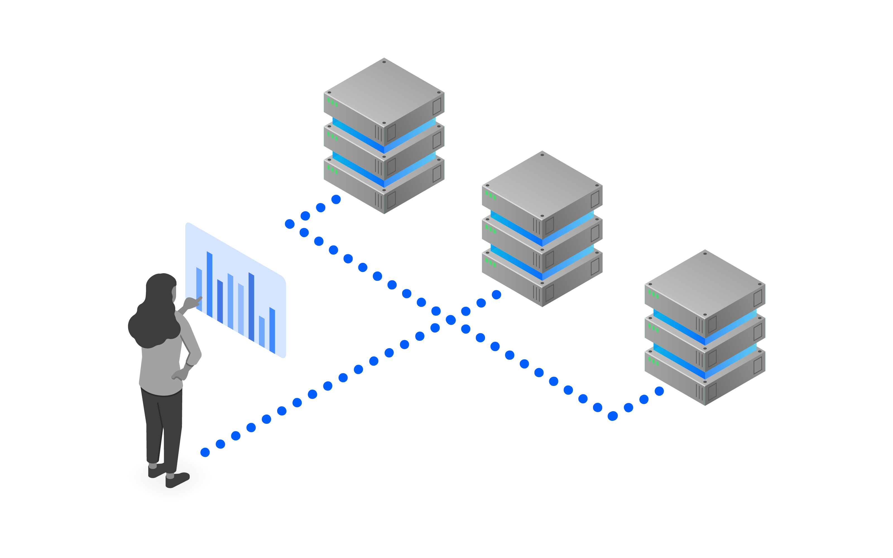
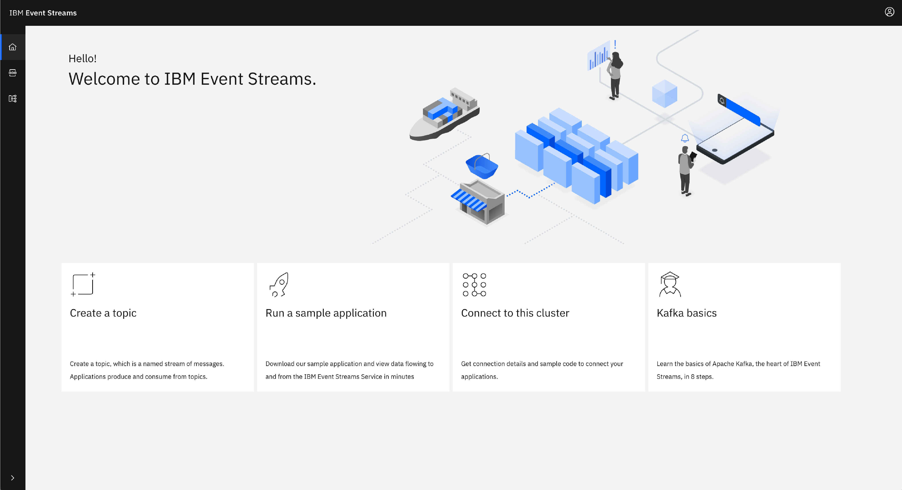

<!-- <sidebar> <heading>Learning path:IBM Event Streams Developer Essentials Badge</heading> 
この記事は、IBM Event Streams Developer Essentialsのラーニングパスとバッジの一部です。
 <ul><li>[IBM Event Streams fundamentals](/articles/event-streams-fundamentals)</li><li>[Apache Kafka fundamentals](/articles/event-streams-kafka-fundamentals)</li><li>[Deploying and using a basic Kafka instance](/tutorials/deploying-and-using-a-basic-kafka-)</li><li>[Get hands on experience](/tutorials/event-streams-hands-on-java-sample)</li><li>[Take on the coding challenge](/tutorials/event-streams-badge-event-streams-dev-challenge)</li><li>[Debug your app](/articles/event-streams-dev-cheat-sheet)</li></ul></sidebar> -->

オープンソースの[Apache Kafka](/articles/event-streams-kafka-fundamentals)をベースに構築されたIBM Event Streamsは、イベントが発生したときにそれに反応できるスマートなアプリケーションの構築を支援するイベントストリーミング・プラットフォームです。イベント・ストリームが中心となる典型的なユースケースをいくつか紹介します。

- [アダプティブ・ソリューションの作成](https://www.ibm.com/uk-en/cloud/event-streams/build-user-experiences)。データの流れを利用して、応答性の高い、魅力的なユーザーエクスペリエンスを構築する。
- [機械学習の促進](https://www.ibm.com/uk-en/cloud/event-streams/real-time-data-streams)。イベントを利用して、バッチ処理からリアルタイム分析や予測分析に移行する。

[IBM Event Streams](https://www.ibm.com/jp-ja/cloud/event-streams)は、完全に管理されたApache Kafkaサービスを提供し、ソリューションの耐久性と高可用性を確保します。イベント・ストリームを使用することで、Kafkaのエキスパート・チームによる24時間体制のサポートを受けることができます。

お客様のご要望に応じて、Liteプラン、Standardプラン、Enterpriseプランの3種類のプランをご用意しています。Liteプランでは機能が限定されていますが、他のプランではより本番に近い機能が提供されています。各プランの詳細については、[IBM Event Streams documentation](https://cloud.ibm.com/docs/services/EventStreams?topic=eventstreams-plan_choose)をご参照ください。

## IBM Event Streamsの主な機能

Event Streamsは、エンタープライズ対応の、完全に管理されたApache Kafkaサービスを提供します。これが意味するところは、以下のものがサービスの一部として提供されているという安心感を持って、アプリケーションを構築できるということです。

- [高可用性と信頼性](#high-availability-and-reliability)
- [セキュリティ](#security)
- [コンプライアンス](#compliance)

### 高可用性と信頼性

Event Streamsは、IBM Cloud上で動作する高可用性と信頼性の高いApache Kafkaサービスを提供します。イベントストリームスは、データセンターの損失に至るまでの単一障害点から保護するマルチゾーンリージョン展開により、[高可用性](/articles/ha-dr-kafka-ibm-event-streams/)を提供します。

IBM Event Streamsサービスで実行されるKafkaクラスターは、最大の信頼性と可用性を保証するマルチゾーン展開の使用を最適化するように構成されており、以下のようになっています。

- replication.factor = 3
- min.insync.replicas = 2

この構成により、Event Streams サービスは 99.99% の可用性を提供しています。

## セキュリティ

アプリケーションを構築する際、セキュリティは非常に重要ですが、安全なアーキテクチャを確立し、維持するには多大な労力が必要となります。Event Streamsでは、以下のようなセキュリティが確保されていることを確認しながら、アプリケーションを構築することができます。

- データセキュリティとプライバシー
- イベント・ストリーム・リソースへのアクセス
- イベントストリームのインスタンスへのアクセス制限

#### データのセキュリティとプライバシー

Event Streamsは、Event Streamsとクライアント間の伝送中に暗号化を提供することで、データのセキュリティと完全性を確保します。クライアントがEvent Streamsに接続する際には、SASL Plainメカニズムとブローカーのリストを使用してSASL_SSLのセキュリティプロトコルを使用するようにクライアントを構成する必要があります。この設定は

- すべての通信が暗号化されることを保証する
- 中間者攻撃を防ぐために、ブローカーの信頼性を検証する。
- すべての接続で認証を実施する

Event Streamsは、静止状態のメッセージデータとメッセージログを暗号化されたディスクに保存します。デフォルトでは、この暗号化によって十分なセキュリティレベルが確保されていますが、独自の暗号化キーを提供することも可能です。この場合、独自のキーを使用し、保存されているデータのライフサイクルを管理できるという利点があります。

詳細については、Event Streamsのドキュメントをお読みください。
- [データセキュリティとプライバシー](https://cloud.ibm.com/docs/services/EventStreams?topic=eventstreams-data_security)
- [Managing Encryption](https://cloud.ibm.com/docs/EventStreams?topic=EventStreams-managing_encryption)
- [Using the Kafka API](https://cloud.ibm.com/docs/EventStreams?topic=EventStreams-kafka_using)

#### イベントストリームのリソースへのアクセス

IBM Cloud Identity and Access Management (IAM)との統合により、`cluster`、`topic`、`group`(消費者グループ)などのイベント・ストリーム・リソースへのきめ細かな認証を指定するポリシーを定義することができます。

ポリシーは、リソースタイプにロールを適用し、オプションでそのタイプのリソースのセットを指定します。

使用可能なロールは `Reader`, `Writer`, `Manager` で、アクセスレベルが上がっていきます。例えば、トピックの場合、`Reader`ロールはトピックから消費することができ、`Writer`はトピックに対して消費および生成することができます（`Reader`ができることを`Writer`ができるという性質上、それ以上のことができます）。

このような制御の例としては、あるサービスIDが消費者グループ(Group1)内で、特定のトピック(Topic1)からのみ消費することを許可することが挙げられます。これを実現するには、以下のようなポリシーが必要になります。

| ロール｜リソースタイプ｜リソース｜説明
| ---- | ------------ | -------- | ----------- |
| リーダー｜クラスター｜｜サービス ID はイベント ストリーム クラスターへのアクセス権を持っています。
| 読者｜グループ｜Group1｜`Group1`のコンシューマーはメッセージを消費することができます。
| Reader｜topic｜Topic1｜`Topic1`からのメッセージを消費することができます。

イベントストリームのリソースへのアクセスに関する詳しい情報は、[ドキュメント](https://github.ibm.com/mhub/eventstreams-essentials-course/blob/master/course/intro-event-streams.md#access-to-ibm-event-streams-resources)に記載されています。

#### Event Streamsインスタンスへのアクセスを制限する

デフォルトでは、Event Streams インスタンスは IBM Cloud のパブリック・ネットワークを使用するように構成されているので、パブリック・インターネットを介してアクセスできます。ただし、Enterprise プランでは、ワークロードが完全に IBM Cloud 内で実行されており、サービスへのパブリック・アクセスが必要ない場合は、代わりに Event Streams インスタンスを IBM Cloud のプライベート・ネットワークを介してのみアクセスできるように構成することができます。さらに、IP `allowlist` を使用して、サービスへのアクセスをさらに制限することができます。

## コンプライアンス

安全性、可用性、信頼性、拡張性の高いサービスを提供するだけでなく、IBM Event Streamsを使用することは、以下のような多くの標準に準拠した方法でKafkaを実行することを意味します。

- GDPR
- プライバシー・シールド
- ISO 27001、27017、27018（スタンダードプラン、エンタープライズプランのみ）
- SOC 1タイプ1（エンタープライズプランのみ）
- SOC2タイプ1（エンタープライズプランのみ）
- HIPAA対応（エンタープライズプランのみ）
- PCI（エンタープライズプランのみ）

これらすべての基準へのコンプライアンスを確保するには、どれほどの労力が必要かを過小評価してはいけません。IBM Event Streamsを使えば、「コンプライアンス」(/articles/running-a-compliant-kafka-service/)が確保されているという安心感のもと、アプリケーションの構築に集中することができます。

## IBMイベント・ストリームを使う

Event Streamsのインスタンスを操作する方法はいくつかあります。必要なタスクに応じて、以下のインターフェースが利用できます。

- イベント・ストリームのCLI
- API
- イベントストリームのUI

また、サービスに慣れるためのイベントストリームの包括的なサンプルセットも用意されています。

### イベントストリームのCLI

Event Streams CLIは、IBM Cloud CLIのプラグインです。イベント・ストリーム・インスタンスの詳細を表示したり、管理したりすることができます。さまざまなコマンドが用意されており、以下のような情報を取得したり、管理したりすることができます。

- ブローカー
- クラスター
- トピック
- グループ
- ミラーリング

[Event Streams CLIのインストールと構成](https://cloud.ibm.com/docs/EventStreams?topic=EventStreams-cli)の詳細については、IBM Event Streamsのドキュメントを参照してください。また、利用可能なコマンドの詳細を記載した[CLI reference page](https://cloud.ibm.com/docs/EventStreams?topic=EventStreams-cli_reference#cli_reference)を確認してください。

### イベントストリームのAPI

IBM Event Streams では、サービスを利用するためのいくつかの API を提供しています。

- **Kafka API** - 標準の Kafka API は、IBM Event Streams インスタンスですべて利用できます。
- **Admin REST API** - [Admin API](/tutorials/managing-ibm-event-streams-topics-using-the-kafka-admin-api/)は、トピックの作成や削除などの機能を提供します。
- **REST Producer API** - 安全なHTTPSエンドポイントを介してトピックにメッセージを生成します。
- **スキーマレジストリAPI** - スキーマの作成、読み込み、削除などのスキーマの管理を行います。このAPIはEnterpriseプランでのみ利用可能です。

###イベントストリームのUI

Event Streams UI は、IBM Cloud Console の一部です。お客様のサービス・インスタンスを便利で使いやすい形で表示します。

UI からは、トピックやコンシューマー・グループを参照または検索できます。また、お客様のインスタンスに接続する方法や、クライアントの要件の詳細についての情報を得ることができ、すぐに実行できるようなサンプル構成も用意されています。

###イベントストリームのサンプル

IBM Event Streams の使用を開始するために、用意されているサンプルアプリケーションの中から選択することができます。サンプルは、Java、Nodejs、Pythonなど、さまざまな言語で提供されています。

まずは、[Getting Started documentation](https://cloud.ibm.com/docs/EventStreams?topic=EventStreams-getting_started)から始めるのが良いでしょう。また、サンプルの完全なセットは、[event-streams-samples](https://github.com/ibm-messaging/event-streams-samples)のGitHub repoで入手できます。

## まとめと次のステップ

イベントストリームは、完全に管理されたApache Kafkaサービスであり、エンタープライズ向けのイベントベースのアプリケーションを構築するために必要なものをすべて提供していることがお分かりいただけたと思います。今度は、[Apache Kafka fundamentals](/learningpaths/ibm-event-streams-badge/kafka-fundamentals/)をより深く見て、それらのアプリケーションの構築を開始する方法を理解する時です。

これらのIBM Event Streamsの機能についてもっと読む。

* [高可用性](/articles/ha-dr-kafka-ibm-event-streams/)
* [コンプライアンス](/articles/running-a-compliant-kafka-service/)
* [Admin API](/tutorials/managing-ibm-event-streams-topics-using-the-kafka-admin-api/)