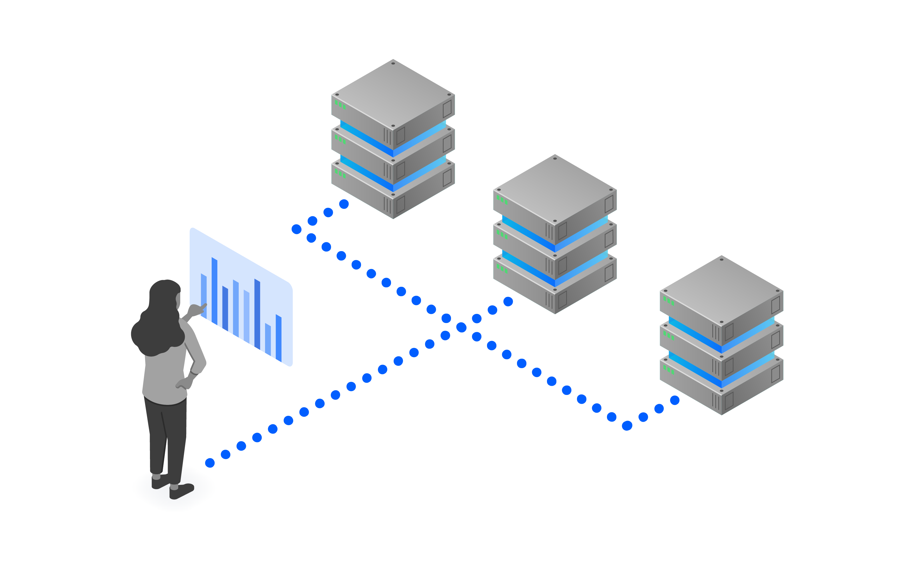
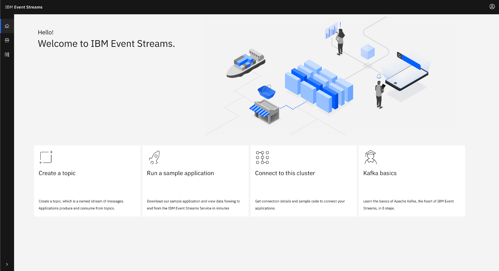

<!-- <sidebar> <heading>Learning path: IBM Event Streams Developer Essentials Badge</heading> 
This article is part of the IBM Event Streams Developer Essentials learning path and badge.
 <ul><li>[IBM Event Streams fundamentals](/articles/event-streams-fundamentals)</li><li>[Apache Kafka fundamentals](/articles/event-streams-kafka-fundamentals)</li><li>[Deploying and using a basic Kafka instance](/tutorials/deploying-and-using-a-basic-kafka-instance)</li><li>[Get hands on experience](/tutorials/event-streams-hands-on-java-sample)</li><li>[Take on the coding challenge](/tutorials/event-streams-badge-event-streams-dev-challenge)</li><li>[Debug your app](/articles/event-streams-dev-cheat-sheet)</li></ul></sidebar> -->

Built on open source [Apache Kafka](/articles/event-streams-kafka-fundamentals), IBM Event Streams is an event-streaming platform that helps you build smart applications that can react to events as they happen. Some typical use cases for which Event Streams is a central piece are:

- [Creation of adaptive solutions](https://www.ibm.com/uk-en/cloud/event-streams/build-user-experiences): Use streams of data to build responsive, engaging user experiences.
- [Facilitate machine learning](https://www.ibm.com/uk-en/cloud/event-streams/real-time-data-streams): Use events to move from batch processing to real-time and predictive analytics.

[IBM Event Streams](https://www.ibm.com/cloud/event-streams) offers a fully managed Apache Kafka service, ensuring durability and high availability for your solutions. By using Event Streams, you have support around the clock from our team of Kafka experts.

Depending on your requirements, the service is offering 3 different plans: a Lite plan, a Standard plan, and an Enterprise plan. The Lite plan offers a limited set of capabilities, whereas the other plans provide more production-ready capabilities. See the [IBM Event Streams documentation](https://cloud.ibm.com/docs/services/EventStreams?topic=eventstreams-plan_choose), for the full details about each of the plans.

## Key capabilities of IBM Event Streams

Event Streams offers an enterprise ready, fully managed Apache Kafka service. What this means is that you can build your applications with the reassurance that the following is being provided as part of the service:

- [High availability and reliability](#high-availability-and-reliability)
- [Security](#security)
- [Compliance](#compliance)

### High availability and reliability

Event Streams offers a highly available and reliable Apache Kafka service running on IBM Cloud. Event Streams provides [high availability](/articles/ha-dr-kafka-ibm-event-streams/) via a multi-zone region deployment which protects against single points of failure, up to and including a data center loss.

The Kafka cluster that runs in the IBM Event Streams service is configured in such a way to optimize the use of the multi-zone deployment that ensures maximum reliability and availability, including the following:

- replication.factor = 3
- min.insync.replicas = 2

With this configuration, the Event Streams service is provided with an availability of 99.99%.

## Security

Security is crucial when building your applications, however it can also be a large amount of effort to establish and maintain a secure architecture. With Event Streams you can build your applications with the knowledge that the following aspects of security are provided:

- Data Security and Privacy
- Access to Event Streams Resources
- Restricted Access to an Event Streams instance

#### Data Security and Privacy

Event Streams ensures the security and integrity of your data by offering encryption during transmission between Event Streams and clients. When clients connect to Event Streams, clients must be configured to use a security protocol of SASL_SSL using the SASL Plain mechanism and a list of brokers. This configuration:

- Ensures that all communications are encrypted
- Validates the authenticity of the brokers preventing man-in-the-middle attacks
- Enforces authentication on all connections

Event Streams stores message data at rest and message logs on encrypted disks. By default, this encryption provides a good level of security; however, it is possible to provide your own encryption key which offers the additional benefit of using your own key and being able to control the lifecycle of the data stored at rest.

You can read the Event Streams documentation to learn more about:
- [Data Security and Privacy](https://cloud.ibm.com/docs/services/EventStreams?topic=eventstreams-data_security)
- [Managing Encryption](https://cloud.ibm.com/docs/EventStreams?topic=EventStreams-managing_encryption)
- [Using the Kafka API](https://cloud.ibm.com/docs/EventStreams?topic=EventStreams-kafka_using)

#### Access to Event Streams Resources

Integration with IBM Cloud Identity and Access Management (IAM) allows you to define policies that specify fine-grained authorization to Event Streams resources, such as `cluster`, `topic`, and `group` (consumer groups).

A policy applies a role to a resource type and optionally specifies the set of resources of that type.

Roles available are `Reader`, `Writer` and `Manager` with increasing levels of access. What can be performed on a resource is dependent on that resourcetype, so for example with a topic the `Reader` role can consume from a topic, and a `Writer` can consume and produce to a topic (by nature of `Writer` being able to do whatever a `Reader` can do and more).

An example of such a control would be to allow a service id to consume in a consumer group (Group1), only from a specific topic (Topic1). The following policies would be required to achieve this:

| Role | ResourceType | Resource | Description |
| ---- | ------------ | -------- | ----------- |
| Reader | cluster | | The service id has access to the event streams cluster |
| Reader | group | Group1 | Consumers in `Group1` are able to consume messages |
| Reader | topic | Topic1 | Messages from `Topic1` are available to be consumed |

More information about access to Event Streams resources is [available in the documentation](https://github.ibm.com/mhub/eventstreams-essentials-course/blob/master/course/intro-event-streams.md#access-to-ibm-event-streams-resources).

#### Restricted Access to an Event Streams instance

By default, Event Streams instances are configured to use the IBM Cloud public network, so they are accessible over the public Internet. However, with the Enterprise plan, if your workload is running entirely within the IBM Cloud, and public access to the service is not required, Event Streams instances can instead be configured to only be accessible over the IBM Cloud private network. Additionally, an IP `allowlist` can be used to further restrict access to the service.

## Compliance

As well as offering a secure, available, reliable and scalable service, using IBM Event Streams means that you are running Kafka in a way that is compliant with a large number of standards, including:

- GDPR
- Privacy Shield
- ISO 27001, 27017, 27018 (Standard and Enterprise plans only)
- SOC 1 Type 1 (Enterprise plan only)
- SOC 2 Type 1 (Enterprise plan only)
- HIPAA ready (Enterprise plan only)
- PCI (Enterprise plan only)

Do not underestimate how much effort is involved in ensuring compliance with all of these standards. With IBM Event Streams, you are able to focus on building your applications safe in the knowledge that [compliance](/articles/running-a-compliant-kafka-service/) has been taken care of for you.

## Using IBM Event Streams

There are a number of different ways to interact with an Event Streams instance. Depending on the task you need to do the following interfaces are available to you:

- Event Streams CLI
- APIs
- Event Streams UI

There is also a comprehensive set of Event Streams samples available to help you get familiar with the service.

### Event Streams CLI

The Event Streams CLI is a plugin for the IBM Cloud CLI. It allows you to view the details of and to manage an Events Stream instance. It offers a number of different commands, providing the ability to retrieve information about and manage aspects of the following:

- brokers
- cluster
- topics
- groups
- mirroring

Review the IBM Event Streams documentation to for details on [installing and configuring the Event Streams CLI](https://cloud.ibm.com/docs/EventStreams?topic=EventStreams-cli). Also, review the [CLI reference page](https://cloud.ibm.com/docs/EventStreams?topic=EventStreams-cli_reference#cli_reference), which provides details of the available commands.

### Event Streams APIs

IBM Event Streams provides several APIs for interacting with the service:

- **Kafka API** - The standard Kafka APIs are all available on an IBM Event Streams instance.
- **Admin REST API** - The [Admin API](/tutorials/managing-ibm-event-streams-topics-using-the-kafka-admin-api/) offers functionality such as creating and deleting topics.
- **REST Producer API** - Produce messages to a topic via a secure HTTPS endpoint.
- **Schema Registry API** - Administration of schemas such as creating, reading and deleting schemas. This API is only available on the Enterprise plan.

### Event Streams UI

The Event Streams UI is part of the IBM Cloud Console. Providing a convenient and user friendly view onto your service instance.

From the UI you can browse or search topics and consumer groups. You can also obtain information about how to connect to your instance with details of the requirements for a client, including a sample configuration to get you up and running quickly.

### Event Streams Samples

To help you get started using IBM Event Streams, you can choose from a selection of sample applications available. The samples are available in a variety of languages, including Java, Nodejs, Python.

A good starting point is [this Getting Started documentation](https://cloud.ibm.com/docs/EventStreams?topic=EventStreams-getting_started), or the complete set of samples are available in our [event-streams-samples](https://github.com/ibm-messaging/event-streams-samples) GitHub repo.

## Summary and next steps

You have learned that Event Streams is a fully managed Apache Kafka service, offering all you need to build enterprise ready event based applications. Now it is time to take a deeper look at the [Apache Kafka fundamentals](/learningpaths/ibm-event-streams-badge/kafka-fundamentals/) to understand how to start building those applications.

Read more about these IBM Event Streams capabilities:

* [High availability](/articles/ha-dr-kafka-ibm-event-streams/)
* [Compliance](/articles/running-a-compliant-kafka-service/)
* [Admin API](/tutorials/managing-ibm-event-streams-topics-using-the-kafka-admin-api/)