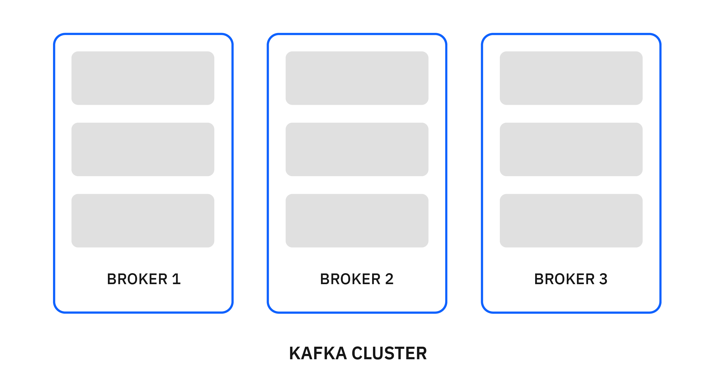
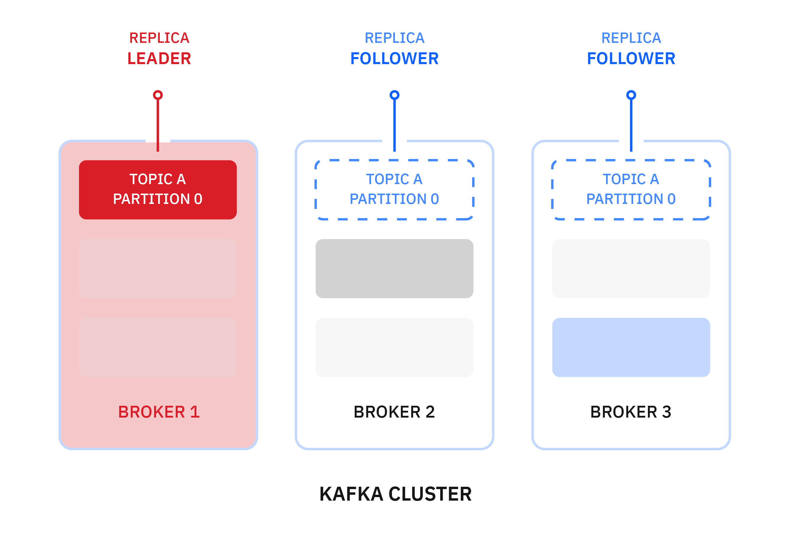
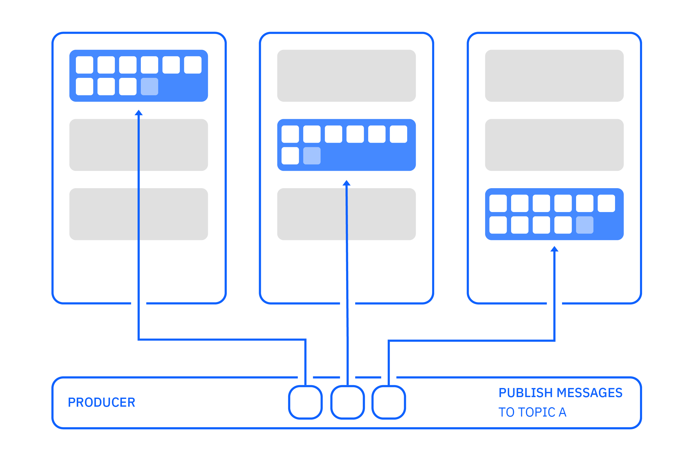
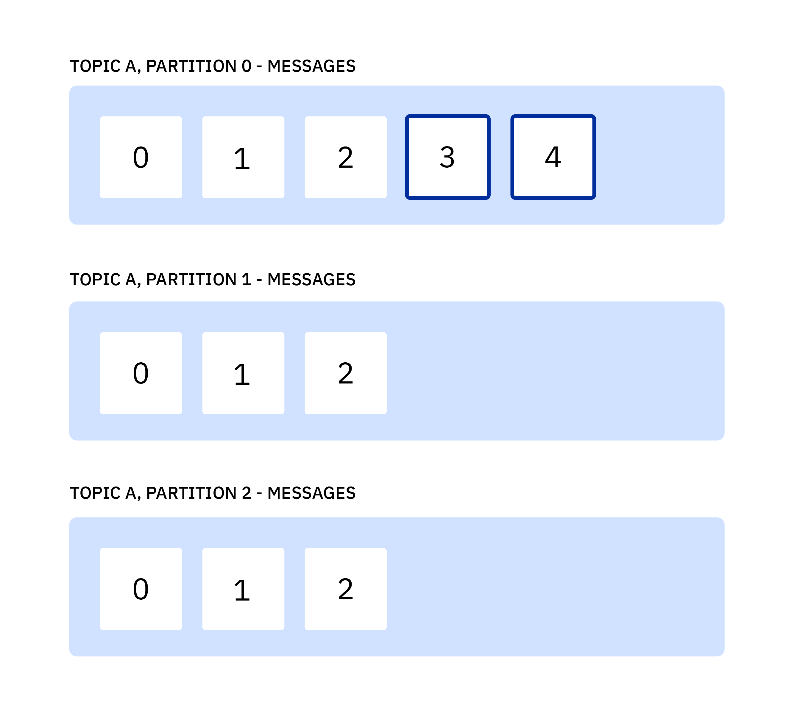
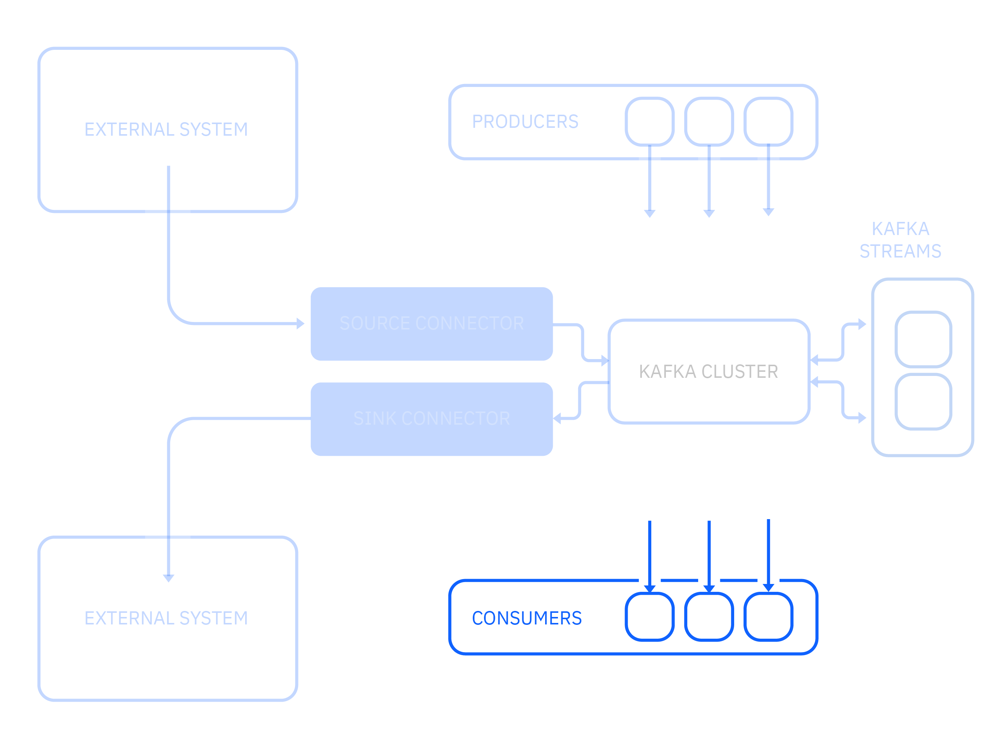
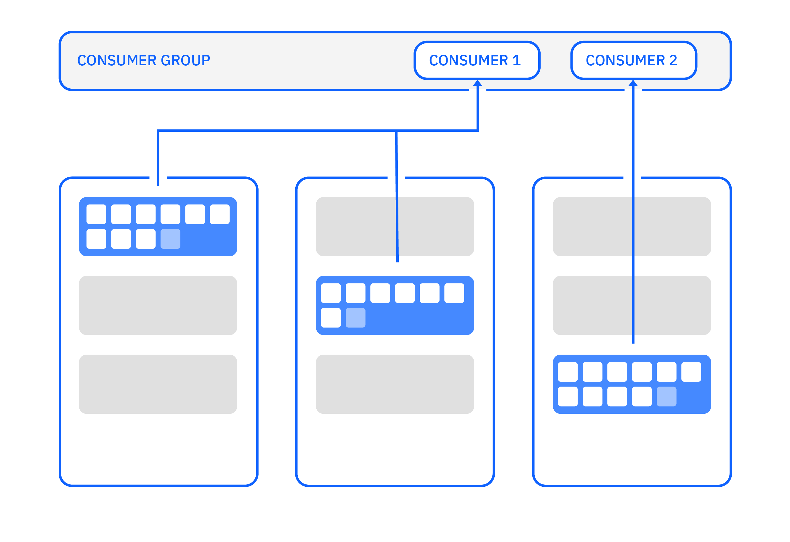
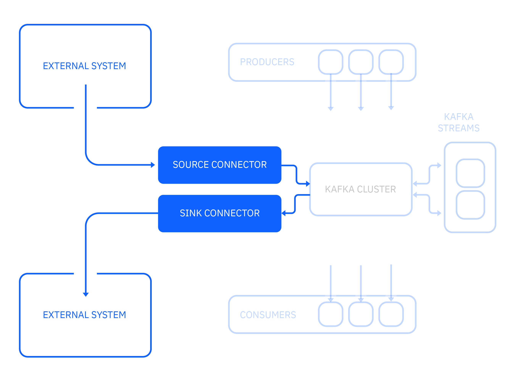

---
also_found_in:
- learningpaths/develop-kafka-apps/
- learningpaths/ibm-event-streams-badge/
authors: ''
check_date: '2021-11-15'
completed_date: '2020-12-09'
components:
- kafka
display_in_listing: true
draft: false
excerpt: Apache Kafkaは、リアルタイムのデータフィードを処理するために、高スループット、低レイテンシー、耐障害性、スケーラブルなプラットフォームとして設計・最適化されています。この記事では、Apache
  Kafkaの一般的な使用例を学んだ後、Apache Kafkaのコアコンセプトを学びます。また、プロデューサーとコンシューマーの仕組みや、Kafka StreamsとKafka
  Connectを使って強力なデータストリーミングパイプラインを構築する方法についても学びます。
ignore_prod: false
meta_description: Apache Kafkaは、リアルタイムのデータフィードを処理するために、高スループット、低レイテンシー、耐障害性、スケーラブルなプラットフォームとして設計・最適化されています。この記事では、Apache
  Kafkaの一般的な使用例を学んだ後、Apache Kafkaのコアコンセプトを学びます。また、プロデューサーとコンシューマーの仕組みや、Kafka StreamsとKafka
  Connectを使って強力なデータストリーミングパイプラインを構築する方法についても学びます。
meta_keywords: what is Apache Kafka, Kafka, event streaming, IBM Event Streams, data
  streaming
meta_title: Apache Kafkaの基礎知識
primary_tag: kafka
related_content:
- slug: an-introduction-to-apache-kafka
  type: articles
- slug: get-started-with-apache-kafka
  type: tutorials
subtitle: IBM Event Streamsのベースとなっているオープンソースのストリーム処理ソフトウェアの重要なコンセプトを学ぶことができます。
title: Apache Kafkaの基礎知識
---

<!-- <sidebar> <heading>Learning path:IBM Event Streams Developer Essentials Badge</heading> 
この記事は、IBM Event Streams Developer Essentialsのラーニングパスとバッジの一部です。
 <ul><li>[IBM Event Streams fundamentals](/articles/event-streams-fundamentals)</li><li>[Apache Kafka fundamentals](/articles/event-streams-kafka-fundamentals)</li><li>[Deploying and using a basic Kafka instance](/tutorials/deploying-and-using-a-basic-kafka-)</li><li>[Get hands on experience](/tutorials/event-streams-hands-on-java-sample)</li><li>[Take on the coding challenge](/tutorials/event-streams-badge-event-streams-dev-challenge)</li><li>[Debug your app](/articles/event-streams-dev-cheat-sheet)</li></ul></sidebar> -->

[Apache Kafka](https://kafka.apache.org/)は、リアルタイムのデータフィードを処理するための、高スループット、低レイテンシー、耐障害性、スケーラブルなプラットフォームとして設計、最適化されています。Kafkaはこのすべてを驚くほどうまくこなし、今日の多くのイベントストリーミングアプリケーションの中核的なビルディングブロックとしての地位を確立しています。  

この記事では、Apache Kafkaの一般的な使用例とコア・コンセプトを学びます。また、プロデューサーとコンシューマーの仕組みや、Kafka StreamsとKafka Connectを使って強力なデータストリーミングパイプラインを構築する方法についても学びます。

次の図は、Kafkaに接続するコアコンポーネントと、それらの間のデータフローを説明しています。

## 一般的な使用例

Apache Kafkaプロジェクトは、パワフルでスケーラブルなテクノロジーであり、これらのユースケースを含む様々なユースケースで広く採用されています。

* **メッセージング** - Kafkaは、高いスループット、ビルトインのパーティショニング、レプリケーション、フォールトトレランスを備えているため、大規模なメッセージングを扱う際に適しています。
* **運用監視** - Kafkaは、複数のデータソースからのメトリックデータやロギングデータの集中的なフィードを提供することができます。遅延の少ない処理が可能で、複数のデータソースや分散したデータ消費を容易にサポートします。
* **ストリーム処理** - 多くのユーザーは、複数のステージで構成される処理パイプラインでデータを処理します。ここでは、生の入力データがKafkaトピックから消費され、さらに消費やフォローアップ処理のために、集約、エンリッチメント、またはその他の方法で新しいトピックに変換されます。このような処理パイプラインにより、費用対効果が高く、耐障害性があり、スケーラブルなリアルタイムデータ処理ソリューションを構築することができます。
* **マイクロサービス** - Kafkaは、非同期メッセージングにより送信者と受信者を切り離すことで、マイクロサービス間の複雑なコミュニケーションを簡素化することができます。

Kafkaには、Webサイトのアクティビティ追跡やイベントソーシングなど、他にも多くのユースケースがあり、Kafkaの導入が急速に進んでいることから、ユースケースのリストはまだまだ拡大しています。

## Apache Kafkaのキーコンセプト

Kafkaの一般的なユースケースがわかったところで、Kafkaの仕組みを理解するために、いくつかのキーコンセプトを探ってみましょう。

- [ブローカー](#Brokers)
- [メッセージ](#Messages)
- [Topic and Partitions](#トピックとパーティション)
- [レプリケーション](#Replication)

###Brokers

Kafka は、ブローカーと呼ばれる一連のサーバー上でクラスターとして動作します。以下の例のように、1つのクラスターには最低3つのブローカーが必要です。

###メッセージ

メッセージは、Kafka のデータの単位です。各メッセージは、キーと値の2つの部分で構成されます。Kafka では、メッセージとレコードを同じ意味で使用しています。Kafkaでは、メッセージとレコードという言葉を使い分けています。

### トピックとパーティション

各トピックは、メッセージの名前付きストリームです。トピックは 1 つ以上のパーティションで構成されます。パーティション上のメッセージは、オフセットと呼ばれる番号で並べられます。

複数のパーティションをブローカーに分散させることで、トピックのスケーラビリティが向上します。トピックに複数のパーティションがある場合、パーティションをクラスター全体に分散させることで、データを並行して投入してスループットを向上させることができます。

トピック上のメッセージは永遠に保存されるわけではありません。Kafkaは古いメッセージを削除します。一定の時間が経過した後にメッセージを削除するか、ログが一定のサイズに達したときに削除するかを指定できます。

トピックとパーティションは、[Kafkaコンソールツール](https://cloud.ibm.com/docs/EventStreams?topic=EventStreams-kafka_console_tools)または[KafkaアドミンAPI](/tutorials/managing-ibm-event-streams-topics-using-the-kafka-admin-api/)を使って管理できます。

### レプリケーション

可用性と耐障害性を高めるために、各トピックを複数のブローカーに複製することができます。各パーティションでは、いずれかのブローカーがリーダーとなり、他のブローカーがフォロワーとなります。

パーティションに対するすべての生成および消費要求は、リーダーレプリカで処理されます。フォロワーはリーダーに追いつくことを目的として、リーダーからパーティションデータを複製します。パーティション・リーダーに追いついているフォロワーのレプリカは「同期」しています。通常はすべてのレプリカが同期していなければなりませんが、障害発生後に追いつくまでの間、一時的に同期していないレプリカがあっても構いません。

パーティションのリーダーが失敗した場合、同期しているレプリカを持つフォロワーの1人が自動的にそのパーティションのリーダーになります。同期しているレプリカを持つフォロワーは、メッセージを失うことなくリーダーになることができます。実際には、すべてのサーバーが、あるパーティションではリーダーとなり、別のパーティションではフォロワーとなります。新しいリーダーのレプリカを指定するプロセスは、リーダー選挙と呼ばれます。パーティションのリーダーは動的で、サーバーの出入りによって変わります。

次の例では、ブローカー1がトピックAのパーティション1のリーダーになっています。

ブローカー1がオフラインになると、自動的にブローカー2がそのパーティションのリーダーになります。

パーティションのリーダーが変わっても、アプリケーションが特別なアクションを取る必要はありません。Kafkaクライアントライブラリは自動的に新しいリーダーに再接続しますが、クラスターが落ち着くまでの間、レイテンシーが増加します。

## Apache Kafka クライアント

次に、アプリケーションがKafkaとの間でデータを送受信したり処理したりするためのKafkaクライアントについて説明します。

- [プロデューサ](#Producers)
- [コンシューマー](#Consumers)
- [Kafkaストリーム](#Kafka-Streams)
- [Kafka Connect](#Kafka-Connect)

### プロデューサ

プロデューサーは、メッセージのストリームを Kafka トピックにパブリッシュするアプリケーションです。プロデューサーは1つまたは複数のトピックに公開でき、オプションでデータを保存するパーティションを選択できます。

プロデューサーはKafkaに接続すると、最初のブートストラップ接続を行います。この接続は、クラスター内のどのブローカーに対しても可能です。プロデューサーは、どのブローカーとパーティションに接続する必要があるかを知るために、公開したいトピックに関する情報を要求します。

その後、プロデューサーはパーティション・リーダーへの別の接続を確立し、メッセージの発行を開始します。これらのアクションは、プロデューサーがKafkaクラスターに接続する際に内部で自動的に行われます。

メッセージがパーティション・リーダーに送信されても、そのメッセージはコンシューマーがすぐに利用できるわけではありません。リーダーはそのメッセージをパーティションに追加し、そのパーティションの次のオフセット番号を割り当てます。すべてのフォロワーがメッセージを複製し、自分のレプリカにメッセージを書き込んだことを確認した後、メッセージはコミットされ、コンシューマーが利用できるようになります。

先に述べたように、メッセージはキーと値の2つの部分から構成されています。

プロデューサーは、メッセージをパブリッシュする際に、パーティション番号を明示的に指定することができます。これにより、直接的なコントロールが可能になりますが、プロデューサーのコードは、パーティションの選択を管理する責任を負うことになり、より複雑になります。プロデューサーがパーティション番号を指定しない場合、パーティションの選択はパーティショナーによって行われます。Kafkaプロデューサーに組み込まれているデフォルトのパーティショナーは、以下のように動作します。

* メッセージがキーを持っていない場合は、ラウンドロビン方式でパーティションを選択します。

    

* メッセージにキーがある場合、キーのハッシュ値を計算してパーティションを選択します。これは、同じキーを持つすべてのメッセージに対して、同じパーティションを選択する効果があります。

    

自分でカスタムパーティショナーを書くこともできます。カスタム・パーティショナーは、メッセージをパーティションに割り当てるために、任意のスキームを選択することができます。たとえば、キーの情報のサブセットだけを使用したり、アプリケーション固有の識別子を使用したりすることができます。

Kafkaエコシステムの多くのツール（他のシステムへのコネクタなど）は値のみを使用し、キーを無視するため、メッセージデータのすべてを値に入れ、キーだけをパーティショニングやログコンパクションに使用するのが最適です。

他の多くのメッセージングシステムは、メッセージと一緒に他の情報を運ぶ方法を持っています。Kafkaでは、この目的のためにメッセージヘッダーを使用しています。詳細は[こちら](https://kafka.apache.org/documentation/#recordheader)をご覧ください。

#### メッセージの順序付け

Kafkaは通常、プロデューサーから送信された順番にメッセージを書き込みます。しかし、再試行によってメッセージが重複したり、順序が変わったりする状況もあります。一連のメッセージを順番に送信したい場合は、同じキーを与えてすべてのメッセージを同じパーティションに書き込むようにすることが非常に重要です。これがメッセージの順序付けを保証する唯一の方法です。

プロデューサーは、メッセージの送信を自動的に再試行することもできます。リトライ機能を有効にすると、アプリケーションコードが自らリトライを実行しなければならなくなるため、この機能を有効にすることをお勧めします。Kafkaのバッチ処理と自動再試行の組み合わせは、メッセージを重複させたり、順序を入れ替えたりする効果があります。

#### メッセージの確認

メッセージを公開する際に、`acks`プロデューサー設定を使用して、必要な確認応答のレベルを選択することができます。この選択は、スループットと信頼性のバランスを表しています。
メッセージを送信するプロデューサーは、以下の3つのレベルの確認応答を持ちます。

| 確認応答のモード｜信頼性｜意味
|-------------|----------------|--------------------------------------------------------------------------------------------------------------------------------------------------------------------------------------------|
| acks=0｜信頼性が最も低い｜ブローカーからの応答を待たない。メッセージは、ネットワークに書き込まれた時点で送信されたとみなされます。                                                                                           
| acks=1｜デフォルト｜リーダー・ブローカーがメッセージを受け取ったという返信を待ちます。
| acks=all｜最も信頼性が高い｜同期しているすべてのレプリカ・ブローカーがメッセージを受信したという返信を待ちます。

#### 配信セマンティクス

Kafkaは、以下の複数の異なるメッセージ配信セマンティクスを提供しています。

- At most once: メッセージは失われる可能性があり、再配送されない。
- 少なくとも1回：メッセージが失われることはないが、重複があるかもしれない
- 正確に1回：メッセージが失われることはなく、重複もありません。

配信のセマンティクスは、以下の設定によって決まります。

- ジャック
- `retries` (再試行)
- イデンポテンスを有効にする

デフォルトでは、Kafkaは「at least once」のセマンティクスを使用します。

exactly once" セマンティクスを有効にするには、`idempotent` または `transactional` プロデューサーを使用する必要があります。トランザクショナルプロデューサーは、`enable.idempotence`を`true`に設定することで有効になり、再試行しても各メッセージのコピーが正確に1つKafkaに書き込まれることを保証します。トランザクションプロデューサーは、すべてのメッセージが正常に配信されるか、あるいはいずれのメッセージも配信されないように、複数のパーティションへのデータの送信を可能にします。つまり、トランザクションは完全にコミットされるか、完全に破棄されるかのどちらかです。また、トランザクションにオフセットを含めることで、Kafkaへのメッセージの読み取り、処理、および書き込みを行うアプリケーションを構築することができます。

### コンシューマー

コンシューマーとは、Kafka トピックからのメッセージのストリームを消費するアプリケーションのことです。コンシューマーは、1 つ以上のトピックからメッセージを読み取り、処理することができます。

コンシューマーがKafkaに接続すると、最初のブートストラップ接続を行います。この接続は、クラスター内のどのサーバーに対しても可能です。コンシューマーは、どのブローカーとパーティションに接続する必要があるかを知るために、消費したいトピックに関する情報を要求します。

次にコンシューマーは、パーティション・リーダーへの別の接続を確立し、メッセージの消費を開始します。これらのアクションは、コンシューマーがKafkaクラスターに接続する際に内部で自動的に行われます。

コンシューマーは通常、長時間実行されるアプリケーションです。コンシューマは定期的に`Consumer.poll(...)`を呼び出してKafkaからメッセージを要求します。コンシューマーは`poll()`を呼び出し、メッセージのバッチを受信し、それらを迅速に処理して、再び`poll()`を呼び出します。

コンシューマがメッセージを処理するとき、そのメッセージはそのトピックから削除されません。その代わり、コンシューマーは、どのメッセージが処理されたかをKafkaに知らせる方法をいくつか選ぶことができます。このプロセスは "committing the offset" と呼ばれています。

コンシューマの現在の位置とパーティション上の最新メッセージとの差は、オフセットラグと呼ばれます。時間の経過とともにラグが大きくなる場合は、コンシューマが追従できていないことを示しています。短期的には問題ありませんが、最終的には保存期間を超えるとコンシューマーがメッセージを見逃す可能性があります。

#### コンシューマーグループ

コンシューマ・グループには、メッセージを処理するために一緒に働く1つまたは複数のコンシューマが含まれます。1つのパーティションからのメッセージは、各グループの1つのコンシューマによって処理されます。

いつでも、各パーティションはグループ内の1つのコンシューマのみに割り当てられます。この割り当てにより、各パーティションのメッセージが順番に処理されるようになります。

グループ内の消費者よりもパーティションの数が多い場合、一部の消費者は複数のパーティションを持っています。コンシューマの数がパーティションの数より多い場合、パーティションを持たないコンシューマもいます。したがって、パーティションの数は、コンシューマ間のワークロードのバランスに影響します。

グループ内のコンシューマはすべて、`group.id`の設定に同じ値を使用します。ワークロードを処理するために複数のコンシューマが必要な場合は、同じコンシューマグループで複数のコンシューマを動作させることができます。コンシューマが1台しか必要ない場合でも、`group.id`にも値を指定するのが普通です。

各コンシューマグループには、グループ内のコンシューマにパーティションを割り当てる責任を負うコーディネーターと呼ばれるサーバーがクラスタ内にあります。この責任は、負荷を均等にするために、クラスター内のサーバーに分散されます。コンシューマへのパーティションの割り当ては、グループのリバランスごとに変更することができます。

コンシューマグループで以下のような変更があった場合、グループはその変更に対応するためにグループメンバーへのパーティションの割り当てを変更することでリバランスを行います。

- コンシューマがグループに加わる
- コンシューマがグループから離脱
- 消費者がグループに参加した場合 消費者がグループから離脱した場合 コーディネーターによって消費者がもはや生存していないと見なされた場合
- 既存のトピックに新しいパーティションが追加される

消費者グループごとに、Kafkaは消費される各パーティションのコミットされたオフセットを記憶します。

消費者グループがリバランスされている場合、グループから離脱した消費者は、グループに復帰するまでコミットが拒否されることに注意してください。この場合、コンシューマーはグループに再参加する必要があり、以前消費していたパーティションとは異なるパーティションが割り当てられるかもしれません。

コンシューマーグループは、[Kafkaコンソールツール](https://cloud.ibm.com/docs/EventStreams?topic=EventStreams-kafka_console_tools)や[Kafka Admin API](https://cloud.ibm.com/docs/EventStreams?topic=EventStreams-kafka_using)を使って管理することもできます。

#### コンシューマの有効性

Kafkaは、故障したコンシューマーを自動的に検出し、稼働中のコンシューマーにパーティションを再割り当てできるようにします。これを実現するために、ポーリングとハートビートという2つのメカニズムを使用しています。

`Consumer.poll(...)`から返されるメッセージのバッチが大きかったり、処理に時間がかかったりすると、`poll()`を再び呼び出すまでの遅延が大きくなったり、予測できなくなったりすることがあります。場合によっては、最大ポーリング間隔を長く設定して、メッセージ処理に時間がかかったからといって、コンシューマがグループから削除されないようにする必要があります。これが唯一のメカニズムであるならば、故障したコンシューマを検出するのにかかる時間も長くなるでしょう。

グループコーディネーターは、グループメンバーがアクティブであることを示すために、定期的にハートビートを送信することを期待しています。コンシューマでは、バックグラウンドのハートビートスレッドが実行され、コーディネーターに定期的にハートビートを送信します。コーディネーターがセッションタイムアウト以内にグループメンバーからハートビートを受信しなかった場合、コーディネーターはそのメンバーをグループから削除し、グループのリバランスを開始する。セッションタイムアウトは、最大ポーリング間隔よりもはるかに短くすることができるため、メッセージ処理に時間がかかっても、故障したコンシューマを検出する時間は短くて済みます。

最大ポーリング間隔は `max.poll.interval.ms` プロパティで、セッションタイムアウトは `session.timeout.ms` プロパティで設定できます。これらの設定は、メッセージのバッチ処理に5分以上かかる場合を除き、通常は使用する必要はありません。

## Kafka ストリーム

Kafka Streamsは、Apache Kafkaプロジェクトの一部であるストリーム処理ライブラリです。Kafkaのデータを処理・分析するアプリケーションの構築を容易にする、オープンソースのJava APIです。

Kafka Streamsアプリは、1つ以上のトピックの入力を受け、0つ以上のトピックを出力することができます。次の例では、Kafka Streamsアプリは、foo、barなどの値と、red、orangeなどのキーを持つメッセージを受け取ります。そして、ビンゴというキーを持つすべてのメッセージを見つけるためにフィルタリングし、マップを適用して値を大文字にします。そして、そのメッセージを出力トピックにプッシュします。

## Kafka コネクト

Kafka Connect は Apache Kafka プロジェクトの一部で、外部システムを Kafka に接続することができます。

クラスタとの間でデータをコピーするためのコネクタを実行できるランタイムで構成されています。その主な特徴は

- スケーラビリティ。1人のワーカーから多数のワーカーへと容易に拡張できる。
- 信頼性。オフセットやコネクタのライフサイクルを自動的に管理します。
- 拡張性。コミュニティは、ほとんどの一般的なシステム用のコネクタを構築しています。

IBMは[MQ](https://cloud.ibm.com/docs/EventStreams?topic=EventStreams-mq_connector)と[Cloud Object Storage](https://cloud.ibm.com/docs/EventStreams?topic=EventStreams-cos_connector)のコネクタを持っています。多くのコネクタが利用可能で、しばしばオープンソースになっています。

## まとめと次のステップ

一般的なユースケースとKafkaの基本的なコンセプトがわかったところで、これらのApache Kafkaのコンセプトについてもう少し掘り下げてみましょう。

* [Topic, partitions, and persistence](/articles/how-persistence-works-in-apache-kafka/)
* [Authentication and authorization](/tutorials/kafka-authn-authz/)