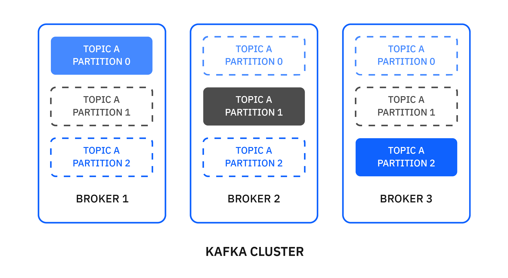

---
also_found_in:
- learningpaths/develop-kafka-apps/
- learningpaths/ibm-event-streams-badge/
authors: ''
check_date: '2021-11-15'
completed_date: '2020-12-09'
components:
- kafka
display_in_listing: true
draft: false
excerpt: Apache Kafka is designed and optimized to be a high-throughput, low-latency,
  fault-tolerant, scalable platform for handling real-time data feeds. In this article,
  you learn some of the common use cases for Apache Kafka and then learn the core
  concepts for Apache Kafka. You'll also learn how producers and consumers work and
  how Kafka Streams and Kafka Connect can be used to create powerful data streaming
  pipelines.
ignore_prod: false
meta_description: Apache Kafka is designed and optimized to be a high-throughput,
  low-latency, fault-tolerant, scalable platform for handling real-time data feeds.
  In this article, you learn some of the common use cases for Apache Kafka and then
  learn the core concepts for Apache Kafka. You'll also learn how producers and consumers
  work and how Kafka Streams and Kafka Connect can be used to create powerful data
  streaming pipelines.
meta_keywords: what is Apache Kafka, Kafka, event streaming, IBM Event Streams, data
  streaming
meta_title: Apache Kafka fundamentals
primary_tag: kafka
related_content:
- slug: an-introduction-to-apache-kafka
  type: articles
- slug: get-started-with-apache-kafka
  type: tutorials
subtitle: Learn the key concepts of the open-source stream-processing software that
  IBM Event Streams is built on
title: Apache Kafka fundamentals
---

<!-- <sidebar> <heading>Learning path: IBM Event Streams Developer Essentials Badge</heading> 
This article is part of the IBM Event Streams Developer Essentials learning path and badge.
 <ul><li>[IBM Event Streams fundamentals](/articles/event-streams-fundamentals)</li><li>[Apache Kafka fundamentals](/articles/event-streams-kafka-fundamentals)</li><li>[Deploying and using a basic Kafka instance](/tutorials/deploying-and-using-a-basic-kafka-instance)</li><li>[Get hands on experience](/tutorials/event-streams-hands-on-java-sample)</li><li>[Take on the coding challenge](/tutorials/event-streams-badge-event-streams-dev-challenge)</li><li>[Debug your app](/articles/event-streams-dev-cheat-sheet)</li></ul></sidebar> -->

[Apache Kafka](https://kafka.apache.org/) is designed and optimized to be a high-throughput, low-latency, fault-tolerant, scalable platform for handling real-time data feeds. Kafka does this all amazingly well and has established itself as a core building block for many of today's event streaming applications.  

In this article, you will learn some of the common use cases and core concepts for Apache Kafka. You'll also learn how producers and consumers work and how Kafka Streams and Kafka Connect can be used to create powerful data streaming pipelines.

The following diagram describes the core components that connect to Kafka and the data flow between them:

## Common use cases

Apache Kafka project is a powerful and scalable technology that is widely adopted for a variety of use cases, including these use cases:

* **Messaging** - Kafka offers high throughput, built-in partitioning, replication, and fault-tolerance, which makes it a good choice when handling large-scale messaging.
* **Operational monitoring** - Kafka can provide centralized feeds of metric and logging data from multiple data sources. It offers lower-latency processing and easier support for multiple data sources and distributed data consumption.
* **Stream processing** - Many users process data in processing pipelines that consist of multiple stages, where raw input data is consumed from Kafka topics and then aggregated, enriched, or otherwise transformed into new topics for further consumption or follow-up processing. With such processing pipelines, you can build cost-effective, resilient, and scalable real-time data processing solutions.
* **Microservices** - Kafka can help simplify complex communication between microservices by decoupling senders from receivers with asynchronous messaging.

There are many more use cases for Kafka, such as website activity tracking and event sourcing, and the list of use cases is still expanding as Kafka adoption is rapidly growing.

## Key concepts of Apache Kafka

Now that we know the common use cases for Kafka, let's explore some of the key concepts to understand how it works.

- [Brokers](#Brokers)
- [Messages](#Messages)
- [Topics and Partitions](#Topics-and-Partitions)
- [Replication](#Replication)

### Brokers

Kafka is run as a cluster on a set of servers, which are called brokers. A cluster has a minimum of 3 brokers as shown in the following example:

### Messages

A message is a unit of data in Kafka. Each message is comprised of two parts: key and value. The key is commonly used for data about the message and the value is the body of the message. Kafka uses the terms message and record interchangeably.

### Topics and partitions

Each topic is a named stream of messages. A topic is made up of one or more partitions. The messages on a partition are ordered by a number called the offset.

By having multiple partitions distributed across the brokers, the scalability of a topic is increased. If a topic has more than one partition, it allows data to be fed through in parallel to increase throughput by distributing the partitions across the cluster.

Messages on topics are not kept forever. Kafka will remove old messages. You can specify whether you want to remove messages after a certain amount of time or when the log reaches a certain size.

Topics and partitions can be managed using [Kafka console tools](https://cloud.ibm.com/docs/EventStreams?topic=EventStreams-kafka_console_tools) or [Kafka Admin API](/tutorials/managing-ibm-event-streams-topics-using-the-kafka-admin-api/).

### Replication

To improve availability and resiliency, each topic can be replicated onto multiple brokers. For each partition, one of the brokers is the leader, and the other brokers are the followers.

All produce and consume requests for the partition are handled by the leader replica. The followers replicate the partition data from the leader with the aim of keeping up with the leader. A follower replica that is keeping up with the partition leader is "in-sync". All the replicas should usually be in-sync but it's acceptable for a replica to be temporarily not in-sync while it's catching up after a failure.

If the leader for a partition fails, one of the followers with an in-sync replica automatically takes over as the partition's leader. Any follower with an in-sync replica can become the leader without losing any messages. In practice, every server is the leader for some partitions and the follower for others. The process of designating a new leader replica is called a leadership election. The leadership of partitions is dynamic and changes as servers come and go.

In the following example, broker 1 is the leader for partition 1 of topic A.

When broker 1 goes offline, broker 2 becomes the leader for the partition automatically.

Applications do not need to take specific actions to handle the change in the leadership of a partition. The Kafka client library automatically reconnects to the new leader, although you will see increased latency while the cluster settles.

## Apache Kafka clients

Let's now learn about the Kafka clients that allow applications to send, receive, and process data from and to Kafka.

- [Producers](#Producers)
- [Consumers](#Consumers)
- [Kafka Streams](#Kafka-Streams)
- [Kafka Connect](#Kafka-Connect)

### Producers

A producer is an application that publishes streams of messages to Kafka topics. A producer can publish to one or more topics and can optionally choose the partition that stores the data.

When a producer connects to Kafka, it makes an initial bootstrap connection. This connection can be to any of the brokers in the cluster. The producer requests information about the topic that it wants to publish to so that it knows which broker and partition it needs to connect to.

Then, the producer establishes another connection to the partition leader and can begin to publish messages. These actions happen automatically internally when your producer connects to the Kafka cluster.

When a message is sent to the partition leader, that message is not immediately available to consumers. The leader appends the message to the partition, assigning it the next offset number for that partition. After all the followers have replicated the message and acknowledged that they've written the message to their replicas, the message is now committed and becomes available for consumers.

As mentioned earlier, a message is comprised of two parts: key and value.

The producer can explicitly specify a partition number when it publishes a message. This gives direct control, but it makes the producer code more complex because it takes on the responsibility for managing the partition selection. If the producer does not specify a partition number, the selection of a partition is made by a partitioner. The default partitioner that is built into the Kafka producer works as follows:

* If the message does not have a key, it selects the partition in a round-robin fashion.

    

* If the message does have a key, it selects the partition by calculating a hash value for the key. This has the effect of selecting the same partition for all messages with the same key.

    

You can also write your own custom partitioner. A custom partitioner can choose any scheme to assign messages to partitions. For example, use just a subset of the information in the key or an application-specific identifier.

Because many tools in the Kafka ecosystem (such as connectors to other systems) use only the value and ignore the key, it's best to put all of the message data in the value and just use the key for partitioning or log compaction.

Many other messaging systems also have a way of carrying other information along with the messages. Kafka uses message headers for this purpose, more information can be found [here](https://kafka.apache.org/documentation/#recordheader).

#### Message ordering

Kafka generally writes messages in the order that they are sent by the producer. However, there are situations where retries can cause messages to be duplicated or reordered. If you want a sequence of messages to be sent in order, it's very important to ensure that they are all written to the same partition by giving the same key because this is the only way to guarantee message ordering.

The producer is also able to retry sending messages automatically. It's often a good idea to enable this retry feature because the alternative is that your application code has to perform any retries itself. The combination of batching in Kafka and automatic retries can have the effect of duplicating messages and reordering them.

#### Message acknowledgments

When you publish a message, you can choose the level of acknowledgments required using the `acks` producer configuration. The choice represents a balance between throughput and reliability.
A producer sending messages has three levels of acknowledgements as follows:

| Acknowledgment Mode | Reliability    | Meaning  |
|-------------|----------------|--------------------------------------------------------------------------------------------------------------------------------------------------------------------------------------------|
| acks=0      | Least reliable | It does not wait for a reply from the brokers. Message is considered sent as soon as it has been written to the network.                                                                                           
| acks=1      | Default        | It waits for a reply to say that the leader broker has received the message.
| acks=all    | Most reliable  | It waits for a reply to say that all the in-sync replica brokers have received the message.

#### Delivery semantics

Kafka offers the following multiple different message delivery semantics:

- At most once: messages might get lost, and won't get redelivered
- At least once: messages are never lost, but there might be duplicates
- Exactly once: messages are never lost, and there are no duplicates

The delivery semantics are determined by the following settings:

- `acks`
- `retries`
- `enable.idempotence`

By default, Kafka uses "at least once" semantics.

To enable "exactly once" semantics, you must use the `idempotent` or `transactional` producers. The transactional producer is enabled by setting `enable.idempotence` to `true`, and it guarantees that exactly one copy of each message is written to Kafka, even if it retries. The transactional producer enables the sending of data to multiple partitions such that either all messages are successfully delivered or none of them are. That is, a transaction is either fully committed or fully discarded. You can also include offsets in transactions to enable you to build applications that read, process, and write messages to Kafka.

### Consumers

A consumer is an application that consumes streams of messages from Kafka topics. A consumer can read messages from one or more topics and processes them.

When a consumer connects to Kafka, it makes an initial bootstrap connection. This connection can be to any of the servers in the cluster. The consumer requests information about the topic that it wants to consume from so that it knows which broker and partition it needs to connect to.

Then the consumer establishes another connection to the partition leader and can begin to consume messages. These actions happen automatically internally when your consumer connects to the Kafka cluster.

A consumer is normally a long-running application. A consumer requests messages from Kafka by calling `Consumer.poll(...)` regularly. The consumer calls `poll()`, receives a batch of messages, processes them promptly, and then calls `poll()` again.

When a consumer processes a message, the message is not removed from its topic. Instead, consumers can choose from several ways of letting Kafka know which messages have been processed. This process is known as "committing the offset."

The difference between a consumer's current position and the newest message on a partition is known as the offset lag. If the lag increases over time, it is a sign that the consumer is not able to keep up. Over the short term, this is not an issue, but eventually the consumer could miss messages if the retention period is exceeded.

#### Consumer Groups

A consumer group contains one or more consumers that work together to process the messages. The messages from a single partition are processed by one consumer in each group.

At any time, each partition is assigned to only one consumer in the group. This assignment ensures that the messages on each partition are processed in order.

If there are more partitions than consumers in a group, some consumers have multiple partitions. If there are more consumers than partitions, some consumers have no partitions. Therefore the number of partitions influences the balancing of workload among consumers.

The consumers in a group all use the same value for the `group.id` configuration. If you need more than one consumer to handle your workload, you can run multiple consumers in the same consumer group. Even if you only need one consumer, it's usual to also specify a value for `group.id`.

Each consumer group has a server in the cluster called the coordinator that is responsible for assigning partitions to the consumers in the group. This responsibility is spread across the servers in the cluster to even the load. The assignment of partitions to consumers can change at every group rebalance.

When one of the following changes takes place in a consumer group, the group rebalances by shifting the assignment of partitions to the group members to accommodate the change:

- A consumer joins the group
- A consumer leaves the group
- A consumer is considered as no longer live by the coordinator
- New partitions are added to an existing topic

For each consumer group, Kafka remembers the committed offset for each partition being consumed.

If you have a consumer group that has rebalanced, be aware that any consumer that has left the group will have its commits rejected until it rejoins the group. In this case, the consumer needs to rejoin the group, where it might be assigned a different partition to the one it was previously consuming from.

Consumer groups can also be managed using [Kafka console tools](https://cloud.ibm.com/docs/EventStreams?topic=EventStreams-kafka_console_tools) or [Kafka Admin API](https://cloud.ibm.com/docs/EventStreams?topic=EventStreams-kafka_using).

#### Consumer liveness

Kafka automatically detects failed consumers so that it can reassign partitions to working consumers. It uses two mechanisms to achieve this: polling and heartbeating.

If the batch of messages returned from `Consumer.poll(...)`is large or the processing is time-consuming, the delay before calling `poll()` again can be significant or unpredictable. In some cases, it's necessary to configure a long maximum polling interval so that consumers do not get removed from their groups just because message processing is taking a while. If this were the only mechanism, it would mean that the time taken to detect a failed consumer would also be long.

The group coordinator expects group members to send it regular heartbeats to indicate that they remain active. A background heartbeat thread runs in the consumer sending regular heartbeats to the coordinator. If the coordinator does not receive a heartbeat from a group member within the session timeout, the coordinator removes the member from the group and starts a rebalance of the group. The session timeout can be much shorter than the maximum polling interval so that the time taken to detect a failed consumer can be short even if message processing takes a long time.

You can configure the maximum polling interval using the `max.poll.interval.ms` property and the session timeout using the `session.timeout.ms` property. You will typically not need to use these settings unless it takes more than 5 minutes to process a batch of messages.

## Kafka Streams

Kafka Streams is a stream processing library that is part of the Apache Kafka project. It is an open source Java API that simplifies the building of applications that process and analyze data in Kafka.

A Kafka Streams app can take input of one or more topics, and can output zero or more topics. In the following example, the Kafka Streams app takes the messages with value of foo, bar, and so on, and keys such as red, orange, and so on. It then filters to find all messages with a key of bingo, and then applies a map to uppercase the values. Then, it pushes the messages onto the output topic.

## Kafka Connect

Kafka Connect is part of the Apache Kafka project and allows connecting external systems to Kafka.

It consists of a runtime that can run connectors to copy data to and from a cluster. Its main characteristics are:

- Scalability: It can easily scale from a single worker to many.
- Reliability: It automatically manages offsets and the lifecycle of connectors.
- Extensibility: The community has built connectors for most popular systems.

IBM has connectors for [MQ](https://cloud.ibm.com/docs/EventStreams?topic=EventStreams-mq_connector) and [Cloud Object Storage](https://cloud.ibm.com/docs/EventStreams?topic=EventStreams-cos_connector). Many connectors are available and are often open source.

## Summary and next steps

Now that you know some of the common use cases and the fundamental concepts of Kafka, you can dig in a little deeper on these Apache Kafka concepts:

* [Topics, partitions, and persistence](/articles/how-persistence-works-in-apache-kafka/)
* [Authentication and authorization](/tutorials/kafka-authn-authz/)