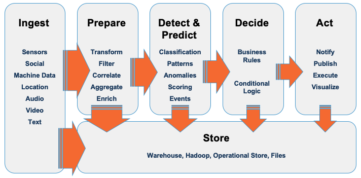
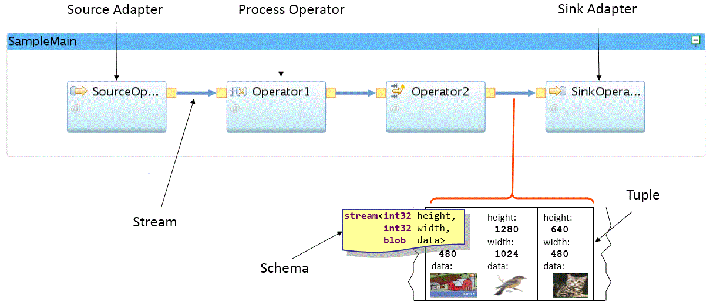
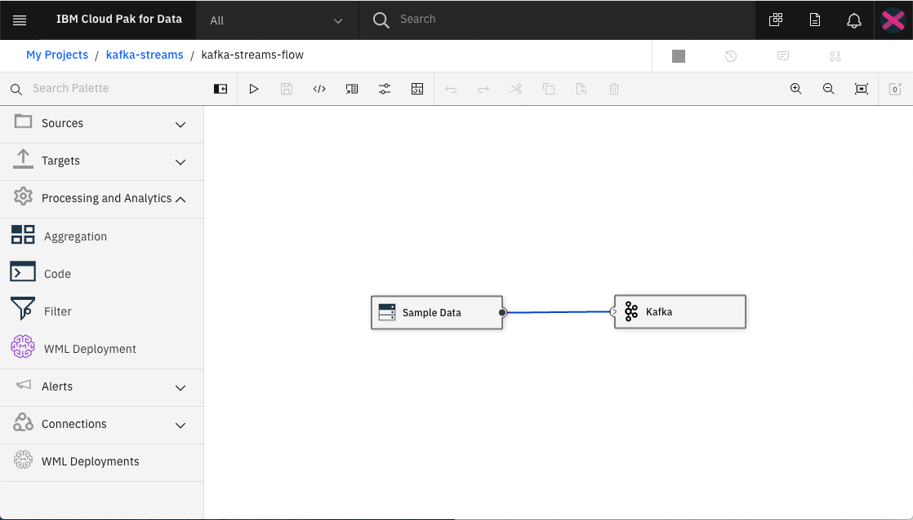
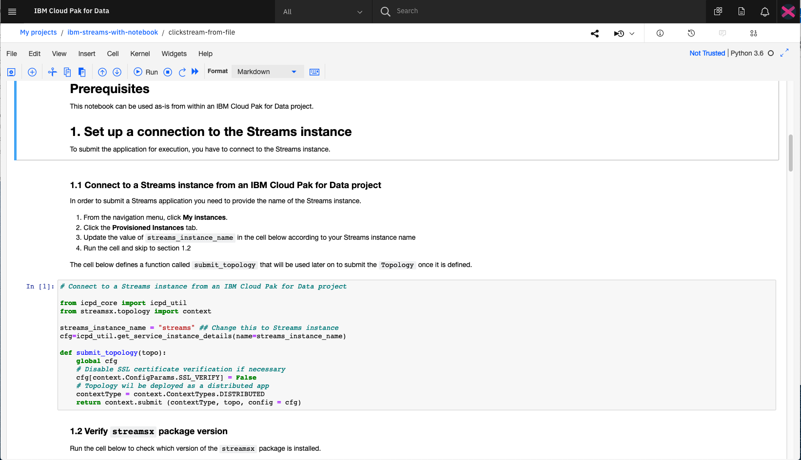

## Introduction

IBM Streams は、データをリアルタイムに分析するアプリケーションを開発できる高度な分析プラットフォームです。IBM Streams を使用すると、次のことが可能になります。

* 何千ものソースからリアルタイムにデータを取り込み、相関させることができます。データ形式は、構造化または非構造化のテキスト、画像、ビデオなどです。
* 低レイテンシーの応答時間で継続的にデータを分析することができます。
* 機械学習モデルをリアルタイムにスコアリングするアプリケーションを作成することができます。これにより、発生したパターンやトレンドを検出し、対応することができます。

IBM Streamsアプリケーションは、Java、Python、C++などの一般的な言語で作成できます。

以下は、典型的なストリーミング・アプリケーションのパターンです。

* 多くのソースからデータを取り込みます。
* 分析のためにデータを準備する。
* データの中のイベントやパターンを検出し、予測する。
* 結果をどのように扱うべきかを決定し、それに基づいて行動する。
* 長期的に価値のあるデータを保存する。

この記事は、IBM Streamsの仕組みと、それを使って独自のストリーム・アプリケーションを構築する方法について、理解を深めるためのラーニング・パスの最初の部分です。

## 使用例

Streams プラットフォームは、大量の連続したデータを最初に保存することなく分析することに優れています。  これは、データベースに保管されているデータの分析とは対照的で、事後的にイベントを後知恵で理解することができます。ストリームを使えば、トレンドやパターンを発生時に検出し、即座に対応することができます。ここでは、いくつかの使用例を紹介します。

* 決済処理
* 不正行為の検知
* アノモリ検知
* 予知保全
* IoTアナリティクス
* クリックストリーム解析

データは、以下のような様々な形式があります。

* 非構造化テキスト
* ビデオ
* オーディオ
* 地理空間
* センサー

##  用語と概念

ストリーミングの仕組みをよりよく理解するためには、すべてのIBM Streamsアプリケーションにとって基本的な用語と概念を説明することが重要です。

| 用語 | 定義 |
| --- | --- |
| 演算子｜演算子は、ストリームに対して何らかのアクションを実行します。これには、フィルター、アグリゲーター、アラートの設定、機械学習モデルに対するデータのスコアリングなどがあります。|
| Source｜アプリケーションがストリーミングデータの取り込みに使用するデータソース。例としては、Apache Kafka、RabbitMQ、MQTTなどがあります。|
| ストリーム｜オペレーター間を通過するデータ。  |
| ターゲット｜ストリーミングデータの最終出力。ターゲットの例としては、Cloudant&reg;、MySQL、Db2&reg;Event Storeなどがあります。  
| スキーマ｜オペレーター間を移動するストリームデータのフォーマット。|
| タプル（Tuple）｜ストリームデータ内の単一のエントリまたはイベント。|

さらに、ウィンドウの概念も重要です。ウィンドウには複数のタプルが含まれており、アプリケーションは一度に多くのデータを分析することができます。ウィンドウには2つのタイプがあります。

* スライディングウィンドウ -- タプルがウィンドウに追加されるたびに、分析は段階的に行われます。Sliding window -- タプルがウィンドウに追加されると、分析は段階的に行われます。タプルは、新しいタプルが到着するか、一定期間後に個別に削除されます。  移動平均によく使用されます。
* Tumbling window -- 特定の期間または設定されたタプル数に達した後、すべてのタプルが分析され、その後、ウィンドウから削除されます。

## Offerings

「IBM Streams」は、「IBM Cloud Pak&reg; for Data」で提供されます。ストリーミング・アプリケーションは、パブリック・クラウドやプライベート・クラウド、またはオンプレミスに展開できます。

なお、IBMが提供するIBM Streamsのサービスは複数あります。混乱を避けるために、ここではそれらについて簡単に説明します。

* [IBM Streaming Analytics](https://cloud.ibm.com/catalog/services/streaming-analytics?cm_sp=ibmdev-_-developer-articles-_-cloudreg) - IBM StreamsのIBM Cloud&reg;バージョンです。開発者の視点では、このサービスは似ています。
* InfoSphere&reg; Streams - IBM Streamsの旧製品名です。
* [Event Streams](https://cloud.ibm.com/catalog/services/event-streams?cm_sp=ibmdev-_-developer-articles-_-cloudreg) - Apache Kafkaプラットフォーム上に構築された高スループットのメッセージバスで、現在はIBM Cloudでのみ利用可能です。
* [Streams flows](https://developer.ibm.com/streamsdev/docs/category/streams-flows/) - IBM Streamsに組み込まれたビジュアル統合開発環境です。
* [streamsx](https://pypi.org/project/streamsx/) - IBM Streams アプリケーションを構築するための Python API です。

## ツールと言語

IBM Streams アプリケーションを開発する方法は複数あります。

### ストリームの流れ

IBM Streams には、IBM Streams flows というビジュアル IDE が付属しています。このツールでは、演算子をキャンバスにドラッグ＆ドロップしたり、内蔵の設定パネルからパラメータを変更したりすることができます。コード演算子では、独自の Java、Scala、Python コードを注入して、フィルタや集約などのアクションを実行できます。

この機能を試すには、このラーニング・パスに含まれているチュートリアル、Create your first IBM Streams app without writing code をご覧ください。

### Python

IBM Streams フローの代わりに、IBM Streams Python API を使用して Python でアプリケーションを記述する方法があります。この API は streamsx Python パッケージで提供されています。お好みのエディタを使用して Python でアプリケーションを開発し、Streams ランタイムにデプロイすることができます。

#### Jupyter Notebooks

IBM Cloud Pak for Data を使用している場合は、Jupyter Notebook を使用して Cloud Pak for Data プロジェクトで IBM Streams アプリを構築することもできます。IBM Cloud Pak for Data プラットフォームは、複数のデータ・ソースとの統合、組み込みのアナリティクス、および機械学習モデルのサポートを提供します。

独自のノートブックの作成を始めるには、このラーニング・パスに含まれるコード・パターンである Build a streaming app using a Python API をチェックしてください。

### IBM Streams Processing Language (SPL)

SPL は、IBM Streams アプリケーションを開発するために特別に設計されたプログラミング言語です。Microsoft Visual Studio Code を使用して SPL アプリケーションを作成するか、Streams Studio を使用します。このラーニングパスでは、SPLについては詳しく説明しませんが、SPLを使用することで、Streams開発のための最も高度な機能が提供されることを覚えておきましょう。

SPLおよびStreams Studioの詳細については、こちらをご覧ください。

* [SPLリファレンス](https://www.ibm.com/support/knowledgecenter/en/SSCRJU_5.3/com.ibm.streams.splangref.doc/doc/spl-container.html)
* [Create an SPL Streams app](https://github.com/IBMStreams/streamsx.documentation/blob/gh-pages/docs/spl/quick-start/qs-0.markdown)

## まとめ

この記事は、IBM Streams アプリケーションを構築するための手順を案内するラーニング・パスの最初の部分です。このシリーズでは、ストリーミング・アプリケーションを作成するさまざまな方法と、それらをサポートするプラットフォームをナビゲートする方法を説明します。また、[Apache Kafka](https://kafka.apache.org)との間でストリーミングを行う方法や、機械学習モデルでストリーミング・データを豊かにする方法も学びます。