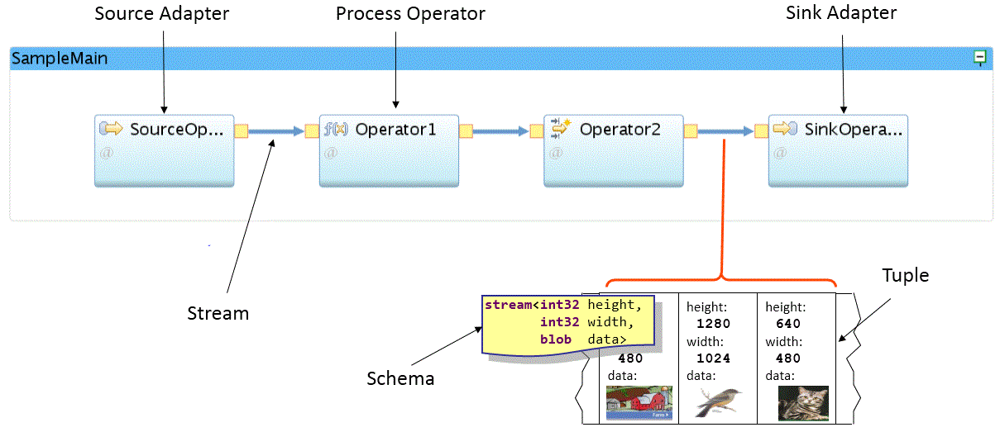
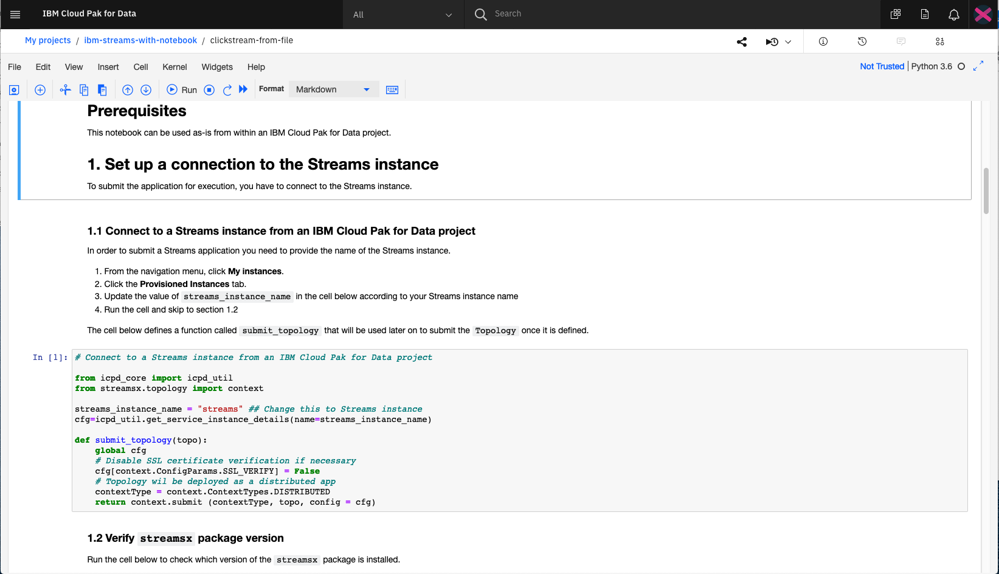

## Introduction

IBM Streams is an advanced analytics platform that allows you to develop applications that analyze data in real time. With IBM Streams, you can:

* Ingest and correlate data from thousands of sources in real time. Data formats can be structured or unstructured text, images, video, and more.
* Continuously analyze data with low-latency response times.
* Create applications that score machine learning models in real time. This allows you to detect and respond to patterns and trends as they occur.

IBM Streams applications can be created with popular languages like Java, Python and C++.

Following is the pattern of a typical streaming application:

* Ingest data from many sources.
* Prepare the data for analysis.
* Detect and predict event and patterns in the data.
* Decide how the results should be handled and act on them.
* Store any data that is of long-term value.

This article is the first part of a learning path that helps you gain a better understanding about how IBM Streams works and how you can use it to build your own streams applications.

## Use cases

The Streams platform excels at analyzing large amounts of continuous data without having to store it first.  This is in contrast to analyzing data at rest in a database, which allows you to gain hindsight on events after the fact. With Streams, you can detect a trend or pattern as it occurs and react to it immediately. Here are some example use cases:

* Payment processing
* Fraud detection
* Anomoly detection
* Predictive maintenance
* IoT analytics
* Clickstream analysis

Data can be in various formats, such as:

* unstructured text
* video
* audio
* geospatial
* sensor

## Terms and concepts

To better understand how streaming works, it's important to cover some basic terms and concepts that are fundamental to all IBM Streams applications.

| Term | Definition |
| ---  |   ---      |
| Operator | Operators perform some action on the stream. This can include filters, aggregators, setting alerts, and scoring data against a machine learning model. |
| Source | The data source the application uses to ingest streaming data. Examples include Apache Kafka, RabbitMQ, and MQTT. |
| Stream | The data that passes between operators.  |
| Target | The final output of the streaming data. Example targets include Cloudant&reg;, MySQL, and Db2&reg; Event Store.  
| Schema | The format of the stream data as it moves between operators. |
| Tuple | A single entry or event in the stream data. |

Additionally, the concept of windowing is important. Windows contain multiple tuples, which allows an application to analyze larger subsets of data at one time. There are two types of windows:

* Sliding window -- Analysis is done incrementally as tuples are added to the window. Tuples are removed individually as newer tuples arrive or after a specific period of time.  Often used for moving averages.
* Tumbling window -- After a specific period of time or a set number of tuples is reached, all tuples are analyzed and then removed from the window.

## Offerings

IBM Streams is available on IBM Cloud Pak&reg; for Data. Streaming applications can be deployed in any public or private cloud, or on-premises.

Note that there are multiple IBM Streams services available from IBM. To avoid confusion, they're briefly discussed here:

* [IBM Streaming Analytics](https://cloud.ibm.com/catalog/services/streaming-analytics?cm_sp=ibmdev-_-developer-articles-_-cloudreg) - The IBM Cloud&reg; version of IBM Streams. From a developer perspective, the services are similar.
* InfoSphere&reg; Streams - The former product name for IBM Streams.
* [Event Streams](https://cloud.ibm.com/catalog/services/event-streams?cm_sp=ibmdev-_-developer-articles-_-cloudreg) - A high-throughput message bus built on the Apache Kafka platform, currently available only on IBM Cloud.
* [Streams flows](https://developer.ibm.com/streamsdev/docs/category/streams-flows/) - The visual integrated development environment built into IBM Streams.
* [streamsx](https://pypi.org/project/streamsx/) - Python API for building IBM Streams applications.

## Tooling and languages

There are multiple ways to develop IBM Streams applications.

### Streams flows

IBM Streams comes with a visual IDE called IBM Streams flows. The tool allows you to drag and drop operators onto a canvas, and modify parameters from built-in settings panels. Code operators allow you to inject your own Java, Scala, or Python code to perform actions like filters or aggregations.

To try this out, please check out Create your first IBM Streams app without writing code, a tutorial included in this learning path.

### Python

An alternative to IBM Streams flows is to write your application in Python using the IBM Streams Python API. The API is provided by the streamsx Python package. You can use your favorite editor to develop your application in Python and deploy it on the Streams runtime.

#### Jupyter Notebooks

If you are using IBM Cloud Pak for Data, you can also build your IBM Streams app in a Cloud Pak for Data project using a Jupyter Notebook. The IBM Cloud Pak for Data platform provides support for integration with multiple data sources, built-in analytics, and machine learning models.

To get started creating your own notebook, please check out Build a streaming app using a Python API, a code pattern included in this learning path.

### IBM Streams Processing Language (SPL)

SPL is a programming language specifically designed to develop IBM Streams applications. You can use Microsoft Visual Studio Code to create SPL applications or use Streams Studio. This learning path will not cover SPL in depth, but it is important to note that using SPL provides the most advanced set of features for Streams development.

For more information on SPL and Streams Studio:

* [SPL Reference](https://www.ibm.com/support/knowledgecenter/en/SSCRJU_5.3/com.ibm.streams.splangref.doc/doc/spl-container.html)
* [Create an SPL Streams app](https://github.com/IBMStreams/streamsx.documentation/blob/gh-pages/docs/spl/quick-start/qs-0.markdown)

## Summary

This article is the first part of a learning path that guides you through the steps to build IBM Streams applications. This series covers the various ways to create streaming apps and how to navigate the platforms that support them. You'll also learn how to stream to and from [Apache Kafka](https://kafka.apache.org), as well as how to enrich your streaming data with machine learning models.