機械学習とは、ある値を予測するために、アルゴリズムを適用してデータ内のパターンを学習するシステムのことです。十分なデータを使用することで、すべての入力変数と予測される値との関係が確立されます。これにより、他の入力変数が与えられたときに、システムが新しい値を予測することが容易になります。このアプローチは、あらかじめ設定されたルールに基づいてアプリケーションを開発する従来のプログラミングとは異なります。機械学習の基本的な概念は以前から存在していましたが、最近になってこの分野が盛り上がってきたのは、正確な予測を実現するための鍵となる最新のプロセッサーと豊富なデータがあるからです。機械学習の歴史については、すでに十分なコンテンツがあるため、この記事ではそのトピックは取り上げません。その代わりに、必要な概念を理解するための実践的なアプローチをお伝えしますので、ぜひ参考にしてください。

この記事では、以下の概念を説明します。

* 機械学習の基礎知識
* 教師あり学習と教師なし学習
* モデルの構築
* 機械学習におけるパイプライン

## 機械学習の基礎

このセクションでは、機械学習プロジェクトに取り組む際に使用する基本的な用語について説明します。

### 線形代数

線形代数は、変数間の相関関係を扱う数学の一分野です。出力変数が入力変数の1以下の累乗（指数）で表現できることから線形と呼ばれています。線形代数の基本を理解することは、機械学習の基本の一部を理解するのに大いに役立ちます。ここでは、頻繁に使用される重要な用語を定義します。

#### テンソルとは？

まず、_スカラー_から始めましょう。スカラー表現とは、基本的に1、5、23.5、42などの任意の数字のことです。いくつかのスカラーをグループ化すると、_vector_になります。例えば、(1, 5, 23, 2)は長さ4のベクトルです。ベクトルでは、すべての要素が同じデータ型に属していなければなりませんが、_タプル_では、データ型が混在していてもかまいません。マトリックス（matrix）は、同じサイズのベクトルのリストです。行列では、行の数と列の数は異なっていても構いませんが、各要素は同じデータ型でなければなりません。行数が_m_、列数が_n_の行列は、_m×n_行列と呼ばれています。

_Tensors_は、多次元空間で表現されるデータです。テンソルとは、これらの表現を表す総称です。例えば、0次元のテンソルはスカラー、1次元のテンソルはベクトル、2次元のテンソルは行列となります。次の画像は3次元テンソルの例で、基本的には行列を3次元に拡張したものである。

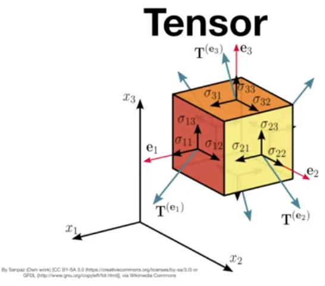

テンソルは、画像処理などで便利な面があります。高さ、幅、そして色を表す1つの次元を持つことができます。

### 高次元ベクトル空間

高次元ベクトル空間を理解することは、機械学習の仕組みを理解するための基礎となります。以下の画像は、3つの列を持つデータセットです。これらの列は次元や特徴と呼ばれています。この表は、3次元データセットとも呼ばれます。これらの点を3次元空間にプロットすると、3つの点群が観察されます。

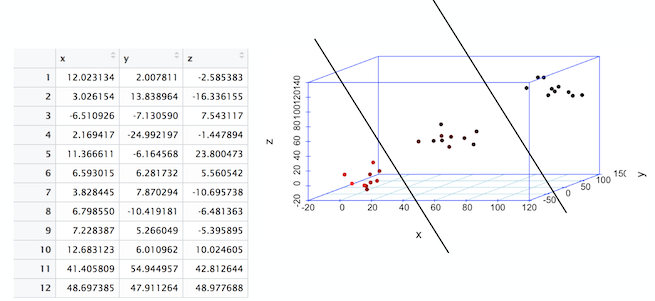

線とは、2次元空間における点の基本的な区切りのことです。先ほどの画像では、3次元空間での点の分離を示す区分けが見られます。この3次元空間の線は、「面」と呼ばれます。3次元から4次元以上になると、平面は「超平面」になります。

なぜなら、分離が確立された後、新しいデータを予測することは、データポイントが分離のどの部分にあるかを特定するだけだからです。

## 教師あり機械学習と教師なし機械学習

### 教師あり機械学習
教師あり機械学習とは、データセットの各レコードにラベルやフラグが設定されているタイプの問題です。

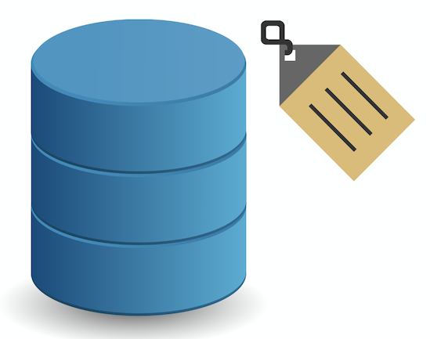

次の表は、最高温度、最低温度、最大振動の情報を含んでいます。

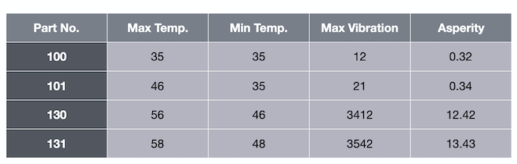

最後の列「asperity」はラベルです。温度と振動のデータがあれば、アスペリティを予測したいと思います。これがラベル付きのデータセットです。

このラベル付きのデータセットを使って、ラベルのないデータの未来を予測するアルゴリズムを学習することができます。そのデータをアルゴリズムに当てはめると、アルゴリズムはこのデータのラベルを予測します。これを「教師付き学習」といいます。教師あり学習には、_Regression_と_classification_の2種類があります。

#### 回帰

連続した値を予測しなければならないタイプのユースケースは、回帰と呼ばれています。例えば、35、35、12という値をアルゴリズムに渡すと、アスペリティの値は0.32と予測されます。

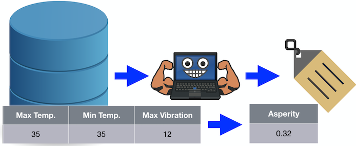

#### 分類

出力が連続値ではなくバイナリ値、または少なくとも離散値であるタイプのユースケースは、分類と呼ばれます。つまり、アルゴリズムは数値を予測するのではなく、クラス変数を予測します。

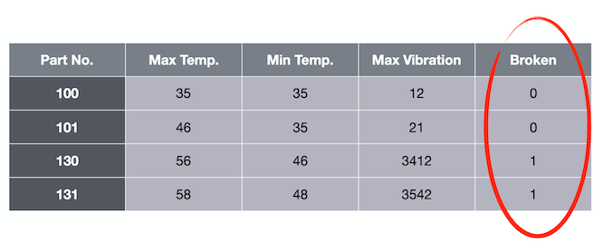

たとえば、35、35、12という値をアルゴリズムに渡すと、brokenの場合は0という値を予測することになります。

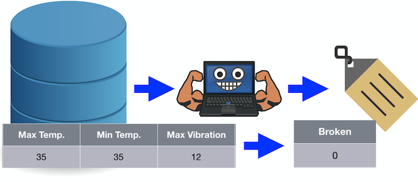

クラスが2つしかない場合は、バイナリ分類と呼ばれます。2つ以上のクラスがある場合は、多クラス分類となります。

### 教師なし学習

教師なし機械学習とは、データセットの中にラベルやフラグが含まれているレコードがないタイプの問題を指します。クラスタリングは、教師なし機械学習の一種です。

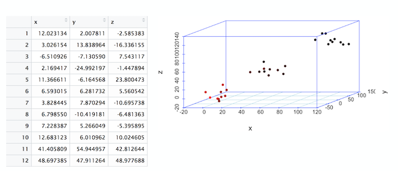

#### Clustering

前述の3次元プロットでは、データの3つのクラスター（雲）に注目してください。表をプロットするだけで、データが3つのクラスターに集中していることがわかります。このプロセスを「クラスタリング」と呼びます。

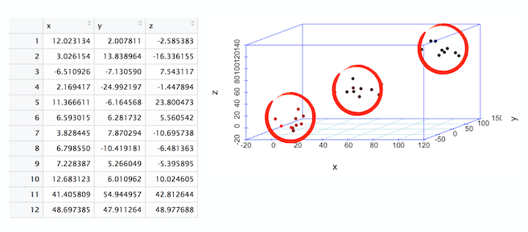

## モデルの構築

機械学習の_モデルとは、過去に見たデータを使って構築され、新しいデータを事前に計算された一定の精度で予測するように設定された数学的な構成のことです。  

以下は、ゼロからモデルを構築するために反復的に実行される一連のステップです。

* データの探索
* データの前処理
* トレーニングとテストのためのデータの分割
* 分類モデルの作成
* パイプラインを用いてこれらのステップをすべて組み立てる
* モデルのトレーニング
* モデルでの予測の実行
* モデルのパフォーマンスの評価と視覚化

モデルを構築するためのより詳細で実践的なアプローチは、[Build and test your first machine learning model using Python and scikit-learn](/tutorials/build-and-test-your-first-machine-learning-model-using-python-and-scikit-learn/)で説明されています。

## パイプライン

 パイプラインは、機械学習の流れの中でデータ処理を設計するための非常に便利なプロセスです。データの前処理は、適用するアルゴリズムに関わらず、学習を開始する前に毎回データに適用しなければならない面倒なステップです。以下の画像は、データモデリングを開始する前に毎回適用される前処理の典型的なシーケンスです。

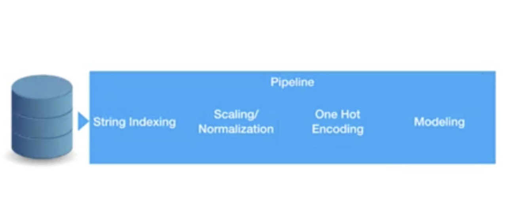

パイプラインを使用すると、前処理はそのままで、異なるモデリングアルゴリズムや、モデリングアルゴリズムの異なるパラメータセットを切り替えることができるということです。つまり、データ処理の流れを1つのパイプラインにまとめ、そのパイプラインを下流で使用することができるということです。

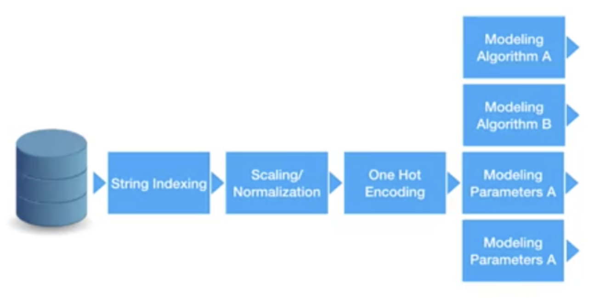

機械学習のアルゴリズムと同様に、パイプラインにもfit、evaluate、scoreというメソッドがあります。基本的にfitは学習を開始し、scoreは予測値を返します。

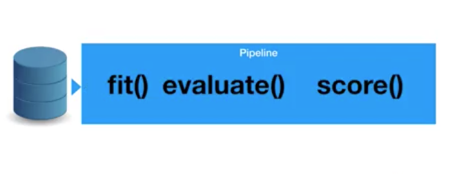

パイプラインを使用する最大の利点の1つに、_クロスバリデーション_があります。これは、同じパイプラインを使用して、複数のハイパーパラメータを変更または調整するプロセスを意味し、アルゴリズムの最適化を加速します。モデルの性能を向上させるためにチューニングできるハイパーパラメータはいくつかあります。これらのトピックに関する詳細は、今後の記事で取り上げます。

## まとめ

このチュートリアルでは、機械学習の基本的な概念を紹介しました。必要な概念を理解するための実践的なアプローチを提供したので、初心者の方にも安心してご利用いただけます。