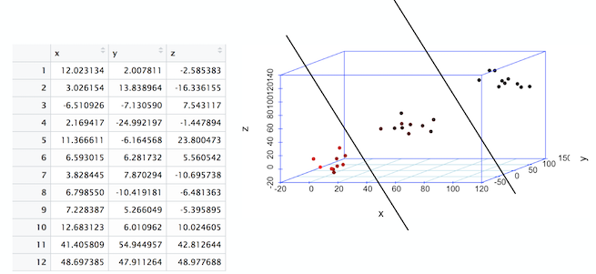
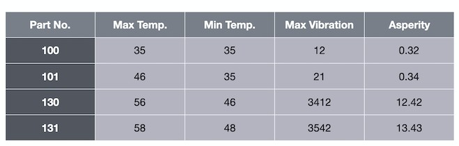
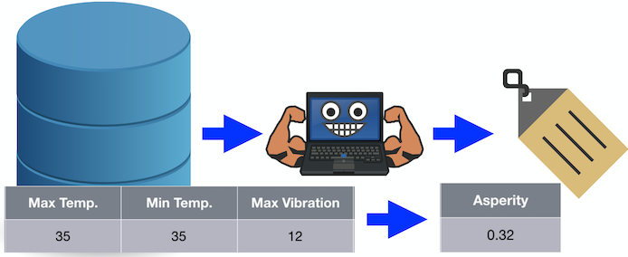
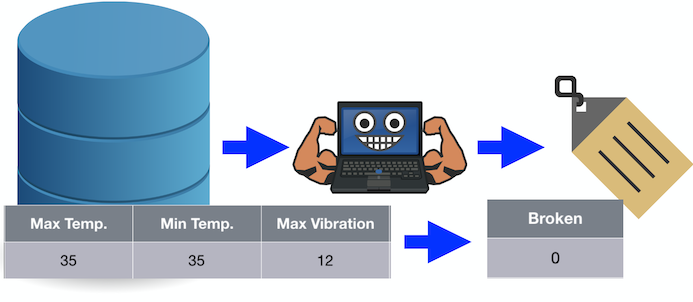
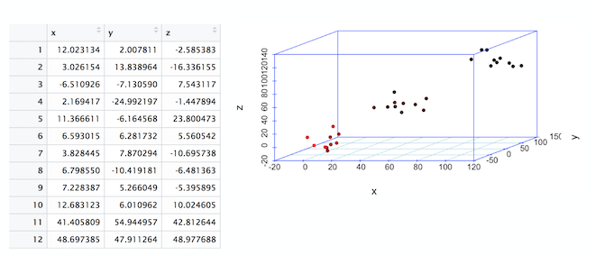
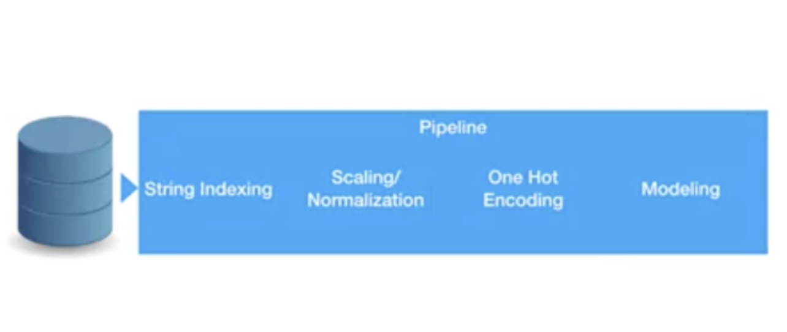
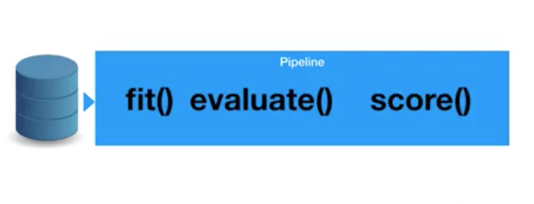

Machine learning is the science where in order to predict a value, algorithms are applied for a system to learn patterns within data. With the use of sufficient data, the relationship between all of the input variables and the values to be predicted is established. It becomes easier for the system to predict a new value given other input variables. This approach differs from conventional programming where an application is developed based on previously set rules. Even though the fundamental concepts of machine learning have been around for a while, the field has gained momentum recently due to the state-of-the-art processors and the abundant data that's available, which are both key to achieving accurate predictions. Because there is enough content already available on the history of machine learning, we do not cover that topic in this article. Instead, we give you a practical approach to understanding the necessary concepts to help get you started.

The following concepts are explained in this article:

* Fundamentals of machine learning
* Supervised versus unsupervised learning
* Building a model
* Pipelines in machine learning

## Fundamentals of machine learning

In this section, we discuss some of the basic terminologies that are used while working with a machine learning project.

### Linear algebra

Linear algebra is a field in mathematics that deals with correlations between variables. It's called linear because the output variable can be expressed in terms of the input variables with powers (exponents) not greater than one. Understanding the basics of linear algebra goes a long way in helping to understand some of the basics of machine learning. In this section, we define some of the key terms that are frequently used.

#### What are tensors?

Let's start with _scalar_. Scalar representation is basically any number such as 1, 5, 23.5, or 42. If you group a number of scalars together, you end up with a _vector_. For example, (1, 5, 23, 2) is a vector of length four. In a vector, all elements should belong to the same data type, whereas in a _tuple_, types can be mixed. A _matrix_ is a list of equal-sized vectors. In a matrix, the number of rows can be different from the number of columns, but each element must have the same type. A matrix with _m_ rows and _n_ columns is referred to as _m x n_ matrices.

_Tensors_ are data that is represented in a multi-dimensional space. Tensor is a generic term that represents these representations. For example, a zero-dimensional tensor is a scalar, a one-dimensional tensor is a vector, and a two-dimensional tensor is a matrix. The following image shows an example of a 3D tensor, which is basically an extension of a matrix, but in three dimensions.

Tensors can be handy in some aspects, such as image processing. You can have one dimension for the height, one for the width, and one for colors.

### High-dimensional vector spaces

Understanding high-dimensional vector spaces helps in giving you a solid foundation towards understanding how machine learning works. The following image shows a data set that has three columns. These columns are referred to as dimensions or features. The table is also called a three-dimensional data set. When these points are plotted in a 3D space, we observe three point clouds.

A _line_ is a basic separation of points in a 2-dimensional space. In the previous image, you see a division that marks the separation of points in a 3-dimensional space. This line in a 3D space is referred to as a _plane_. If you are going from three dimensions to four dimensions or more, the plane becomes an _hyperplane_.

Identifying these separations is critical because after the separations are established, predicting new data is merely identifying which part of the separation a data point lies within.

## Supervised versus unsupervised machine learning

### Supervised machine learning
Supervised machine learning refers to the type of problems in which each record in the the data set contains a label or a flag.

Consider the following table that contains information about max temperature, min temperature, and max vibration.

The final column, asperity, is the label. Given temperature and vibration data, we want to predict asperity. This is a labeled data set.

Using this data set that includes the label, we can train an algorithm to predict the future for unlabeled data. You fit that into your algorithm, and the algorithm now predicts a label for this data. This is referred to as supervised learning. _Regression_ and _classification_ are the two types of supervised learning.

#### Regression

The type of use cases where a continuous value must be predicted is referred to as regression. For example, if we pass the algorithm the values 35, 35, and 12, it predicts a value for asperity of 0.32.

#### Classification

The type of use cases where the output is a binary value or at least a discrete value instead of a continuous value is referred to as classification. In other words, the algorithm does not predict a number, but instead predicts a class variable.

For example, if we pass the algorithm the values 35, 35, and 12, it predicts a value 0 for broken.

If you have only two classes, it is called binary classification. If you have more than two classes, you have multiclass classification.

### Unsupervised learning

Unsupervised machine learning refers to the type of problems in which no record in the the data set contains any label or a flag. _Clustering_ is a type of unsupervised machine learning.

#### Clustering

In the 3-dimensional plot shown previously, notice the 3 clusters or clouds of data. Just by plotting the table, we see that data is centered around three clusters. This process is called clustering.

## Building a model

A machine learning _model_ refers to a mathematical configuration that is built using previously seen data and is set up to predict new data to a certain degree of accuracy that is previously calculated.  

Following is the sequence of steps that are performed iteratively to build a model from scratch.

* Data exploration
* Data preprocessing
* Splitting data for training and testing
* Preparing a classification model
* Assembling all of these steps using pipelines
* Training the model
* Running predictions on the model
* Evaluating and visualizing model performance

A more detailed and hands-on approach to building a model is described in [Build and test your first machine learning model using Python and scikit-learn](/tutorials/build-and-test-your-first-machine-learning-model-using-python-and-scikit-learn/).

## Pipelines

 Pipelines is a very convenient process of designing your data processing in a machine learning flow. Data preprocessing is a tedious step that must be applied on data every time before training begins, irrespective of the algorithm that will be applied. The following image shows a typical sequence of preprocessing steps that is applied every time before the data modeling begins.

The idea is that when using pipelines, you can keep the preprocessing and just switch the different modeling algorithms or different parameter sets of your modeling algorithm. The overall idea is that you can fuse your complete data processing flow into one single pipeline, and that single pipeline can be used downstream.

Similar to a machine learning algorithm, pipelines have methods called fit, evaluate, and score. Basically, fit starts the training and score returns the predicted value.

_Cross-validation_ is one of the biggest advantages of using pipelines. It refers to the process of changing or tuning several hyperparameters using the same pipeline, which accelerates the optimization of your algorithm. There are several hyperparameters that can be tuned to better performing models. Details related to these topics are covered in a future article.

## Summary

This tutorial provided some of the basic concepts of machine learning. It provided a practical approach to understanding the necessary concepts to help get you started.