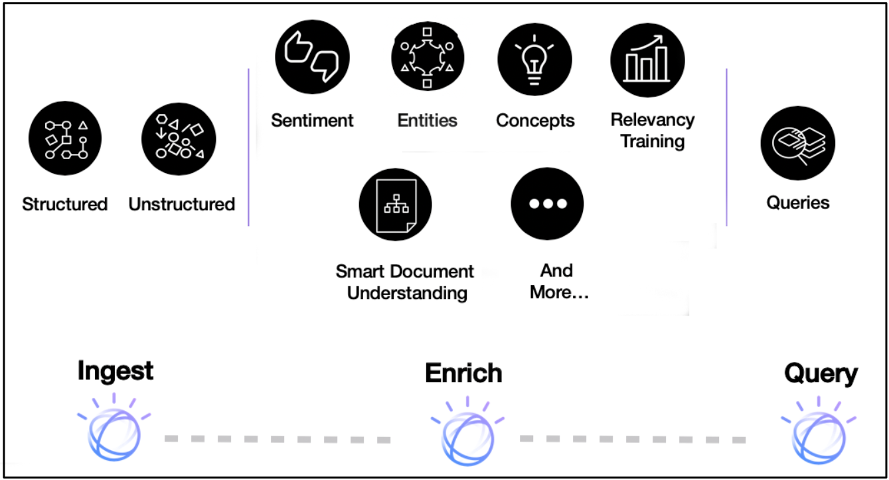
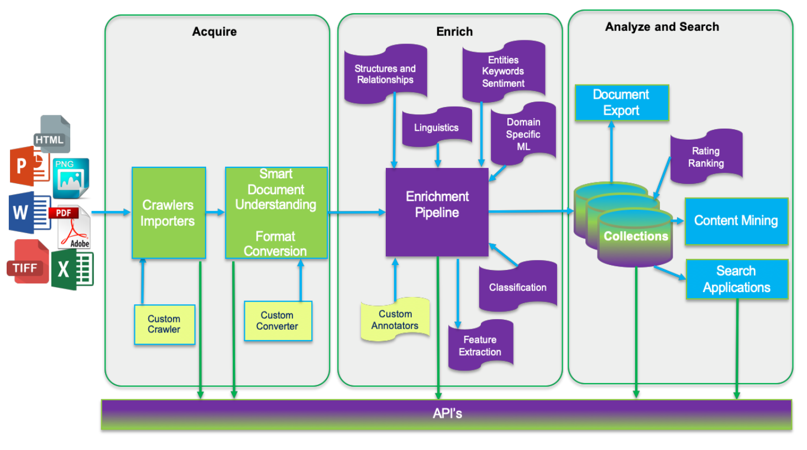
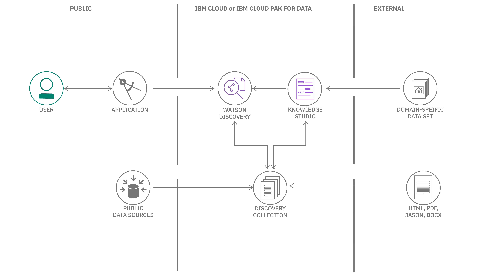

## Introduction

IBM Watson Discovery を使用すると、非構造化データ (JSON、HTML、PDF、Word など) の取り込み、正規化、エンリッチ、検索を迅速かつ正確に行うことができます。自然言語理解や文書変換などのコア Watson API と、プライベートまたはパブリックデータの大規模なコレクションを簡単にアップロード、エンリッチ化、インデックス化できる UI ツールがパッケージされています。

次の図は、Discovery パイプラインを構成するすべてのコンポーネントのハイレベルビューです。

**Note:** Watson Discovery V2は2021年8月にリリースされました。既存のV1ユーザーの方は、V1とV2の[機能の比較](https://cloud.ibm.com/docs/discovery-data?topic=discovery-data-version-choose#version-choose-comparison&cm_sp=ibmdev-_-developer-articles-_-cloudreg)ができます。

## 用語と概念

### Watson Discovery のサービス用語

ここでは、Discovery に固有の用語や概念について説明します。

| 用語 | 定義 |
| --- | --- |
| [プロジェクト](https://cloud.ibm.com/docs/discovery-data?topic=discovery-data-projects&cm_sp=ibmdev-_-developer-articles-_-cloudreg)| プロジェクトは、リソースを収集して管理するための便利な方法です。コレクションを作成することで、プロジェクトタイプを割り当て、データをプロジェクトに接続することができます。|
| [コレクション](https://cloud.ibm.com/docs/discovery-data?topic=discovery-data-collections&cm_sp=ibmdev-_-developer-articles-_-cloudreg)| コレクションは、環境内のデータを論理的に分割したもので、独立してクエリを実行できます。|
| [Enrichments](https://cloud.ibm.com/docs/discovery-data?topic=discovery-data-nlu&cm_sp=ibmdev-_-developer-articles-_-cloudreg)| Discovery には、データに対する認知的なエンリッチメントとインサイトを提供する強力な分析エンジンが含まれています。これらのエンリッチメントには、エンティティ、キーワード、品詞、センチメントが含まれます。|
| [ファセット](https://cloud.ibm.com/docs/discovery-data?topic=discovery-data-facets&cm_sp=ibmdev-_-developer-articles-_-cloudreg)| ファセットは、類似したパターンやコンテンツを共有するドキュメントを整理および分類するために Discovery で使用されます。|
| [アグリゲーション](https://cloud.ibm.com/docs/discovery-data?topic=discovery-data-query-reference#aggregations&cm_sp=ibmdev-_-developer-articles-_-cloudreg)| これは、選択したエンリッチメントの上位値など、一連のデータ値を返すディスカバリーを指します。たとえば、データコレクションに出現する上位 10 個の概念を返すことができます。|
| [パサージュ](https://cloud.ibm.com/docs/discovery-data?topic=discovery-data-query-parameters#passages&cm_sp=ibmdev-_-developer-articles-_-cloudreg)| [パッセージ]() 大規模なドキュメントを扱う際に、パッセージ検索機能を使用して、ベストマッチに関連する短くて関連性の高い抜粋を返すことができます。|
| [Smart Document Understanding](https://cloud.ibm.com/docs/discovery-data?topic=discovery-data-configuring-fields&cm_sp=ibmdev-_-developer-articles-_-cloudreg)| [スマートドキュメント理解]を使用して、ドキュメントをより小さく、より消費しやすい情報の塊に分割します。ドキュメント内の正しい情報にインデックスを付けることで、アプリケーションが検索して返すことのできる答えを改善することができます。|
| [関連性のトレーニング](https://cloud.ibm.com/docs/discovery-data?topic=discovery-data-train&cm_sp=ibmdev-_-developer-articles-_-cloudreg)| 関連性のトレーニングは、Discovery のクエリ結果をトレーニングして改善する機能を提供します。|
| [Discovery Query Language](https://cloud.ibm.com/docs/discovery-data?topic=discovery-data-query-reference&cm_sp=ibmdev-_-developer-articles-_-cloudreg)| [Discovery Query Language]() フィールド名、演算子、およびキーワードを使用して結果を検索するために使用するクエリの構文です。|
| [自然言語クエリ](https://cloud.ibm.com/docs/discovery-data?topic=discovery-data-query-parameters#nlq&cm_sp=ibmdev-_-developer-articles-_-cloudreg)| 厳密なクエリ言語の代わりに、"How do I save a file? "のような簡単なフレーズで言語をクエリすることもできます。|
| [Watson Discovery tooling](#tooling) | コレクションの作成と投入、エンリッチメントの適用、データのクエリとテストに使用できる、IBM Cloud コンソールから利用可能な UI ツールの広範なセットを指します。|

### エンリッチメント

Discovery には、データに対する認知的なエンリッチメントやインサイトを提供する強力な分析エンジンがあります。自然言語処理 (NLP) 機能を内蔵しており、JSON、HTML、PDF、Microsoft&trade; Word など、さまざまな種類のドキュメントからエンリッチメントを抽出することができます。次の表は、主なエンリッチメントを示しています。

| エンリッチメント | 定義 |
| --- | --- |
| [Entities](https://cloud.ibm.com/docs/discovery-data?topic=discovery-data-nlu#nlu-entities&cm_sp=ibmdev-_-developer-articles-_-cloudreg)| 人、会社、組織、都市、地理的特徴。|
| [Sentiment](https://cloud.ibm.com/docs/discovery-data?topic=discovery-data-nlu#nlu-sentiment&cm_sp=ibmdev-_-developer-articles-_-cloudreg)| 全体的な肯定的または否定的なセンチメントを識別します。|
| [Keywords](https://cloud.ibm.com/docs/discovery-data?topic=discovery-data-nlu#nlu-keywords&cm_sp=ibmdev-_-developer-articles-_-cloudreg)| [Keywords]() 重要なキーワードを決定し、それらをランク付けし、オプションとして、センチメントを検出します。|
| [Parts of speech](https://cloud.ibm.com/docs/discovery-data?topic=discovery-data-nlu#nlu-pos&cm_sp=ibmdev-_-developer-articles-_-cloudreg)| コンテンツ内の品詞（例えば、名詞や動詞）を識別します。|
| [Contracts](https://cloud.ibm.com/docs/discovery-data?topic=discovery-data-contracts-schema&cm_sp=ibmdev-_-developer-articles-_-cloudreg)| [契約書]() 特定の種類のドキュメントについて、契約用語や詳細を識別します。  |
| [表の理解](https://cloud.ibm.com/docs/discovery-data?topic=discovery-data-understanding_tables&cm_sp=ibmdev-_-developer-articles-_-cloudreg)| 特定の種類のドキュメントについて、ディスカバリーは、テーブルおよびテーブル関連データの詳細情報を提供します。|

これらのエンリッチメントに対して自然言語によるクエリを行うことができるため、一般的なキーワード検索エンジンよりも優位性があります。

## データフロー

Watson Discoveryでは、データは3つのステージのいずれかを経由して流れます。「取得」、「エンリッチ」、「分析・検索」の3つの段階を経てデータが流れます。

**取得**。データは 1 つまたは複数のデータソースから取り込まれ、不要なコンテンツ (グラフィックやフォーマットなど) が取り除かれた後、Enrich ステージに渡されます。

**Enrich**:データ（通常、構造化テキストと非構造化テキストの混合）は、自然言語処理や機械学習などの技術を用いて処理され、生のテキストに意味や文脈を与えます。このエンリッチされたデータは、コレクションに保存されます。

**分析と検索**。1つまたは複数のコレクションからの強化されたデータを使用して、発見や探索を行ったり、検索ベースのアプリケーションを通じて専門家の支援を可能にします。

## アーキテクチャ

Discovery を使用する一般的な方法は、アプリケーションから Discovery API にアクセスすることです。Watson チームは、多くのプログラミング言語をサポートする [SDK](#sdks) をリリースしており、Web アプリケーションやモバイル アプリケーションで Discovery を簡単に使用できるようになっています。

すべてのデータコンテンツは、Watson Discovery コレクション内に保存され、強化されています。データは特定の構造を必要とせず、複数の公共および民間のデータソースから取得することができます。すべての Discovery プロジェクトには、Sample Collection という名前の事前にエンリッチされたデータコレクションが付属しています (ソフトウェアのインストールマニュアルで構成されています)。

オプションとして、Watson Knowledge Studio を使用すると、特定の業界や組織のデータに含まれる固有のエンティティや関係性の理解を深めるために、ドメインエキスパートを使用して Discovery のカスタマイズを支援することができます。

Discoveryの典型的な使用例としては、以下のようなものがあります。

* *何千もの製品レビューを一度に検索する必要がある*。ディスカバリーコレクションを作成し、そのコレクションを照会したり、時系列でセンチメントをグラフ化したりするUIを構築します。
* ドキュメント内のテキストをプログラムで検索する必要がある場合*。Discoveryの通路検索機能を使用して、FAQチャットボットを作成します。
* *異なるフォーマットの何千ものドキュメントがあり、それらを論理的に整理する必要がある*。Discoveryを使って、キーワード、コンセプト、関係性を引き出し、ソートします。

## ディスカバリーへのアクセス

### ツール

前述したように、Discovery には、IBM Cloud または IBM Cloud Pak for Data から利用できる独自のツールセットがあり、Discovery のプロジェクトやコレクションを手動で管理するための UI が提供されています。

以下の動画では、このツールを使って新しいプロジェクトとデータ・コレクションを作成し、エンリッチメントのためにデータ・ファイルをインジェストする方法を紹介しています。

チュートリアルの [Getting started with the Watson Discovery Sample Project](https://cloud.ibm.com/docs/discovery-data?topic=discovery-data-getting-started&cm_sp=ibmdev-_-developer-articles-_-cloudreg) は、Discovery UI ツールの操作方法を学ぶためのもう 1 つの素晴らしいリソースです。

### SDK

プログラムによるアクセスのために、Discovery には多数の言語がサポートされています。以下のリストは、現在の開発者向けSDKを示しています。

* [Node SDK](https://github.com/watson-developer-cloud/node-sdk)
* [Python SDK](https://github.com/watson-developer-cloud/python-sdk)
* [Swift SDK](https://github.com/watson-developer-cloud/swift-sdk)
* [Java&trade; SDK](https://github.com/watson-developer-cloud/java-sdk)
* [Go SDK](https://github.com/watson-developer-cloud/go-sdk)
* [Ruby SDK](https://github.com/watson-developer-cloud/ruby-sdk)
* 【.NET SDK】(https://github.com/watson-developer-cloud/dotnet-standard-sdk)
* [Salesforce SDK](https://github.com/watson-developer-cloud/salesforce-sdk)

### APIs

API の詳細については、[Discovery API documentation](https://cloud.ibm.com/apidocs/discovery-data?cm_sp=ibmdev-_-developer-articles-_-cloudreg)をご参照ください。

### コードサンプル

以下の Node.js コード・サンプルは、IBM Cloud 上の Discovery プロジェクトを認証してクエリする方法を示しています。クエリの概念について詳しく知りたい場合は、Discovery [documentation](https://cloud.ibm.com/docs/discovery-data?topic=discovery-data-query-defaults&cm_sp=ibmdev-_-developer-articles-_-cloudreg)をご覧ください。