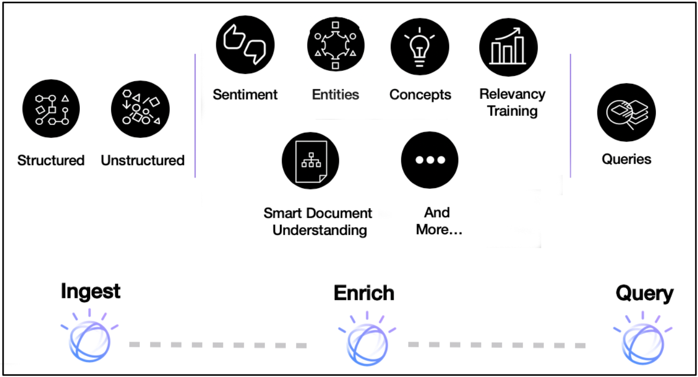

## Introduction

With IBM Watson Discovery, you can ingest, normalize, enrich, and search your unstructured data (JSON, HTML, PDF, Word, and more) with speed and accuracy. It packages core Watson APIs such as Natural Language Understanding and Document Conversion along with UI tools that enable you to easily upload, enrich, and index large collections of private or public data.

The following image shows a high-level view of all of the components that make up the Discovery pipeline.



**Note:** Watson Discovery V2 was released in August 2021. For existing V1 users, you can [compare the features](https://cloud.ibm.com/docs/discovery-data?topic=discovery-data-version-choose#version-choose-comparison&cm_sp=ibmdev-_-developer-articles-_-cloudreg) of V1 and V2.

## Terms and concepts

### Watson Discovery service terms

This section covers the terms and concepts that are specific to Discovery.

| Term | Definition |
| ---  |   ---      |
| [Project](https://cloud.ibm.com/docs/discovery-data?topic=discovery-data-projects&cm_sp=ibmdev-_-developer-articles-_-cloudreg) | A project is a convenient way to collect and manage the resources. You can assign a project type and connect your data to the project by creating a collection. |
| [Collection](https://cloud.ibm.com/docs/discovery-data?topic=discovery-data-collections&cm_sp=ibmdev-_-developer-articles-_-cloudreg) | A collection is a logical division of your data in an environment and can be queried independently. |
| [Enrichments](https://cloud.ibm.com/docs/discovery-data?topic=discovery-data-nlu&cm_sp=ibmdev-_-developer-articles-_-cloudreg) | Discovery contains a powerful analytics engine that provides cognitive enrichments and insights into your data. These enrichments include entities, keywords, parts of speech, and sentiment. |
| [Facets](https://cloud.ibm.com/docs/discovery-data?topic=discovery-data-facets&cm_sp=ibmdev-_-developer-articles-_-cloudreg) | Facets are used by Discovery to organize and classify documents that share similar patterns or content. |
| [Aggregations](https://cloud.ibm.com/docs/discovery-data?topic=discovery-data-query-reference#aggregations&cm_sp=ibmdev-_-developer-articles-_-cloudreg) | This refers to Discovery returning a set of data values, such as the top values for selected enrichments. For example, it can return the top 10 concepts that appear in a data collection. |
| [Passages](https://cloud.ibm.com/docs/discovery-data?topic=discovery-data-query-parameters#passages&cm_sp=ibmdev-_-developer-articles-_-cloudreg) | When working with large documents, you can use the passage search feature to return short and relevant excerpts related to the best matches. |
| [Smart Document Understanding](https://cloud.ibm.com/docs/discovery-data?topic=discovery-data-configuring-fields&cm_sp=ibmdev-_-developer-articles-_-cloudreg) | Use Smart Document Understanding to break your documents into smaller, more consumable chunks of information. When you help Discovery index the correct set of information in your documents, you improve the answers that your application can find and return. |
| [Relevancy training](https://cloud.ibm.com/docs/discovery-data?topic=discovery-data-train&cm_sp=ibmdev-_-developer-articles-_-cloudreg) | Relevancy training provides the ability to train and improve Discovery query results. |
| [Discovery Query Language](https://cloud.ibm.com/docs/discovery-data?topic=discovery-data-query-reference&cm_sp=ibmdev-_-developer-articles-_-cloudreg) | The syntax of the queries that you would use to search for results using field names, operators, and keywords. |
| [Natural Language Query](https://cloud.ibm.com/docs/discovery-data?topic=discovery-data-query-parameters#nlq&cm_sp=ibmdev-_-developer-articles-_-cloudreg) | As an alternative to strict query language, you can also query the language with simple phrases such as "How do I save a file?" |
| [Watson Discovery tooling](#tooling) | The extensive set of UI tools available from the IBM Cloud console that you can use to create and populate your collection, apply enrichments, and query and test your data. |

### Enrichments

Discovery has a powerful analytics engine that provides cognitive enrichments and insights into your data. With built-in natural language processing (NLP) capabilities, it can extract enrichments from a wide range of document types, such as JSON, HTML, PDF, and Microsoft&trade; Word. The following table shows the key enrichments.

| Enrichment | Definition |
| ---   |   ---      |
| [Entities](https://cloud.ibm.com/docs/discovery-data?topic=discovery-data-nlu#nlu-entities&cm_sp=ibmdev-_-developer-articles-_-cloudreg) | People, companies, organizations, cities, and geographic features. |
| [Sentiment](https://cloud.ibm.com/docs/discovery-data?topic=discovery-data-nlu#nlu-sentiment&cm_sp=ibmdev-_-developer-articles-_-cloudreg) | Identifies the overall positive or negative sentiment. |
| [Keywords](https://cloud.ibm.com/docs/discovery-data?topic=discovery-data-nlu#nlu-keywords&cm_sp=ibmdev-_-developer-articles-_-cloudreg) | Determines important keywords, ranks them, and, optionally, detects the sentiment. |
| [Parts of speech](https://cloud.ibm.com/docs/discovery-data?topic=discovery-data-nlu#nlu-pos&cm_sp=ibmdev-_-developer-articles-_-cloudreg) | Identifies the parts of speech (for example, nouns and verbs) in the content. |
| [Contracts](https://cloud.ibm.com/docs/discovery-data?topic=discovery-data-contracts-schema&cm_sp=ibmdev-_-developer-articles-_-cloudreg) | For specific types of documents, Discovery can identify contract terms and details.  |
| [Table understanding](https://cloud.ibm.com/docs/discovery-data?topic=discovery-data-understanding_tables&cm_sp=ibmdev-_-developer-articles-_-cloudreg) | For specific types of documents, Discovery can provide detailed information about tables and table-related data. |

The ability to make natural language queries on these enrichments provides an advantage over typical keyword search engines.

## Data flow

In Watson Discovery, data flows through one of three stages: Acquire, Enrich, and Analyze and Search.

**Acquire**: Data is ingested from one or more data sources, stripped of unnecessary content (such as graphics and formatting), and then passed to the Enrich stage.

**Enrich**: The data (typically, a mix of structured and unstructured text) is processed using techniques such as natural language processing and machine learning to provide meaning and context to the raw text. This enriched data is stored in collections.

**Analyze and Search**: Uses the enriched data from one or more collections to conduct discovery and exploration or to enable expert assistance through search-based applications.


## Architecture


A common way to use Discovery is by accessing the Discovery APIs from your application. The Watson team releases [SDKs](#sdks) that support many programming languages so that you can use Discovery easily in a web or mobile application.

All of the data content is stored and enriched within Watson Discovery collections. The data does not require any specific structure and can come from multiple public and private data sources. Every Discovery project comes with a pre-enriched data collection named Sample Collection (comprised of software installation manuals).

Optionally, with Watson Knowledge Studio, you can use domain experts to help customize Discovery to better understand the unique entities and relationships in your specific industry or organizational data.

Some typical use cases for Discovery include:

* *The need to search thousands of product reviews at once*: Create a Discovery collection and build a UI to query the collection and graph the sentiment over time.
* *The need to programmatically find text within a document*: Use the passage retrieval feature of Discovery to create an FAQ chatbot.
* *There are thousands of documents in different formats and you need to organize them logically*: Use Discovery to pull out keywords, concepts, and relationships to sort them.

## Accessing Discovery

### Tooling

As mentioned previously, Discovery has its own set of tooling that is available through IBM Cloud or IBM Cloud Pak for Data and which provides a UI to manually manage your Discovery projects and collections.

The following video shows how you can use the tool to create a new project and data collection, and then ingest data files for enrichment.


The [Getting started with the Watson Discovery Sample Project](https://cloud.ibm.com/docs/discovery-data?topic=discovery-data-getting-started&cm_sp=ibmdev-_-developer-articles-_-cloudreg) tutorial provides another great resource for learning how to navigate the Discovery UI tooling.

### SDKs

For programmatic access, Discovery comes with support for a large number of languages. The following list shows the current developer SDKs.

* [Node SDK](https://github.com/watson-developer-cloud/node-sdk)
* [Python SDK](https://github.com/watson-developer-cloud/python-sdk)
* [Swift SDK](https://github.com/watson-developer-cloud/swift-sdk)
* [Java&trade; SDK](https://github.com/watson-developer-cloud/java-sdk)
* [Go SDK](https://github.com/watson-developer-cloud/go-sdk)
* [Ruby SDK](https://github.com/watson-developer-cloud/ruby-sdk)
* [.NET SDK](https://github.com/watson-developer-cloud/dotnet-standard-sdk)
* [Salesforce SDK](https://github.com/watson-developer-cloud/salesforce-sdk)

### APIs

For more information on the APIs, see the [Discovery API documentation](https://cloud.ibm.com/apidocs/discovery-data?cm_sp=ibmdev-_-developer-articles-_-cloudreg).

### Code sample

The following Node.js code sample shows how to authorize and query your Discovery project on IBM Cloud. If you need more information on query concepts, look at the Discovery [documentation](https://cloud.ibm.com/docs/discovery-data?topic=discovery-data-query-defaults&cm_sp=ibmdev-_-developer-articles-_-cloudreg).

```javascript
const DiscoveryV2 = require('ibm-watson/discovery/v2');
const { IamAuthenticator } = require('ibm-watson/auth');

const discovery = new DiscoveryV2({
  version: '{version}',
  authenticator: new IamAuthenticator({
    apikey: '{apikey}',
  }),
  serviceUrl: '{url}',
});

const params = {
  projectId: '{projectId}',
  query: '{field}:{value}',
};

discovery.query(params)
  .then(response => {
    console.log(JSON.stringify(response.result, null, 2));
  })
  .catch(err => {
    console.log('error:', err);
  });

```

## Summary

This article gave you an introduction to Watson Discovery, where you can ingest, normalize, enrich, and search your unstructured data (JSON, HTML, PDF, Word, and more) with speed and accuracy. It packages core Watson APIs such as Natural Language Understanding and Document Conversion along with UI tools that enable you to easily upload, enrich, and index large collections of private or public data.