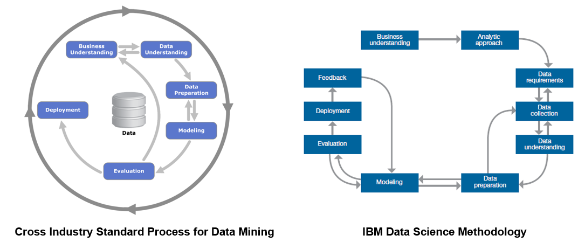

## Introduction

IBM&reg; Watson&trade; Studio ラーニングパスでは、IBM Watson Studio を使用して顧客の解約を予測するさまざまな方法を紹介しています。AutoAI Experiment ツールを使用した半自動のアプローチから、SPSS Modeler Flows を使用した図式化されたアプローチ、Python 用 Jupyter notebooks を使用した完全にプログラムされたスタイルまで、さまざまです。

このラーニングパスに含まれるチュートリアルはすべて、CRISP-DM（Cross Industry Standard Process for Data Mining）やIBM Data Science Methodologyなどのデータサイエンス（およびデータマイニング）の手法の主要なステップに沿っています。チュートリアルでは、データの理解、データの準備、モデリング、評価、予測分析のための機械学習モデルの展開などのタスクに焦点を当てています。チュートリアルでは、<a href="https://www.kaggle.com/sandipdatta/customer-churn-analysis" target="_blank" rel="noopener noreferrer">Kaggle</a>で提供されている顧客の解約に関するデータ・セットとノートブックをベースとして使用し、AutoAI、SPSS Modeler、およびIBM Watson Studioスイート・オブ・ツールで提供されているIBM Watson Machine Learningサービスを使用して、同じ問題を解決する別の方法を示しています。学習パスでは、データの理解をサポートするためのIBM Watson Studioのプロファイリング・ツールとダッシュボードの使用、および簡単なデータ準備と変換タスクを解決するためのRefineツールについて説明しています。

## データサイエンス・メソドロジー

IBMは、個々のテクノロジー・コンポーネントをリファレンス・アーキテクチャーにマッピングするためのプロセス・モデルを含む[lightweight IBM Cloud Garage Method](/articles/the-lightweight-ibm-cloud-garage-method-for-data-science/)を定義しました。この方法には、要求工学やデザイン思考のタスクは含まれていません。プロジェクトのアーキテクチャを最初に定義するのは難しいため、この手法では、プロセスモデル中のアーキテクチャの変更をサポートしています。

各ステージは、方法論全体の中で重要な役割を果たしています。ある程度の抽象度で言えば、データマイニングのための<a href="https://www.the-modeling-agency.com/crisp-dm.pdf" target="_blank" rel="noopener noreferrer">CRISP-DM</a>メソッドで概説されているワークフローを改良したものと見ることができます。

両方の方法論によると、すべてのプロジェクトは、問題と目的を定義する「ビジネスの理解」から始まります。これに続いて、IBMデータサイエンス・メソッドでは、データサイエンティストが問題解決のためのアプローチを定義する「分析的アプローチ」の段階があります。IBMデータサイエンス・メソッドでは、その後、_データ要求_、_データ収集_、_データ理解_と呼ばれる3つのフェーズが続きますが、CRISP-DMでは、1つの_データ理解_フェーズで表現されています。

データサイエンティストがデータを理解し、開始するのに十分なデータを手に入れた後は、_データ準備_フェーズに移ります。このフェーズは通常、非常に時間がかかります。データサイエンティストはこのフェーズに約80％の時間を費やし、データクレンジングやフィーチャーエンジニアリングなどの作業を行います。ここでは「データ整理」という言葉がよく使われます。データサイエンティストは、データのクレンジング中およびクレンジング後に、データの全体像を把握するための記述統計や、データの関係性や潜在的な構造を調べるためのクラスタリングなどの探索作業を行うのが一般的です。このプロセスは、データサイエンティストがデータセットに満足するまで、何度も繰り返し行われます。

モデルの学習段階では、機械学習を用いて予測モデルを構築します。モデルは学習された後、予測精度、感度、特異性などの統計的指標によって評価されます。モデルが十分であると判断された後、そのモデルはデプロイされ、未見のデータに対するスコアリングに使用されます。IBM Data Science Methodologyでは、モデルを使用した際のフィードバックを得るための「フィードバック」の段階が追加されており、このフィードバックがモデルの改良に使用されます。どちらの手法も、高度に反復的な性質を持っています。

このラーニングパスでは、データの理解から始まり、データの準備、モデルの構築、モデルの評価、そしてモデルの展開とテストに至るまでのフェーズに焦点を当てます。目的は、顧客の解約を予測するモデルを開発することです。このような解約の原因を分析してビジネスを改善することに関連する側面は、このラーニングパスの範囲外です。つまり、一連の特徴によって定義された顧客の観察結果をもとに、この特定の顧客が解約のリスクにさらされているかどうかを予測することができる、さまざまな種類の分類モデルを扱うことになります。

## IBM Watson Studio

すべての作業に、<a href="https://dataplatform.cloud.ibm.com/docs/content/getting-started/welcome-main.html?cm_sp=ibmdev-_-developer-articles-_-cloudreg" target="_blank" rel="noopener noreferrer">IBM Watson Studio</a>を使用しています。IBM Watson Studioは、データを共同で扱うことでビジネス上の問題を解決するための**環境**と**ツール**を提供します。データの分析と可視化、データのクレンジングと整形、ストリーミングデータの取り込み、機械学習モデルの作成、トレーニング、デプロイなどに必要なツールを選択することができます。

IBM Watson Studio を使用すると、以下のことができます。

* <a href="https://dataplatform.cloud.ibm.com/docs/content/wsj/manage-data/manage-projects.html?audience=wdp&cm_sp=ibmdev-_-developer-articles-_-cloudreg" target="_blank" rel="noopener noreferrer">プロジェクト</a>を作成して、アナリティクスの目標を達成するためのリソース (データ接続、データ資産、共同作業者、ノートブックなど) を整理します。

* <a href="https://dataplatform.cloud.ibm.com/docs/content/wsj/getting-started/assets.html#connection?cm_sp=ibmdev-_-developer-articles-_-cloudreg" target="_blank" rel="noopener noreferrer">接続</a>から、クラウドまたはオンプレミスのデータソースにデータをアクセスします。

* <a href="https://dataplatform.cloud.ibm.com/docs/content/wsj/manage-data/add-data-project.html?cm_sp=ibmdev-_-developer-articles-_-cloudreg" target="_blank" rel="noopener noreferrer">ファイルのアップロード</a>をプロジェクトのオブジェクトストレージに行います。

* <a href="https://dataplatform.cloud.ibm.com/docs/content/wsj/catalog/manage-catalog.html?cm_sp=ibmdev-_-developer-articles-_-cloudreg" target="_blank" rel="noopener noreferrer">データカタログ</a>を作成・維持し、データの発見、インデックス、共有を行う。

* <a href="https://dataplatform.cloud.ibm.com/docs/content/wsj/refinery/refining_data.html?cm_sp=ibmdev-_-developer-articles-_-cloudreg" target="_blank" rel="noopener noreferrer">データのリファイン</a>を行い、データをクレンジングして整形し、分析の準備をする。

<a href="https://dataplatform.cloud.ibm.com/docs/content/wsj/analyze-data/data-science.html?cm_sp=ibmdev-_-developer-articles-_-cloudreg" target="_blank" rel="noopener noreferrer">データサイエンス</a>のタスクを実行するには、PythonやScala用のJupyter Notebooksを作成し、データを処理するコードを実行して、その結果をインラインで表示します。また、R用のRStudioを使用することもできます。

* Streams Designer ツールを使用して、ストリームデータを取り込み、<a href="_blank" target="noopener noreferrer">分析する</a>。

* <a href="https://dataplatform.cloud.ibm.com/docs/content/wsj/analyze-data/ml-overview.html?cm_sp=ibmdev-_-developer-articles-_-cloudreg" target="_blank" rel="noopener noreferrer">機械学習</a>や **深層学習** のモデルを作成、テスト、デプロイします。

* <a href="https://dataplatform.cloud.ibm.com/docs/content/wsj/analyze-data/visual-recognition-overview.html?cm_sp=ibmdev-_-developer-articles-_-cloudreg" target="_blank" rel="noopener noreferrer">画像コンテンツを認識するディープラーニングモデルをトレーニングして、画像を分類する</a>。

* <a href="https://dataplatform.cloud.ibm.com/docs/content/wsj/getting-started/assets.html#dashboard?cm_sp=ibmdev-_-developer-articles-_-cloudreg" target="_blank" rel="noopener noreferrer">データビジュアライゼーションのダッシュボード</a>をコーディングなしで作成・共有する。

技術的には、IBM Watson Studioは、以下の図のように、様々なオープンソース技術とIBM製品をベースにしています。

データサイエンスの文脈では、IBM Watson Studioは、データサイエンスの問題を解決するプロセスにおいて、開発者、データエンジニア、ビジネスアナリスト、データサイエンティストをサポートする、統合されたマルチロールコラボレーションプラットフォームと見なすことができます。開発者の役割としては、機械学習サービスを使用するアプリケーションを構築する上で、IBM Cloudプラットフォームの他のコンポーネントも関連してくるかもしれません。しかし、データサイエンティストは、以下のような様々なツールを使って機械学習モデルを構築することができます。

* <a href="https://dataplatform.cloud.ibm.com/docs/content/wsj/analyze-data/autoai-overview.html?audience=wdp&context=wdp&cm_sp=ibmdev-_-developer-articles-_-cloudreg" target="_blank" rel="noopener noreferrer">AutoAI Model Builder</a>。プログラミングのスキルを必要としないグラフィカルなツール
* <a href="https://dataplatform.cloud.ibm.com/docs/content/wsd/spss-modeler.html?cm_sp=ibmdev-_-developer-articles-_-cloudreg" target="_blank" rel="noopener noreferrer">SPSS Modeler Flows</a>。図式化されたスタイルを採用
* <a href="https://dataplatform.cloud.ibm.com/docs/content/wsj/analyze-data/rstudio-overview.html?cm_sp=ibmdev-_-developer-articles-_-cloudreg" target="_blank" rel="noopener noreferrer">RStudio</a>と<a href="https://dataplatform.cloud.ibm.com/docs/content/wsj/analyze-data/notebooks-parent.html?linkInPage=true&cm_sp=ibmdev-_-developer-articles-_-cloudreg" target="_blank" rel="noopener noreferrer">Jupyter Notebooks</a>の組み合わせ。プログラム的なスタイルの使用

これらの3つの主要コンポーネント以外にも、使用します。

* <a href="https://www.ibm.com/jp-ja/cloud/object-storage" target="_blank" rel="noopener noreferrer">IBM Cloud Object Storage</a>を使用して、モデルのトレーニングとテストに使用するデータセットを保存します。
* <a href="https://dataplatform.cloud.ibm.com/docs/content/wsj/refinery/refining_data.html?cm_sp=ibmdev-_-developer-articles-_-cloudreg" target="_blank" rel="noopener noreferrer">Data Refinery</a> でデータセットを変換します。
* <a href="https://www.ibm.com/support/knowledgecenter/en/SSEP7J_11.1.0/com.ibm.swg.ba.cognos.ug_ca_dshb.doc/ca_waca_tut_overview_for_docs.html" target="_blank" rel="noopener noreferrer">Cognos Dashboards</a>で可視化を行う。

その他の背景については、IBM Watson Studio で利用可能な <a href="https://dataplatform.cloud.ibm.com/docs/content/wsj/getting-started/videos.html?cm_sp=ibmdev-_-developer-articles-_-cloudreg" target="_blank" rel="noopener noreferrer"> 広範な「ハウツー」ビデオのリスト</a>をご覧ください。

## IBM Watson Machine Learning サービス

IBM Watson Studio の重要なコンポーネントは、IBM Watson Machine Learning サービスと、機械学習モデルと対話するためにあらゆるプログラミング言語から呼び出すことができる REST API のセットです。IBM Watson Machine Learning サービスの焦点はデプロイメントですが、IBM SPSS Modeler または IBM Watson Studio を使用して、モデルやパイプラインをオーサリングして作業することができます。SPSS ModelerとIBM Watson StudioはどちらもSpark MLlibとPython scikit-learnを使用しており、機械学習、人工知能、統計学から取り入れた様々なモデリング手法を提供しています。

以下のリンクを使用して、Watson Machine Learning のより詳細な情報を入手してください。

* <a href="https://dataplatform.cloud.ibm.com/docs/content/wsj/analyze-data/ml-overview.html?cm_sp=ibmdev-_-developer-articles-_-cloudreg" target="_blank" rel="noopener noreferrer">Watson Machine Learning の概要</a>。
* <a href="https://cloud.ibm.com/apidocs/machine-learning?cm_sp=ibmdev-_-developer-articles-_-cloudreg" target="_blank" rel="noopener noreferrer">Watson Machine Learning API</a>を参照してください。

## まとめ

この記事では、IBM Data Science Methodology の背景情報、IBM Watson Studio が果たす役割、そしてこのラーニングパスで取り上げられる内容のプレビューを提供しました。

このラーニングパスの目的の 1 つは、IBM Watson Studio が、Python、Scala、または R 用の Jupyter Notebooks に加えて、同様のプロセスをより速く、プログラミングスキルなしで実現できる代替方法を提供していることを示すことです。要するに、これらのメカニズムは、データサイエンティストがフローを定義することで純粋にグラフィカルにモデルを作成できるSPSS Modeler Flowと、IBM Watson Studio内のIBM AutoAIグラフィカルツールであり、SPSSよりも一歩進んで、機械学習モデルの作成、評価、デプロイ、テストを半自動で行うことができます。同時に、この学習パスでは、IBM Watson Studioが、データのプロファイリング、可視化、変換のための機能を、やはりプログラミングを必要とせずにすぐに提供する様子を示しています。