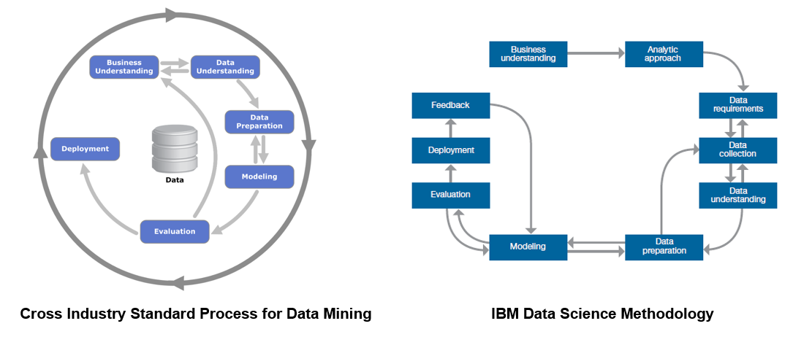
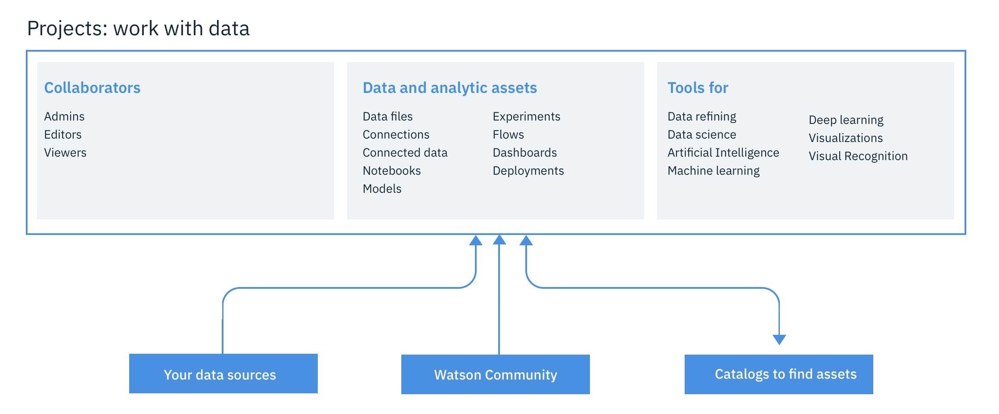
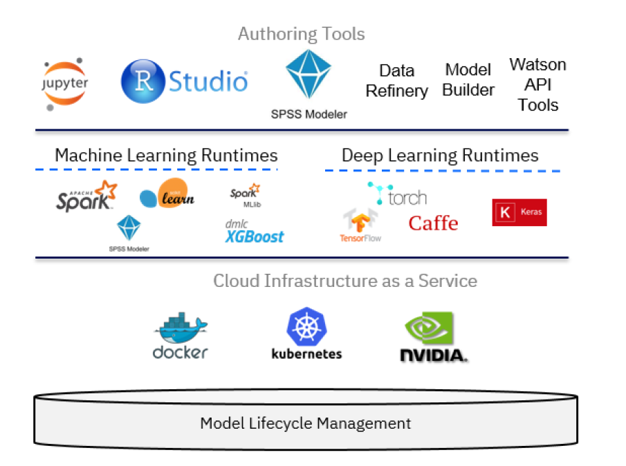

## Introduction

The IBM&reg; Watson&trade; Studio learning path demonstrates various ways of using IBM Watson Studio to predict customer churn. It ranges from a semi-automated approach using the AutoAI Experiment tool to a diagrammatic approach using SPSS Modeler Flows to a fully programmed style using Jupyter notebooks for Python.

All of the tutorials within this learning path follow the main steps of methods for data science (and data mining), such as Cross Industry Standard Process for Data Mining (CRISP-DM) and the IBM Data Science Methodology. The tutorials focus on tasks for data understanding, data preparation, modeling, evaluation, and deployment of a machine learning model for predictive analytics. They use as a basis a data set and notebook for customer churn available on <a href="https://www.kaggle.com/sandipdatta/customer-churn-analysis" target="_blank" rel="noopener noreferrer">Kaggle</a>, and then demonstrate alternative ways of solving the same problem by using AutoAI, the SPSS Modeler, and the IBM Watson Machine Learning service provided by the IBM Watson Studio suite of tools. The learning path explains the use of the profiling tool and the dashboards of IBM Watson Studio to support data understanding, as well as the Refine tool to solve straightforward data preparation and transformation tasks.

## Data Science Methodology

IBM has defined a [lightweight IBM Cloud Garage Method](/articles/the-lightweight-ibm-cloud-garage-method-for-data-science/) that includes a process model to map individual technology components to the reference architecture. This method does not include any requirement engineering or design thinking tasks. Because it can be hard to initially define the architecture of a project, this method supports architectural changes during the process model.

Each stage plays a vital role in the context of the overall methodology. At a certain level of abstraction, it can be seen as a refinement of the workflow outlined by the <a href="https://www.the-modeling-agency.com/crisp-dm.pdf" target="_blank" rel="noopener noreferrer">CRISP-DM</a> method for data mining.

According to both methodologies, every project starts with _Business understanding_, where the problem and objectives are defined. This is followed in the IBM Data Science Method by the _Analytical approach_ phase, where the data scientist can define the approach to solving the problem. The IBM Data Science Method then continues with three phases called _Data requirements_, _Data collection_, and _Data understanding_, which in CRISP-DM are presented by a single _Data understanding_ phase.

After the data scientist has an understanding of the data and has sufficient data to get started, they move to the _Data preparation_ phase. This phase is usually very time consuming. A data scientist spends about 80% of their time in this phase, performing tasks such as data cleansing and feature engineering. The term "data wrangling" is often used in this context. During and after cleansing the data, the data scientist generally performs exploration, such as descriptive statistics to get an overall feel for the data, and clustering to look at the relationships and latent structure of the data. This process is often iterated several times until the data scientist is satisfied with their data set.

The model training stage is where machine learning is used in building a predictive model. The model is trained and then evaluated by statistical measures such as prediction accuracy, sensitivity, and specificity. After the model is deemed sufficient, it is deployed and used for scoring on unseen data. The IBM Data Science Methodology adds an additional _Feedback_ stage for obtaining feedback from using the model, which is then used to improve the model. Both methods are highly iterative by nature.

In this learning path, we will focus on the phases starting with data understanding, and then continue on to preparing the data, building a model, evaluating the model, and then deploying and testing the model. The purpose is to develop models to predict customer churn. Aspects related to analyzing the causes of these churns to improve the business is out of the scope of this learning path. This means that we will be working with various kinds of classification models that can, given an observation of a customer defined by a set of features, give a prediction as to whether this specific client is at risk of churning.

## IBM Watson Studio

For all of the tasks we use <a href="https://dataplatform.cloud.ibm.com/docs/content/getting-started/welcome-main.html?cm_sp=ibmdev-_-developer-articles-_-cloudreg" target="_blank" rel="noopener noreferrer">IBM Watson Studio</a>. It give you the **environment** and **tools** to solve business problems by collaboratively working with data. You can choose the tools needed to analyze and visualize data; to cleanse and shape the data; to ingest streaming data; or to create, train, and deploy machine learning models.

With IBM Watson Studio, you can:

* Create <a href="https://dataplatform.cloud.ibm.com/docs/content/wsj/manage-data/manage-projects.html?audience=wdp&cm_sp=ibmdev-_-developer-articles-_-cloudreg" target="_blank" rel="noopener noreferrer">projects</a> to organize the resources (such as data connections, data assets, collaborators, and notebooks) to achieve an analytics goal.

* Access data from <a href="https://dataplatform.cloud.ibm.com/docs/content/wsj/getting-started/assets.html#connection?cm_sp=ibmdev-_-developer-articles-_-cloudreg" target="_blank" rel="noopener noreferrer">connections</a> to your cloud or on-premises data sources.

* <a href="https://dataplatform.cloud.ibm.com/docs/content/wsj/manage-data/add-data-project.html?cm_sp=ibmdev-_-developer-articles-_-cloudreg" target="_blank" rel="noopener noreferrer">Upload files</a> to the project’s object storage.

* Create and maintain <a href="https://dataplatform.cloud.ibm.com/docs/content/wsj/catalog/manage-catalog.html?cm_sp=ibmdev-_-developer-articles-_-cloudreg" target="_blank" rel="noopener noreferrer">data catalogs</a> to discover, index, and share data.

* <a href="https://dataplatform.cloud.ibm.com/docs/content/wsj/refinery/refining_data.html?cm_sp=ibmdev-_-developer-articles-_-cloudreg" target="_blank" rel="noopener noreferrer">Refine data</a> by cleansing and shaping the data to prepare it for analysis.

* Perform <a href="https://dataplatform.cloud.ibm.com/docs/content/wsj/analyze-data/data-science.html?cm_sp=ibmdev-_-developer-articles-_-cloudreg" target="_blank" rel="noopener noreferrer">data science</a> tasks by creating Jupyter Notebooks for Python or Scala to run code that processes data and then view the results inline. Alternavitely, you can use RStudio for R.

* Ingest and <a href="https://dataplatform.cloud.ibm.com/docs/content/wsj/streaming-pipelines/overview-streaming-pipelines.html?cm_sp=ibmdev-_-developer-articles-_-cloudreg" target="_blank" rel="noopener noreferrer">analyze streams</a> data with the Streams Designer tool.

* Create, test, and deploy <a href="https://dataplatform.cloud.ibm.com/docs/content/wsj/analyze-data/ml-overview.html?cm_sp=ibmdev-_-developer-articles-_-cloudreg" target="_blank" rel="noopener noreferrer">machine learning</a> and **deep learning** models.

* <a href="https://dataplatform.cloud.ibm.com/docs/content/wsj/analyze-data/visual-recognition-overview.html?cm_sp=ibmdev-_-developer-articles-_-cloudreg" target="_blank" rel="noopener noreferrer">Classify images</a> by training deep learning models to recognize image content.

* Create and share <a href="https://dataplatform.cloud.ibm.com/docs/content/wsj/getting-started/assets.html#dashboard?cm_sp=ibmdev-_-developer-articles-_-cloudreg" target="_blank" rel="noopener noreferrer">dashboards</a> of data visualizations without coding.

Technically, IBM Watson Studio is based on a variety of open source technology and IBM products as shown in the following figure.

In the context of data science, IBM Watson Studio can be viewed as an integrated, multi-role collaboration platform that supports the developer, data engineer, business analyst, and the data scientist in the process of solving a data science problem. For the developer role, other components of the IBM Cloud platform might be relevant as well in building applications that use machine learning services. However, the data scientist can build machine learning models using a variety of tools, ranging from:

* <a href="https://dataplatform.cloud.ibm.com/docs/content/wsj/analyze-data/autoai-overview.html?audience=wdp&context=wdp&cm_sp=ibmdev-_-developer-articles-_-cloudreg" target="_blank" rel="noopener noreferrer">AutoAI Model Builder</a>: A graphical tool requiring no programming skills
* <a href="https://dataplatform.cloud.ibm.com/docs/content/wsd/spss-modeler.html?cm_sp=ibmdev-_-developer-articles-_-cloudreg" target="_blank" rel="noopener noreferrer">SPSS Modeler Flows</a>: Adopts a diagrammatic style
* <a href="https://dataplatform.cloud.ibm.com/docs/content/wsj/analyze-data/rstudio-overview.html?cm_sp=ibmdev-_-developer-articles-_-cloudreg" target="_blank" rel="noopener noreferrer">RStudio</a> and <a href="https://dataplatform.cloud.ibm.com/docs/content/wsj/analyze-data/notebooks-parent.html?linkInPage=true&cm_sp=ibmdev-_-developer-articles-_-cloudreg" target="_blank" rel="noopener noreferrer">Jupyter Notebooks</a>: Using a programmatic style

Beyond these three main components, you will also use:

* <a href="https://www.ibm.com/cloud/object-storage" target="_blank" rel="noopener noreferrer">IBM Cloud Object Storage</a> to store the data set used to train and test the model
* <a href="https://dataplatform.cloud.ibm.com/docs/content/wsj/refinery/refining_data.html?cm_sp=ibmdev-_-developer-articles-_-cloudreg" target="_blank" rel="noopener noreferrer">Data Refinery</a> to transform the data set
* <a href="https://www.ibm.com/support/knowledgecenter/en/SSEP7J_11.1.0/com.ibm.swg.ba.cognos.ug_ca_dshb.doc/ca_waca_tut_overview_for_docs.html" target="_blank" rel="noopener noreferrer">Cognos Dashboards</a> to generate visualizations

For additional background, take a look at an <a href="https://dataplatform.cloud.ibm.com/docs/content/wsj/getting-started/videos.html?cm_sp=ibmdev-_-developer-articles-_-cloudreg" target="_blank" rel="noopener noreferrer">extensive list of "how-to" videos</a> that are available for IBM Watson Studio.

## IBM Watson Machine Learning service

A key component of IBM Watson Studio is the IBM Watson Machine Learning service and its set of REST APIs that can be called from any programming language to interact with a machine learning model. The focus of the IBM Watson Machine Learning service is deployment, but you can use IBM SPSS Modeler or IBM Watson Studio to author and work with models and pipelines. Both SPSS Modeler and IBM Watson Studio use Spark MLlib and Python scikit-learn and offer various modeling methods that are taken from machine learning, artificial intelligence, and statistics.

Use the following links to get more detailed information on Watson Machine Learning:

* <a href="https://dataplatform.cloud.ibm.com/docs/content/wsj/analyze-data/ml-overview.html?cm_sp=ibmdev-_-developer-articles-_-cloudreg" target="_blank" rel="noopener noreferrer">Watson Machine Learning overview</a>
* <a href="https://cloud.ibm.com/apidocs/machine-learning?cm_sp=ibmdev-_-developer-articles-_-cloudreg" target="_blank" rel="noopener noreferrer">Watson Machine Learning API</a>

## Summary

This article provided background information on the IBM Data Science Methodology, what role IBM Watson Studio can play, and a preview of what will be covered in this learning path.

One objective of this learning path is to show how IBM Watson Studio offers, in addition to Jupyter Notebooks for Python, Scala, or R, alternative ways of going through a similar process that might be faster and can be achieved without programming skills. In essence, these mechanisms are SPSS Modeler Flow, which allows a data scientist to create a model purely graphically by defining a flow, and the IBM AutoAI graphical tool inside IBM Watson Studio, which goes one step beyond SPSS by providing a semi-automatic approach to creation, evaluation, deployment, and testing of a machine learning model. At the same time, the learning path shows how IBM Watson Studio provides capabilities out of the box for profiling, visualizing, and transforming the data, again without any programming required.