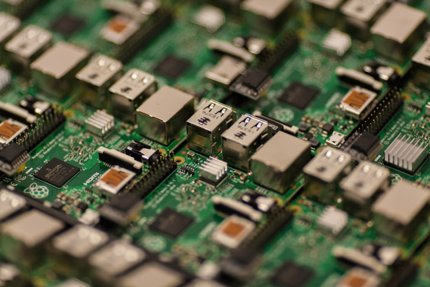

---
also_found_in:
- learningpaths/iot-getting-started-iot-development/
authors: ''
completed_date: '2017-05-05'
draft: false
duration: 1 hour
excerpt: IoTプロジェクトにおいて、いつ、どこで、なぜ、開発者がある種類のハードウェアデバイスやセンサーを別のものと比較して選択するのかを学びます。
ignore_prod: false
last_updated: '2020-01-30'
meta_description: この記事では、マイクロコントローラ（例えばArduino）、シングルボードコンピュータ（例えばRaspberry Pi）、組み込みデバイスなど、IoTに一般的に採用されているさまざまなタイプのハードウェアの概要を説明しています。この記事では、IoTの観点から、必要なセキュリティ機能やファームウェアの機能の概要を含め、ハードウェアのハイレベルな構成要素と主要な特性について説明しています。また、IoTプロジェクトにおいて、いつ、どこで、なぜ、開発者がある種類のハードウェアを別の種類のハードウェアと比較して選択するのかについての指針や、さまざまな業界での使用例も紹介しています。
meta_keywords: IoT, devices, sensors
primary_tag: iot
related_content:
- slug: iot-getting-started-iot-development
  type: learningpaths
- slug: iot-next-steps-iot-development
  type: learningpaths
subtitle: このハードウェアガイドは、IoTプロジェクトのプロトタイピングや開発時に使用するハードウェアを決定するのに役立ちます。
title: 次のIoTプロジェクトに最適なハードウェアの選択
---

<!-- <サイドバー> <見出し>ラーニングパス。Getting started with IoT development</heading> 
この記事は、IoT開発者のためのクイックスタートガイドである「IoT 101」ラーニングパスの一部です。
 <ul> <li> [IoTのコンセプトとスキル](/articles/iot-key-concepts-skills-get-started-iot)</li> <li>IoTハードウェアガイド（本記事）</li> <li> [IoTネットワークガイド](/articles/iot-lp101-connectivity-network-protocols/)</li> <li> [IoTプラットフォーム](/articles/iot-lp101-why-use-iot-platform/)</li> <li> [Tutorial:Build a smart doorbell](/tutorials/iot-lp101-get-started-develop-iot-home-automation/)</li></ul></sidebar> -->

接続されたデバイスはIoTの中心です。デバイスはデータを収集し、パラメータを監視します。産業機器、建物、自動車から、動物、貨物輸送、パイプライン、人間まで、あらゆるものに搭載されています。

ハードウェアとソフトウェアのコンポーネントは、IoTアプリケーションのために、仕様開発、コンセプトデザイン、プロトタイプ、テスト、そして最終的にはネットワークに統合されたハードウェアとソフトウェアのロールアウトという、標準的な設計プロトコルによって設計されます。  ArduinoやRaspberry Piなどのプラットフォームは、設計を迅速化し、カスタマイズを必要としないラピッドプロトタイピングを可能にするため、IoT構成の実現に必要な時間を短縮することができます。

設計では、性能要件、その要件を達成するために必要なハードウェアとソフトウェアを特定した上で、動作環境とその中で使用されるアプリケーションを十分に考慮した上で、市販のCOTS（Commercial Off-the-Shelf）またはカスタマイズされた設計によるコンポーネントの仕様を決定する必要があります。

IoTの文脈では、デバイスとは、情報を取得し、それを送信するものを指します。例えば、パイプラインに設置された圧力センサー、冷蔵車両に設置された温度センサー、散布された牛の皮下に挿入された小さなチップなどは、すべてデバイスです。デバイスは単独で動作することもあれば、他のデバイスと同期して動作することもあります。

この記事では、次のIoTプロジェクトを開発するために、いくつかの既製のハードウェアの選択肢と、それらを選択する際に考慮すべき要素を紹介します。

## IoTデバイスの特徴

IoTのランドスケープが発展するにつれ、新しいデバイスやプラットフォームが登場します。  新しいIoTネットワークを構成したり、既存のネットワークを開発・拡張したりするために、ハードウェアやソフトウェアを選択する際に比較の基準となる、IoTデバイスに共通する重要な特性があります。

IoTデバイスは、機能によって特徴づけられることがあります。  

* データの取得と制御
* データの処理と保存
* 接続性
* パワーマネジメント

### データ収集と制御

_Data Acquisition_ ([DAQ](https://en.wikipedia.org/wiki/Data_acquisition))は、一定の時間間隔(データサンプルレート)でアナログ情報を収集し、デジタル信号としてリモート出力デバイスに送信してデジタル情報を読み取る機能です。DAQには、シグナルコンディショニング（生のセンサー読み取り値の操作とスケーリング）や、アナログセンサー読み取り値をデジタル値に変換して処理・分析するアナログ・デジタル変換器などが含まれます。

センサーとは、物理的な変数を測定し、それを電気信号（電圧）に変換する部品です。センサーは、温度、湿度、圧力、煙、ガス、光、音、振動、気流、水流、速度、加速度、近接、GPS位置、高度など、さまざまな変数を測定するために、市販されており、仕様もさまざまです。

センサーの機能はさまざまで、さまざまな状態を測定することができます。例えば、プロポセプティブセンサーは、デバイスの内部状態を監視します。また、押しボタン、スライド式操作部、タッチスクリーンなどのセンサーは、機器との直接対話（Human-Machine Interface）に使用されることがあります。

センサーの種類ごとに多くのオプションがあります。メーカーとそのセンサー製品の仕様は様々である。センサーの精度、正確さ、必要な動作条件は、カタログやメーカーによって異なる場合があります。センサーは、エンジン内、水中、人間や動物に埋め込まれた状態、さらには宇宙で使用されることもあります。環境によって必要とされるセンサーの特性は異なり、それに応じて用途別に設計されています。

センサー部品の重要な特性に「分解能」があります。センサーの分解能とは、そのセンサーが確実に読み取ることのできる最小の変化量のことで、センサーの生の読み取り値を表す数値の大きさと関係している。例えば、10ビットの分解能を持つアナログ温度センサーでは、0〜1023の数値を使って温度の読み取りを表現する。ビットは2進法なので、10ビットでは10の2乗、つまり1024通りの値が得られることになります。しかし、実際には、センサーは電気的なノイズの影響を受け、実際の分解能は低下します。

センサーが温度などの物理的変数を電気信号に変換するのに対し、出力デバイスはその逆で、電気信号を物理的な結果に変換します。出力デバイスには、LED、スピーカー、スクリーンなどがあります。  そのためには、モーターやリレー、ソレノイドなど、物理的に何かを作動させる「アクチュエーター」が必要になる場合があります。アクチュエーターは、産業用IoTアプリケーションでは一般的です。  例えば、製造業では、組み立て工程で製品を動かしたり握ったりするために、空気圧式のリニアアクチュエータが広く採用されています。スクールバスの車軸に搭載されたアクチュエータは、不利な動きを検出したときにブレーキを作動させることがあります。また、農産物を入れた冷蔵コンテナの中で、温度が一定の許容できないレベルまで上昇すると、アラームが作動することがあります。

### データの処理と保存

IoTデバイスには、特定のデータ処理・保存機能が必要です。これにより、データの集約、送信、分析を実現することができます。IoTデバイスには、データを直接処理するものもあれば、このデータを他のデバイス、ゲートウェイデバイス、またはクラウドアプリケーションに送信して、さらに集計や分析を行うものもあります。

エッジアナリティクスは、データ分析を集中的に行うのではなく、ネットワークのエッジで行う。大量のデータを上流のクラウドサーバーやデータセンターに転送して解析するのではなく、デバイス自体でリアルタイムに解析したり、IoTデバイスに接続された近くのゲートウェイデバイス（ルーターなど）で解析したりすることができます。エッジでのデータ処理は、収集されたデータの集約とフィルタリングを行い、最も重要なデータのみをアップストリームに送信します。エッジアナリティクスは、アップストリームの処理やストレージの要件を減らし、ネットワークの負荷を軽減します。

IoTアプリケーションが使用する処理能力とストレージは、データを消費するサービスやアプリが必要とする処理に依存します。利用可能なメモリーとプロセッサーの仕様、クロックスピード、コア数など、これらすべてがデータ処理のデバイスレートを決定します。不揮発性フラッシュの容量は、データをアップストリームに送信するまで保存するために使用され、デバイスに保存できるデータの量を決定します。エッジアナリティクスを実行するデバイスは、測定値の検証、正規化、スケーリング、変換などの基本的なデータ処理のみを行うデバイスよりも、大幅に多くの処理能力を必要とします。

### 接続性

ネットワーク接続性は、IoTデバイスの特徴です。デバイスは、ローカルで他のデバイスと通信します。デバイスはローカルで他のデバイスと通信し、クラウドベースのサービスを介してデータを公開します。デバイスによっては、802.11 (Wi-Fi)、Bluetooth、RFID、セルラーネットワーク、またはLoRa、SigFox、NB-IoTなどのLPWAN (Low Power Wide Area Network)技術を使用して、ワイヤレスで通信します。有線通信は、据え置き型の機器に適しています。このようなデバイスは、例えばスマートビルディング、ホームオートメーション、産業用制御アプリケーションなどに設置され、イーサネットで接続されたり、イーサネットオーバーパワーで後付けされたりします。シリアル通信は、デバイス間の有線接続の形態であり、_Universal Asynchronous Receiver Transmitter_ (UART)や、自動車産業を起源とする_Controller Area Network_ (CAN)などの標準プロトコルを使用します。

## パワーマネジメント

電源管理は、バッテリーや太陽電池（ソーラー）などのワイヤレス電源に依存するポータブルやウェアラブルのIoTデバイスにとって重要な要素です。使用パターンや、取り付けられたセンサー、アクチュエーター、集積回路（IC）の電力要件に応じて、デバイスを定期的にスリープモードや低電力モードにして、電力を節約することができます。

例えば、Raspberry Pi 4のようなシングルボードコンピュータは、一般的な使用方法で動作するために約700〜1000mAの電流を必要とします。無線LANネットワークで常にデータを送信していたり、負荷の高いデバイスが多くのデータ処理を行っていたりすると、電力使用量は高くなりますが、その後、デバイスがアイドル状態になると低下します。カメラモジュールを接続した場合、カメラ使用時には必要なアンペア数が約250mA増加します。また、センサーは通常、動作させるために電力を必要とします。Raspberry PiのGPIOピンは、3.3Vまたは5Vを供給し、すべてのピンで合計50mAの電流まで供給されます。ピンに取り付ける部品の数が増えれば増えるほど、デバイスの消費電力は大きくなります。

## IoTプロジェクトをプロトタイピングするための既製ハードウェアの種類

IoTアプリケーションの開発は、低コストで市販されている既製のハードウェア開発ボード、プラットフォーム、プロトタイピングキットが増えてきたことで、より身近なものになっています。モジュール式のハードウェア設計は、非常に柔軟性に富んでいます。コンポーネントの選択肢が増えることで、設計者は仕様の異なる新しいセンサーを代用することができます。また、ネットワーク、データ処理、ストレージなどのモジュールを独自にアップグレードすることで、要件の変化に対応することができます。

マイクロコントローラーやシングルボードコンピューターなど、市販のハードウェアデバイスの多くは、SoC（System-on-a-Chip）集積回路を中心に設計されています。SoCは、データ処理、ストレージ、ネットワークなどの機能を1つのチップにまとめたものです。このような構成は、利便性のために柔軟性を犠牲にすることになりますが、幸いなことに、膨大な数のコモディティ機器があり、さまざまな構成を選択することができます。例えば、表1には、IoTプロジェクトのプロトタイピングに使用できるマイクロコントローラーの技術仕様と、人気の高い3種類のシングルボードコンピューター（SBC）の比較を示しています。

### マイコン開発ボード

マイクロコントローラー_は、データ処理とストレージ機能を提供するSoCです。マイクロコントローラには、プロセッサコア、メモリ（RAM）、およびマイクロコントローラ上で動作するカスタムプログラムを格納するEPROM（erasable programmable read-only memory）が含まれます。マイクロコントローラー開発ボードは、マイクロコントローラーをサポートする追加回路を備えたPCBで、チップを使った試作やプログラム作成をより便利にします。

センサーやアクチュエーターは、デジタルまたはアナログの_General Purpose Input/Output_(GPIO)ピン、またはハードウェアバスを介してマイクロコントローラーに接続します。バスで接続されたコンポーネントとのデバイス内通信には、[I2C](https://en.wikipedia.org/wiki/I%C2%B2C)や[SPI](https://en.wikipedia.org/wiki/Serial_Peripheral_Interface_Bus)などの標準的な通信プロトコルが使用されます。標準規格を採用することで、バスで接続される部品の追加や交換が容易になります。

Arduino ([http://arduino.cc/en/Main/](http://arduino.cc/en/Main/))は、オープンソースのデバイスプラットフォームで、互換性のある開発ボードやツールを作成するコミュニティが活発に活動しています。デバイスの機能は、Arduinoの公式モデル([https://www.arduino.cc/en/Products/Compare](https://www.arduino.cc/en/Products/Compare))によって異なり、また、何十ものサードパーティ製互換ボードによっても異なります。ここに掲載されているデバイスはすべてArduino互換のマイクロコントローラーで、どこにでもあるArduino Unoや、携帯電話モデムを内蔵したParticle社のElectron、Espressif Systems社の([https://espressif.com/en/products/hardware/esp8266ex/overview](https://espressif.com/en/products/hardware/esp8266ex/overview))などがあります。ESP8266-01は、無線LANを内蔵した低価格・低消費電力のマイクロコントローラです。

 <figure> <heading>Arduinoマイクロコントローラ開発ボード</heading> </img></figure>

ESP8266は、Arduinoと同様、活発なコミュニティが存在します。ESP8266をベースにした開発ボードとしては、[NodeMCU](http://www.nodemcu.com/index_en.html)、[WeMos D1](https://docs.wemos.cc/en/latest/d1/index.html)、AdaFruit社のFeather Huzzah([https://learn.adafruit.com/adafruit-feather-huzzah-esp8266/overview](https://learn.adafruit.com/adafruit-feather-huzzah-esp8266/overview))などが有名である。ESP8266を搭載したボード用の代替ファームウェアが、オープンソースやメーカーのコミュニティによって多数開発されており、IoT開発者がLua、Python、JavaScriptを使ってこれらのボード用にプログラミングしたり、OTA（Over-the-Air）アップデートをサポートしたりできるようになっている。

 <table-complex border="0" cellpadding="0" cellspacing="0" class="ibm-data-table" summary="Arduino Uno, Particle Electron, and Espressif Systems ESP8266-01 microcontrollersの技術仕様"> <heading refname="table-microcontrollers">Arduino Uno, Particle Electron,およびEspressif Systems ESP8266-01マイクロコントローラの技術仕様</heading> <thead> <tr> <th> 特徴 </th> <th> 機能 </th> <th> Arduino Uno </th> <th> Particle Electron </th> <th> Espressif Systems ESP8266-01 </th01 </th></tr></thead> <tbody> <tr> <td colspan="5"> <strong> <em>データ収集と制御</em></strong></td></tr> <tr> <td></td> <td> <strong>GPIOピン</strong></td> <td> 6アナログin   14デジタル-。6 PWM </td> <td> 12 アナログ・イン   2 アナログ・アウト   30 デジタル - 13 PWM   </td> <td> 2 デジタル   1 アナログ </td></tr> <tr> <td> </td> <td> <strong>ロジック・レベルの電圧</strong></td> <td> 5V </td> <td> 3.3V </td> <td> 3.3V </td></tr> <tr> <td colspan="5"> <strong> <em>データ処理およびストレージ</em></strong></td></tr> <tr> <td></td> <td> <strong>プロセッサ</strong></td> <td> ATMega328P </td> <td> 32bit STM32F205   ARM Cortex M3 </td> <td> 32-bit Tensilica L106 </td></tr> <tr> <td></td> <td> <strong>プロセッサの速度</strong></td> <td> 16 KHz </td> <td> 120 MHz </td> <td> 80 MHz </td></tr> <tr> <td></td> <td> <strong>メモリ</strong></td> <td> 32 kBフラッシュ。  1 kB EEPROM </td> <td> 1 Mb flash,   128 kB RAM </td> <td> 1 Mb </td></tr> <tr> <td colspan="5"> <strong> <em>Connectivity</em></strong></td></tr> <tr> <td></td> <td> <strong>Network Interfaces</strong></td> <td>デフォルトではありません。シールドで追加することができます。</td> </tr> <td> </td> </td> </td> </td> </td> </td> </td> </tr> <tr> <td colspan="5"> <strong> <em>電源</em></td> </tr> <tr> <td></td> <td> <strong>推奨電源</strong></td> <td> 9-12V DC 0.5 - 2A バレル、または 5V 500mA USB、または 9 - 12V on VIN pin </td> <td> 5V micro USB または 3.9V-12VDC on VIN pin </td> <td> レギュレートされた 3.</td> </tr> <tr> <td colspan="5"> <strong> <em>Other</em></strong></td> </tr> <tr> <td></td> <td> <strong>Dimensions</strong></td> <td> 2.7 in X 2.1 in </td> <td> 2.05 in x 0.8 in </td> <td> 1.4 in x 1 in </td></tr> <tr> <td></td> <td> <strong>典型的なコスト</strong></td> <td> $20 </td> <td> $39 - $59 </td> <td> $10 </td></tbody></table-complex>

Arduino互換のマイクロコントローラーで動作するソフトウェアを開発するには、CまたはC++とArduino IDEを使用するのが標準的な方法ですが、コミュニティが開発した言語バインディングやビジュアルプログラミングツールも存在します。ピン配置が共通しているArduino互換ボードは、サードパーティ製のオプションのシールドを使用することで、例えば、Arduino UnoにイーサネットポートやBluetoothを追加するなどの拡張が可能です。ホビー用マイコンの開発環境としては、Arduinoが最も広く採用されているが、Tessel（[https://tessel.io/](https://tessel.io/)）やParticle.io（[http://particle.io](http://particle.io)）のようにJavaScriptをネイティブにサポートしているものや、MicroPythonのPyBoard（[http://micropython.org](http://micropython.org)）やWeIO（[http://we-io.net/hardware/](http://we-io.net/hardware/)）のようにPythonをサポートしているボードもある。

Arduino互換のマイコンを選択すると、クロスプラットフォームのArduinoライブラリやArduino IDEを使って開発したプログラムを、他のArduino互換デバイスに移植しやすくなります。微妙な違いを克服していくことは、やはり必要です。

例えば、Arduino UnoではデジタルI/Oピンは5Vロジック（0VはLOWまたはOFF、5VはHIGHまたはON）ですが、ESP8266やParticleボードでは3.3Vロジック（HIGHは3.3V）です。このため、センサーやアクチュエーターなどの部品は、どちらか一方にしか対応していないものもあり、部品の選択に影響を与えます。5V用に設計されたセンサーを3.3V用に交換すると、予想外の結果になったり、高電圧に耐えられないピンが損傷したりする可能性があるため、ロジックレベルの変換器を追加する必要があるのです。ディープスリープモードの有効化や、特定のプロトコルを使用して接続されたセンサーから情報を読み取るなど、低レベルのハードウェア機能を実装する場合は、デバイスやコンポーネント固有のライブラリを使用する必要があり、コードの移植性が損なわれる可能性があります。

### シングルボードコンピュータ

シングルボードコンピュータ(SBC)は、マイクロコントローラの上位機種です。キーボードやマウス、スクリーンなどの周辺機器を取り付けることができ、メモリや処理能力も高くなっています（例えば、1.2GHzの32ビットARMマイクロプロセッサと、8ビット16KHzのマイクロコントローラの比較）。

表2は、Raspberry Pi 4 ([https://www.raspberrypi.org/](https://www.raspberrypi.org/))、BeagleBone Black ([http://beagleboard.org/black](http://beagleboard.org/black))、DragonBoard 410c ([https://developer.qualcomm.com/hardware/dragonboard-410c](https://developer.qualcomm.com/hardware/dragonboard-410c))の3つのSBCの技術仕様です。

 <figure> <heading>Raspberry Piシングルボードコンピュータ</heading> </img></figure>

マイクロコントローラとシングルボードコンピュータの区別は、やや恣意的です。Onion Omega 2 ([https://docs.onion.io/omega2-docs/omega2.html#omega2](https://docs.onion.io/omega2-docs/omega2.html#omega2))のように、ローエンドSBCとほぼ同等のオンボードメモリと処理能力を持つ、その中間に位置するデバイスもあります。また、UDOO Quad ([http://www.udoo.org/docs/Introduction/Introduction.html](http://www.udoo.org/docs/Introduction/Introduction.html))のように、ARMベースのLinuxシステムとArduino互換のマイクロコントローラを統合したハイブリッドデバイスも多数あります。

 <table-complex border="0" cellpadding="0" cellspacing="0" class="ibm-data-table" summary="Raspberry Pi 4, BeagleBone Black, and DragonBoard SBCsの技術仕様"> <heading refname="table-sbcs">Raspberry Pi 4の技術仕様。BeagleBone BlackおよびDragonBoard SBCの技術仕様</heading> <thead> <tr> <th> 特徴 </th> <th> 機能 </th> <th> Raspberry Pi 4 </th> <th> BeagleBone Black </th> <th> Qualcomm DragonBoard410c </th></tr></thead> <tbody> <tr> <td colspan="5"> <strong> <em>データ収集と制御</em></strong></td> </tr> <tr> <td valign="0"> <strong>GPIOピン</strong></td> <td valign="0"> 40のI/Oピン。含む 29 デジタル </td> <td> 65 デジタル - 8 PWM   7 アナログ入力 </td> <td> 12 デジタル </td> </tr> <tr> <td></td> <td> <strong>ロジックレベルの電圧</strong></td> <td> 3.3V </td> <td> 5V </td> <td> 1.8V </td></tr> <tr> <td colspan="5"> <strong> <em>データ処理およびストレージ</em></td></tr> <tr> <td></td> <td> <strong>プロセッサ</strong></td><td> ARM Cortex A72 </td> <td> AM335X ARM Cortex A8 </td> <td> ARM Cortex A53 </td> </tr> <tr> <td></td> <td> <strong>プロセッサの速度</strong></td> <td> 1.5GHz </td> <td>1GHz </td> <td>1.2GHz </td></tr> <tr> <td> <strong>メモリ</strong></td> <td>1～4Gb </td> <td>512Mb RAM, 4Gb Flash </td> <td>1Gb,8Gb Flash </td></tr> <tr> <td colspan="5"> <strong> <em>Connectivity</em></strong></td></tr> <tr> <td></td> <td> <strong>Network Interfaces</strong></td> <td>Wifi, Ethernet,</td> </tr> <td>イーサネット、 USBポートは外部のWifi / Bluetoothアダプタを使用可能</td> <td>Wifi, Bluetooth, GPS </td></tr> <tr> <td colspan="5"> <strong> <em>電源</em></strong></td></tr> <tr> <td> </td> <strong>推奨電源</strong></td> <td>5V 3A USB Type C </td> <td>5V 1.2A - 2Aバレル </td> <td> 6.5 - 18V 2Aバレル </td></tr> <tr> <td colspan="5"> <strong> <em>その他</em></strong></td></tr> <tr> <td></td> <td> <strong>寸法</strong></td> <td> 3.5 x 2.3インチ</td> <td> 3.4 x 2.1インチ</td> <td> 3.3 x 2.1インチ</td> </tr> <tr> <td> </td> <td> <strong>一般的なコスト</strong></td> <td> 35ドル</td> <td> 55ドル</td> <td> 75ドル</td> </tr> </tbody></table-complex>。

マイクロコントローラーと同様に、SBCのデバイス機能は、Raspberry Piでは_hats_、BeagleBone Blackでは_capes_と呼ばれるスタッキング可能な拡張ボードを追加することで拡張することができます。また、内蔵されたデバイス機能の制限を緩和するために、モーターコントローラーやアナログ・デジタル・コンバーターなどの外部モジュールを追加することができます。

多くのSBCデバイスは、ミニPCのようなもので、Linuxディストリビューションを中心とした組み込みOSを搭載しています。そのため、センサーやアクチュエーターに対応した組込みアプリケーションを開発するための開発ツールや言語の選択肢が、マイコンボードに比べて多くあります。しかし、SBCはセットアップが複雑で、サイズが大きく、電力消費量も多く、アプリケーションが保存されているSDカードやフラッシュメモリーが破損するなどの問題が発生しやすい。

### マイコン開発ボードとシングルボードコンピュータの選び方

既製のマイコン開発ボードやシングルボードコンピュータは、IoTソリューションの一部にしかならないかもしれませんが、IoTソリューションの開発をブートストラップで行うには最適です。

まずは、IoTデバイスの主な特性をアプリケーションの要件に照らし合わせて検討し、以下の設計上の決定事項に沿って作業を進めることが一つの方法です。

* 必要な周辺センサーや出力部品の種類と数を決定し、必要に応じてこれらの部品の設計回路を決定する。
* 周辺機器の読み取りや制御を行うマイクロコントローラやシングルボードデバイスの選択
* デバイス内の通信に使用するデータ通信プロトコルを決定します（例えば、マイクロコントローラーと接続されたセンサー間の通信にはI2Cを使用します）。
* クラウドサービスやアプリとの通信に必要なネットワークハードウェアとプロトコルの選択

例えば、予算内でホームオートメーションシステムを構築する場合、Raspberry Pi Zero Wを選択することができます。Raspberry Pi Zero Wは、小型で非常に低価格なSBCデバイスで、十分な処理能力とメモリ（1GHz ARM6プロセッサと512MB RAM）を備えており、デバイス上でデータ処理や分析を行うことができます。プログラムやデータを保存するために、最大64GBまでのmicroSDカードフラッシュメモリの拡張に対応しています。また、Raspberry Pi 4と同様に40ピンのGPIOフルヘッダーを搭載しており、複数のセンサーを接続でき、SPIとI2Cの両方のプロトコルに対応しています。また、ホームネットワークに接続するための無線LANを搭載しており、ポータブルパワーパックや壁電源からマイクロUSBで電源を供給することができます。

IoTランドスケープの設計をさらに進める際には、一度立ち止まって、予想される性能と設計意図を比較してみてください。デバイスの設計とプロトタイプ、組み込みソフトウェアの選択、上流のサービスやアプリの選択を実施しますが、その後、評価するために立ち止まります。性能、信頼性、セキュリティなどの機能要件および非機能要件に対してプロトタイプを定期的に評価し、必要に応じてこれらの選択を見直すことができます。

## IoTプロジェクトを展開するためのIoTハードウェア要件

IoTデバイスは非常に特殊です。非常に特殊な環境下で動作するように設計されています。IoTプロジェクトのハードウェアは多岐にわたります。一般的な既製のハードウェアでプロトタイプを作成することもありますが、最終的には、IoTソリューションの要件に合わせたカスタムPCBやコンポーネントの設計・開発に移行することができます。その際には、以下のようなハードウェアの要件を検討する必要があります。

* セキュリティ要件
* 開発のしやすさ
* データの取得、処理、保存に関する要件
* 接続性の要件
* 電力要件
* 物理的デバイス設計
* コスト要件

### セキュリティ要件

IoTにおいてセキュリティは重要な要素です。設計・開発のすべての段階で考慮することが必要です。あらゆるデバイスで取得されるデータの整合性とセキュリティは、たとえ試作中であっても損なわれてはなりません。セキュリティ要件は、IoTデバイス自体、ネットワーク、クラウド、モバイル、Webサービスなどのアプリケーションに適用されます。

関連するセキュリティ要件は以下の通りです。

* 各デバイスが、データやメッセージを送受信する速度で暗号化および復号化できるだけの十分な処理能力とメモリを備えていること。
* 上流のサービスやアプリケーションとの認証に使用される承認およびアクセス制御メカニズムを、組み込みソフトウェア開発ライブラリがサポートしていること。
* なりすましを防ぐために、ネットワークに追加された新しいデバイスを安全に登録するためのデバイス管理プロトコルを実装した既製デバイスや、セキュリティパッチのセキュアな無線アップデートをサポートするファームウェア機能を備えたデバイスを採用すること。

### 開発のしやすさ

プロトタイピングの際には、IoTデバイスを素早く簡単に起動し、データを取得し、他のデバイスやクラウドと通信できるようにするために、開発のしやすさも優先度の高い要件です。

ハードウェアメーカーや開発コミュニティが提供するAPIドキュメント、開発ツール、サポートの利用しやすさ、利用可能性、品質などを考慮してください。IoTソリューションを開発する際の不満を解消し、時間を節約するために、プログラムやリフラッシュが迅速かつ容易で、デバイスごとの設定が不要または最小限であるなど、導入時の負担が少ないデバイスを選択してください。

### データの取得、処理、保存に関する要件

接続するセンサーの数、取得するデータの解像度、データをサンプリングする速度などにより、処理するデータ量が決まり、データ処理やストレージの要件に影響を与えます。

デバイスに保持する必要のあるデータ量は、デバイスがデータをアップストリームに送信するために接続する頻度に依存します。スマートビルに設置されている有線の常時接続デバイスは、少量の生データを高可用性サーバーに直接ストリーミングするため、大量のデータを一気に処理する必要があるデバイスに比べて、データ処理能力やストレージの必要量は少なくなります。また、節電のために数時間おきにしか接続しない機器では、その間のデータをローカルに記録するために、より多くのストレージが必要になります。

### 接続性の要件

ワイヤレスネットワークの接続性の要件には、動作範囲、信号の伝送距離、予想されるデータ量と伝送速度などがあります。また、フォールトトレランス（耐障害性）や、切断されたデバイスが再接続してデータの送信を再試行できることも考慮してください。

ハードウェアにはBluetoothやWifiなどのネットワーク接続機能が内蔵されている場合もあれば、拡張ボードやモジュールを使って機能を追加する必要がある場合もあります。アップグレード可能な外付けモジュールであれば、さまざまなモジュールを試して通信距離や消費電力を評価することができるため、より柔軟な対応が可能です。

### 必要な電力

センサーの数やネットワークの通信速度など、その他の要件の多くは、デバイスの電力要件に影響を与えます。デバイスの電源がハードワイヤードであるか、バッテリーやスーパーキャパシタのようなポータブル電源を必要とするかを検討してください。バッテリーなどのポータブル電源を必要とする場合は、バッテリーのサイズ、重量、容量の要件に加え、充電式、交換式、またはバッテリーが切れた後に廃棄する必要があるかどうかを知っておく必要があります。また、充電式の場合は、どのくらいの頻度で、どのような方法で充電する必要があるのでしょうか。

### 物理デバイスの設計要件

物理的なデバイスの設計要件には、デバイスの外観やサイズが含まれます。

また、デバイスが設置される環境条件を考慮する必要があります。例えば、防水性や耐久性のある筐体が必要なのか？例えば、車両監視のためにトラックの下側に設置されるデバイスの場合、過酷な環境下での動作を保証するためのシールド、防水性、汚れや衝撃、振動への耐性が必要となります。

### コスト要件

ハードウェアのコストには、ハードウェアおよび関連部品（センサーなど）の初期費用のほか、電力、消耗部品や不良部品の交換などのメンテナンス費用など、継続的な運用コストが含まれます。また、一部のコンポーネントやデバイスドライバーのライセンス料も考慮する必要があります。カスタムボードを製作するよりも、市販の開発ボードやSBCを購入した方が経済的な場合もあります。IoTネットワークの規模が大きくなり、多くのデバイスが必要になった場合には、専用のハードウェアデバイスが賢明な選択肢となるでしょう。

## 結論

アプリケーションや状況はそれぞれ異なります。IoTプロジェクトのハードウェアの選択には、「一長一短」というアプローチはありません。マイクロコントローラやシングルボードコンピュータのような標準ベースのコモディティハードウェアを採用すれば、柔軟性を犠牲にすることなく、開発の初期段階で時間と費用を節約することができます。プロトタイピングの段階で学んだことは、後にIoTソリューションを展開する際の重要なハードウェア設計の決定に役立ちます。