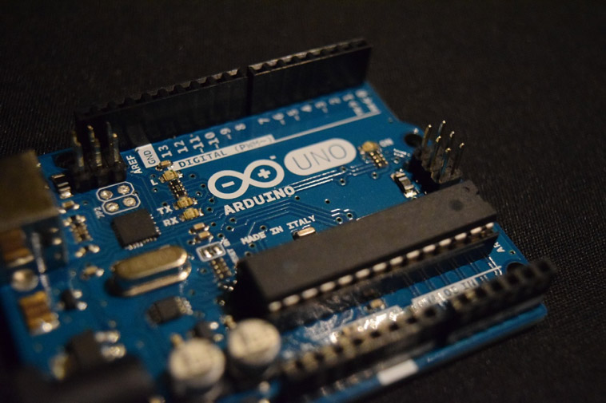

---
also_found_in:
- learningpaths/iot-getting-started-iot-development/
authors: ''
completed_date: '2017-05-05'
draft: false
duration: 1 hour
excerpt: Learn when, where, and why a developer might choose one type of hardware
  device or sensor over another for an IoT project.
ignore_prod: false
last_updated: '2020-01-30'
meta_description: This article provides an overview of different types of hardware
  that are commonly adopted for IoT, including micro controllers (for example, Arduino),
  single board computers (for example, Raspberry Pi), and embedded devices. The article
  describes the high-level building blocks and key characteristics of hardware, including
  an overview of needed security features and firmware capabilities, in the context
  of IoT. The article also provides guidance for when, where and why a developer might
  choose one type of hardware over another for an IoT project, and examples of use
  across a range of industries.
meta_keywords: IoT, devices, sensors
primary_tag: iot
related_content:
- slug: iot-getting-started-iot-development
  type: learningpaths
- slug: iot-next-steps-iot-development
  type: learningpaths
subtitle: Use this hardware guide to determine which hardware to use when prototyping
  and developing IoT projects
title: Choosing the best hardware for your next IoT project
---

<!-- <sidebar> <heading>Learning path: Getting started with IoT development</heading> 
This article is part of the IoT 101 learning path, a quick-start guide for IoT developers.
 <ul> <li> [IoT concepts and skills](/articles/iot-key-concepts-skills-get-started-iot)</li> <li>IoT hardware guide (this article)</li> <li> [IoT networking guide](/articles/iot-lp101-connectivity-network-protocols/)</li> <li> [IoT platforms](/articles/iot-lp101-why-use-iot-platform/)</li> <li> [Tutorial: Build a smart doorbell](/tutorials/iot-lp101-get-started-develop-iot-home-automation/)</li></ul></sidebar> -->

Connected devices are central to IoT. Devices gather data and monitor parameters. They are found on everything from industrial equipment, buildings, and cars, to animals, cargo shipments, pipelines, and people.

Hardware and software components are designed for IoT applications via a standard design protocol: specification development, conceptual design, prototype, test, and ultimately rollout of hardware and software integrated into a network.  Some platforms, such as Arduino and Raspberry Pi, may expedite design and allow rapid prototyping without involved customization, thus expediting the time required to implement an IoT configuration.

Design will require identification of performance requirements, the necessary hardware and software to achieve such requirements, followed by specifications for components – either commercially off-the-shelf (COTS) or customized designs – with due consideration for the operating environment and the application to be used within it.

In the context of IoT, a device refers to anything that attains information and transmits it. For example, a pressure sensor within a pipeline, a temperature sensor within a refrigerated railcar, or tiny chips inserted beneath the skin of a cow in a scattered heard – are all devices. Devices may stand alone, or they work in sync with other devices.

In this article, I’ll review some off-the-shelf hardware options and some factors to consider in selecting them to develop your next IoT project.

## IoT device characteristics

As an IoT landscape develops, new devices and platforms will be introduced.  There are key characteristics that are common to IoT devices that provide a basis of comparison when selecting hardware and software to configure a new IoT network or to develop and expand an existing one.

IoT devices may be characterized by capabilities:  

* Data acquisition and control
* Data processing and storage
* Connectivity
* Power management

### Data acquisition and control

_Data acquisition_ ([DAQ](https://en.wikipedia.org/wiki/Data_acquisition)) gathers analog information at a fixed time interval (the data sample rate), and transmits it as a digital signal to a remote output device for a digital readout. DAQ may include signal conditioning (to manipulate and scale raw sensor readings), and analog-to-digital converters to convert the analog sensor readings into digital values so that they can be processed and analyzed.

_Sensors_ are components that measure physical variables and convert them to electrical signals (voltages). Sensors are available, commercially, off-the-shelf, and specified to measure a range of variables which include: temperature, humidity, pressure, smoke, gas, light, sound, vibration, air-flow, water-flow, speed, acceleration, proximity, GPS position, altitude, and a multitude of other variables.

Sensors vary in their functionality and may be used to measure a wide assortment of conditions. For example, proprioceptive sensors monitor the internal state of the device. Sensors such as push buttons, sliding controls, or touchscreens may be used to interact directly with a device (Human-Machine Interface).

Each type of sensor has many options. Manufacturers and their sensor product specifications vary. The sensor’s accuracy, precision, and required operating condition may vary from catalog to catalog and from manufacturer to manufacturer. Sensors may be used within an engine, underwater, embedded in humans or animals, and even in space. Environments require different sensor characteristics and are designed for different uses accordingly.

An important characteristic of sensor components is resolution. The resolution of a sensor represents the smallest amount of change that the sensor can reliably read and is related to the size of the numeric value that is used to represent raw sensor readings. For example, an analog temperature sensor with 10 bits of resolution represents a temperature reading using a numeric value between 0 and 1023. Bits are binary, so 10 bits provides two to the power of 10, or 1024 possible values in total. However, in practice, sensors are affected by electrical noise which reduces the actual resolution.

While sensors convert a physical variable like temperature to an electrical signal, output devices are the inverse: they convert an electrical signal to a physical outcome. Output devices include LEDs, speakers, and screens.  This may require _actuators_ such as motors, relays, and solenoids that physically actuate something. Actuators are common in industrial IoT applications.  For example, pneumatic linear actuators are widely adopted in manufacturing to move and grip products during the assembly process. An actuator on an axle of a school bus may actuate braking when adverse motion is detected. A high temperature in a refrigerated container with produce inside, may actuate an alarm when a temperature rises to a certain unacceptable level.

### Data processing and storage

IoT devices require specific data processing and storage capability. This helps achieve data aggregation, transmission, and analysis. Some IoT devices may process data directly, while others transmit this data to other devices, gateway devices, or cloud applications for further  aggregation and analysis.

Edge analytics performs data analysis at the edges of a network rather than in a centralized location. Data can be analyzed in realtime on the devices themselves, or it can be analytized on a nearby gateway device (like a router) connected to the IoT devices, in lieu of transmitting large volumes of data upstream to a cloud server or data center for further analysis. Processing data at the edge aggregates and filters the data as it is collected, with only the most salient data sent upstream. Edge analytics reduces upstream processing and storage requirements alleviates network load.

The processing power and storage used by an IoT application depends on processing required by the services or apps that consume the data. Available memory and processor specifications, clock speed, and number of cores, all of which subsequently determine the devices rate of data processing. The capacity of the non-volatile flash, which is used to persist data until transmitted upstream, determines how much data can be stored on the device. Devices performing edge analytics require substantially more processing capabilities than devices that perform only basic data processing like validating, normalizing, scaling, or converting readings.

### Connectivity

Network connectivity is a defining characteristic of any IoT device. Devices communicate with other devices locally. They then publish data via cloud-based services. Some devices communicate wirelessly, by using 802.11 (Wi-Fi), Bluetooth, RFID, cellular networks, or Low Power wide area network (LPWAN) technologies like LoRa, SigFox or NB-IoT. Wired communication is suited to stationary devices. Such devices may be installed in smart buildings, home automation, and industrial control applications, for example, and connected with Ethernet, or retrofitted with Ethernet over power. Serial communication is a form of wired connectivity between devices, using standard protocols like _Universal Asynchronous Receiver Transmitter_ (UART), or the _Controller Area Network_ (CAN) protocol, which has its origins in the automotive industry.

### Power management

Power management is a critical factor for portable and wearable IoT devices that rely on a wireless power source, such as batteries or photovoltaic cells (solar). Depending on usage patterns and the power requirements of the attached sensors, actuators, or integrated circuits (ICs), a device may be put into sleep mode or into low-power mode periodically to conserve power.

For example, a single-board computer like the Raspberry Pi 4 requires around 700 – 1000mA of current to operate under typical usage. If you were transmitting data constantly over a wifi network, or if the device under heavy load was performing a lot of data processing, the power usage would be high, but then  it would drop when the device became idle. If you connect a camera module, the required amperage increases by about 250mA when the camera is in use. Also, sensors normally require power to operate; the GPIO pins on the Raspberry Pi supply 3.3V or 5V, up to a total of 50mA current across all of the pins. The power consumption of the device increases as you increase the number of components that are attached to the pins.

## Types of off-the-shelf hardware for prototyping your IoT project

Developing IoT applications is more accessible with the growing availability of low-cost, commercially available off-the-shelf hardware development boards, platforms, and prototyping kits. Modular hardware designs provide great  flexibility. With a greater selection of components, designers may substitute  new sensors with different specifications. Alternatively, you can independently upgrade the networking, data processing, or storage modules of a device for evolving requirements.

Many commercial off-the-shelf hardware devices, including microcontrollers and single-board computers, are designed around _System-on-a-Chip_ (SoC) integrated circuits. SoCs bundle capabilities such as data processing, storage, and networking onto a single chip. This configuration means that you sacrifice some flexibility for the sake of convenience, but, fortunately, there are a huge number of commodity devices available with a range of configurations to choose from. For example, Table 1 lists the technical specifications for a selection of microcontrollers that can be used for prototyping IoT projects and provides a comparison of three popular _Single-Board-Computers_ (SBCs).

### Microcontroller development boards

A _microcontroller_ is a SoC that provides data processing and storage capabilities. Microcontrollers contain a processor core (or cores), memory (RAM), and _erasable programmable read-only memory_ (EPROM) for storing the custom programs that run on the microcontroller. _Microcontroller development boards_ are PCBs with additional circuitry to support the microcontroller to make it more convenient to prototype with and program the chip.

Sensors and actuators connect to the microcontroller through digital or analog _General Purpose Input/Output_ (GPIO) pins or through a hardware bus. Standard communication protocols like [I2C](https://en.wikipedia.org/wiki/I%C2%B2C) and [SPI](https://en.wikipedia.org/wiki/Serial_Peripheral_Interface_Bus) are used for intra-device communication with the components that are connected with the bus. Adopting standards makes it easier to add or swap out components that are connected with the bus.

Arduino ([http://arduino.cc/en/Main/](http://arduino.cc/en/Main/)) is an open source device platform, with an active community who are creating compatible development boards and tooling. Device capabilities vary across the official Arduino models ([https://www.arduino.cc/en/Products/Compare)](https://www.arduino.cc/en/Products/Compare)), and also between the dozens of third-party compatible boards. All of the devices in are Arduino-compatible microcontrollers, including the ubiquitous Arduino Uno, Particle's Electron, which includes an integrated cellular modem, and Espressif Systems' ([https://espressif.com/en/products/hardware/esp8266ex/overview](https://espressif.com/en/products/hardware/esp8266ex/overview)) ESP8266-01, a low cost, low-power microcontroller with integrated wifi.

 <figure> <heading>Arduino micro-controller development board</heading> </img></figure>

Like Arduino, the ESP8266, has an active community of adopters. Notable development boards that are based around the ESP8266, include [NodeMCU](http://www.nodemcu.com/index_en.html), [WeMos D1](https://docs.wemos.cc/en/latest/d1/index.html), and AdaFruit's Feather Huzzah ([https://learn.adafruit.com/adafruit-feather-huzzah-esp8266/overview](https://learn.adafruit.com/adafruit-feather-huzzah-esp8266/overview)). A number of alternative firmware options for ESP8266-based boards have been developed by the open source and maker community, enabling IoT developers to program for these boards using Lua, Python, and JavaScript, and to support over-the-air (OTA) updates.

 <table-complex border="0" cellpadding="0" cellspacing="0" class="ibm-data-table" summary="Technical specifications for Arduino Uno, Particle Electron, and Espressif Systems ESP8266-01 microcontrollers"> <heading refname="table-microcontrollers">Technical specifications for Arduino Uno, Particle Electron, and Espressif Systems ESP8266-01 microcontrollers</heading> <thead> <tr> <th> Characteristic </th> <th> Feature </th> <th> Arduino Uno </th> <th> Particle Electron </th> <th> Espressif Systems ESP8266-01 </th></tr></thead> <tbody> <tr> <td colspan="5"> <strong> <em>Data acquisition and control</em></strong></td></tr> <tr> <td></td> <td> <strong>GPIO pins</strong></td> <td> 6 Analog in   14 Digital - 6 PWM </td> <td> 12 Analog in   2 Analog out   30 Digital - 13 PWM  </td> <td> 2 Digital   1 Analog </td></tr> <tr> <td></td> <td> <strong>Logic level voltage</strong></td> <td> 5V </td> <td> 3.3V </td> <td> 3.3V </td></tr> <tr> <td colspan="5"> <strong> <em>Data processing and storage</em></strong></td></tr> <tr> <td></td> <td> <strong>Processor</strong></td> <td> ATMega328P </td> <td> 32-bit STM32F205   ARM Cortex M3 </td> <td> 32-bit Tensilica L106 </td></tr> <tr> <td></td> <td> <strong>Processor speed</strong></td> <td> 16 KHz </td> <td> 120 MHz </td> <td> 80 MHz </td></tr> <tr> <td></td> <td> <strong>Memory</strong></td> <td> 32 kB flash,   1 kB EEPROM </td> <td> 1 Mb flash,   128 kB RAM </td> <td> 1 Mb </td></tr> <tr> <td colspan="5"> <strong> <em>Connectivity</em></strong></td></tr> <tr> <td></td> <td> <strong>Network Interfaces</strong></td> <td> None by default. Can be added with shields. </td> <td> Integrated cellular modem (2G / 3G) </td> <td> Integrated wifi </td></tr> <tr> <td colspan="5"> <strong> <em>Power</em></strong></td></tr> <tr> <td></td> <td> <strong>Recommended Power Supply</strong></td> <td> 9-12V DC 0.5 - 2A barrel, or 5V 500mA USB, or 9 - 12V on VIN pin </td> <td> 5V micro USB or 3.9V-12VDC on VIN pin </td> <td> Regulated 3.3V 300mA supply on VCC pin </td></tr> <tr> <td colspan="5"> <strong> <em>Other</em></strong></td></tr> <tr> <td></td> <td> <strong>Dimensions</strong></td> <td> 2.7 in X 2.1 in </td> <td> 2.05 in x 0.8 in </td> <td> 1.4 in x 1 in </td></tr> <tr> <td></td> <td> <strong>Typical cost</strong></td> <td> $20 </td> <td> $39 - $59 </td> <td> $10 </td></tr></tbody></table-complex>

The standard approach for developing the software to run on Arduino-compatible microcontrollers is to use C or C++ and the Arduino IDE, however community-developed language bindings and visual programming tools also exist. Arduino-compatible boards that share common pin layouts are able to be expanded by using optional third-party shields, for example, to add an Ethernet port or Bluetooth to an Arduino Uno. Arduino is the most widely adopted hobbyist microcontroller development environment, but others like Tessel ([https://tessel.io/](https://tessel.io/)) and Particle.io ([http://particle.io](http://particle.io)) natively support JavaScript, while Python is supported for boards like MicroPython's PyBoard ([http://micropython.org](http://micropython.org)) and by WeIO ([http://we-io.net/hardware/](http://we-io.net/hardware/)).

Selecting an Arduino-compatible microcontroller makes it easier to port programs that are developed using the cross-platform Arduino libraries and Arduino IDE to run on other Arduino-compatible devices. Working through and around subtle difference is still required.

For example, the Arduino Uno uses 5V logic on digital I/O pins (where 0 volts equals LOW or OFF and 5 volts equals HIGH or ON), but the ESP8266 and Particle boards use 3.3V logic (HIGH is 3.3V). This might affect your choice of sensor or actuator components, as some components only work with one or the other. Swapping sensors that are designed for 5V to 3.3V logic might result in unpredictable results and possibly damage the pins that are intolerant to higher voltages, and so you’d need to add a logic-level converter to make this work. When you get down to implementing low-level hardware features like enabling deep sleep mode or reading from connected sensors by using specific protocols, you’ll likely need to rely on device or component-specific libraries that will make your code less portable.

### Single board computers

_Single board computers_ (SBCs) are a step up from microcontrollers. They allow you to attach peripheral devices like keyboards, mice, and screens, as well as offering more memory and processing power (for example, a 1.2 GHz 32-bit ARM microprocessor from compared to an 8-bit 16KHz microcontroller from ).

Table 2 lists technical specifications for three SBCs, the Raspberry Pi 4 ([https://www.raspberrypi.org/](https://www.raspberrypi.org/)), BeagleBone Black ([http://beagleboard.org/black](http://beagleboard.org/black)) and DragonBoard 410c ([https://developer.qualcomm.com/hardware/dragonboard-410c](https://developer.qualcomm.com/hardware/dragonboard-410c)).

 <figure> <heading>Raspberry Pi single-board-computer</heading> </img></figure>

The distinction between microcontrollers and single-board-computers is somewhat arbitrary. Some devices, like the Onion Omega 2 ([https://docs.onion.io/omega2-docs/omega2.html#omega2](https://docs.onion.io/omega2-docs/omega2.html#omega2)), fall somewhere in between, with almost as much on-board memory and processing capability as a low-end SBC. There are also a number of hybrid devices, like the UDOO Quad ([http://www.udoo.org/docs/Introduction/Introduction.html](http://www.udoo.org/docs/Introduction/Introduction.html)) that integrate an ARM-based Linux system with an Arduino-compatible micro-controller.

 <table-complex border="0" cellpadding="0" cellspacing="0" class="ibm-data-table" summary="Technical specifications for Raspberry Pi 4, BeagleBone Black, and DragonBoard SBCs"> <heading refname="table-sbcs">Technical specifications for Raspberry Pi 4, BeagleBone Black and DragonBoard SBCs</heading> <thead> <tr> <th> Characteristic </th> <th> Feature </th> <th> Raspberry Pi 4 </th> <th> BeagleBone Black </th> <th> Qualcomm DragonBoard 410c </th></tr></thead> <tbody> <tr> <td colspan="5"> <strong> <em>Data acquisition and control</em></strong></td></tr> <tr> <td></td> <td> <strong>GPIO pins</strong></td> <td> 40 I/O pins, including 29 Digital </td> <td> 65 Digital - 8 PWM   7 Analog in </td> <td> 12 Digital </td></tr> <tr> <td></td> <td> <strong>Logic level voltage</strong></td> <td> 3.3V </td> <td> 5V </td> <td> 1.8V </td></tr> <tr> <td colspan="5"> <strong> <em>Data processing and storage</em></strong></td></tr> <tr> <td></td> <td> <strong>Processor</strong></td> <td> ARM Cortex A72 </td> <td> AM335X ARM Cortex A8 </td> <td> ARM Cortex A53 </td></tr> <tr> <td></td> <td> <strong>Processor speed</strong></td> <td> 1.5GHz </td> <td> 1 GHz </td> <td> 1.2 GHz </td></tr> <tr> <td></td> <td> <strong>Memory</strong></td> <td> 1-4 Gb </td> <td> 512 Mb RAM, 4 Gb Flash </td> <td> 1Gb, 8Gb Flash </td></tr> <tr> <td colspan="5"> <strong> <em>Connectivity</em></strong></td></tr> <tr> <td></td> <td> <strong>Network Interfaces</strong></td> <td> Wifi, Ethernet, Bluetooth </td> <td> Ethernet,   USB ports allow external wifi / Bluetooth adaptors </td> <td> Wifi, Bluetooth, GPS </td></tr> <tr> <td colspan="5"> <strong> <em>Power</em></strong></td></tr> <tr> <td></td> <td> <strong>Recommended Power Supply</strong></td> <td> 5V 3A USB Type C </td> <td> 5V 1.2A - 2A barrel </td> <td> 6.5 - 18V 2A barrel </td></tr> <tr> <td colspan="5"> <strong> <em>Other</em></strong></td></tr> <tr> <td></td> <td> <strong>Dimensions</strong></td> <td> 3.5 x 2.3 in </td> <td> 3.4 x 2.1 in </td> <td> 3.3 in x 2.1 in </td></tr> <tr> <td></td> <td> <strong>Typical cost</strong></td> <td> $35 </td> <td> $55 </td> <td> $75 </td></tr></tbody></table-complex>

As with microcontrollers, SBC device capabilities can be expanded through the addition of stackable expansion boards known as _hats_ on Raspberry Pi and _capes_ on BeagleBone Black, and through the addition of external modules, such as motor controllers or analog-to-digital converters, to mitigate limitations with the built-in device capabilities.

Many SBC devices are more like a mini-PC, and run an embedded operating system, typically a streamlined Linux distribution. As a result, there are many more development tools and language choices that are available for developing embedded applications that work with the attached sensors and actuators on these devices than on microcontroller boards. However, SBCs are more complex to set up, larger, more power hungry, and more prone to problems like corruption of the SD card or flash memory where applications are stored.

### Choosing between microcontroller development boards and single-board computers

Although off-the-shelf microcontroller development boards and single-board computers might only be part of an  IoT solution, they are ideal for bootstrapping the development of one.

One way to get started is to consider the key IoT device characteristics in light of your application's requirements, and then work through the following design decisions:

* Determine the type and number of peripheral sensors and output components that you need, and, if necessary, any design circuits for these components
* Select a microcontroller or single-board device to co-ordinate reading from and controlling the peripheral components
* Decide on the data communication protocols that you need to use for intra-device communication (for example, using I2C for communication between the microcontroller and any attached sensors)
* Select the networking hardware and protocols that you need to use to communicate with cloud services and apps

For example, to set up a home automation system on a budget, you may choose the Raspberry Pi Zero W. It is a small and very low-cost SBC device  with ample processing power and memory (1GHz ARM6 processor and 512 MB RAM) to perform data processing and analytics on the device. It supports microSD card flash memory expansion up to 64GB for storing programs and data. And, it is equipped with a full 40-pin GPIO header, just like the Raspberry Pi 4, which allows connecting multiple sensors and supports both SPI and I2C protocols. It has on-board wifi for connecting with a home network, and it can be powered with micro-USB off a portable power pack or wall power supply.

As you progress further with your  IoT landscape design you may stop and compare your anticipated performance with design intent. Conduct device design and prototype, embedded software selection, and the selection of upstream services and apps, but then stop to assess it. You can periodically assess your prototypes against your functional and non-functional requirements, including performance, reliability, and security, and revisit these choices as necessary.

## IoT hardware requirements for deploying your IoT project

IoT devices are highly specialized. They are designed to operate within very specific environments. The hardware for IoT projects vary widely. While you may prototype with generic off-the-shelf hardware, you eventually can move toward the design and development of custom PCBs and components, tailored to the requirement of your IoT solutions. As part of this process, you will need to consider these kinds of hardware requirements:

* Security requirements
* Ease of development
* Data acquisition, processing and storage requirements
* Connectivity requirements
* Power requirements
* Physical device design
* Cost requirements

### Security requirements

Security is critical element within IoT. It is imperative that it be considered at all stages of design and development. Data integrity and security captured by any device must remain intact - even during prototyping. Security requirements apply to the IoT devices themselves, your network, and the  cloud, mobile and web service applications.

Related security requirements include:

* Ensuring that each device has enough processing power and memory to be able to encrypt and decrypt data and messages at the rate that they are sent and received
* Ensuring that the embedded software development libraries support whatever authorization and access control mechanisms are used to authenticate with upstream services and apps
* Choosing to adopt off-the-shelf devices that implement device management protocols for securely registering new devices as they are added to a network to avoid spoofing, and those that include firmware capabilities to support secure over the air updates for security patches

### Ease of development

While prototyping, ease of development is another high priority requirement so that you can quickly and easily get your IoT device up and running, capturing data, and communicating with other devices and the cloud.

Consider the accessibility, availability, and quality of API documentation, development tools, and support offered by the hardware manufacturer or by the development community. Select devices that are quick and easy to program and re-flash, as well as being low touch to deploy, with zero or minimal per-device configuration required, to cut down on frustration and save time while you are developing your IoT solution.

### Data acquisition, processing, and storage requirements

The number of sensors that are connected, the resolution of the data that is captured, and the rate at which the data is sampled all determine the volume of data to be processed, which impacts on data processing and storage requirements.

The amount of data that needs to be retained on a device is dependent on how frequently the device connects to transmit data upstream. A wired, always-connected device that is installed in a smart building, one that streams low volumes of raw data directly to a highly available server, will require less data processing power and storage compared to a device that needs to process large volumes of data in bursts. A device that only connects every few hours to conserve power will require more storage to log data locally in the interim.

### Connectivity requirements

Connectivity requirements for wireless networking include operating range, how far the signal will need to be transmitted, and the anticipated volume and rate of data to be transmitted. Consider fault-tolerance and the ability for a device to reconnect and retry sending data, after it was disconnected.

Your hardware may have integrated network connectivity like Bluetooth or wifi, or this capability might need to be added with an expansion board or module. An external module that can be upgraded can provide more flexibility, as you have the option to try different modules to evaluate their range and power consumption.

### Power requirements

Many of the other requirements, including the number of sensors needed, and the rate of network transmission, will impact the device’s power requirements. Consider whether your device wll be hardwired for power, or require a portable power source like a battery or supercapacitor. If it requires a portable power supply such as a battery, you need to know the size, weight, and capacity requirements for the battery, as well as whether it must be rechargeable, replaceable, or discarded after the battery dies. If the device is rechargeable, how often should be charged, and by what means?

### Physical device design requirements

The physical device design requirements include the appearance and size of the device.

The environmental conditions in which the device will be installed also need to be considered, for example, will it need a waterproof or ruggedized enclosure? For example, a device that is installed on the underside of a truck as part of a fleet monitoring application would need to be shielded to ensure it continued to operate under harsh conditions; it would need to be waterproof and resistant to dirt, shock, and vibration.

### Cost requirements

The cost of the hardware includes the initial outlay for the hardware and associated components (such as any sensors) as well as their on-going operating costs, such as power and maintenance costs in the form of replacing worn parts or defective components. Also consider possible licensing fees for some components or device drivers. Purchasing commercially available off-the-shelf development boards or SBCs may be more economical than fabricating  custom boards. As you scale out your IoT network with many devices, dedicated hardware devices may become a wiser alternative.

## Conclusion

Every application and situation is different. There is no “one-size-fits all” approach to selecting hardware for IoT projects. Adopting standards-based, commodity hardware like microcontrollers, or single-board-computers, can save time and expense in the early stages of development, without sacrificing flexibility. What you learn in the prototyping phase can help make critical hardware design decisions later in deploying your IoT solution.