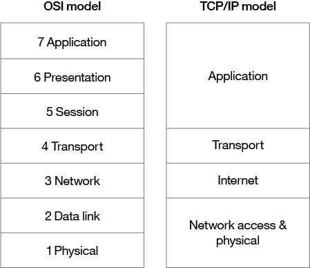
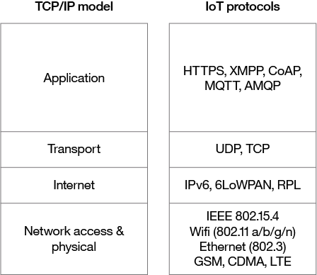

---
also_found_in:
- learningpaths/iot-getting-started-iot-development/
authors: ''
completed_date: '2017-05-23'
draft: false
duration: 1 hour
excerpt: IoTネットワーキングのために広く採用されている技術や規格について、また、あるネットワークプロトコルを他のプロトコルよりも選択する理由について学びます。
ignore_prod: false
last_updated: '2020-01-31'
meta_description: このガイドでは、IoTネットワークのために広く採用されている技術や規格、あるネットワークプロトコルを他のプロトコルよりも選択する理由について学びます。また、IoTにおけるネットワーク技術に関連する主な検討事項や課題についてもご紹介します。
meta_keywords: IoT, networking, connectivity
primary_tag: iot
related_content:
- slug: iot-getting-started-iot-development
  type: learningpaths
- slug: iot-next-steps-iot-development
  type: learningpaths
subtitle: IoTネットワークの課題を解決するネットワーク技術の選択ガイド
tags:
- iot
title: あらゆるモノをつなぐ「モノのインターネット
---

<!-- <サイドバー> <見出し>ラーニングパス。Getting started with IoT development</heading> 
この記事は、IoT開発者のためのクイックスタートガイドである「IoT 101」ラーニングパスの一部です。
 <ul> <li> [IoTのコンセプトとスキル](/articles/iot-key-concepts-skills-get-started-iot)</li> <li> [IoTハードウェアガイド](/articles/iot-lp101-best-hardware-?devices-iot-project)</li> <li>IoTネットワークガイド（この記事）</li> <li> [IoTプラットフォーム](/articles/iot-lp101-why-use-iot-platform/)</li> <li> [Tutorial:Build a smart doorbell](/tutorials/iot-lp101-get-started-develop-iot-home-automation/)</li></ul></sidebar> -->

ネットワーク技術は、IoTデバイスが、クラウド上で実行されている他のデバイス、アプリケーション、およびサービスと通信することを可能にします。インターネットは、異機種間の通信の安全性と信頼性を確保するために、標準化されたプロトコルに依存しています。標準プロトコルは、デバイスがネットワークを確立・管理し、ネットワーク上でデータを送信する際に使用するルールとフォーマットを規定しています。

ネットワークは、技術の「スタック」として構築されます。Bluetooth LEのような技術は、スタックの一番下に位置します。  Bluetooth LEなどの技術はスタックの一番下にあり、IPv6技術（ネットワークトラフィックの論理的デバイスアドレスとルーティングを担当）などの技術はスタックのさらに上にあります。スタックの最上位に位置する技術は、メッセージキューイング技術など、その上で動作するアプリケーションによって使用されます。

この記事では、IoTネットワークに広く採用されている技術と標準について説明しています。また、あるネットワークプロトコルを選択する際の指針も示しています。さらに、IoTのネットワークに関する主な検討事項と課題（通信距離、帯域幅、電力使用量、断続的な接続性、相互運用性、セキュリティ）について説明しています。

## ネットワークの標準と技術

OSI（Open Systems Interconnection）モデルは、ISO標準の抽象モデルで、7つのプロトコル層を積み重ねたものです。上から順に、アプリケーション、プレゼンテーション、セッション、トランスポート、ネットワーク、データリンク、物理の7つのプロトコル層で構成されています。インターネットを支えるTCP/IP（Internet Protocol suite）(https://en.wikipedia.org/wiki/Internet_protocol_suite)は、OSIモデルのこれらの層を簡略化して具体的に実装したものである。

 <figure> <heading refname="ositcpmodels">OSIとTCP/IPのネットワークモデル</heading> </img></figure>

 
TCP/IPモデルでは、OSIモデルのレイヤーの一部を統合し、4つのレイヤーのみを含んでいます。

  物理層（OSIのレイヤ1）では、各機器が物理的にどのようにネットワークに接続されているかを規定しています。リンク層（OSI第2層）では、機器はMACアドレスで識別され、このレベルのプロトコルは、スイッチがネットワーク上の機器にフレームを配信する方法など、物理的なアドレッシングに関するものです。

* このレベルのプロトコルは、スイッチがネットワーク上のデバイスにフレームを配信する方法など、物理的なアドレッシングに関するものです。   OSIレイヤ3は論理的なアドレッシングに関係しています。この層のプロトコルは、ルーターがIPアドレスで識別される送信元と送信先のホスト間でデータのパケットを配信する方法を定義しています。IoTデバイスのアドレッシングにはIPv6が一般的に採用されています。

* トランスポート層（OSIではレイヤ4）は、エンド・ツー・エンドの通信に重点を置き、信頼性、輻輳回避、パケットが送信されたときと同じ順序で配信されることの保証などの機能を提供します。IoTのトランスポートには、パフォーマンス上の理由からUDP（User Datagram protocol）が採用されることが多い。

* **アプリケーション層**   アプリケーション層（OSIではレイヤー5、6、7）は、アプリケーションレベルのメッセージングを扱います。HTTP/Sは、インターネット上で広く採用されているアプリケーション層のプロトコルの一例です。

TCP/IPモデルやOSIモデルは、ネットワークプロトコルや各プロトコルを実装した具体的な技術を議論するための有用な抽象化を提供してくれますが、中にはこれらの層のモデルにきちんと収まらず、実用性に欠けるプロトコルもあります。例えば、ネットワークトラフィックのプライバシーとデータの完全性を確保するために暗号化を実装している TLS（Transport Layer Security）プロトコルは、OSI レイヤー 4、5、6 にまたがって動作していると考えることができます。

##  IoTネットワークプロトコル

IoTで広く採用されているネットワーキングプロトコルのいくつかと、それらがTCP/IP層のどこに当てはまるかを図2に示します。

 <figure> <heading refname="iotnp">TCP/IPモデルにマッピングされたIoTネットワークプロトコル</heading> </img></figure>

 

IoTの分野では、多くの新しいネットワーク技術が採用されています。異なるベンダーによる複数のテクノロジーは、ホームオートメーション、ヘルスケア、または産業用IoTといった異なる垂直市場をターゲットとし、同じ標準プロトコルの代替実装を提供しています。例えば、[IEEE 802.15.4](https://en.wikipedia.org/wiki/IEEE_802.15.4)は、低レートの無線パーソナルエリアネットワーク(LR-WPAN)の動作について記述しており、ZigBee、Z-Wave、EnOcean、SNAP、6LoWPANなどの複数の競合技術によって実装されています。

イーサネットなどのインターネット接続に使用される技術は、IoTにも適用できます。物理的な伝送技術に向けてスタックをさらに下げていくと、IoTデバイスやIoTのコンテクストに特有の課題に直面します。

ネットワークの構造はトポロジーと呼ばれています。IoTで採用されている最も一般的な[ネットワークトポロジー](https://en.wikipedia.org/wiki/Network_topology)は、スター型トポロジーとメッシュ型トポロジーです。スター型トポロジーでは、各IoTデバイスは中央のハブ（ゲートウェイ）に直接接続され、上流の接続されたデバイスからのデータと通信します。メッシュトポロジーでは、デバイスは範囲内の他のデバイスに接続します。ネットワーク内のノードは、単純なセンサーノードとして機能します。センサーノードは、ゲートウェイノードと同様に、トラフィックをルーティングします。メッシュネットワークは、スター型のネットワークよりも複雑である。しかし、単一のセントラルゲートウェイに依存しないため、障害が発生しにくくなります。

### ネットワークアクセスと物理層 IoTネットワーク技術

IoT ネットワークのプロトコルスタックの下位には、セルラー、無線LAN、イーサネットのほか、LPWAN、Bluetooth Low Energy (BLE)、ZigBee、NFC、RFID などの特殊なソリューションがあります。

 <sidebar> 
ガートナー社によると、NB-IoTはLPWANネットワークの標準になりつつあります。この<a href="https://iot-for-all.com/what-is-narrowband-iot-nb-iot/">IoT for Allの記事</a>では、NB-IoTについて詳しく説明しています。
</sidebar>

以下は、それぞれの簡単な説明を含むネットワーク技術です。

* **LPWAN**   ([Low Power Wide Area Network](https://en.wikipedia.org/wiki/LPWAN))は、低消費電力で長距離の無線通信のために設計された技術のカテゴリーです。無線センサーなどの低消費電力のIoTデバイスを大規模に展開するのに適しています。LPWAN技術には、LoRa（LongRange physical layer protocol）、Haystack、SigFox、LTE-M、NB-IoT（Narrow-Band IoT）などがあります。 
* **Cellular**   LPWANの[NB-IoT](https://en.wikipedia.org/wiki/NarrowBand_IOT)および[LTE-M](https://www.link-labs.com/blog/what-is-lte-m)規格は、既存のセルラーネットワークを使用した低消費電力、低コストのIoT通信オプションに対応しています。NB-IoTはこれらの規格の中で最も新しいもので、主に屋内にある多数の機器間の長距離通信に焦点を当てています。LTE-MとNB-IoTはIoTに特化して開発されましたが、長距離無線通信には既存のセルラー技術も頻繁に採用されています。これには、レガシーデバイスの2G（GSM）（現在は廃止されている）、CDMA（現在は廃止されている）が含まれる一方で、3Gも含まれますが、いくつかのネットワークプロバイダーがすべての3Gデバイスを廃止するなど、急速に廃止されつつあります。4Gはまだ有効で、5Gが完全に利用可能になり、実装されるまでは有効です。 。
* **Bluetooth Low Energy (BLE)**  [BLE](https://en.wikipedia.org/wiki/Bluetooth_low_energy)は、一般的なBluetooth 2.4 GHz無線通信プロトコルの低消費電力バージョンです。BLEは、1台のプライマリデバイスが複数のセカンダリデバイスを制御する、スター型の近距離通信（100メートル以下）用に設計されています。Bluetoothは、OSIモデルの第1層（PHY）と第2層（MAC）の両方で動作します。BLEは、少量のデータを連続して送信する機器に最適です。デバイスは、データを送信していないときは、スリープして電力を節約するように設計されています。このような状況下でも、この技術を活用することで、より多くの人に快適な環境を提供することができます。
* **ZigBee**  [ZigBee](https://zigbee.org/zigbee-for-developers/zigbee-3-0/)は、2.4GHzの無線通信スペクトルで動作します。また、BLEよりもデータレートが若干低い（BLEの270kbpsに対し、最大250kbps）のが特徴です。ZigBeeは、メッシュネットワークのプロトコルです。BLEとは異なり、すべての機器がバースト間にスリープできるわけではありません。BLEとは異なり、すべての機器がバースト間にスリープできるわけではなく、メッシュ内での位置や、ルーターやコントローラーとして動作する必要があるかどうかによって異なります。ZigBeeは、ビルやホームオートメーション用に設計されました。ZigBeeに関連する技術としては、IEEE 802.15.4をベースにしたZ-Waveがある。Z-Waveは、ホームオートメーションのために設計されました。 
 
* **RFID**  [RFID](https://en.wikipedia.org/wiki/Radio-frequency_identification)はRadio Frequency Identificationの略です。RFIDタグには、識別子とデータが格納されています。このタグは機器に取り付けられ、RFIDリーダーによって読み取られます。RFIDの典型的な範囲は1メートル以下です。RFIDタグには、アクティブタグ、パッシブタグ、アシストパッシブタグがあります。パッシブタグは、IDがリーダーによってパッシブに読み取られるため、バッテリーを持たないデバイスに最適です。アクティブタグは定期的に自分のIDをブロードキャストし、アシストパッシブタグはRFIDリーダーが存在するとアクティブになります。  [**Dash7**](http://www.dash7-alliance.org/)は、産業用IoTアプリケーションで安全な長距離通信を行うために設計された、アクティブRFIDを使用する通信プロトコルです。NFCと同様に、RFIDの典型的な使用例は、小売店や産業用IoTアプリケーション内の在庫アイテムを追跡することです。   
* **Wifi**  [Wifi](https://en.wikipedia.org/wiki/Wi-Fi)は、IEEE 802.11a/b/g/n仕様に基づく標準的なワイヤレスネットワークです。802.11nは最も高いデータスループットを提供しますが、高い電力消費を伴うため、IoTデバイスは省電力の理由から802.11bまたはgのみを使用する場合があります。IoTデバイスのプロトタイプや現世代のIoTデバイスの多くには無線LANが採用されていますが、より長距離で低消費電力のソリューションが広く利用されるようになると、無線LANは低消費電力の代替品に取って代わられる可能性が高くなってきます。 
* **Ethernet**   ローカルエリアネットワーク内の有線接続に広く採用されている[Ethernet](https://en.wikipedia.org/wiki/Ethernet)は、IEEE 802.3規格を実装しています。全てのIoTデバイスが固定式の無線である必要はありません。例えば、ビルディングオートメーションシステム内に設置されたセンサーユニットは、イーサネットのような有線ネットワーク技術を使用することができます。有線の代替ソリューションである電力線通信（PLC）は、専用のネットワークケーブルの代わりに既存の電気配線を使用します。

#### 5Gネットワークの幕開け

5Gは、次世代の無線ネットワークです。既存の4G Long-Term Evolution（LTE）のインフラを利用します。注目すべきは、帯域幅の向上です。しかし、容量や無線サービスの信頼性も同様です。

5Gは、モノのインターネット（IoT）を構成する何十億もの接続デバイスによってもたらされる、より多くのデータや通信要件に最適です。  また、リアルタイム通信に必要な超低遅延にも対応しています。これは、インターネットを利用するすべてのデバイスからのすべての信号の配管として機能する、まったく新しいデータパイプラインです。緻密なデータを扱うことができます。

4Gの約20倍の速さで、例えば動画を17秒でダウンロードすることができます。これは、IoT時代のコネクテッド・ワールドを後押しするものであり、IoTが将来達成できることを明確に後押しするものでもあります。

5Gの登場と本格的な実装は、まだ初期の実装であり、まもなく古いものになります。しかし、5Gは私たちの世界と生活をより良いものにし、データがこれまで以上に大量かつ迅速に移動することで、テクノロジーの成果をこれまで以上に輝かせることになるでしょう。

### インターネット層 IoT ネットワーク技術

インターネット層の技術（OSIレイヤー3）は、データのパケットを識別し、ルーティングする技術です。IoTでよく採用される技術はこの層に関連するもので、IPv6、6LoWPAN、RPLなどがあります。

* **IPv6**   インターネット層では、デバイスはIPアドレスによって識別されます。IPv6は、IoTアプリケーションでは一般的に、レガシーなIPv4アドレッシングの上に使用されます。IPv4は32ビットのアドレスに限定されているため、合計で約43億のアドレスしか提供できず、これは現在接続されているIoT機器の数よりも少ないです。一方、IPv6は128ビットを使用するため、2 128のアドレス（約3.4×10 38、約3400億10億）のアドレスを提供できます。実際には、すべてのIoT機器がパブリックアドレスを必要とするわけではありません。
* **6LoWPAN**   [IPv6 Low Power Wireless Personal Area Network (6LoWPAN)](https://en.wikipedia.org/wiki/6LoWPAN)規格は、802.15.4無線ネットワーク上でIPv6を使用することを可能にしています。6LoWPANは無線センサーネットワークによく使われており、ホームオートメーション機器のためのプロトコル[Thread](http://threadgroup.org/)も6LoWPAN上で動作します。 
* **RPL**   インターネット層にはルーティングも含まれています。[IPv6 Routing Protocol for Low-Power and Lossy Networks (RPL)](https://datatracker.ietf.org/doc/html/rfc6550)は、6LoWPANで実装されたネットワークのように、低消費電力のネットワーク上でIPv6トラフィックをルーティングするために設計されています。RPLは、無線センサーネットワークのような制約のあるネットワークでパケットをルーティングするために設計されています。このようなネットワークでは、すべてのデバイスに常に到達できるわけではなく、パケットロスが多いか予測できない場合があります。RPLは、エネルギー消費量やレイテンシーの最小化といった動的な指標や制約条件に基づいて、ネットワーク内のノードのグラフを構築することで、最適な経路を計算することができます。

### アプリケーション層 IoTネットワーク技術

HTTPとHTTPSは、インターネット上のアプリケーションではどこにでもあるものですが、IoTにおいても同様で、RESTfulなHTTPとHTTPSのインターフェースが広く普及しています。CoAP(Constrained Application Protocol)は、軽量のHTTPのようなもので、UDP上の6LoWPANと組み合わせて使われることが多いです。また、MQTT、AMQP、XMPPなどのメッセージングプロトコルも、IoTアプリケーションでよく使われています。

* **MQTT**  [Message Queue Telemetry Transport (MQTT)](http://mqtt.org/)は、パブリッシュ/サブスクライブベースのメッセージングプロトコルで、低帯域幅の状況、特に信頼性の低いネットワーク上のセンサーやモバイルデバイスで使用するために設計されました。 
* **AMQP**  [Advanced Message Queuing Protocol (AMQP)](https://en.wikipedia.org/wiki/Advanced_Message_Queuing_Protocol) は、メッセージ指向のミドルウェアに使用される、オープンスタンダードなメッセージングプロトコルです。最も有名なのは、[RabbitMQ](https://www.rabbitmq.com/)で実装されているAMQPです。 
* **XMPP**   [Extensible Messaging and Presence Protocol (XMPP)](https://en.wikipedia.org/wiki/XMPP)は、もともとインスタントメッセージングなどのリアルタイムの人間同士のコミュニケーションのために設計されたプロトコルです。このプロトコルは、軽量ミドルウェアの実装やXMLデータのルーティングのために、M2M（Machine-to-Machine）通信にも適用されています。XMPPは主にスマート家電で使用されています。

このレイヤーでどの技術を選択するかは、IoTプロジェクトの具体的なアプリケーション要件によって異なります。例えば、複数のセンサーを搭載した低価格のホームオートメーションシステムの場合、プロトコルがシンプルで軽量であるため、ストレージや処理能力の低いデバイスにメッセージングを実装するのに適しているMQTTが適しているでしょう。

##  IoTネットワークの検討事項と課題

IoTアプリケーションにどのネットワーク技術を採用するかを検討する際には、以下のような制約があることに注意してください。

* 範囲
* 帯域幅
* 電力使用量
* 間欠的な接続性
* 相互運用性
* セキュリティ

### 範囲

ネットワークは、そのネットワークに接続されたIoTデバイスが通常データを伝送する距離で表現することができます。

* 例えば、携帯電話のアプリとBLEで通信するフィットネス用のウェアラブル端末などがあります。 
* 例えば、ホームオートメーションや工場の生産ラインに設置されたセンサーが、同じ建物内に設置されたゲートウェイ装置と無線LANで通信するようなものです。 
* 例えば、街中に設置されたスマートパーキングセンサーがメッシュネットワークで接続されているような場合です。 
* 例えば、大規模な農場や牧場に設置された農業用センサーは、敷地内の微気候の環境条件を監視するために使用されます。

ネットワークは、IoTデバイスからデータを取得し、意図した目的地に送信する必要があります。必要な範囲に合わせてネットワークプロトコルを選択します。例えば、数キロメートルの範囲で動作するWANアプリケーションにBLEを選択することはありません。必要な範囲でデータを送信することが難しい場合は、エッジコンピューティングを検討してください。エッジ・コンピューティングは、遠く離れたデータセンターなどからではなく、デバイスから直接データを分析します。

### 帯域幅

帯域幅とは、単位時間あたりに転送できるデータ量のことです。  IoTデバイスからデータを収集し、上流に送信する速度が制限されます。帯域幅は、次のような多くの要因に影響されます。

* 各デバイスが収集し、送信するデータの量
* 配置されているデバイスの数
* データが一定の流れで送られているのか、断続的なバーストで送られているのか、また、顕著なピーク時があるかどうか。

ネットワークプロトコルのパケットサイズは、一般的に送信されるデータ量と一致している必要があります。空のデータでパッドされたパケットを送信するのは非効率的です。  反対に、大きなデータの塊を小さなパケットに分割しすぎると、オーバーヘッドが発生します。データ転送速度は常に対称ではありません（つまり、アップロード速度がダウンロード速度よりも遅い場合があります）。そのため、機器間で双方向の通信が行われる場合は、データ伝送を考慮する必要があります。ワイヤレスやセルラーネットワークは伝統的に低帯域であるため、大量のアプリケーションにワイヤレス技術が適しているかどうかを検討する必要があります。

すべての生データを送信する必要があるかどうかを検討する。解決策としては、サンプリングの頻度を下げて、より少ないデータを取得することが考えられます。この場合、キャプチャできる変数が少なくなり、デバイスからのデータをフィルタリングして重要でないデータを除外することができます。また、データを送信する前に集約すれば、送信するデータ量を減らすことができます。しかし、このプロセスは、上流の分析における柔軟性と粒度に影響を与えます。アグリゲーションやバーストは、時間に敏感なデータやレイテンシーに敏感なデータには必ずしも適していません。これらの技術はすべて、IoTデバイスのデータ処理とストレージの要件を増加させます。

### 電力使用量

デバイスからデータを送信すると電力を消費します。長距離でデータを送信する場合は、短距離の場合よりも多くの電力を必要とします。バッテリー、太陽電池、コンデンサなどの電源と、機器のライフサイクルを考慮する必要があります。ライフサイクルを長く保つことは、信頼性を高めるだけでなく、運用コストの削減にもつながります。電源のライフサイクルを長くするためには、さまざまな工夫が必要です。  例えば、バッテリーの寿命を延ばすために、デバイスがアイドル状態の時は常にスリープモードにすることができます。もう一つのベストプラクティスは、異なる負荷と異なるネットワーク条件でのデバイスのエネルギー消費をモデル化し、デバイスの電源とストレージ容量が、採用したネットワーク技術を使って必要なデータを送信するのに必要な電力と一致するようにすることです。

### 断続的な接続性

IoTデバイスは常に接続されているわけではありません。場合によっては、デバイスは定期的に接続されるように設計されています。しかし、時には信頼性の低いネットワークでは、接続性の問題でデバイスが落ちてしまうことがあります。共有スペクトルを使用する無線ネットワークでの干渉やチャネル競合への対処など、サービス品質の問題が発生することもあります。IoTのランドスケープデザインにとって重要な要素となる場合には、断続的な接続性を考慮し、中断のないサービスを提供するために利用可能なあらゆるソリューションを模索する必要があります。

### 相互運用性

デバイスは他のデバイス、機器、システム、技術と連携し、相互運用性を持ちます。  IoTには様々なデバイスが接続されるため、相互運用性が課題となります。インターネット上で相互運用性を維持するには、標準プロトコルを採用するのが伝統的な方法です。標準規格は、業界の参加者によって合意され、複数の異なるデザインや方向性を避けることができます。  適切な標準規格とそれに同意する参加者がいれば、非互換性の問題、ひいては相互運用性の問題を回避することができます。

しかし、IoTでは、標準化プロセスがイノベーションや変化に追いつけないことがあります。  それらは、まだ変更の余地がある標準の次期バージョンに基づいて書かれ、リリースされます。テクノロジーを取り巻くエコシステムを考慮する。広く採用されているか？その技術は広く採用されているか、オープンかプロプライエタリか？その技術は広く採用されているか？

これらの質問を用いてIoTネットワークを計画することで、より強固なIoTネットワークのためのより良い相互運用性を計画することができます。

###セキュリティ

セキュリティは優先事項です。認証、暗号化、オープンポート保護など、エンドツーエンドのセキュリティを実装したネットワーク技術の選択が重要です。IEEE 802.15.4には、セキュリティモデルがあり、アクセス制御、メッセージの完全性、メッセージの機密性、リプレイプロテクションなどのセキュリティ機能があり、ZigBeeなどこの規格に基づいた技術で実現されています。

安全でセキュアなIoTネットワークを形成するために、以下の要素を考慮してください： 。

* このようにして、安全なネットワークを形成するために、以下の要素を考慮してください。デバイスの認証に X.509 規格を採用することを検討してください。 
* **暗号化**   無線LANを使用している場合は、無線ネットワークの暗号化にWPA2（Wireless Protected Access 2）を使用します。また、PPSK（Private Pre-Shared Key）方式を採用することもできます。アプリケーション間の通信でプライバシーとデータの整合性を確保するには、必ずTLSまたはDTLS（Datagram Transport-Layer Security）を採用してください。DTLSはTLSをベースにしていますが、UDPで実行される信頼性の低い接続に適応しています。TLSはアプリケーションデータを暗号化し、その整合性を確保します。 
    ポートプロテクションは、ゲートウェイや上流のアプリケーションやサービスとの通信に必要なポートのみを外部からの接続に対してオープンにします。それ以外のポートは無効にするか、ファイアウォールで保護する必要があります。そのため、ルーターではUPnPを無効にする必要があります。

## 結論

IoTのネットワーク技術を適切に選択するには、妥協が必要です。選択されたネットワーキング技術は、IoTデバイスの設計に影響を与えます。この記事で提案されている検討事項は、多くの要素に依存しています。例えば、ネットワークの範囲、データレート、消費電力はすべて直接関係します。ネットワークの範囲や伝送するデータのレートや量を増やすと、その条件下でデータを伝送するために、IoTデバイスは確実に追加の電力を必要とします。

基本的なホームオートメーションでは、電力に関する基準はあまり重要ではなく、デバイスはほとんどの場合、壁のコンセントから直接電力を供給されます。帯域幅の制限や接続性の低下は、より優先度の高い問題です。Wifiは適度な帯域幅を提供し、コモディティハードウェアを使用することでプロジェクトを迅速に進めることができます。しかし、Wifiは低消費電力のデバイスには最適化されていないため、バッテリー駆動のデバイスには適していません。

この記事では、IoTのための最も一般的なネットワークプロトコルとテクノロジーの概要を説明します。これらのIoTネットワーキングの課題に照らし合わせて要件を検討し、IoTアプリケーションに最も適したテクノロジーを見つけることが最も重要です。