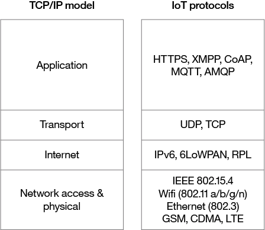

---
also_found_in:
- learningpaths/iot-getting-started-iot-development/
authors: ''
completed_date: '2017-05-23'
draft: false
duration: 1 hour
excerpt: Learn about widely adopted technologies and standards for IoT networking
  and why you might choose one network protocol over another.
ignore_prod: false
last_updated: '2020-01-31'
meta_description: In this guide for IoT connectivity, learn about widely adopted technologies
  and standards for IoT networking and why you might choose one network protocol over
  another. Also, learn about the key considerations and challenges related to networking
  technologies in IoT.
meta_keywords: IoT, networking, connectivity
primary_tag: iot
related_content:
- slug: iot-getting-started-iot-development
  type: learningpaths
- slug: iot-next-steps-iot-development
  type: learningpaths
subtitle: A guide to selecting network technologies to solve your IoT networking challenges
tags:
- iot
title: Connecting all the things in the Internet of Things
---

<!-- <sidebar> <heading>Learning path: Getting started with IoT development</heading> 
This article is part of the IoT 101 learning path, a quick-start guide for IoT developers.
 <ul> <li> [IoT concepts and skills](/articles/iot-key-concepts-skills-get-started-iot)</li> <li> [IoT hardware guide](/articles/iot-lp101-best-hardware-devices-iot-project)</li> <li>IoT networking guide (this article)</li> <li> [IoT platforms](/articles/iot-lp101-why-use-iot-platform/)</li> <li> [Tutorial: Build a smart doorbell](/tutorials/iot-lp101-get-started-develop-iot-home-automation/)</li></ul></sidebar> -->

Networking technologies enable IoT devices to communicate with other devices, applications, and services running in the cloud. The internet relies on standardized protocols to ensure communication between heterogeneous devices is secure and reliable. Standard protocols specify rules and formats that devices use to establish and manage networks and transmit data across those networks.

Networks are built as a "stack" of technologies. A technology such as Bluetooth LE is at the bottom of the stack.  While others such as such as IPv6 technologies (which is responsible for the logical device addressing and routing of network traffic) are further up the stack. Technologies at the top of the stack are used by the applications that are running on top of those layers, such as message queuing technologies.

This article describes widely adopted technologies and standards for IoT networking. It also provides guidance for choosing one network protocol over another. It then discusses key considerations and challenges related to networking within IoT: range, bandwidth, power usage, intermittent connectivity, interoperability, and security.

## Networking standards and technologies

The Open Systems Interconnection (OSI) model is an ISO-standard abstract model is a stack of seven protocol layers. From the top down, they are: application, presentation, session, transport, network, data link and physical. TCP/IP, or the [Internet Protocol suite](https://en.wikipedia.org/wiki/Internet_protocol_suite), underpins the internet, and it provides a simplified concrete implementation of these layers in the OSI model.

 <figure> <heading refname="ositcpmodels">OSI and TCP/IP networking models</heading> </img></figure>

 
The TCP/IP model includes only four layers, merging some of the OSI model layers:

* **Network Access & Physical Layer**   This TCP/IP Layer subsumes both OSI layers 1 and 2. The physical (PHY) layer (Layer 1 of OSI) governs how each device is physically connected to the network with hardware, for example with an optic cable, wires, or radio in the case of wireless network like wifi IEEE 802.11 a/b/g/n). At the link layer (Layer 2 of OSI), devices are identified by a MAC address, and protocols at this level are concerned with physical addressing, such as how switches deliver frames to devices on the network.

* **Internet Layer**   This layer maps to the OSI Layer 3 (network layer).   OSI Layer 3 relates to logical addressing. Protocols at this layer define how routers deliver packets of data between source and destination hosts identified by IP addresses. IPv6 is commonly adopted for IoT device addressing.

* **Transport Layer**   The transport layer (Layer 4 in OSI) focuses on end-to-end communication and provides features such as reliability, congestion avoidance, and guaranteeing that packets will be delivered in the same order that they were sent. UDP (User Datagram protocol) is often adopted for IoT transport for performance reasons.

* **Application Layer**   The application layer (Layers 5, 6, and 7 in OSI) covers application-level messaging. HTTP/S is an example of an application layer protocol that is widely adopted across the internet.

Although the TCP/IP and OSI models provide you with useful abstractions for discussing networking protocols and specific technologies that implement each protocol, some protocols don’t fit neatly into these layered models and are impractical. For example, the Transport Layer Security (TLS) protocol that implements encryption to ensure privacy and data integrity of network traffic can be considered to operate across OSI layers 4, 5, and 6.

## IoT networking protocols

Some of the networking protocols that are widely adopted within IoT and where they fit within the TCP/IP layers are shown in Figure 2.

 <figure> <heading refname="iotnp">IoT network protocols mapped to the TCP/IP model</heading> </img></figure>

 

Many emerging and competing networking technologies are being adopted within the IoT space. Multiple technologies from different vendors, target different vertical markets - home automation, healthcare, or industrial IoT - and provide alternative implementations of the same standard protocols. For example, [IEEE 802.15.4](https://en.wikipedia.org/wiki/IEEE_802.15.4) describes the operation of low-rate wireless personal area networks (LR-WPANs) and is implemented by several competing technologies including ZigBee, Z-Wave, EnOcean, SNAP, and 6LoWPAN.

Technologies used for internet connectivity, such as Ethernet, can be applied within the IoT. As you look further down the stack toward physical transmission technologies, you face more challenges that are specific to IoT devices and IoT contexts.

The structure of a network is known as its topology. The most common [network topologies](https://en.wikipedia.org/wiki/Network_topology) that are adopted within IoT are star and mesh topologies. In a star topology, each IoT device is directly connected to a central hub (gateway) that communicates with data from the connected devices upstream. In mesh topologies, devices connect to other devices within range. Nodes within the network can act as simple sensor nodes. Sensor nodes route traffic as can gateway nodes. Mesh networks are more complex than networks with star topologies. They are less prone to failure as they do not rely on a single central gateway.

### Network access and physical layer IoT network technologies

IoT network technologies to be aware of toward the bottom of the protocol stack include cellular, wifi, and Ethernet, as well as more specialized solutions such as LPWAN, Bluetooth Low Energy (BLE), ZigBee, NFC, and RFID.

 <sidebar> 
 NB-IoT is becoming the standard for LPWAN networks, according to Gartner. This <a href="https://iot-for-all.com/what-is-narrowband-iot-nb-iot/">IoT for All article</a> tells more about NB-IoT.
</sidebar>

The following are network technologies with brief descriptions of each:

* **LPWAN**   ([Low Power Wide Area Network](https://en.wikipedia.org/wiki/LPWAN)) is a category of technologies designed for low-power, long-range wireless communication. They are ideal for  large-scale deployments of low-power IoT devices such as wireless sensors. LPWAN technologies include LoRa (LongRange physical layer protocol), Haystack, SigFox, LTE-M, and NB-IoT (Narrow-Band IoT).  
* **Cellular**   The LPWAN [NB-IoT](https://en.wikipedia.org/wiki/NarrowBand_IOT) and [LTE-M](https://www.link-labs.com/blog/what-is-lte-m) standards address low-power, low-cost IoT communication options using existing cellular networks. NB-IoT is the newest of these standards and is focused on long-range communication between large numbers of primarily indoor devices. LTE-M and NB-IoT were developed specifically for IoT, however existing cellular technologies are also frequently adopted for long-range wireless communication. While this has included 2G (GSM) in legacy devices (and currently being phased out), CDMA (also being retired or phased out), it also includes 3G, which is rapidly being phased out with several network providers retiring all 3G devices. 4G is still active and will be until 5G becomes fully available and implemented.  
* **Bluetooth Low Energy (BLE)**  [BLE](https://en.wikipedia.org/wiki/Bluetooth_low_energy) is a low-power version of the popular Bluetooth 2.4 GHz wireless communication protocol. It is designed for short-range (no more than 100 meters) communication, typically in a star configuration, with a single primary device that controls several secondary devices. Bluetooth operates across both layers 1 (PHY) and 2 (MAC) of the OSI model. BLE is best suited to devices that transmit low volumes of data in bursts. Devices are designed to sleep and save power when they are not transmitting data. Personal IoT devices such as  wearable health and fitness trackers, often use BLE. 
* **ZigBee**  [ZigBee](https://zigbee.org/zigbee-for-developers/zigbee-3-0/) operates on 2.4GHz wireless communication spectrum. It has a longer range than BLE by up to 100 meters. It also has a slightly lower data rate (250 kbps maximum compared to 270 kbps for BLE) than BLE. ZigBee is a mesh network protocol. Unlike BLE, not all devices can sleep between bursts. Much depends on their position in the mesh and whether they need to act as routers or controllers within the mesh. ZigBee was designed for building and home automation applications. Another closely related technology to ZigBee is Z-Wave, which is also based on IEEE 802.15.4. Z-Wave was designed for home automation.  
* **NFC**   The [near field communication (NFC)](https://en.wikipedia.org/wiki/Near_field_communication) protocol is used for very small range communication (up to 4 cm), such as holding an NFC card or tag next to a reader. NFC is often used for payment systems, but also useful for check-in systems and smart labels in asset tracking.  
* **RFID**  [RFID](https://en.wikipedia.org/wiki/Radio-frequency_identification) stands for Radio Frequency Identification. RFID tags store identifiers and data. The tags are attached to devices and read by an RFID reader. The typical range of RFID is less than a meter. RFID tags can be active, passive, or assisted passive. Passive tags are ideal for devices without batteries, as the ID is passively read by the reader. Active tags periodically broadcast their ID, while assisted passive tags become active when RFID reader is present.  [**Dash7**](http://www.dash7-alliance.org/) is a communication protocol that uses active RFID that is designed to be used within Industrial IoT applications for secure long-range communication. Similar to NFC, a typical use case for RFID is tracking inventory items within retail and industrial IoT applications.  
* **Wifi**  [Wifi](https://en.wikipedia.org/wiki/Wi-Fi) is standard wireless networking based on IEEE 802.11a/b/g/n specifications. 802.11n offers the highest data throughput, but at the cost of high-power consumption, so IoT devices might only use 802.11b or g for power conservation reasons. Although wifi is adopted within many prototype and current generation IoT devices, as longer-range and lower-power solutions become more widely available, it is likely that wifi will be superseded by lower-power alternatives.  
* **Ethernet**   Widely deployed for wired connectivity within local area networks, [Ethernet](https://en.wikipedia.org/wiki/Ethernet) implements the IEEE 802.3 standard. Not all IoT devices need to be stationery wireless . For example, sensor units installed within a building automation system can use wired networking technologies like Ethernet. Power line communication (PLC), an alternative hard-wired solution, uses existing electrical wiring instead of dedicated network cables.

#### The dawn of 5G networks

5G is the next generation of wireless networks. It builds existing 4G Long-Term Evolution (LTE) infrastructure. Notably, bandwidth is improved. But so is capacity, and reliability of wireless service.

5G is ideal for more data and communication requirements brought for the by the billions of connected devices that will make up the Internet of Things (IoT).  It also aids the ultra-low latency requirement for real-time communications. It is an all-new data pipeline that serves as the plumbing for every signal, from every device, that uses the Internet. It can handle dense data.

It is fast - about twenty times faster than 4G, enabling the user to download video, say, in just 17 seconds. It is a boost to our connected world in the age of IoT, and a discernible boost to what IoT can accomplish in the future.

The arrival and full implementation of 5G is still in early implementation; soon it will be old. Rest assured, it will make our world better, our lives better, and allow the fruits of technology to shine with a tad more luster than ever before as data moves in greater volumes, quicker than ever.

### Internet layer IoT network technologies

Internet layer technologies (OSI Layer 3) identify and route packets of data. Technologies commonly adopted for IoT are related to this layer, and include IPv6, 6LoWPAN, and RPL.

* **IPv6**   At the Internet layer, devices are identified by IP addresses. IPv6 is typically used for IoT applications over legacy IPv4 addressing. IPv4 is limited to 32-bit addresses, which only provide around 4.3 billion addresses in total, which is less than the current number of IoT devices that are connected, while IPv6 uses 128 bits, and so provides 2 128 addresses (around 3.4 × 10 38 or 340 billion billion billion billion) addresses. In practice, not all IoT devices need public addresses. Of the tens of billions of devices expected to connect via the IoT over the next few years, many will be deployed in private networks that use private address ranges and only communicate out to other devices or services on external networks by using gateways. 
* **6LoWPAN**   The [IPv6 Low Power Wireless Personal Area Network (6LoWPAN)](https://en.wikipedia.org/wiki/6LoWPAN) standard allows IPv6 to be used over 802.15.4 wireless networks. 6LoWPAN is often used for wireless sensor networks, and the [Thread](http://threadgroup.org/) protocol for home automation devices also runs over 6LoWPAN.  
* **RPL**   The Internet Layer also covers routing. [IPv6 Routing Protocol for Low-Power and Lossy Networks (RPL)](https://datatracker.ietf.org/doc/html/rfc6550) is designed for routing IPv6 traffic over low-power networks like those networks implemented over 6LoWPAN. RPL (pronounced "ripple") is designed for routing packets within constrained networks such as wireless sensor networks, where not all devices are reachable at all times and there are high or unpredictable amounts of packet loss. RPL can compute the optimal path by building up a graph of the nodes in the network based on dynamic metrics and constraints like minimizing energy consumption or latency.

### Application layer IoT network technologies

HTTP and HTTPS are ubiquitous across internet applications, which is true also within IoT, with RESTful HTTP and HTTPS interfaces widely deployed. CoAP (Constrained Application Protocol) is like a lightweight HTTP that is often used in combination with 6LoWPAN over UDP. Messaging protocols like MQTT, AMQP, and XMPP are also frequently used within IoT applications:

* **MQTT**  [Message Queue Telemetry Transport (MQTT)](http://mqtt.org/) is a publish/subscribe-based messaging protocol that was designed for use in low bandwidth situations, particularly for sensors and mobile devices on unreliable networks.  
* **AMQP**  [Advanced Message Queuing Protocol (AMQP)](https://en.wikipedia.org/wiki/Advanced_Message_Queuing_Protocol) is an open standard messaging protocol that is used for message-oriented middleware. Most notably, AMQP is implemented by [RabbitMQ](https://www.rabbitmq.com/).  
* **XMPP**   The [Extensible Messaging and Presence Protocol (XMPP)](https://en.wikipedia.org/wiki/XMPP) was originally designed for real-time human-to-human communication including instant messaging. This protocol has been adapted for machine-to-machine (M2M) communication to implement lightweight middleware and for routing XML data. XMPP is primarily used with smart appliances.

Your choice of technologies at this layer will depend on the specific application requirements of your IoT project. For example, for a budget home automation system that involves several sensors, MQTT would be a good choice as it is great for implementing messaging on devices without much storage or processing power because the protocol is simple and lightweight to implement.

## IoT networking considerations and challenges

When you consider which networking technologies to adopt within your IoT application, be mindful of the following constraints:

* Range
* Bandwidth
* Power usage
* Intermittent connectivity
* Interoperability
* Security

### Range

Networks can be described in terms of the distances over which data is typically transmitted by the IoT devices attached to the network:

* **PAN (Personal Area Network)**   PAN is short-range, where distances can be measured in meters, such as a wearable fitness tracker device that communicates with an app on a cell phone over BLE.  
* **LAN (Local Area Network)**   LAN is short- to medium-range, where distances can be up to hundreds of meters, such as home automation or sensors that are installed within a factory production line that communicate over wifi with a gateway device that is installed within the same building.  
* **MAN (Metropolitan Area Network)**   MAN is long-range (city wide), where distances are measured up to a few kilometers, such as smart parking sensors installed throughout a city that are connected in a mesh network topology.  
* **WAN (Wide Area Network)**   WAN is long-range, where distances can be measured in kilometers, such as agricultural sensors that are installed across a large farm or ranch that are used to monitor micro-climate environmental conditions across the property.

Your network should retrieve data from the IoT devices and transmit to its intended destination. Select a network protocol that matches the range is required. For example, do not choose BLE for a WAN application to operate over a range of several kilometers. If transmitting data over the required range presents a challenge, consider edge computing. Edge computing analyzes data directly from the devices rather than from a distant data center or elsewhere.

### Bandwidth

Bandwidth is the amount of data that can be transmitted  per unit of time.  It limits the rate at which data can be collected from IoT devices and transmitted upstream. Bandwidth is affected by  many factors, which include:

* The volume of data each device gathers and transmits
* The number of devices deployed
* Whether data is being sent as a constant stream or in intermittent bursts, and if any peak periods are notable

The packet size of the networking protocol should match up with the volume of data typically transmitted. It is inefficient to send packets padded with empty data.  In contrast, there are overheads in splitting larger chunks of data up across too many small packets. Data transmission rates are not always symmetrical (that is, upload rates might be slower than download rates). So, if there is two-way communication between devices, data transmission needs to be factored in. Wireless and cellular networks are traditionally low bandwidth, so consider whether a wireless technology is the right choice for high-volume applications.

Consider whether all raw data must be transmitted. A possible solution is to capture less data by sampling less frequently. Thus, you’ll capture fewer variables and may filter data from the device to drop insignificant data. If you aggregate the data before you transmit it, you reduce the volume of data transmitted. But this process affects flexibility and granularity in the upstream analysis. Aggregation and bursting are not always suitable for time-sensitive or latency-sensitive data. All of these techniques increase the data processing and storage requirements for the IoT device.

### Power usage

Transmitting data from a device consumes power. Transmitting data over long ranges requires more power than over a short range. You must consider the power source – such as a battery, solar cell, or capacitor -  of a device and its total lifecycle. A long and enduring lifecycle will not only provide greater reliability but reduce operating cost. Steps may be taken to help achieve longer power supply lifecycles.  For example, to prolong the battery life, you can put the device into sleep mode whenever it is idle. Another best practice is to model the energy consumption of the device under different loads and different network conditions to ensure that the device's power supply and storage capacity matches with the power that is required to transmit the necessary data by using the networking technologies that you adopted.

### Intermittent connectivity

IoT devices aren't always connected. In some cases, devices are designed to connect periodically. However, sometimes an unreliable network might cause devices to drop off due to connectivity issues. Sometimes quality of service issues, such as dealing with interference or channel contention on a wireless network using a shared spectrum. Designs should incorporate intermittent connectivity and seek any available solutions to provide uninterrupted service, should that be a critical factor for IoT landscape design.

### Interoperability

Devices work with other devices, equipment, systems, and technology; they are interoperable.  With so many different devices connecting to the IoT, interoperability can be a challenge. Adopting standard protocols has been a traditional approach for maintaining interoperability on the Internet. Standards are agreed upon by industry participants and avoid multiple different designs and directions.  With proper standards, and participants who agree to them, incompatibility issues, hence interoperability issues may be avoided.

However, for the IoT, standardization processes sometimes struggle to keep up with innovation and change.  They are written and  released based on upcoming versions of standards that are still subject to change. Consider the ecosystem around the technologies: Are they widely adopted? Are they open versus proprietary? How many implementations are available?

Using these questions to plan your IoT networks help plan better interoperability for a more robust IoT network.

### Security

Security is a priority. Selection of networking technologies that implement end-to-end security, including authentication, encryption, and open port protection is crucial. IEEE 802.15.4 includes a security model that provides security features that include access control, message integrity, message confidentiality, and replay protection, which are implemented by technologies based on this standard such as ZigBee.

Consider the following factors in shaping a secure and safe IoT network: 

* **Authentication**   Adopt secure protocols to support authentication for devices, gateways, users, services, and applications. Consider using adopting the X.509 standard for device authentication.  
* **Encryption**   If you are  using wifi, use Wireless Protected Access 2 (WPA2) for wireless network encryption. You may also adopt a Private Pre-Shared Key (PPSK) approach. To ensure privacy and data integrity for communication between applications, be sure to adopt TLS or Datagram Transport-Layer Security (DTLS), which is based on TLS, but adapted for unreliable connections that run over UDP. TLS encrypts application data and ensures its integrity.  
* **Port protection**   Port protection ensures that only the ports required for communication with the gateway or upstream applications or services remain open to external connections. All other ports should be disabled or protected by firewalls. Device ports might be exposed when exploiting Universal Plug and Play (UPnP) vulnerabilities. Thus, UPnP should be disabled on the router.

## Conclusion

Proper selection of IoT networking technologies requires compromise. Selected networking technologies will impact the design of IoT devices. The considerations suggested in this article depend on many factors. For example, network range, data rate, and power consumption are all directly related. If you increase the network range or rate and volume of data that is transmitted, your IoT devices will  certainly require additional power to transmit the data under those conditions.

For basic home automation, the power consideration criterion is likely of low importance; the device would most likely be powered directly from a wall socket. Bandwidth limitations and drop-outs in connectivity are higher priorities. Wifi  provides reasonable bandwidth and expedites the project by using commodity hardware. However, wifi is not optimized for low-power devices, making it an unwise choice for a battery-powered device.

This article provides an overview of some of the most common networking protocols and technologies for IoT. It is most important to consider your requirements in light of these IoT networking challenges to find the technologies that will be the best fit for your IoT application.