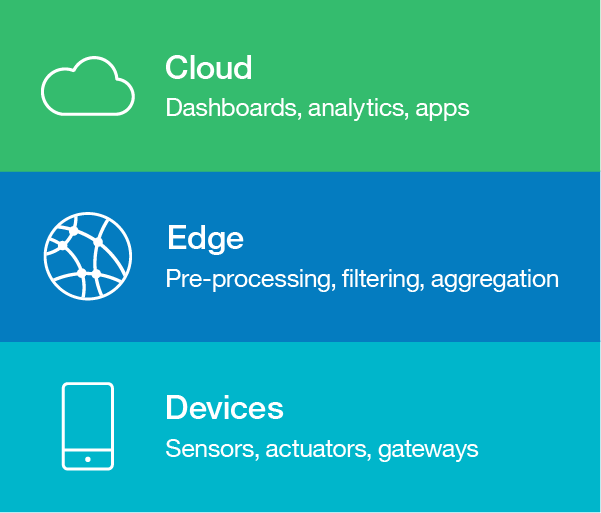

<!-- <サイドバー> <見出し>ラーニングパス。Building skills in IoT development</heading> 
このチュートリアルは、IoTの開発者向けガイドであるIoT 201 learning pathの一部です。
 <ul> <li> [IoTアーキテクチャ](/articles/iot-lp201-iot-architectures/)</li> <li> [IoTセキュリティの課題](/articles/iot-top-10-iot-security-?challenges/)</li> <li>[IoTデータアナリティクス](/tutorials/iot-lp301-iot-manage-data)</li><li>[IoTデバイスマネジメント](/tutorials/iot-lp301-device-management)</li> <li>[Tutorial:Build a door monitoring system](/tutorials/iot-lp201-build-door-monitoring-system)</li></ul></sidebar> -->

IoTのユースケースは、様々な業界に広がっています。典型的なIoTソリューションには、多くの異機種のIoTデバイスが含まれ、異なるフォーマットのデータを異なる速度で生成するセンサーがあり、それらを処理・分析して洞察を得ることになります。IoTデバイスは、ネットワークに直接接続するか、ゲートウェイデバイスを介してネットワークに接続し、デバイス同士やクラウドサービス、アプリケーションとの通信を可能にします。

このような複雑さの中で、IoTシステムのアーキテクチャー計画は困難を極めることになります。

 <figure> <heading refname="ibmmodel">Internet of Thingsのヒューマンビュー（出典：X-Force Research and Development, "Human view of Things"）。X-Force Research and Development, "IBM X-Force Threat Intelligence Quarterly 4Q 2014," Doc # WGL03062USEN, Publish Date:2014年11月。http://www.ibm.com/security/xforce/downloads.html)</heading> </img></figure> です。

この記事では、データ駆動型のIoTアーキテクチャを計画する際に適用できる、以下の戦略について説明します。これらの戦略は、開発を簡素化し、複雑さを管理し、IoTソリューションが拡張性、柔軟性、および堅牢性を維持するのに役立ちます。

* レイヤード・アーキテクチャの採用
* セキュリティ・バイ・デザイン
* オペレーションの自動化
* 相互運用性を考慮した設計
* リファレンス・アーキテクチャの採用

## ♪ ♪ レイヤード・アーキテクチャーを採用する

アーキテクチャは、物理的な側面（つまり、センサーやアクチュエーターなどのデバイス）と、仮想的な側面（サービスや通信プロトコルなど）を含む、IoTソリューションの構造を説明します。アーキテクチャーを複数の層に分け、各層に独立して焦点を当てるモジュラーアプローチは、IoTシステムの複雑さを管理するのに役立ちます。

IoTアーキテクチャでは、作業をIoTネットワークのエッジ（物理デバイスがクラウドに接続する場所）にオフロードする傾向が見られます。これにより、データ駆動型のIoTアプリケーションにおいて、遅延の削減、プライバシーの向上、帯域幅コストの削減が可能になります。

エッジアナリティクスを含むデータ駆動型IoTアプリケーションでは、次の図に示すような基本的な3層構造のアーキテクチャにより、デバイスからエッジサービス、そしてクラウドサービスへの情報の流れを把握することができます。より詳細なIoTアーキテクチャでは、アイデンティティ管理、アクセス制御、データセキュリティなど、他の層にまたがる垂直の層も含まれます。

 <figure> <heading refname="archlayers">Layers of an IoT architecture</heading> </img></figure>

### デバイス層

 <sidebar> 
IoTデバイスの特徴については、こちらの[IoTハードウェアガイド](/articles/iot-lp101-best-hardware-devices-iot-project)をご覧ください。
 
ネットワーク技術については、こちらの[IoTコネクティビティガイド](/articles/iot-lp101-connectivity-network-protocols)をご覧ください。</sidebar>

 デバイス層のコンポーネント（図2の下部に表示）には、IoTデバイスに接続される物理的なセンサーやアクチュエーター、そしてIoTデバイス自体が含まれます。センサーやアクチュエーター単体では、一般的に「スマート」なデバイスとはみなされませんが、センサーやアクチュエーターは、より多くの処理能力を持つアーキテクチャのコンポーネントに、直接的または間接的（ゲートウェイデバイスの助けを借りて）に接続されることが多いです。

これらのデバイスは通常、Bluetooth、Zigbee、wifi、セルラー、RFIDなどの無線プロトコル、またはイーサネットなどの有線プロトコルで情報を送信します。最近では、Wi-Fi 6、Bluetooth 5、Thread（IPv6ベースのZigbeeに似たプロトコル）などの新しいバージョンの無線プロトコルがリリースされ、バッテリーの節約、通信距離、コスト、速度の面でIoTシステムをより効率的に利用できるようになっています。

IoTデバイスは、基本的なIoTデバイスよりもわずかに処理能力の高い中間デバイスであるゲートウェイを介して上流側と通信するのが一般的です。ゲートウェイには必ずしもセンサーが直接接続されているわけではありませんが、データ取得のプロセスにおいて重要な役割を果たします。ゲートウェイ・デバイスは、生のセンサー・データの読み取りに対して、基本的なアナログ／デジタル変換、スケーリング、その他の標準化を行うことができます。

### エッジ層

エッジ層（図2の中間層）は、ネットワークのエッジに位置する分析および前処理サービスに関連しています。この層は、下流の層（デバイス層）との統合ハブの役割を果たします。アップストリーム層にルーティングやデバイスコントロールの機能を提供します。この層はパブサブシステムに接続され、イベントを中継したり、イベントを聞いたりすることがあります。

エッジアナリティクスは、センサーから入力されたデータが収集された時点で、データのストリームを処理することにより、リアルタイム（またはほぼリアルタイム）で行われます。データのフィルタリングやアグリゲーションなどの基本的な前処理タスクはエッジで実行され、前処理された主要なデータは、さらなる処理や分析のためにクラウドサービスやアプリケーションにアップストリーム転送されます。このレイヤーに統合可能なオープンソース技術としては、[Eclipse Kapua](https://www.eclipse.org/kapua/)、[Apache Camel](https://camel.apache.org/)、[Apache ActiveMQ](https://activemq.apache.org/)などがあります。

エッジはパブリックネットワーク（インターネット）との最初の接点となることが多いため、この層ではセキュリティとアクセス制御が最大の関心事となります。多くの攻撃は、アーキテクチャの他のコンポーネントと比較して、ゲートウェイとエッジをターゲットにしています。

### クラウド層

データの準備が完了した後、データは上流に送られ、クラウド層（図2の最上位層）で処理、保存、クラウド・アプリケーション内での使用が行われます。このデータは、統計的な分析に使用されたり、機械学習パイプラインに供給されて、洞察力を発見し、意思決定を行うことができます。

データ処理を行うクラウドアプリケーションは、多くの場合、モバイルアプリケーションやウェブベースのクライアントアプリケーションによって補完されています。これらのアプリケーションは、データをダッシュボードのようなインターフェースでエンドユーザーに提示し、ダッシュボードやビジュアライゼーションによってさらに調査や分析を行うためのツールを提供します。また、これらのアプリケーションは、システム全体のハイレベルな管理やモニタリングのためのインターフェースを提供し、他のシステムが既存のシステムを利用したり、その上に構築したりすることを可能にするパブリックAPIのような規定も提供しています。

## "Security by Design "の実装

IoTソリューションでエンドツーエンドのセキュリティを実現するためには、IoTアーキテクチャのすべての層でセキュリティを優先しなければなりません。セキュリティは、IoTアーキテクチャの独立したレイヤーとしてではなく、IoTアーキテクチャにおける横断的な問題として考える必要があります。多くのデバイスが接続されているため、個々のデバイスやゲートウェイが危険にさらされても、システム全体としての整合性を維持する必要があります。アーキテクチャが複数の防御層をサポートしていることを確認してください。また、IoTソリューションでは、ゲートウェイを使用して脆弱なデバイスを隔離したり、通信や使用パターンを監視して異常を検知するなど、侵害されたデバイスを特定して無力化できるようにしてください。

IoTインフラのこれらの側面については、標準やベストプラクティスを採用する必要があります。

* デバイス、アプリケーション、ユーザのアイデンティティ
* 認証、承認（2FA）、および役割に基づくアクセス・コントロール
* 暗号化キーと証明書の管理
* セキュアな通信チャネルとメッセージの完全性（暗号化の使用による）
* デバイスの健全性を監視するための継続的な遠隔測定データ
* 頻繁な監査
* 機密・重要データの分類、暗号化されたストレージ。
* プロトコルのセキュリティ、アップデートの安全な配信

## オペレーションの自動化

IoT アーキテクチャが、すべての層で自動化とオーケストレーションをサポートしていることを確認してください。IoTソリューションをロールアウトする際には、これらの自動化機能を使用することを計画し、迅速かつ容易な開発と展開をサポートできるようにします。例えば、エッジやクラウドレイヤーでのマイクロサービスアーキテクチャは、[コンテナ技術](/articles/iot-docker-containers/)を使用して実装し、[Kubernetes](/components/kubernetes/)などのツールを使用してオーケストレーションを行うことができます。

これらの機能により、新しいデバイスやゲートウェイを設定したり、デバイスのデータを処理するためにクラウドアプリケーションの新しいインスタンスをデプロイしたりするようなオペレーションが、エラーを起こしにくくなります。これは、何千、何百万ものデバイスが接続されたIoTソリューションにスケールアップするためには不可欠です。理想的には、システムがリモートで、設定の変更、新しいデバイスのプロビジョニングと検出、アップデートの送信、グレースフル・デプロイメントを可能にすることです。優雅なデプロイメントには、実際のアップデートを行う前にデバイスのテストを実行する機能や、テストの失敗や停電など何らかの理由でアップデートが失敗した場合のロールバック戦略の実装などが含まれます。

## 相互運用性の設計

IoTソリューションに採用するデバイス、ネットワークプロトコル、データフォーマットの多様性は、IoTのアーキテクチャ上の最大の課題の1つです。IoTソリューションに複数のIoTプラットフォームを採用する場合、各IoTプラットフォーム内で使用されている技術を統合して、まとまったソリューションにできるかどうかを検討する必要があります。

IoTの相互運用性を維持するための最良の戦略の一つは、標準規格を採用することです。標準規格は、新しいコンポーネントがすでに採用している同じ標準規格に準拠している限り、コンポーネントの切り替えや追加導入、オープンソースツールの活用などを柔軟に行うことができます。

また、リファレンス・アーキテクチャは、IoTアーキテクチャを計画する際に役立つガイドラインを提供します。リファレンス・アーキテクチャーは通常、標準規格に基づいており、デザインパターンやベストプラクティスが集約されています。リファレンス・アーキテクチャを採用し、リファレンス・アーキテクチャに記載されているガイドラインに従ってそれらを実装したIoTプラットフォームを選択することは、IoTアーキテクチャ内の相互運用性を維持するための確実な戦略となります。

## リファレンス・アーキテクチャーに従う

現在、相互運用性を向上させるために、IoTアーキテクチャの標準化に向けた多くの取り組みが行われています。IoTプラットフォームのベンダーや研究パートナーは、これらのイニシアチブを通じて協力し、IoTリファレンス・アーキテクチャを定義しています。リファレンス・アーキテクチャーは、IoTソリューションで使用されるハイレベルなビルディング・ブロックを記述し、主要なアーキテクチャー・コンセプトの共通用語を確立することで、アーキテクチャーの基盤として機能します。これらのイニシアチブは、幅広い既存のソリューションを利用して、効果的なデザインパターンやベストプラクティスを明らかにします。

広く参照されているIoTリファレンス・アーキテクチャーには以下のものがあります。

* [Internet of Things - Architecture (IoT-A)](http://www.meet-iot.eu/deliverables-IOTA/D1_5.pdf)があります。IoT-Aのリファレンスモデルとアーキテクチャは、2013年にEUのライトハウスプロジェクトで開発されました。IoT-Aは、様々なドメインに適用可能な具体的なアーキテクチャを開発するために構築されるよう設計されています。
* [IEEE P2413 - Standard for an Architectural Framework for the Internet of Things (IoT):](https://standards.ieee.org/standard/2413-2019.html) 現在進行中のIEEE標準化プロジェクトで、製造業、スマートビルディング、スマートシティ、インテリジェント交通システム、スマートグリッド、ヘルスケアなどのIoTドメイン間の共通点を特定することを目的としています。
* [Industrial Internet Reference Architecture (IIRA)](https://www.iiconsortium.org/IIC_PUB_G1_V1.80_2017-01-31.pdf?cm_mc_uid=42240287207114889661528&cm_mc_sid_50200000=1498959849) - IIRAは、AT&T、Cisco、General Electric、IBM、Intelが2014年3月に設立したIndustrial Internet Consortiumによって、産業用IoTアプリケーションに特化して開発されました。

リファレンスアーキテクチャーは、IoTソリューションを開発する際のテンプレートとして使用することができます。上に挙げたアーキテクチャは、IoTのアーキテクチャコンポーネントとその機能をハイレベルな言葉で説明していますが、抽象的な要件を特定のテクノロジーやテクノロジースタックにマッピングすることで、より具体的なものにすることができます。

### IoTリファレンスアーキテクチャの構成要素

リファレンス・アーキテクチャーの詳細はアプリケーション・ドメインによって異なりますが、多くのIoTリファレンス・アーキテクチャーは少なくとも以下の機能を記述しています。

* デバイスとそのデータの管理
* 接続と通信
* 分析とアプリケーション

さらに、リファレンス・アーキテクチャーには、柔軟性、信頼性、サービス品質、相互運用性、統合性などの非機能要件に対応するための仕組みも記述されているのが一般的です。

#### デバイスとそのデータの管理

リファレンス・アーキテクチャのデバイス管理の側面は、デバイス、そのアイデンティティ、およびそのライフサイクルの管理に関するものです。リファレンス・アーキテクチャーでは

* デバイスのオンボーディング (レジストリとアイデンティティ)
* アップデート管理とデプロイメント
* コンフィグレーション管理
* デバイスの無効化、有効化、廃止などの操作によるリモートコントロール

IoTデバイスの管理については、こちらのチュートリアル「[Managing your IoT devices](/learningpaths/iot-next-steps-iot-development/manage-iot-device/)」で詳しく説明しています。"

#### 接続性と通信

デバイス間、デバイスとゲートウェイ間、ゲートウェイとクラウドサービスおよびアプリケーション間の接続性および双方向通信の管理は、IoTリファレンスアーキテクチャ内でよく説明されるもう1つの重要な能力です。エッジコンピューティングには、イベントドリブン型のアーキテクチャが適しており、デバイスとサービス間の通信にはパブリッシュ／サブスクライブプロトコルとメッセージブローカーが使用されます。

#### アナリティクスとアプリケーション

IoTデバイスから送られてくるデータから価値を引き出すために、クラウド・アプリケーションは、データのストリームまたはバッチを操作して実用的な洞察を見出すための可視化および分析ツールを提供します。ユースケースに応じて、意思決定管理ツールやビジネスプロセスツールがアラートを発したり、それに対応したアクションを実行します。

IoT分析については、こちらのチュートリアル「[Making sense of IoT data](/learningpaths/iot-next-steps-iot-development/manage-iot-data/)」で詳しく説明しています。

### 具体的なリファレンスアーキテクチャー

リファレンスアーキテクチャで提供されることの多いパターンやガイドラインは、産業用IoTなど特定のIoTドメイン内から引き出されたものであったり、さまざまなドメインのソリューションから一般化されたものであったりします。ハイレベルで一般化されたアーキテクチャーは、より具体的なドメイン固有またはプラットフォーム固有のアーキテクチャーを作成するためのテンプレートとして使用できます。

 <sidebar> 
IoTプラットフォームについては、こちらの[IoTプラットフォームガイド](/articles/iot-lp101-why-use-iot-platform/)で詳しく解説していますので、ぜひご覧ください。

汎用IoTプラットフォームのベンダーは、より応用性の高いリファレンス・アーキテクチャと、プラットフォームが提供するツールやソフトウェア・エージェントを使ってリファレンス・アーキテクチャに準拠したIoTソリューションを開発するための実装ガイドを提供していることが多い。IoTプラットフォームを中心としたリファレンス・アーキテクチャーには、以下のようなものがあります。

* [IBM IoTリファレンス・アーキテクチャ](https://www.ibm.com/devops/method/content/architecture/iotArchitecture)
* [Intel IoTプラットフォーム・リファレンス・アーキテクチャ](https://www.intel.com.au/content/www/au/en/internet-of-things/white-papers/iot-platform-reference-architecture-paper.html)
* [Microsoft Azure IoT Architecture](https://azure.microsoft.com/en-au/updates/microsoft-azure-iot-reference-architecture-available/)
* [Amazon Web Services Pragma Architecture](https://aws.amazon.com/blogs/startups/iot-a-small-things-primer/)

[IBM Industrie 4.0](https://www.ibm.com/devops/method/content/architecture/iotArchitecture/industrie_40)参照アーキテクチャは、ドメイン固有の参照アーキテクチャの一例で、IIRA参照アーキテクチャとIBM IoT参照アーキテクチャをベースに、産業用IoTアプリケーション向けに設計されています。

## 結論

データ駆動型のIoTソリューションの設計は、関係するデバイスや接続性の規模や異種性のために複雑です。この記事では、安全性、柔軟性、拡張性に優れたIoTアーキテクチャを設計するための戦略をご紹介しました。