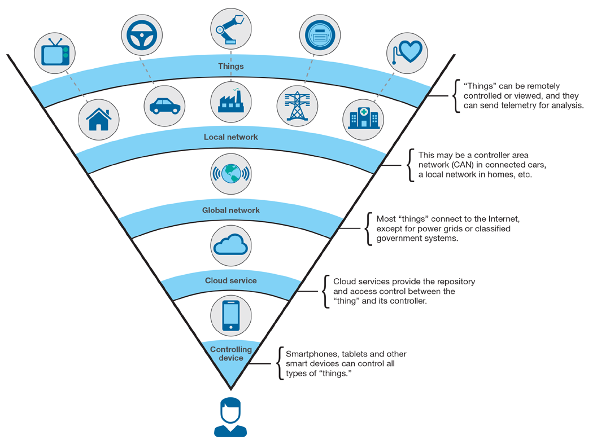
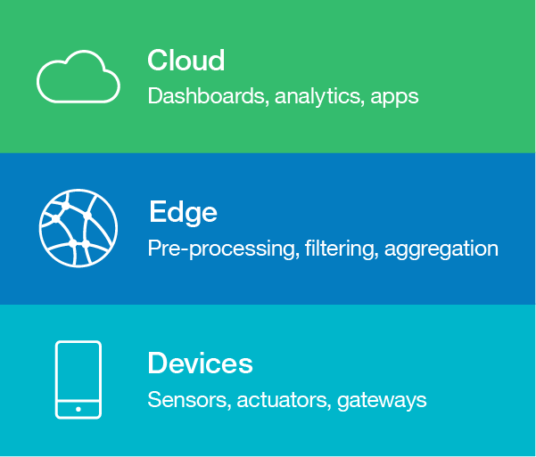

<!-- <sidebar> <heading>Learning path: Building skills in IoT development</heading> 
This tutorial is part of the IoT 201 learning path, an developer guide for IoT.
 <ul> <li> [IoT architectures](/articles/iot-lp201-iot-architectures/)</li> <li> [IoT security challenges](/articles/iot-top-10-iot-security-challenges/)</li> <li>[IoT data analytics](/tutorials/iot-lp301-iot-manage-data) </li><li> [IoT device management](/tutorials/iot-lp301-device-management)</li> <li> [Tutorial: Build a door monitoring system](/tutorials/iot-lp201-build-door-monitoring-system)</li></ul></sidebar> -->

The use-cases of IoT are spread out through various industries. A typical IoT solution involves many heterogeneous IoT devices, with sensors that produce data in different formats at different rates that is then processed and analyzed to gain insights. IoT devices can be connected either directly to a network or through a gateway device to a network, which enables the devices to communicate with each other and with cloud services and applications.

Amidst all of this complexity, architecture planning for your IoT system can prove to be challenging.

 <figure> <heading refname="ibmmodel">Human view of Internet of Things (Source: X-Force Research and Development, “IBM X-Force Threat Intelligence Quarterly 4Q 2014,” Doc # WGL03062USEN, Publish Date: Nov 2014. http://www.ibm.com/security/xforce/downloads.html) </heading> </img></figure>

In this article, we discuss the following strategies that you can apply when you plan data-driven IoT architectures. These strategies help you simplify development, manage complexity, and ensure that your IoT solutions remain scalable, flexible, and robust:

* Adopt a layered architecture
* Security by design
* Automate operations
* Design for interoperability
* Follow a reference architecture

## Adopt a layered architecture

An architecture describes the structure of your IoT solution, including the physical aspects (that is, the devices like sensors and actuators) and the virtual aspects (like services and communication protocols). The modular approach of dividing the architecture into multiple tiers and focusing on each tier independently helps managing the complexity of IoT systems.

There has been a trend in the IoT architectures to offload work to the edges of the IoT networks (where the physical devices connect to the cloud). This helps in reducing latency, improving privacy, and reducing bandwidth costs within data-driven IoT applications.

For data-driven IoT applications that involve edge analytics, a basic three-tiered architecture, which is shown in the following figure, captures the flow of information from devices, to edge services, and then out to cloud services. A more detailed IoT architecture would also include vertical layers that cut across the other layers, like identity management, access control, and data security.

 <figure> <heading refname="archlayers">Layers of an IoT architecture</heading> </img></figure>

### Devices layer

 <sidebar> 
You can read more about the IoT device characteristics in this [IoT hardware guide](/articles/iot-lp101-best-hardware-devices-iot-project).
 
You can read more about the network technologies in this [IoT connectivity guide](/articles/iot-lp101-connectivity-network-protocols).</sidebar>

 The components in the device layer (shown at the bottom of Figure 2) include physical sensors and actuators that are connected to IoT devices and the IoT devices themselves. Sensors and actuators on their own are typically not considered to be “smart” devices, but sensors and actuators often connect either directly or indirectly (with the help of gateway devices) to the components of the architecture that have more processing capabilities.

These devices typically transmit information over wireless protocols like Bluetooth, Zigbee, wifi, cellular, RFID, or over-the-wire protocols like Ethernet. There have been recent developments in wireless protocols with the release of newer versions like Wi-Fi 6, Bluetooth 5, and Thread (an IPv6-based Zigbee-like protocol) that can serve IoT systems in a much more efficient way in terms of battery savings, range, cost, and speed.

It is common for IoT devices to communicate upstream through gateways, which are intermediate devices that have slightly more processing power than the basic IoT devices. Although they don’t always have sensors attached directly, gateway devices play an important role in the data acquisition process. They can perform basic analog-to-digital conversions, scaling, and other normalization of the raw sensor data readings.

### Edge layer

The Edge layer (shown as the middle tier of Figure 2) relates to the analytics and pre-processing services that are located at the edge of the network. This layer serves as an integration hub for downstream layers (devices layer). It provides routing, and device control capabilities for the upstream layers. This layer might be connected to pub-sub systems to relay events and also listen to them.

Edge analytics occurs in real time (or near real time) by processing the stream of data at the point where the data is collected as it comes in from the sensors. Basic pre-processing tasks like filtering and aggregation of data are performed at the edge, and then key pre-processed data is transferred upstream to cloud services and applications for further processing and analytics. Some open source technologies that can be integrated at this layer are [Eclipse Kapua](https://www.eclipse.org/kapua/), [Apache Camel](https://camel.apache.org/), and [Apache ActiveMQ](https://activemq.apache.org/).

Since the edges can often be the first point of contact to the public network (internet), security and access control becomes an utmost concern for this layer. A lot of attacks are targeted at gateways and edges as compared to other components of the architecture.

### Cloud layer

After the data has been prepared, it is sent upstream for further processing, storage, and use within cloud applications, in the cloud layer (shown as the top tier of Figure 2). This data might be used in statistical analysis or be fed into machine learning pipelines to discover insights and make decisions.

The cloud applications that perform the data processing are often complemented by mobile apps and web-based client applications that present the data to end users in dashboard-like interface and tools for further exploration and analysis through dashboards and visualizations. These applications also provide interfaces for high-level management and monitoring of the entire system, and provisions like public APIs to allow other systems to leverage and build on top of the existing system.

## Implement "Security by Design"

To achieve end-to-end security within an IoT solution, security must be a priority across all of the layers of your IoT architecture. You need to think about security as a cross-cutting concern in your IoT architecture, rather than as a separate layer of your IoT architecture to be tackled in isolation at the end. With so many devices connected, the integrity of the system as a whole needs to be maintained even when individual devices or gateways are compromised. Ensure that your architecture supports multiple layers of defense. Also, ensure that your IoT solution can identify and neutralize devices that become compromised, such as by using gateways to isolate vulnerable devices and to monitor communications and usage patterns to detect anomalies.

You should adopt standards and best practices for these aspects of your IoT infrastructure:

* Device, application and user identity
* Authentication, authorization (2FA), and access control based on roles
* Cryptographic Keys and Certificate management
* Secure communication channels and message integrity (by using encryption)
* Continuous telemetry data for monitoring the health of the devices
* Frequent auditing
* Classification of confidential and sensitive data, encrypted storage.
* Protocol security, secure delivery of updates

## Automate operations

Ensure that your IoT architecture supports automation and orchestration across all of the layers. Plan to use these automation features when you roll out your IoT solution so that you can support fast and easy development and deployment. For example, a microservices architecture at the Edge or Cloud Layer can be implemented by using [container technologies](/articles/iot-docker-containers/) and orchestrated by using tools such as [Kubernetes](/components/kubernetes/).

These features make operations like setting up a new device or gateway or deploying a new instance of a cloud application to process the device data less error prone. Avoiding manual configuration ensures that operations are repeatable, which is essential for being able to scale up to IoT solutions that involve thousands or even millions of connected devices. Ideally, you would want your systems to remotely allow you to change configurations, provision and discover new devices, send updates and deploy them gracefully. By graceful deployments can involve functionalities to run tests on the devices before doing the actual updates, and implementation of rollback strategies in case the updates fail for some reason (like failing tests, cuts in power, and so on).

## Design for interoperability

The diversity of devices, network protocols, and data formats that you adopt in your IoT solutions presents one of the greatest architectural challenges for IoT. If you intend to adopt more than one IoT platform in your IoT solution, you’ll need to consider whether the technologies that are used within each IoT platform can be integrated into a cohesive solution.

One of the best strategies for maintaining interoperability in IoT is adopting standards. Standards provide you with flexibility to switch out or introduce additional components and leverage the open source tools, as long as the new components conform to the same standards that you already adopted.

Reference architectures also provide guidelines to assist you in planning your IoT architecture. They are usually standards-based and encapsulate design patterns and best practices. Adopting a reference architecture, and then selecting IoT platforms that implement them by following the guidelines described in the reference architecture, is a reliable strategy for maintaining interoperability within your IoT architecture.

## Follow reference architectures

There are many initiatives currently working towards standardizing IoT architectures to improve interoperability. IoT platform vendors and research partners collaborate through these initiatives to define IoT reference architectures. Reference architectures act as an architectural foundation, describing high level building blocks that are used within IoT solutions and establishing a shared terminology for key architectural concepts. These initiatives draw on a broad range of existing solutions to highlight effective design patterns and best practices.

Some widely referenced IoT reference architectures include:

* [Internet of Things – Architecture (IoT-A)](http://www.meet-iot.eu/deliverables-IOTA/D1_5.pdf): The IoT-A reference model and architecture was developed through an EU lighthouse project in 2013. IoT-A was designed to be built upon in order to develop concrete architectures that are applicable across a range of domains.
* [IEEE P2413 - Standard for an Architectural Framework for the Internet of Things (IoT):](https://standards.ieee.org/standard/2413-2019.html) This ongoing IEEE standardization project aims to identify commonalities across IoT domains, including manufacturing, smart buildings, smart cities, intelligent transport systems, smart grid, and healthcare.
* [Industrial Internet Reference Architecture (IIRA)](https://www.iiconsortium.org/IIC_PUB_G1_V1.80_2017-01-31.pdf?cm_mc_uid=42240287207114889661528&cm_mc_sid_50200000=1498959849) – IIRA was developed specifically for industrial IoT applications by the Industrial Internet Consortium, which was founded in March 2014 by AT&T, Cisco, General Electric, IBM, and Intel.

Reference architectures can be used as a template for developing IoT solutions. The architectures listed above describe IoT architectural components and their functions in high-level terms, but they can be made more concrete by mapping abstract requirements onto specific technologies or technology stacks.

### Components of an IoT Reference Architecture

The details of reference architectures differ depending on the application domain; however, most IoT reference architectures describe at least the following capabilities:

* Managing devices and their data
* Connectivity and communication
* Analytics and applications

In addition, reference architectures usually also describe mechanisms to address non-functional requirements such as flexibility, reliability, quality of service, interoperability, and integration.

#### Managing devices and their data

The device management aspect of a reference architecture is concerned with managing devices, their identity, and their lifecycles. Reference architectures describe:

* Device onboarding (registry and identity)
* Update management and deployment
* Configurations management
* Remote control with operations like disabling, enabling, or decommissioning devices

Read more about IoT device management in this tutorial, "[Managing your IoT devices](/learningpaths/iot-next-steps-iot-development/manage-iot-device/)."

#### Connectivity and communication

Managing connectivity and bidirectional communication between devices, between devices and gateways, and between gateways and cloud services and applications is another key capability that is often described within IoT reference architectures. For edge computing, event-driven architectures are a good choice, with communication between devices and services using publish/subscribe protocols and message brokers.

#### Analytics and applications

To derive value from the data that comes from IoT devices, cloud applications provide visualization and analytics tools that operate over streams or batches of data to identify actionable insights. Depending on the use case, decision management and business process tools can trigger alerts or carry out actions in response.

Read more about IoT analytics in this tutorial, "[Making sense of IoT data](/learningpaths/iot-next-steps-iot-development/manage-iot-data/)."

### Concrete Reference Architectures

The patterns and guidelines that are often provided by a reference architecture can be drawn from within a specific IoT domain, such as Industrial IoT, or can be generalized from solutions across a range of domains. High-level generalized architectures can be used as templates to create more concrete domain-specific or platform-specific architectures.

 <sidebar> 
You can read more about IoT platforms in this [IoT platform guide](/articles/iot-lp101-why-use-iot-platform/).
</sidebar>

General-purpose IoT platform vendors often provide more applied reference architectures, along with implementation guides for developing IoT solutions that conform to their reference architectures using the tools and software agents that are provided by the platform. Some IoT platform-centric reference architectures include:

* [IBM IoT reference architecture](https://www.ibm.com/devops/method/content/architecture/iotArchitecture)
* [Intel IoT platform Reference Architecture](https://www.intel.com.au/content/www/au/en/internet-of-things/white-papers/iot-platform-reference-architecture-paper.html)
* [Microsoft Azure IoT Architecture](https://azure.microsoft.com/en-au/updates/microsoft-azure-iot-reference-architecture-available/)
* [Amazon Web Services Pragma Architecture](https://aws.amazon.com/blogs/startups/iot-a-small-things-primer/)

[IBM Industrie 4.0](https://www.ibm.com/devops/method/content/architecture/iotArchitecture/industrie_40) reference architecture is an example of a domain-specific reference architecture, which is designed for industrial IoT applications, based on the IIRA reference architecture and the IBM IoT Reference Architecture.

## Conclusion

Designing data-driven IoT solutions is complex due to the scale and heterogeneousness of the devices and connectivity involved. In this article, we've outlined some strategies for designing secure, flexible, and scalable IoT architectures.