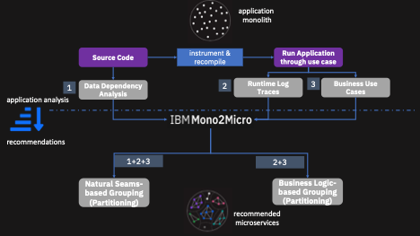
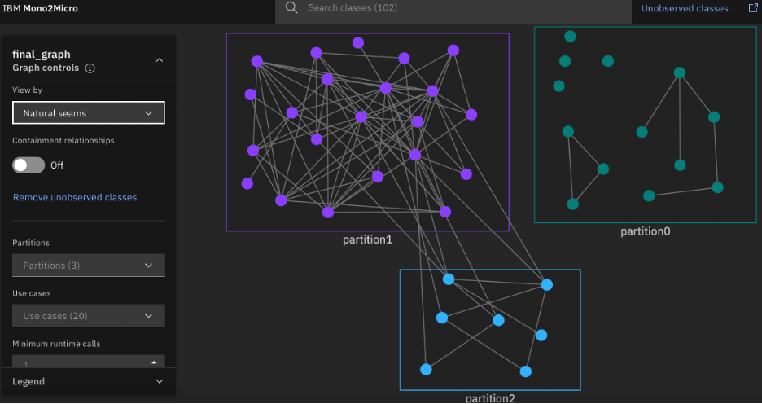

---
also_found_in:
- collections/ibm-research/
- learningpaths/intro-ibm-mono2micro
authors: ''
check_date: '2022-10-01'
collections:
- ibm-research
completed_date: '2020-07-07'
components:
- websphere-hybrid-edition
draft: false
excerpt: IBM Mono2MicroでAIを活用し、モノリシックなアプリケーションをマイクロサービスに変換します。
ignore_prod: false
last_updated: '2021-10-19'
meta_description: IBM Mono2MicroでAIを活用し、モノリシックなアプリケーションをマイクロサービスに変換します。
meta_keywords: mono2micro, m2m, monoliths, microservice, microservices, icp4a, cloud
  pak for apps
meta_title: IBM Mono2Microでモノリシックなアプリケーションをマイクロサービスに変換
primary_tag: microservices
related_content:
- slug: challenges-and-patterns-for-modernizing-a-monolithic-application-into-microservices
  type: articles
- slug: introduction-to-mono2micro
  type: videos
related_links:
- title: Introducing IBM Mono2Micro (IBM Cloud)
  url: https://www.ibm.com/cloud/blog/announcements/ibm-mono2micro
- title: IBM Mono2Micro
  url: http://www.ibm.biz/Mono2Micro
subtitle: AIによるアプリケーションリファクタリングの自動化
tags:
- java
title: IBM Mono2Microでモノリシックなアプリケーションをマイクロサービスに変換
---

## Mono2Micro の紹介

アプリケーションのリファクタリングとは、レガシーアプリケーションを元のセマンティクスを維持したままマイクロサービスに分割するプロセスのことである。リファクタリングは簡単ではない。アーキテクトは、マイクロサービスを推奨するために、コード、デプロイメントの成果物、テストケース、および利用可能なドキュメントを調査する。このプロセスは、手動で、その場限りで、主観的で、時間がかかり、エラーが発生しやすいものです。多くのリファクタリング・プロジェクトは、多大な時間とリソースを費やした後に放棄されてしまう。革新的なアプリケーション・トランスフォーマーである[IBM Mono2Micro](http://www.ibm.biz/Mono2Micro)は、AIを用いてアプリケーションのリファクタリングのプロセスを自動化します。

IBM Researchでは、呼び出しグラフ、データ依存関係（静的）、ランタイム・トレース（動的）などのアプリケーション成果物を分析するために、機械学習と深層学習を用いた新しいAI技術を開発しました。Mono2Microのリファクタリング能力は、アプリケーションの静的および動的な分析に基づくこれらの技術にかかっています。

Mono2Microを使った実験では、非常に大きな関心が寄せられ、大きな価値が実証されました。数百から数千のクラスを含む大規模なレガシー モノリシック アプリケーションに対して、Mono2Micro は完全に非侵襲的な方法で、非常に短い期間内に SME によって検証された適切なマイクロサービスの推奨案を生成しました。このような一枚岩のアプリケーションでは、手作業によるリファクタリングにはかなりの時間がかかります。

[IBM WebSphere Hybrid Edition](https://www.ibm.com/jp-ja/cloud/websphere-hybrid-edition)のコンポーネントとして提供されているMono2Microは、ビジネスロジックベースの推奨と自然なシームベースの推奨という2つのカテゴリーのマイクロサービス推奨（クラスのグループ化の提案）を自動的に生成します。また、Mono2Microは、マイクロサービスのカスタマイズやコードの自動生成といった高度な機能も備えています。これらの機能により、Mono2Microは、大規模で複雑なJava Enterpriseモノリシックアプリケーションのリファクタリングを、数年どころか数ヶ月かかることが多い手作業や他のアプローチと比較して、数週間で成功させることを支援するはずです。

## Mono2Microを使う

Mono2Microを使用してJavaアプリケーションをリファクタリングするには、以下の手順を実行する必要があります。

* Mono2Micro ユーティリティを使用して、関数の入力と終了を追跡するための単純な print 文を挿入してソースコードをインスツルメント化する。
* Mono2Micro ユーティリティを使用して、関数の入力と終了をトレースするための単純な print 文を挿入してソースコードをインストゥルメント化する。
* モノリシック・アプリケーションのインスツルメンテッド・バージョンで、さまざまなビジネス・ユースケースに対応するテストを実行する。
* 生成されたトレースファイルと、インスツルメンテーションおよびビジネスケースの実行フェーズで生成されたいくつかのJSONメタデータファイルを、Mono2MicroのAIコンポーネントに提供する。

##### 図1.Mono2Micro の概要

Mono2MicroのAIコンポーネントは、その斬新な機械学習アルゴリズムを適用することで、マイクロサービスの推奨事項を自動的に提供します。また、Mono2Microは、推奨されたマイクロサービスの詳細について、それらの相互作用についての深い呼び出し分析とともにレポートを生成します。推奨されたマイクロサービスの呼び出し分析レポートは、アプリケーション開発者にとって特に興味深いものであり、推奨されたマイクロサービスを評価し実装するためのガイダンスとして利用することができます。推薦されたマイクロサービスや生成されたレポートは、使いやすく直感的なMono2MicroのGUIで確認することができます。

## ビジネスロジックに基づくグルーピング

Mono2Microは、様々なビジネスユースケースの実行に対応するランタイムトレースを分析します。このトレースは、特定のビジネスユースケースを実装するクラスの呼び出しシーケンスやインタラクションの頻度など、制御の流れの詳細を伝えるものである。機械学習と深層学習の技術は、クラスとそのメソッド間の因果関係、機能的類似性、およびその他の時間的関係を捉えるために、実行時のトレースに使用されます。ランタイム・トレースから得られたこれらの時間的関係は、図1に示すように、ビジネス・ロジックの継ぎ目に応じたクラスのグループ化に使用されます。

図2は、サンプルアプリケーションのグループ化を示しています。円はクラスを表し、クラスのグループ化は色分けされています。また，クラス間の有向エッジは，実行時の呼び出しを表しています．

##### 図2.サンプルアプリケーションのビジネスロジックベースのグルーピング

## Natural seams-based grouping

Mono2Microでは、ビジネスロジックによるシームベースのグルーピングを、クラス間のデータ依存性分析によってさらに強化している。Mono2Microのアルゴリズムは、図1に示すように、データ依存性を持つクラスの関連するグルーピングを反復的にマージし、自然なシームベースのグルーピングを生成する。この自然なシームベースのグルーピングは、ステートレスでシェアナッシングなマイクロサービス・アーキテクチャに近似しているため、リファクタリングのための書き換えの必要性を最小限に抑えることができる（図3参照）。

##### 図3.サンプルアプリケーションのシームベースの自然なグループ化

## Meet in the middle グルーピング

クラスの自然なシームベースのグルーピングは、マイクロサービス・アーキテクチャーにとって理想的なように見えますが、既存のモノリシックなアプリケーションの多くは、マイクロサービスを念頭に置いて設計されていないため、このような戦略では、結果的にリファクタリングから期待される利益を得ることができないかもしれません。また、ほとんどのレガシーアプリケーションは、マイクロサービスを念頭に置いて設計されていないため、構成するクラスのほとんどが相互に依存関係を持っており、1つまたは2つのマイクロサービスにモノリシックアプリケーションの重要なクラスが実質的にすべて含まれることになります。

アーキテクトと開発者は、アプリケーションの知識を活用して、ビジネスロジックベースのグルーピングから出発して、自然なシームベースのグルーピングに向かって、あるいはその逆に、理想的な_カスタマイズされたクラスのグルーピングに到達することを期待しています。「中間に位置する」クラスのグループ化は、マイクロサービスの詳細な推奨事項や呼び出し分析レポートを参照しながら、反復的に行われます。

Mono2MicroのGUIは、SMEがクラスのグループ化を調整して微調整し、望ましいマイクロサービスの推奨事項にたどり着けるように、必要なメカニズムを提供する。

## 自動コード生成

モノリシックなアプリケーションでは、プリミティブでないオブジェクトは参照によって自由に受け渡され、必要なクラス定義はソースコードのどこでも自由に利用できます。リファクタリングされたモノリシック・アプリケーションでは、マイクロサービス間のパラメータは参照で渡すことができません。ほとんどのマイクロサービスは、メソッドのパラメータ、非原始的な型の戻り値、他のマイクロサービスで定義された依存関係を含んでいる可能性があるため、単独ではコンパイルすらできないかもしれません。手動または他のモードのリファクタリングでこれらの問題に対処するためには、SMEはかなりの量の配管コード（データを外部化するためのコードなど）を開発しなければなりません。開発者は、すべてのマイクロサービスのすべてのクラス定義をコピーすることが多いのですが、そうすると、たとえクラス定義の1つが変更されたとしても、すべてのマイクロサービスのビルドと再デプロイメントが必要になります。

Mono2Microは、クラス群をマイクロサービスとして実現するために必要なコードを一括して自動生成することで、これらの問題を独自の方法で解決します。マイクロサービス間のオブジェクト参照は、Mono2Microが完全に自動で行います。また、Mono2Microのコード生成機構は、実装されたマイクロサービス内のクラスメソッドやコンストラクタの定義をコピーしません。

## 次のステップ

Mono2Microとアプリケーションのモダナイゼーションについて詳しくはこちらをご覧ください。

* [IBM Mono2Micro](http://www.ibm.biz/Mono2Micro)のページをご覧ください。
* [Mono2Microのビデオ・デモンストレーション](/videos/introduction-to-mono2micro/)をご覧ください。

   <video-container> <video-id>Er2lfO4abKg</video-id> <video-title display="yes">Transform monolithic applications to microservices with IBM Mono2Micro</video-title> <video-length> <minutes>7</minutes><you/video-length></video-container>