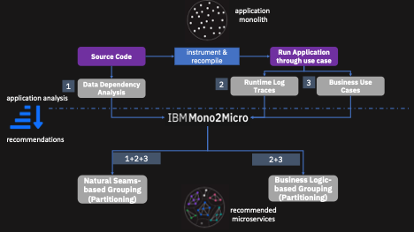
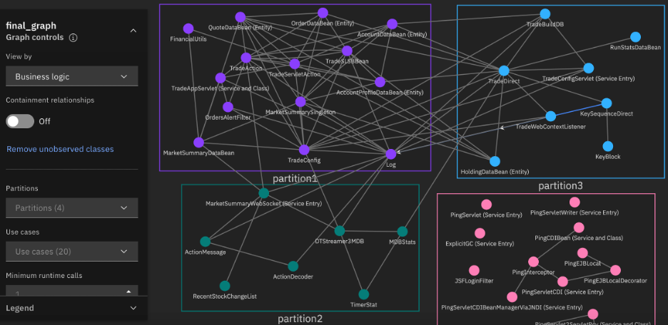
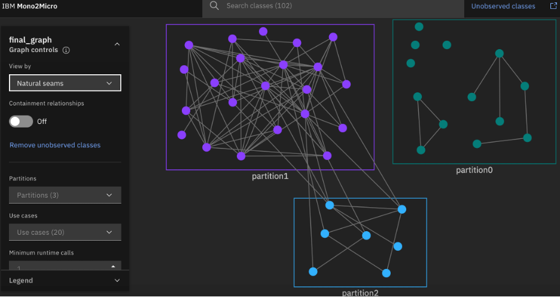

---
also_found_in:
- collections/ibm-research/
- learningpaths/intro-ibm-mono2micro
authors: ''
check_date: '2022-10-01'
collections:
- ibm-research
completed_date: '2020-07-07'
components:
- websphere-hybrid-edition
draft: false
excerpt: Leverage AI to transform monolithic applications to microservices with IBM
  Mono2Micro.
ignore_prod: false
last_updated: '2021-10-19'
meta_description: Leverage AI to transform monolithic applications to microservices
  with IBM Mono2Micro.
meta_keywords: mono2micro, m2m, monoliths, microservice, microservices, icp4a, cloud
  pak for apps
meta_title: Transform monolithic applications to microservices with IBM Mono2Micro
primary_tag: microservices
related_content:
- slug: challenges-and-patterns-for-modernizing-a-monolithic-application-into-microservices
  type: articles
- slug: introduction-to-mono2micro
  type: videos
related_links:
- title: Introducing IBM Mono2Micro (IBM Cloud)
  url: https://www.ibm.com/cloud/blog/announcements/ibm-mono2micro
- title: IBM Mono2Micro
  url: http://www.ibm.biz/Mono2Micro
subtitle: Automate application refactoring using AI
tags:
- java
title: Transform monolithic applications to microservices with IBM Mono2Micro
---

## Introducing Mono2Micro

Application refactoring refers to the process of partitioning legacy applications into microservices, preserving the original semantics of the applications. Refactoring is not easy. Architects examine code, deployment artifacts, test cases, and available documentations to recommend microservices. This process is manual, ad-hoc, subjective, time-consuming, and error-prone. Many refactoring projects get abandoned after spending a significant amount of time and resources. [IBM Mono2Micro](http://www.ibm.biz/Mono2Micro), the revolutionary application transformer, automates the process of application refactoring using AI.

At IBM Research, we developed novel AI techniques using machine learning and deep learning for analyzing application artifacts, such as invocation graphs, data dependencies (static), and runtime traces (dynamic). Mono2Micro's refactoring ability hinges on these techniques, based on static and dynamic analysis of applications.

Experimentations with Mono2Micro have generated tremendous enthusiasm and demonstrated significant value. For large legacy monolithic applications containing few hundreds to few thousands of classes, Mono2Micro generated sound microservice recommendations, verified by SMEs, within a very short time span in a completely non-invasive way. For some of these monolithic applications, manual refactoring takes quite some time.

Mono2Micro, which is available as a component of [IBM WebSphere Hybrid Edition](https://www.ibm.com/cloud/websphere-hybrid-edition), automatically generates two categories of microservice recommendations (suggested groupings of classes): business-logic-based recommendations and natural seams-based recommendations. Mono2Micro also provides the advanced features of customizing microservices and automatic code generation. With these features, Mono2Micro should assist in successfully refactoring large and complex Java Enterprise monolithic applications in weeks, compared to manual or other approaches, which often take months if not years.

## Using Mono2Micro

To refactor Java applications using Mono2Micro, you need to perform the following steps:

* Instrument the source code by inserting simple print statements for tracing function entries and exits using a Mono2Micro utility.
* Build and deploy the instrumented versions of the applications in pre-production but representative environments using the build and deployment tools that you use.
* Execute tests corresponding to the various business use cases on the instrumented versions of the monolithic applications.
* Provide the generated trace files along with a few JSON metadata files generated during the instrumentation and business case execution phases to Mono2Micro's AI component.

##### Figure 1. Overview of Mono2Micro

The AI component of Mono2Micro will automatically provide you the microservice recommendations by applying its novel machine learning algorithms. Mono2Micro also generates reports about the details of recommended microservices along with deep invocation analyses of their interactions. The invocation analysis reports of the recommended microservices are of special interest to application developers, which can be used for guidance to evaluate and implement the microservice recommendations. You can view the microservice recommendations and the generated reports in the easy-to-use and intuitive Mono2Micro GUI.

## Business-logic-based grouping

Mono2Micro analyzes runtime traces corresponding to the executions of various business use cases. The traces convey the details of the flow of control through the classes implementing specific business uses cases, including the invocation sequences and frequency of interactions. Machine learning and deep learning techniques are used on the runtime traces to capture causalities, functional similarities, and other temporal relations among classes and their methods. These temporal relations derived from runtime traces are used to arrive at the grouping of classes according to business logic seams, as shown in Figure 1.

Figure 2 shows such a grouping for a sample application, where the circles represent classes, and groupings of classes are color-coded. The directed edges between classes represent runtime invocations.

##### Figure 2. Business-logic-based groupings for a sample application

## Natural seams-based grouping

Mono2Micro further augments the business logic seams-based grouping with inter-class data dependency analysis. Mono2Micro's algorithm iteratively merges relevant groupings of classes having data dependencies and produces natural seams-based groupings, as shown in Figure 1. The natural seams-based groupings closely approximate the stateless and share-nothing microservice architecture, which minimizes the need for any rewrites for refactoring, which is shown in Figure 3.

##### Figure 3. Natural seams-based groupings for a sample application

## Meet in the middle grouping

While natural seams-based groupings of classes seem to be ideal for microservice architecture, for most existing monolithic applications, such a strategy may fail to provide expected benefits from the resultant refactoring  because most of the legacy applications were not designed keeping microservices in mind. Also most of their constituent classes typically have dependency relationships among themselves, which will result in one or two microservices containing practically all the important classes of the monolithic applications.

We expect architects and developers to arrive at ideal _customized_ groupings of classes using their knowledge of applications by starting their journey from the business-logic-based grouping and drifting somewhat towards the natural seams-based grouping, or vice versa. The "meet in the middle" groupings of classes will be arrived at an iterative fashion consulting the detailed microservice recommendations and the invocation analysis reports.

The Mono2Micro GUI will provide the mechanisms necessary so that the SMEs can adjust and fine-tune groupings of classes to arrive at the desired microservice recommendations.

## Automatic code generation

In monolithic applications, non-primitive objects are passed freely by references, and all the required class definitions are freely available everywhere in the source code. In refactored monolithic applications, inter-microservice parameters cannot be passed by references. Most of the microservices may not even compile on their own since they may contain method parameters, return values of non-primitive types, and dependencies defined in other microservices. To address these problems in manual or other modes of refactoring, SMEs have to develop a significant amount of plumbing code (code for externalizing data, for example). Developers often copy all of the class definitions in all of the microservices, which will necessitate the build and redeployment of all the microservices, even if one of the class definitions change.

Mono2Micro addresses all of these issues in a unique way by automatically generating a bulk of the code needed for realizing groups of classes as microservices. Mono2Micro will completely take care of the cross-microservice object references automatically. Mono2Micro's code generation mechanism also does not copy class methods or constructor definitions in the implemented microservices.

## Next Steps

Learn more about Mono2Micro and modernizing applications:

* Check out the [IBM Mono2Micro](http://www.ibm.biz/Mono2Micro) page.
* Watch a [video demonstration of Mono2Micro](/videos/introduction-to-mono2micro/):

   <video-container> <video-id>Er2lfO4abKg</video-id> <video-title display="yes">Transform monolithic applications to microservices with IBM Mono2Micro</video-title> <video-length> <minutes>7</minutes><you/video-length></video-container>