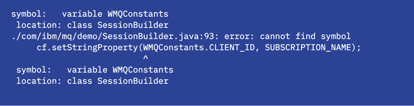
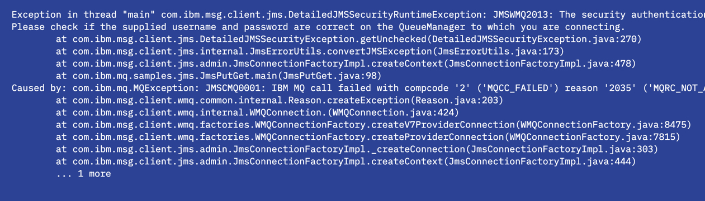
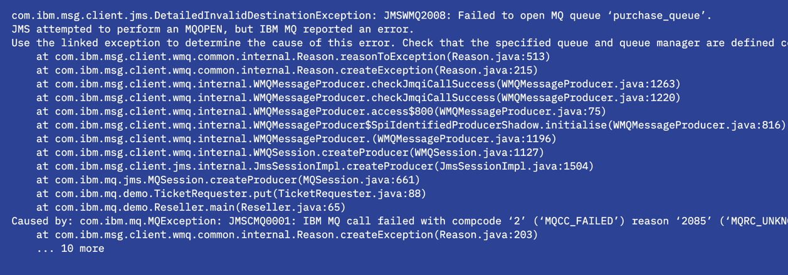
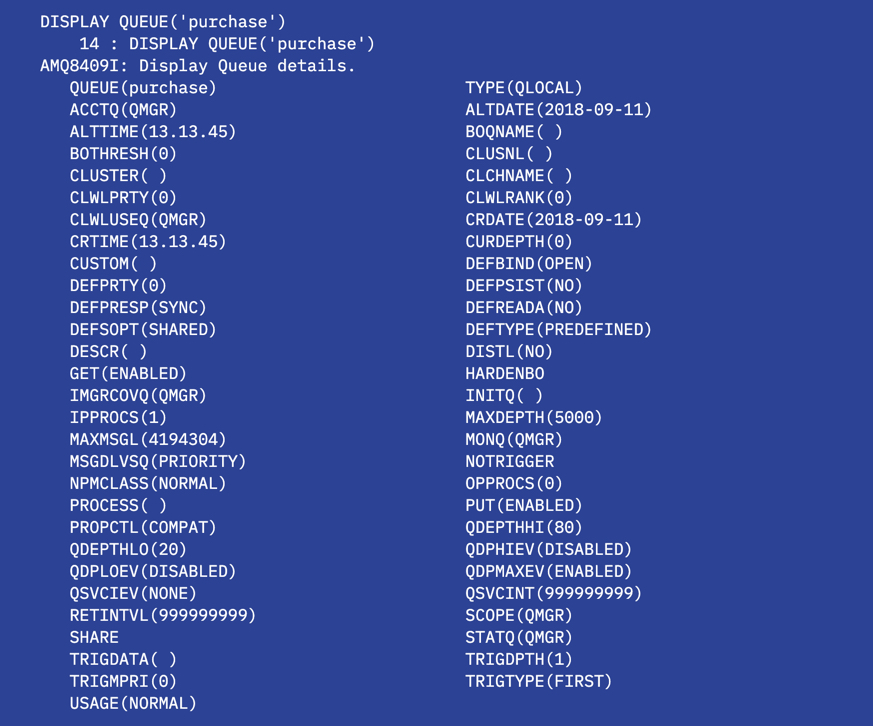

---
also_found_in:
- learningpaths/ibm-mq-badge
authors: ''
check_date: '2022-08-15'
completed_date: '2018-08-07'
components:
- ibm-mq
display_in_listing: true
draft: false
excerpt: IBM MQの一般的なエラーを簡単にデバッグするためのヒントやコツを紹介しています。
ignore_prod: false
last_updated: '2021-08-24'
meta_description: IBM MQの一般的なエラーを簡単にデバッグするためのヒントやコツを紹介しています。
meta_keywords: messaging, message queues, ibm mq
meta_title: 開発者のためのIBM MQチートシート。IBM MQの一般的なエラーを簡単にデバッグするためのヒントとコツ
primary_tag: ibm-mq
related_content:
- slug: mq-best-practices
  type: articles
subtitle: IBM MQの一般的なエラーを簡単にデバッグするためのヒントとコツ
title: 開発者のためのIBM MQチートシート
---

<!--ラーニングパスに組み込まれている場合はコメントアウトされます -->。
<!-- <sidebar> <heading>ラーニングパスです。IBM MQ Developer Essentials Badge</heading> 
この記事は、IBM MQ Developer Essentialsのラーニングパスとバッジの一部です。
 <ul> <li> [IBM MQ fundamentals](/articles/mq-fundamentals/)</li><li> IBM MQ fundamentals (this article)</li><li> [MQ on Containers](/tutorials/mq-connect-app-queue-manager-containers/)を使用して、キュー・マネージャーを立ち上げて実行します。または[MQ on Cloud](/tutorials/mq-connect-app-queue-manager-cloud/)、または[MQ on Ubuntu](/tutorials/mq-connect-app-queue-manager-ubuntu/)、または[MQ on Windows](/tutorials/mq-connect-app-queue-manager-windows/)を使用します。</li> <li>[Explore the MQ Console](/tutorials/mq-setting-up-using-ibm-mq-console/) </li> <li>[Get ready to code in Java](/tutorials/mq-develop-mq-?jms/) </li><li> [Take on the messaging coding challenge](/tutorials/mq-badge-mq-dev-challenge/)</li> <li> アプリケーションや環境をデバッグする(この記事)</li></ul></sidebar> -->

アプリケーションをコーディングし、コンパイルして、初めて実行したところです。エキサイティングな時間です。エラー メッセージが発生しました。

慌てないでください。どんなに優秀な開発者でもそうなるのです。

デバッグの時間ですが、どこから始めればいいのでしょうか？

アプリケーションが失敗する理由はたくさんありますが、それがメッセージングコードの問題なのか、MQ APIコールの問題なのか、MQ関連オブジェクトの問題なのかをどうやって知ることができるでしょうか？

エラーメッセージにMQの理由コード（AMQ2035 2035 MQRC_NOT_AUTHORIZEDなど）が含まれている場合、MQとのやり取りで何か問題が発生している可能性があります。

多くの場合、エラーメッセージを見れば何が問題だったのかは明らかで、コードを修正して次に進むことができます。しかし、もう少しデバッグが必要な場合もあります。以下のセクションでは、基本的なデバッグ手順を説明し、作業を再開するためのヒントを提供します。

## 一般的な問題やエラー

ここでは、コンパイルエラーから接続の問題、設定エラーからセキュリティの問題まで、新しいMQアプリケーション開発者のほとんどが目にするであろう一般的な問題を確認します。  私たちはあなたをカバーします。  

### ちょっと待ってください、私のアプリケーションはまだコンパイルされていません!

コードをコンパイルしようとしていますが、以下のようなエラーが発生します。

何らかの理由でコードがコンパイルされない場合、以下のような原因が考えられます。

* `javac` を使用するために JDK をインストールしていますか?コマンドラインで `java -version` と入力して確認してみてください。
* `jms.jar` と `com.ibm.mq.allclient.jar` は利用できますか？
* `classpath` をチェックしてください。ジャーの場所を正しく入力していますか?
* コマンドの中で、お使いのオペレーティングシステムの正しいファイルディレクトリセパレータを使用していることを確認してください。

### Help!MQ の理由コードが表示されましたが、次に何をすればいいですか?

コードを実行してみましたが、以下のような例外が発生します。

例外の詳細を見ることで、多くの情報を得ることができます。上の例では、アプリケーションが使用しようとしている接続情報（キュー・マネージャー名、接続モード、ホスト名とポート）を見ることができます。また、何が問題なのかという情報も得られます。7行目には、アプリケーションが失敗したポイントに対して発行されたリターンコードが表示されています（この例では2035）。MQの理由コードのリストは、<a href="https://www.ibm.com/docs/en/ibm-mq/9.2?topic=support-reason-codes-exceptions" target="_blank" rel="noopener noreferrer">_IBM MQ Docs_</a>に記載されています。

IBM MQキュー・マネージャーのエラー・ログは、発生した問題の詳細を知るのに最適な場所です。基本的に、私たちは、何が問題だったのかというキュー・マネージャの視点を探しています。エラーログは、キュー・マネージャが動作しているシステム上のMQデータ・ディレクトリにあります。

Dockerコンテナでは。

Linuxの場合。

Windowsシステムの場合。

次に、エラーログファイルを見てみましょう。最新のログエントリーがファイルの一番下に追加されています。ログを見るには、エディタを使ったり、DockerやLinuxなどでは

ここでは、2035年のリターンコードが発生したときのエントリを見ることができます。

### 接続の問題

よくある問題として、初期接続の問題があります。この場合、MQ 理由コード 2538 MQRC_HOST_NOT_AVAILABLE や 2059 MQRC_Q_MGR_NOT_AVAILABLE などの理由コードが表示されます。エラーが発生する可能性のある場所はいくつかありますが、最初に見るべきものは次のとおりです。

* キュー・マネージャーが動作しているホストにpingできるかどうかを確認します。

* キューマネジャへの接続に正しいポートを使用しているかどうかを確認。

    MQ Badge Challenge アプリケーションは、環境変数 MQ_BADGE_QM_PORT を別のものに設定しない限り、1414 を使用します。何らかの理由でポート 1414 を使用できない場合、例えば、複数の Docker インスタンスまたはキュー・マネージャーを実行していて、ポート 1414 が既に使用されている場合などに、これを行う必要があります。別のポート番号を使用するには、別のポートを公開する必要があります。その際には、ポートの環境変数を設定します。

    Windowsのターミナルで。

    Linuxの場合。

* キューマネージャーへの接続に正しいホストを使用しているか確認してください。

    MQ Badge Challenge アプリケーションは、環境変数 MQ_BADGE_QM_HOSTNAME を別のものに設定しない限り、'localhost' を使用します。古いバージョンのDockerでキュー・マネージャを実行している場合は、これを行う必要があるかもしれません。最新バージョンのDockerは、ホストIPアドレスをlocalhostにマッピングしますが、Windows 7でDockerを実行するための現在のオプションであるDocker Toolkitは、ホストIPを仮想マシンのIPアドレスにマッピングします。このIPアドレスを調べるには、Dockerで以下のコマンドを実行します。

    その後、Windowsのターミナルでこのコマンドを実行すると、このホストアドレスがアプリケーションで使用されるようになります。

* アプリケーションの接続詳細で、正しいキューマネージャー名とチャネル名を使用していることを確認してください。これらは大文字と小文字を区別します。MQ Badge Challengeアプリケーションでは、デフォルトの値を使用したくない場合、環境変数 `MQ_BADGE_QM_NAME` および `MQ_BADGE_QM_CHANNEL` も外部化されています。

* キューマネージャーが動作していることを確認してください。

    キューマネジャがホストされているシステム上で、ターミナルウィンドウで dspmq コマンドを直接実行します。

    Dockerインスタンスの場合は、以下のコマンドでコマンドラインにアクセスし、dspmqを実行します。

    dspmqの出力は、システム上のキュー・マネージャーのリストとそのステータスです。

    

### 設定エラー

アプリケーションが接続されますが、実行できません。

主なチェックポイントは、すべてのMQオブジェクト名が期待されるものと一致しているかどうかです。例えば、間違ったキュー名を指定すると以下のようなエラーが発生します。

このケースでは、ログはキュー `purchase_queue` が存在しないことを伝えています。次のステップとしては、`runmqsc`を使って設定を確認するか、それに応じてコードを変更することになります。[MQSCコマンド](#interact-with-thequeue-manager-using-mqsc-commands)の詳細については、以下を参照してください。

### 認可の問題

問題が発生するもう一つの一般的な領域は、認証です。セキュリティの問題では、一般的にAMQ2035 2035 MQRC_NOT_AUTHORIZEDという理由コードが返されます。これが表示された場合、接続が試みられたことはわかりますが、使用されているユーザー名やパスワードに何か問題があると思われます。エラーログを見ると、認証されているユーザーIDがわかります。

MQ Badge Challengeアプリケーションでは、ユーザー名とパスワードはキュー・マネージャーに提供するためにアプリケーションにコード化されています。正しい値が設定されているか確認してください。アプリケーションのデフォルトのユーザー名とパスワード以外を使用している場合、これらの値は提供されたコードで変更するか、環境変数MQ_BADGE_USERNAMEおよびMQ_BADGE_PASSWORDを設定することでデフォルト値を上書きすることができます。

詳細については、クライアント・アプリケーション・セキュリティに関する<a href="https://www.ibm.com/docs/ibm-mq/latest?topic=authentication-planning-client-application" target="_blank" rel="noopener noreferrer">_IBM MQ Docs_</a>をお読みください。

### パブリッシュ/サブスクライブのエラー

パブリッシュ/サブスクライブの問題は、通常、以下のいずれかの理由によるものです。

* サブスクライバーのトピック文字列とパブリッシャーのトピック文字列が一致しない。
* パブリッシュが送信された後にサブスクリプションが作成された。
* パブリケーションでエラーが発生したが、パブリッシングアプリケーションでチェックされなかった。

これらの場合、期待していたメッセージを受信できないことになります。

### MQSCコマンドによるキュー・マネージャーとのやりとり

MQSCコマンドを使用すると、キュー・マネージャーの設定や、チャンネルやキューなどのキュー・マネージャー・オブジェクトを操作するための管理作業を行うことができます。

特に、デフォルトの設定に慣れていない場合には、異なるMQオブジェクト（例えば、qmgr、キュー、またはチャネル）に設定された属性について調べる方法を知っていると、非常に役立つことがあります。その方法の一つとして、MQSCがあります。詳細については、IBM MQ Docsの<a href="https://www.ibm.com/docs/ibm-mq/latest?topic=administering-administration-using-mqsc-commands" target="_blank" rel="noopener noreferrer">_Administration using MQSC commands_</a>を参照してください。

Dockerインスタンスの場合は、キュー・マネージャーを実行しているコンテナのコマンドライン・アクセスが必要です。

ここから（あるいは任意のプラットフォームのコマンドラインから）。

次のようなメッセージが表示されたら、インターフェイスは入力の準備ができています。

DISPLAYコマンドを使用して、MQ Badge Challengeのオブジェクトの一部を調べることができます。例えば、DISPLAY CHANNEL(DEV.APP.SVRCONN)、DISPLAY TOPIC('newTickets')、DISPLAY QUEUE('purchase')などです。

`DISPLAY QUEUE('purchase')`コマンドの出力は以下のようになります。

ここで注目すべき興味深い属性は、maxdepthで、これはキューが保持できるメッセージ数であり、curdepthはキューに現在保持されているメッセージ数です。キュー上のメッセージ数がmaxdepthに達した場合、アプリケーションはMQ Reason Code 2053 MQRC_Q_FULLで失敗します。この問題を解決するいくつかの方法は、デフォルトのmaxdepthを5000に増やすか、アプリケーションを一時停止するか、メッセージを別のキューに入れるなどして、送信側のアプリケーションが理由コード2053(MQRC_Q_FULL)を処理できるようにすることです。

### MQ コンソールを使用したキュー・マネージャーとのやりとり

キューマネージャと対話するためのもう一つの方法として、MQコンソールがあります。MQ コンソールでは、オブジェクトの属性を閲覧・変更できるだけでなく、テストメッセージをキューに投入して設定を検証することができます。(セットアップを検証する別の方法は、amqsputc のようなサンプルにアクセスできるなら、それを実行することです)。

ブラウザで接続できないのですが？

* キューマネージャーをDockerで運用している場合、`https://localhost:9443/ibmmq/console/`にアクセスしてもうまくいかないことがあるかもしれません。Docker コマンドの `docker-machine ip` を使用して、`localhost` の代わりに使用すべき IP アドレスを確認してください。

* コンテナを起動した際に、MQ コンソールが使用するポート 9443 が割り当てられているかどうかを確認します。何らかの理由でポート番号を変更した場合は、正しいポート番号を使用していることを確認してください。

### TLS の問題

キューマネジャのキーリポジトリの変更、証明書の追加や削除など、キューマネジャのセキュリティ設定を変更している場合、期待通りに動作しないことがあります。

多くの場合、キュー・マネージャー上のSSLキャッシュの更新が必要です。もしそうであれば、runmqsc を使用してキュー・マネージャに入り、キャッシュをリフレッシュすることによって、単純にこれを修正することができます。

アプリケーションを再度実行すると、期待通りに動作するはずです。

Javaアプリケーションを実行している場合は、アプリケーションを実行する際に、これらのコマンドライン引数を追加することで、追加のセキュリティデバッグ情報にアクセスすることができます。

## まとめ

この記事では、IBM MQアプリケーションの最も一般的なエラーの種類を取り上げました。  おめでとうございます。あなたはプロのようにデバッグし、すべてが完全に動作しました。
続けて開発してください。

トラブルシューティングの詳細については、こちらをご覧ください。

* 問題解決のためのより詳細なドキュメントについては、<a href="https://www.ibm.com/docs/en/ibm-mq/9.1?topic=checks-making-initial-unix-linux-windows" target="_blank" rel="noopener noreferrer">_IBM MQ Docs_</a>をご覧ください。

* また、MQ でアプリを作るための <a href="https://developer.ibm.com/articles/mq-best-practices/" target="_blank" rel="noopener noreferrer">_best practices_</a> もご覧ください。