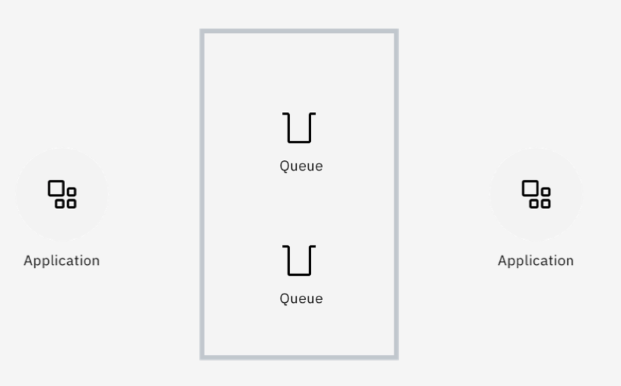
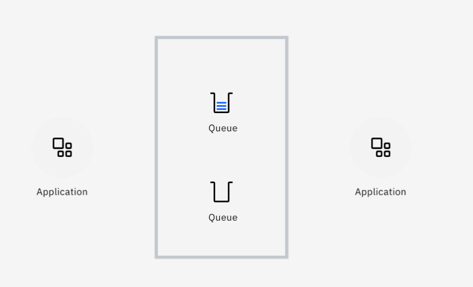

---
also_found_in:
- learningpaths/ibm-mq-badge/
authors: ''
check_date: '2022-08-15'
completed_date: '2018-03-02'
components:
- ibm-mq
display_in_listing: true
draft: false
excerpt: IBM MQは、堅牢性、信頼性、安全性に優れたメッセージング・ソリューションです。IBM MQ は、複数のプラットフォームにまたがるさまざまなアプリケーションの統合を簡素化および高速化し、さまざまな
  API や言語をサポートしています。
ignore_prod: false
last_updated: '2021-08-24'
meta_description: IBM MQは、堅牢性、信頼性、安全性に優れたメッセージング・ソリューションです。IBM MQは、複数のプラットフォームにまたがるさまざまなアプリケーションの統合を簡素化および高速化し、幅広いAPIと言語をサポートしています。IBM
  MQにより、サーバー・インフラストラクチャは、データセンター、メインフレーム、クラウド・フレームワークにまたがることができます。  MQは、アプリケーションが信頼性の高いスケーラブルな方法でデータを通信・交換することを可能にし、1つのアプリケーションを別のアプリケーションから切り離します。
meta_keywords: messaging, message queues, quality of service, QoS, security, message
  exchange patterns
meta_title: IBM MQの基礎知識。堅牢性、信頼性、安全性に優れたメッセージング・ソリューションの主要機能
primary_tag: ibm-mq
related_content:
- slug: what-is-ibm-mq-and-why-do-developers-need-it
  type: videos
- slug: what-is-messaging
  type: articles
- slug: understanding-enterprise-messaging-patterns
  type: videos
- slug: mq-objects-event-driven-and-exactly-once-messaging-to-queues-and-topics
  type: videos
subtitle: 堅牢性、信頼性、安全性に優れたメッセージングソリューションの主な機能をご紹介します。
title: IBM MQの基礎知識
---

<!--ラーニングパスのテンプレートに移行する際にコメントアウトされました -->。
<!-- <sidebar> <heading>ラーニングパス。IBM MQ Developer Essentials Badge</heading> 
この記事はIBM MQ Developer Essentialsのラーニングパスとバッジの一部です。
 <ul> <li> IBM MQの基礎（この記事）</li><li> [MQ on Containers](/tutorials/mq-connect-app-queue-manager-containers/)を使用してキュー・マネージャーを立ち上げて実行します。または[MQ on Cloud](/tutorials/mq-connect-app-queue-manager-cloud/)、または[MQ on Ubuntu](/tutorials/mq-connect-app-queue-manager-ubuntu/)、または[MQ on Windows](/tutorials/mq-connect-app-queue-manager-windows/)を使用します。</li> <li>[Explore the MQ Console](/tutorials/mq-setting-up-using-ibm-mq-console/) </li> <li>[Get ready to code in Java](/tutorials/mq-develop-mq-?jms/) </li><li> [Take on the messaging coding challenge](/tutorials/mq-badge-mq-dev-challenge/)</li> <li> [Debug your application or environment](/articles/mq-dev-cheat-sheet/)</li></ul></sidebar> -->

IBM MQ は、堅牢で信頼性が高く、安全なメッセージング・ソリューションです。IBM MQ は、複数のプラットフォームにまたがるさまざまなアプリケーションの統合を簡素化および高速化し、幅広い API と言語をサポートしています。

IBM MQは、アプリケーションが信頼性と拡張性のある方法でデータを通信・交換することを可能にし、アプリケーションを別のアプリケーションから切り離します。このようにして、MQは、異なるフレームワーク、言語、プラットフォーム、クラウド、場所で実行されるアプリケーションの統合を支援します。MQが問題を解決してアプリケーションを統合してくれるので、好きなようにアプリケーションを書くことができます。

IBM MQにより、サーバーインフラはデータセンター、メインフレーム、クラウドのフレームワークにまたがることができます。ソフトウェアとハードウェアの両方で実装されたIBM MQは、独立したアプリケーション間のエンタープライズ強度の通信を提供します。さらに、それらのアプリケーションを開発する際の複雑さを軽減します。

## IBM MQ はどのようにしてアプリケーション間の通信を簡素化するのですか？

Max Kahan氏が、IBM MQを使用してアプリケーション間の通信を簡素化することの利点を説明します。

<iframe width="560" height="315" src="https://www.youtube.com/embed/ynjc5GMQeRA" frameborder="0" allow="accelerometer; autoplay; clipboard-write; encrypted-media; gyroscope; picture-in-picture" allowfullscreen></iframe>

2つ以上のアプリケーションの間にメッセージングインフラを配置するということは、アプリケーション同士が直接通信しているわけではありません。実際には、ミドルウェアを介してやりとりされます。

具体的には、一方のアプリケーションが他方のアプリケーションのために情報をメッセージに入れ、それをメッセージキューに入れます。

このように、メッセージングでは、キューが利用可能性を提供するため、アプリケーションが同時に利用可能である必要はありません。このモデルは、非同期メッセージングとして知られています。

片方のアプリケーションがなくなっても、もう片方のアプリケーションより遅くなっても、メッセージキューイングは双方の不安定さを処理することで「ショックアブソーバー」を提供します。

## IBM MQの基礎知識

IBM MQを理解するための重要なコンセプトをいくつか見てみましょう。  もしよろしければ、以下を読む前に、Max Kahanが概念を説明している様子をご覧ください。

<iframe width="560" height="315" src="https://www.youtube.com/embed/zwRvUmIgRJ0" title="YouTube video player" frameborder="0" allow="accelerometer; autoplay; clipboard-write; encrypted-media; gyroscope; picture-in-picture" allowfullscreen></iframe>。

### メッセージ、キュー、チャンネル

**メッセージ**は、アプリケーションで生成・消費されるデータのパッケージです。

**キュー**は、メッセージを配送し、消費されるまで確実に保管するためのアドレス可能な場所です。

**キューマネージャ**は、キューをホストするMQサーバです。

**チャンネル**は、キューマネージャが相互に、またアプリケーションと通信するための手段です。

### MQネットワーク

**MQネットワーク**は、相互に接続されたキューイングマネージャの緩やかな集合体であり、すべてのキューイングマネージャが連携して、アプリケーションや場所の間でメッセージを配信します。

### MQ クラスタ

**MQクラスター**は、キューマネジャを緊密に結合したもので、より高いレベルでの拡張性と可用性を実現します。

## IBM MQ メッセージングスタイル

IBM MQ は以下のメッセージングスタイルをサポートしています。

* ポイント・ツー・ポイント・メッセージング
* パブリッシュ/サブスクライブ・メッセージング

これらのメッセージング・パターンについては、Max Kahan氏による説明をご覧ください。

<iframe width="560" height="315" src="https://www.youtube.com/embed/U03FslufqxY" title="YouTube video player" frameborder="0" allow="accelerometer; autoplay; clipboard-write; encrypted-media; gyroscope; picture-in-picture" allowfullscreen></iframe>

### Point-to-point messaging

このスタイルのメッセージングは、メッセージキューの概念に基づいて構築されており、1つのコンシューマーがメッセージを処理することができます。

ポイントツーポイントでは、メッセージの生成者を送信者、メッセージの消費者を受信者と呼びます。送信者はメッセージをキューに送信し、受信者はキューからのメッセージを非同期的に消費します。

ポイント・ツー・ポイントが機能するためには、接続されているアプリケーションは、相互作用するキューの名前を知る必要があります。

この場合、各メッセージは1つのレシーバーによってのみ消費され、ワークロードがすべてのレシーバーに分散されます。

### パブリッシュ/サブスクライブ・メッセージング

このスタイルのメッセージングでは、メッセージのコピーが、関心のある消費者アプリケーションすべてに配信されます。

メッセージを生成する側をパブリッシャー、メッセージを消費する側をサブスクライバーと呼びます。インフラストラクチャ内の発行側と購読側のアプリケーションは、トピックの名前に同意します。コンシューマーは、そのトピックに関するメッセージを受信したいことを通知するために、そのトピックに対するサブスクリプションを作成します。

トピックにパブリッシュされたメッセージは、すべてのサブスクリプションに配信されるので、すべてのサブスクライバーがコピーを取得します。各トピックには多数のパブリッシャーと多数のサブスクライバーが存在する可能性がありますが、MQはそれらすべての間でメッセージの配信を処理します。

## IBM MQ の言語サポートと機能

開発したい言語やランタイムが何であれ、MQはそれをサポートしています。サポートされている言語とランタイムは以下の通りです。

* <a href="https://github.com/ibm-messaging/mq-dev-patterns/tree/master/JMS" target="_blank" rel="noopener noreferrer">Java</a>
* <a href="https://github.com/ibm-messaging/mq-dev-patterns/tree/master/Node.js" target="_blank" rel="noopener noreferrer">Node.js</a>
* <a href="https://www.ibm.com/docs/en/ibm-mq/9.1?topic=mq-coding-in-cobol" target="_blank" rel="noopener noreferrer">COBOL</a>
* <a href="https://www.ibm.com/docs/en/ibm-mq/9.1?topic=mq-writing-client-procedural-applications" target="_blank" rel="noopener noreferrer">C</a>
* <a href="https://github.com/ibm-messaging/mq-dev-patterns/tree/master/Go" target="_blank" rel="noopener noreferrer">Go</a>。
* <a href="https://github.com/ibm-messaging/mq-dev-patterns/tree/master/dotnet" target="_blank" rel="noopener noreferrer">.NET</a>。
* <a href="https://github.com/ibm-messaging/mq-dev-patterns/tree/master/Python" target="_blank" rel="noopener noreferrer">Python</a>。
* <a href="https://github.com/mqlight/ruby-mqlight" target="_blank" rel="noopener noreferrer">Ruby</a>
* <a href="https://github.com/ibm-messaging/mq-dev-patterns/tree/master/dotnet" target="_blank" rel="noopener noreferrer">C#</a>

MQは数多くのAPIをサポートしています。

* <a href="https://developer.ibm.com/tutorials/mq-develop-mq-jms/" target="_blank" rel="noopener noreferrer">JMS</a>
* <a href="https://www.ibm.com/docs/en/ibm-mq/9.1?topic=queuing-message-queue-interface-overview" target="_blank" rel="noopener noreferrer">MQI</a>を参照してください。
* <a href="https://github.com/mqlight" target="_blank" rel="noopener noreferrer">MQ Light</a>

また、MQは数多くのメッセージングプロトコルをサポートしています。

* <a href="https://www.ibm.com/docs/en/ibm-mq/9.2?topic=applications-application-development-concepts" target="_blank" rel="noopener noreferrer">MQ</a>
* <a href="https://www.ibm.com/docs/en/ibm-mq/9.1?topic=applications-mq-light-amqp-advanced-message-queuing-protocol" target="_blank" rel="noopener noreferrer">AMQP</a>
* <a href="https://www.ibm.com/docs/en/ibm-mq/9.1?topic=overview-introduction-mq-telemetry" target="_blank" rel="noopener noreferrer">MQTT</a>
* <a href="https://developer.ibm.com/tutorials/mq-develop-mq-rest-api/" target="_blank" rel="noopener noreferrer">REST</a>

また、MQは数多くの動作環境に対応しています。

* <a href="https://cloud.ibm.com/catalog/services/mq?cm_sp=ibmdev-_-developer-articles-_-cloudreg" target="_blank" rel="noopener noreferrer">Cloud</a>。
* <a href="https://github.com/ibm-messaging/mq-container" target="_blank" rel="noopener noreferrer">Containers</a>。
* <a href="https://www.ibm.com/docs/en/ibm-mq/9.1?topic=uninstalling-installing-mq-linux" target="_blank" rel="noopener noreferrer">Linux</a>
* <a href="https://www.ibm.com/docs/en/ibm-mq/9.1?topic=windows-installing-mq-server" target="_blank" rel="noopener noreferrer">Windows</a>
* <a href="https://www.ibm.com/docs/en/ibm-mq/9.1?topic=uninstalling-installing-mq-aix" target="_blank" rel="noopener noreferrer">AIX</a>
* <a href="https://www.ibm.com/docs/en/ibm-mq/9.1?topic=uninstalling-installing-mq-i" target="_blank" rel="noopener noreferrer">IBM i</a>を参照してください。
* <a href="https://www.ibm.com/docs/en/ibm-mq/9.0?topic=uninstalling-installing-mq-hp-ux" target="_blank" rel="noopener noreferrer">HP-UX</a>を参照してください。
* <a href="https://www.ibm.com/docs/en/ibm-mq/9.1?topic=iu-installing-uninstalling-mq-client-hp-integrity-nonstop-server" target="_blank" rel="noopener noreferrer">HPI NonStop</a>
* <a href="https://www.ibm.com/docs/en/ibm-mq/9.1?topic=uninstalling-installing-mq-zos" target="_blank" rel="noopener noreferrer">z/OS</a>
* <a href="https://www.ibm.com/docs/en/ibm-mq/9.1?topic=uninstalling-installing-mq-solaris" target="_blank" rel="noopener noreferrer">Solaris</a>

__

## まとめ

では、IBM MQについて覚えておくべきことは何でしょうか？  この3つの重要な利点です。

* ****MQはデータの確実な配信を提供します。**** 情報の紛失や重複は重大な問題を引き起こす可能性があります。銀行振り込みや取引を考えてみてください。これらの場合、メッセージを正確に一度だけ配信したいものです。MQは、必要のないデータの紛失や重複を確実に防止する世界的なリーダーです。これは、MQシステムの実証された信頼性と、これらの重要なメッセージをトランザクション交換に統合する能力によって保証されています。

* MQは水平方向への拡張性があります。単一のキュー・マネージャーの作業量が増加した場合、キュー・マネージャーを追加してタスクを共有し、メッセージを分散させることができます。MQクラスターは、メッセージを必要な場所にインテリジェントにルーティングすることもできます。世界には、1日に何十億ものメッセージを処理する水平スケールのMQシステムが溢れています。

* メッセージデータは重要なものであり、MQはそのデータをシステム間で複製したり、メッセージをホストするキュー・マネージャーを他の場所で自動的に再起動する方法を提供することで、常に高い可用性を確保します。これに、同じキューやトピックを提供するキューマネージャーの緊密なクラスター化を組み合わせることで、継続的に利用可能なシステムが実現します。