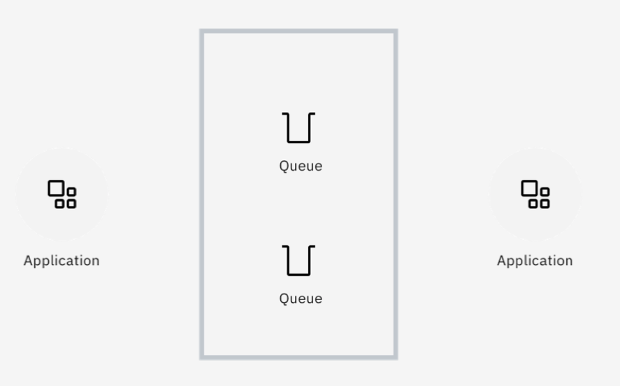
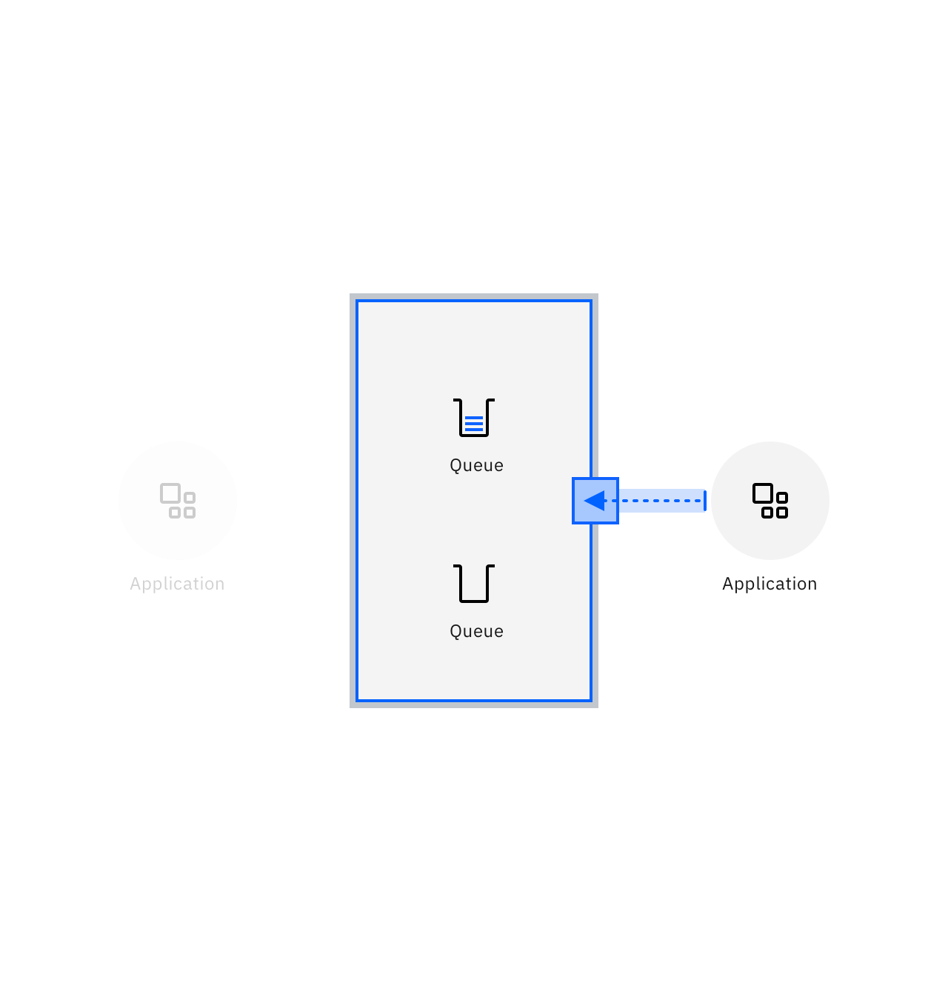
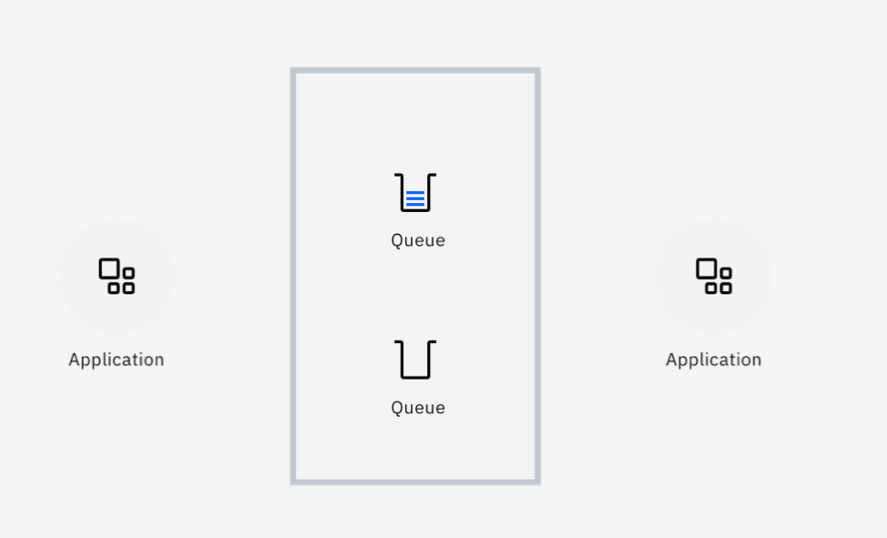
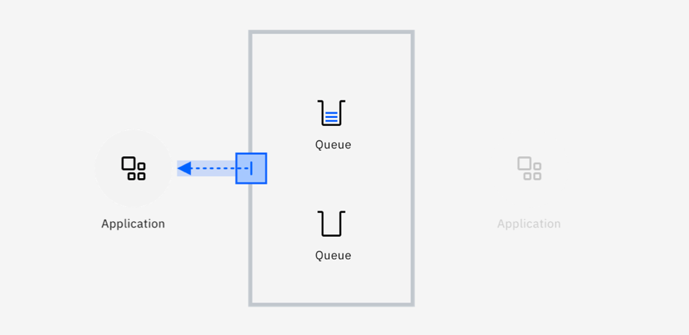
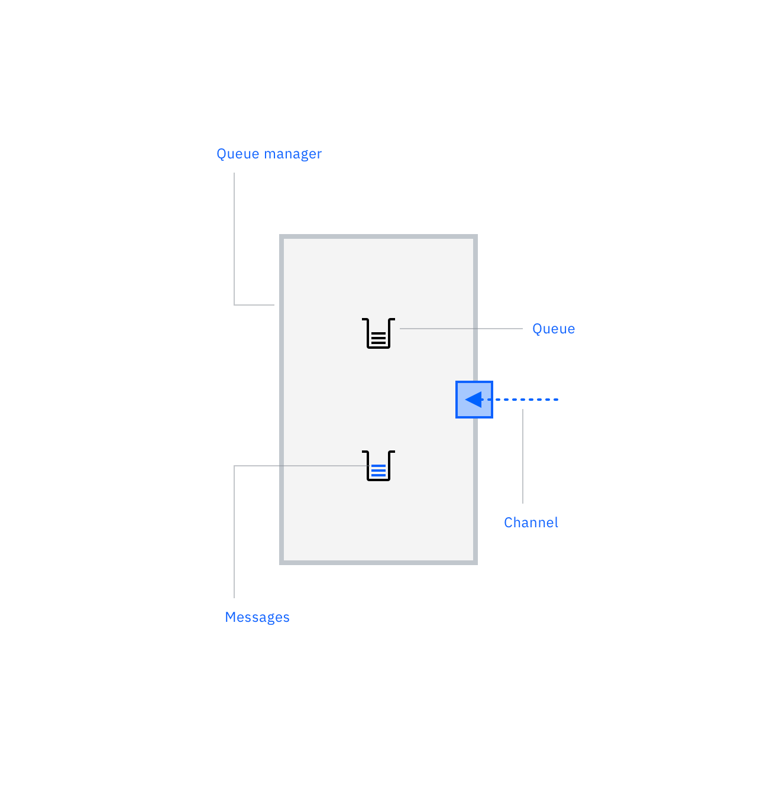
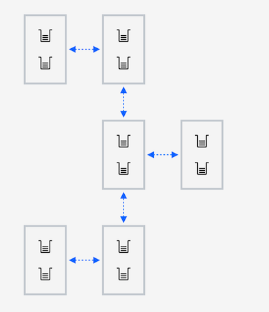
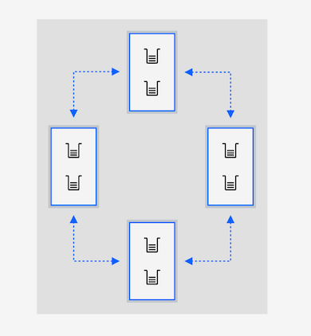
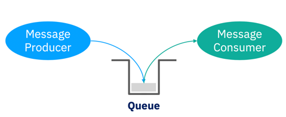
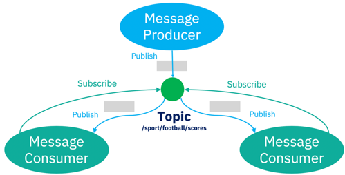

---
also_found_in:
- learningpaths/ibm-mq-badge/
authors: ''
check_date: '2022-08-15'
completed_date: '2018-03-02'
components:
- ibm-mq
display_in_listing: true
draft: false
excerpt: IBM MQ is a robust, reliable, and secure messaging solution. It simplifies
  and accelerates the integration of different applications across multiple platforms,
  and it supports a wide range of APIs and languages.
ignore_prod: false
last_updated: '2021-08-24'
meta_description: IBM MQ is a robust, reliable, and secure messaging solution. It
  simplifies and accelerates the integration of different applications across multiple
  platforms, and it supports a wide range of APIs and languages. IBM MQ allows the
  server infrastructure to span the data center, mainframe, and cloud frameworks.  MQ
  enables applications to communicate and exchange data in a reliable and scalable
  way, that decouples one application from another.
meta_keywords: messaging, message queues, quality of service, QoS, security, message
  exchange patterns
meta_title: 'IBM MQ fundamentals: Key capabilities of the robust, reliable, and secure
  messaging solution'
primary_tag: ibm-mq
related_content:
- slug: what-is-ibm-mq-and-why-do-developers-need-it
  type: videos
- slug: what-is-messaging
  type: articles
- slug: understanding-enterprise-messaging-patterns
  type: videos
- slug: mq-objects-event-driven-and-exactly-once-messaging-to-queues-and-topics
  type: videos
subtitle: Learn about the key capabilities of the robust, reliable, and secure messaging
  solution
title: IBM MQ fundamentals
---

<!-- COMMENTED OUT WHEN MIGRATED TO LEARNING PATH TEMPLATE  -->
<!-- <sidebar> <heading>Learning path: IBM MQ Developer Essentials Badge</heading> 
This article is part of the IBM MQ Developer Essentials learning path and badge.
 <ul> <li> IBM MQ fundamentals (this article)</li><li> Get up and running with a queue manager using [MQ on Containers](/tutorials/mq-connect-app-queue-manager-containers/), or [MQ on Cloud](/tutorials/mq-connect-app-queue-manager-cloud/), or [MQ on Ubuntu](/tutorials/mq-connect-app-queue-manager-ubuntu/), or [MQ on  Windows](/tutorials/mq-connect-app-queue-manager-windows/). </li> <li> [Explore the MQ Console](/tutorials/mq-setting-up-using-ibm-mq-console/) </li> <li>[Get ready to code in Java](/tutorials/mq-develop-mq-jms/) </li><li> [Take on the messaging coding challenge](/tutorials/mq-badge-mq-dev-challenge/)</li> <li> [Debug your application or environment](/articles/mq-dev-cheat-sheet/)</li></ul></sidebar> -->

IBM MQ is a robust, reliable, and secure messaging solution. It simplifies and accelerates the integration of different applications across multiple platforms, and it supports a wide range of APIs and languages.

IBM MQ enables applications to communicate and exchange data in a reliable and scalable way, that decouples one application from another. In this way, MQ assists the integration of applications running in different frameworks, languages, platforms, clouds and locations. You can write applications how you want, in the knowledge that you can rely on MQ to smooth out the problems and join them together.

IBM MQ allows the server infrastructure to span the data center, mainframe, and cloud frameworks. IBM MQ, implemented as both software and hardware, provides enterprise strength communication between independent applications. What’s more, it reduces the complexity of developing those applications.

## How does IBM MQ simplify communication between applications?

Watch as Max Kahan explains the benefits of using IBM MQ to simplify communication between applications:

<iframe width="560" height="315" src="https://www.youtube.com/embed/ynjc5GMQeRA" frameborder="0" allow="accelerometer; autoplay; clipboard-write; encrypted-media; gyroscope; picture-in-picture" allowfullscreen></iframe>

To place a messaging infrastructure between two or more applications means that the applications are not communicating directly. In fact, they interact through the middleware.

More specifically, one application places information for the other in a message, which is put on a message queue.

As a result, messaging does not require applications to be available at the same time, as the queue provides availability. This model is known as asynchronous messaging.

Whether one application goes away, or whether it is just slower than the other one, message queueing provides a "shock absorber" by dealing with the instability of both sides.

## The basics of IBM MQ

Let's look at some of the key concepts for understanding IBM MQ.  If you like, you can watch as Max Kahan explains the concepts for you, before reading along below.

<iframe width="560" height="315" src="https://www.youtube.com/embed/zwRvUmIgRJ0" title="YouTube video player" frameborder="0" allow="accelerometer; autoplay; clipboard-write; encrypted-media; gyroscope; picture-in-picture" allowfullscreen></iframe>

### Messages, queues, and channels

**Messages**  are packages of data that are produced and consumed by applications.

**Queues** are addressable locations to deliver messages to and store them reliably until they need to be consumed.

**Queue managers** are the MQ servers that host the queues.

**Channels** are the way queue managers communicate with each other and with the applications.

### MQ Networks

**MQ networks** are loose collections of interconnected queue managers, all working together to deliver messages between applications and locations.

### MQ Clusters

**MQ clusters** are tight couplings of queue managers, enabling higher levels of scaling and availability.

## IBM MQ messaging styles

IBM MQ supports these messaging styles:

* Point-to-point messaging
* Publish/subscribe messaging

If you like, you can watch as Max Kahan explains these messaging patterns, before reading along below.

<iframe width="560" height="315" src="https://www.youtube.com/embed/U03FslufqxY" title="YouTube video player" frameborder="0" allow="accelerometer; autoplay; clipboard-write; encrypted-media; gyroscope; picture-in-picture" allowfullscreen></iframe>

### Point-to-point messaging

This style of messaging is built around the concept of message queues, and around the processing of messages by a single consumer.

In point-to-point, message producers are called senders and message consumers are called receivers. Senders produce messages to a queue, and receivers asynchronously consume messages from that queue.

For point-to-point to work, connected applications need to know the name of the queue through which they interact.

A queue could have a single receiver or be scaled to many, in which case each message is only consumed by one receiver, distributing the workload across them all.

### Publish/subscribe messaging

In this style of messaging, copies of messages will be delivered to all interested consuming applications.

The producer of a message is known as a publisher, and message consumers are known as subscribers. The publishing and subscribing applications within the infrastructure agree on the name of a topic. For a consumer to signal that they want to receive messages on that topic, they create a subscription to it.

Any message published to a topic will be delivered to all the subscriptions, so every subscriber gets a copy. There could be many publishers and many subscribers to each topic, MQ handles the delivery of messages between all of them.

## IBM MQ language support and capabilities

Whatever language or runtime you wish to develop with, MQ probably supports it. Here are the supported languages and runtimes:

* <a href="https://github.com/ibm-messaging/mq-dev-patterns/tree/master/JMS" target="_blank" rel="noopener noreferrer">Java</a>
* <a href="https://github.com/ibm-messaging/mq-dev-patterns/tree/master/Node.js" target="_blank" rel="noopener noreferrer">Node.js</a>
* <a href="https://www.ibm.com/docs/en/ibm-mq/9.1?topic=mq-coding-in-cobol" target="_blank" rel="noopener noreferrer">COBOL</a>
* <a href="https://www.ibm.com/docs/en/ibm-mq/9.1?topic=mq-writing-client-procedural-applications" target="_blank" rel="noopener noreferrer">C</a>
* <a href="https://github.com/ibm-messaging/mq-dev-patterns/tree/master/Go" target="_blank" rel="noopener noreferrer">Go</a>
* <a href="https://github.com/ibm-messaging/mq-dev-patterns/tree/master/dotnet" target="_blank" rel="noopener noreferrer">.NET</a>
* <a href="https://github.com/ibm-messaging/mq-dev-patterns/tree/master/Python" target="_blank" rel="noopener noreferrer">Python</a>
* <a href="https://github.com/mqlight/ruby-mqlight" target="_blank" rel="noopener noreferrer">Ruby</a>
* <a href="https://github.com/ibm-messaging/mq-dev-patterns/tree/master/dotnet" target="_blank" rel="noopener noreferrer">C#</a>

MQ supports numerous APIs:

* <a href="https://developer.ibm.com/tutorials/mq-develop-mq-jms/" target="_blank" rel="noopener noreferrer">JMS</a>
* <a href="https://www.ibm.com/docs/en/ibm-mq/9.1?topic=queuing-message-queue-interface-overview" target="_blank" rel="noopener noreferrer">MQI</a>
* <a href="https://github.com/mqlight" target="_blank" rel="noopener noreferrer">MQ Light</a>

MQ also supports numerous messaging protocols:

* <a href="https://www.ibm.com/docs/en/ibm-mq/9.2?topic=applications-application-development-concepts" target="_blank" rel="noopener noreferrer">MQ</a>
* <a href="https://www.ibm.com/docs/en/ibm-mq/9.1?topic=applications-mq-light-amqp-advanced-message-queuing-protocol" target="_blank" rel="noopener noreferrer">AMQP</a>
* <a href="https://www.ibm.com/docs/en/ibm-mq/9.1?topic=overview-introduction-mq-telemetry" target="_blank" rel="noopener noreferrer">MQTT</a>
* <a href="https://developer.ibm.com/tutorials/mq-develop-mq-rest-api/" target="_blank" rel="noopener noreferrer">REST</a>

MQ also covers numerous operating environments:

* <a href="https://cloud.ibm.com/catalog/services/mq?cm_sp=ibmdev-_-developer-articles-_-cloudreg" target="_blank" rel="noopener noreferrer">Cloud</a>
* <a href="https://github.com/ibm-messaging/mq-container" target="_blank" rel="noopener noreferrer">Containers</a>
* <a href="https://www.ibm.com/docs/en/ibm-mq/9.1?topic=uninstalling-installing-mq-linux" target="_blank" rel="noopener noreferrer">Linux</a>
* <a href="https://www.ibm.com/docs/en/ibm-mq/9.1?topic=windows-installing-mq-server" target="_blank" rel="noopener noreferrer">Windows</a>
* <a href="https://www.ibm.com/docs/en/ibm-mq/9.1?topic=uninstalling-installing-mq-aix" target="_blank" rel="noopener noreferrer">AIX</a>
* <a href="https://www.ibm.com/docs/en/ibm-mq/9.1?topic=uninstalling-installing-mq-i" target="_blank" rel="noopener noreferrer">IBM i</a>
* <a href="https://www.ibm.com/docs/en/ibm-mq/9.0?topic=uninstalling-installing-mq-hp-ux" target="_blank" rel="noopener noreferrer">HP-UX</a>
* <a href="https://www.ibm.com/docs/en/ibm-mq/9.1?topic=iu-installing-uninstalling-mq-client-hp-integrity-nonstop-server" target="_blank" rel="noopener noreferrer">HPI NonStop</a>
* <a href="https://www.ibm.com/docs/en/ibm-mq/9.1?topic=uninstalling-installing-mq-zos" target="_blank" rel="noopener noreferrer">z/OS</a>
* <a href="https://www.ibm.com/docs/en/ibm-mq/9.1?topic=uninstalling-installing-mq-solaris" target="_blank" rel="noopener noreferrer">Solaris</a>

__

## Summary

So, what do you need to remember about IBM MQ?  These three key benefits:

* **MQ provides assured delivery of data.**  Loss or duplication of information may result in critical issues. Think about a bank transfer or a transaction: for those you want exactly once delivery of messages. MQ is the world leader in making sure data isn't lost or duplicated when you don't want it to be. This is assured through the proven reliability of MQ systems and the ability to integrate those critical messages into transactional exchanges.

* **MQ is horizontally scalable.**  As the workload for a single queue manager increases, it is easy to add more queue managers to share tasks and distribute the messages across them. MQ Clusters will even intelligently route messages to where they're needed. The world is full of horizontally scaled MQ systems that handle billions of messages a day.

* **MQ is highly available.**  The message data is the important thing and MQ ensures it is always highly available by giving you ways to replicate that data between systems and to automatically restart the queue managers that host those messages elsewhere. Couple that with a closely clustered group of queue managers that provide the same queues and topics, and you have a continuously available system.