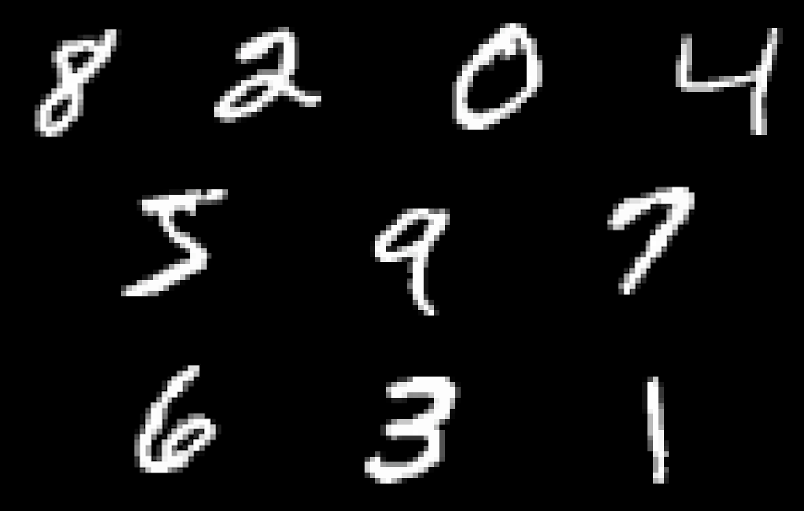
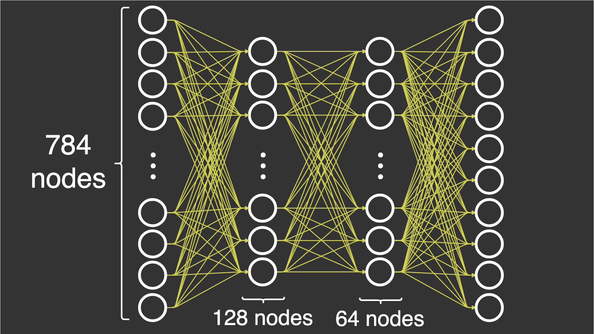

Pythonを使ってさまざまなアーキテクチャの複雑なニューラルネットワークを作成することは、機械学習エンジニアやデータサイエンティストにとって標準的な作業です。しかし、ニューラルネットワークがどのように動作するかを純粋に理解することも同様に価値があります。この記事では、使いやすくしてくれそうなフレームワークの助けを借りずに、ニューラルネットワークを構築する方法の基礎を学びましょう。

記事を読みながら、[GitHub](https://github.com/casperbh96/Neural-Network-From-Scratch)でノートブックを開き、同時にコードを実行することができます。

## 前提条件

この記事では、フォワード・パスとバック・パス（バックプロパゲーション）を実装して、基本的なディープ・ニューラル・ネットワークを作る方法を説明します。そのためには、ニューラルネットワークの機能に関する具体的な知識が必要ですが、それについてはこの[ニューラルネットワーク入門](https://mlfromscratch.com/neural-networks-explained/)で説明しています。

また、この記事の中で私がある操作を行う理由を理解できるように、線形代数の基礎を知っておくことも重要です。私の[連載記事](https://mlfromscratch.com/tag/linear-algebra/)では、これらの基礎を学ぶことができます。しかし、私の一番のお勧めは、3Blue1Brownのシリーズ[Essence of linear algebra](http://www.youtube.com/playlist?list=PLZHQObOWTQDPD3MizzM2xVFitgF8hE_ab)を見ることです。

## NumPy

この記事では、1つの入力層、2つの隠れ層、1つの出力層の4つの層からなる*基本*のディープニューラルネットワークを構築します。すべての層は完全に接続されています。[MNIST](http://yann.lecun.com/exdb/mnist/)というデータセットを使って、0〜9の数字を分類しようとしています。このデータセットは、28×28ピクセルの7万枚の画像で構成されています。このデータセットには、各画像に表示されている数字を示すラベルが1つずつ含まれています。10個のラベルがあるので、10個のクラスがあるということになります。

_MNISTデータセットからの10個の数字の例、2倍に拡大されています。

ニューラルネットワークの学習には、確率的勾配降下法（stochastic gradient descent）を使用しています。

層を正確に定義してみましょう。数字を分類できるようにするには、ニューラルネットワークを実行した後に、ある画像が特定のクラスに属する確率を求めなければなりません。そうすれば、ニューラルネットワークの性能を定量化することができます。

1. 入力層。この層では、28×28の画像からなるデータセットを入力します。これらの画像を28×28=78428×28=784の要素を持つ1つの配列に_flatten_します。つまり、入力層は784個のノードを持つことになります。

1. 1.隠れ層1：この層では、入力層の784個のノードから128個のノードに減らします。これは、ニューラルネットワークを進めていくときに課題となります（これについては後で説明します）。

1. 隠れ層2：この層では、第1隠れ層の128ノードから64ノードにすることにしました。第1層ですでに数を減らしているので、これは新たな挑戦ではありません。

1. 出力層。この層では、64個のノードを合計10個のノードに減らして、ラベルに対してノードを評価できるようにします。このラベルは、10個の要素を持つ配列の形で受け取られ、そのうちの1つの要素は1で、残りは0です。

各層のノード数が，784ノード→128ノード→64ノード→10ノードと減少していくのがわかると思います．これは、オーバーフィッティングでもアンダーフィッティングでもなく、ちょうど良いノード数を得ようとしているだけなので、より良い結果が得られるという[経験的観察](https://www.heatonresearch.com/2017/06/01/hidden-layers.html)に基づいています。この記事で選ばれた特定のノード数は、オーバーフィッティングを避けるために減少させながらもランダムに選ばれました。現実的なシナリオでは、これらのパラメータを総当りや推測で最適化したいところですが、通常はグリッドサーチやランダムサーチを使用しますが、これは本記事の範囲外です。

### インポートとデータセット

NumPyのパートでは、特に使用したインポートを共有したいと思いました。なお、データセットをより簡単に読み込むために、NumPy以外のライブラリを使用していますが、実際のニューラルネットワークには使用していません。

さて、データセットを読み込んで、NumPyで使えるように前処理をしなければならない。すべての画像を255で割って正規化し、すべての画像が0〜1の値を持つようにします。これは、後に活性化関数の数値安定性の問題を取り除くためです。ワンショットでエンコードされたラベルを使用しているのは、ニューラルネットワークの出力からラベルをより簡単に差し引くことができるからです。*また，入力層が必要とする要素として，28 * 28 = 784 要素のフラット化された配列として入力を読み込むことにしました．

### 初期化

ニューラルネットワークの重みの初期化については、少し難しく考えています。以下の方法がどのように機能するのか、なぜ機能するのかを本当に理解するためには、線形代数、特にドット積演算を使用する場合の次元についての理解が必要です。

フィードフォワード・ニューラルネットワークを実装する際に発生する具体的な問題は、784ノードから10ノードに変換しようとしていることです。`DeepNeuralNetwork`クラスをインスタンス化する際に、各層の活性化の数を定義するサイズの配列を渡します。

これは、`init`関数によって、`DeepNeuralNetwork`クラスを初期化するものです。

それでは、`initialization()`関数を呼び出したときに、サイズがニューラルネットワークのパラメータにどのような影響を与えるかを見てみましょう。私は，層が増えるにつれて活性化の数を減らしながらフォワードパスを行うことができるように，*m x n* 個の*"dot-able "* である行列を用意しています。M1の*m*がM2の*n*と等しい、あるいはM1の*n*がM2の*m*と等しい、2つの行列M1とM2に対してのみ、ドット積演算を使用することができます。

この説明で、最初の重みW1をm=128m=128、n=784n=784で初期化し、次の重みW2をm=64m=64、n=128n=128としていることがわかります。入力層A0の活性化数は先ほど説明したように784個で、W1を活性化数A0でドット化すると、演算が成功します。

### フィードフォワード

フォワードパスは、NumPyのドット演算で構成されており、単なる行列の乗算であることがわかります。[Introduction to neural networks](https://mlfromscratch.com/neural-networks-explained/)の記事で説明したように、重みに前の層の活性化を掛けなければなりません。そして、その結果に対して活性化関数を適用しなければなりません。

各層を通過するために、私はドット演算とシグモイド活性化関数を順に適用します。最後の層では、現在のフォワードパスの性能を測定できるように、各クラスの確率を得たいので、活性化関数として「ソフトマックス」を使用します。

**注**:私は数値的に安定したバージョンの`softmax`関数を選びました。詳しくは、スタンフォード大学の[CS231n](http://cs231n.github.io/linear-classify/#softmax)というコースをご覧ください。

次のコードは、この記事で使用した活性化関数を示しています。見ての通り、シグモイドの派生版を用意しています。これは後にニューラルネットワークをバックプロパゲートする際に必要になるからです。

### バックプロパゲーション

バックワードパスは、非常に多くのサイズと、すべての演算を成功させるために揃える必要のある演算があるため、正しく行うのが難しいです。以下にバックワードパスの全関数を示します。以下、各ウェイトの更新について説明します。

#### W3のアップデート

W3`のアップデートは，フォワードパスの出力である`output`からラベル付きのグランドトゥルース配列である`y_train`を引くことで計算できます．この操作は，`len(y_train)`が10であり，`len(output)`も10であることから成功します．y_train`の例としては，以下のようなコードが考えられます．1は`output`のラベルに対応しています．

出力 "の例を以下のコードに示します。数字は "y_train "のクラスに対応する確率です。

これらを引き算すると次のようになります。

次の演算はドット演算で、（先ほど計算した）誤差を最後の層の活性度でドット化します。

#### W2の更新

次は、重み `W2` の更新です。成功するためにはより多くの操作が必要です。まず、`W3` は `(10, 64)` という形をしていて、`error` は `(10, 64)` という形をしているので、形に若干のミスマッチがあります。つまり、全く同じ寸法です。したがって、`.T`による`W3`パラメータの[転置演算](https://docs.scipy.org/doc/numpy/reference/generated/numpy.transpose.html#numpy.transpose)を使用して、配列の寸法を順列化し、ドット演算のために形状を揃えることができるのです。

_転置演算の例です。左：元の行列。右側。並べ替えられた行列。

`W3` は形が `(64, 10)` に，`error` は形が `(10, 64)` になり，ドット演算と互換性があります．この結果は、`Z2`のシグモイド関数の微分の結果と[要素ごとに乗算](https://docs.scipy.org/doc/numpy/reference/generated/numpy.multiply.html)(ハダマード積とも呼ばれる)されます。最後に、その誤差を前の層のアクティベーションでドットします。

#### W1の更新

同様に、`W1`を更新するコードは、1ステップ前のニューラルネットワークのパラメータを使用しています。その他のパラメータ以外は，W2のアップデートと同等のコードとなっています。

### トレーニング (確率的勾配降下法)

フォワードパスとバックワードパスを定義しましたが、どうやって使い始めるのでしょうか？トレーニングループを作って、ニューラルネットワークのパラメータを更新するオプティマイザとして、確率的勾配降下法（SGD）を使わなければなりません。学習機能には、主に2つのループがあります。1つはエポック数（データセット全体を実行する回数）を決めるループ、もう1つは各観測データを1つずつ実行するループです。

各観測データに対して，先ほど説明したように，長さ784の配列の中の1枚の画像である`x`を使ってフォワードパスを行います。フォワードパスの「出力」は，バックワードパスのワンショットエンコードされたラベル（グランドトゥルース）である「y」とともに使用されます．これにより，ニューラルネットワークの重みを更新するための辞書が得られます．

`update_network_parameters()`関数には、SGD更新ルールのコードがあり、入力としてウェイトの勾配が必要なだけです。また、はっきりさせておきたいのは、SGDはバックワードパスからバックプロパゲーションを使って勾配を計算するもので、単にパラメータを更新するものではないということです。この2つは別物のように見えますが、2つのアルゴリズムは異なるので、別々に考えるべきです。

ニューラルネットワークのパラメータを更新した後は，先に用意した検証セットで精度を測定し，データセット全体に対する各反復処理後のネットワークの性能を検証します．

次のコードでは，学習関数と同じ部分を使用しています．まず、フォワードパスを行い、ネットワークの予測値を見つけ、ラベルと等しいかどうかをチェックします。その後、予測値を合計し、100で割って精度を求めています。次に、各クラスの精度を平均化します。

最後に、何が起こるかを知った上で、トレーニング関数を呼び出すことができます。トレーニングデータと検証データをトレーニング関数の入力として使用し、あとは待つだけです。

重みをどのように初期化するかによって，結果が大きく変わることに注意してください。私の結果は，精度が0%から95%の範囲です。

以下は，何が起こっているかを説明するための完全なコードです。

### NumPyでの良い練習問題

このコードは非常に読みやすいのですが、多くのスペースを占めており、ループで実行するように最適化できることに気付いたかもしれません。ここでは、それを最適化して改善するチャンスです。このテーマに初めて触れる方のために、以下の練習問題の難易度は簡単なものから難しいものまでとなっており、最後の練習問題が最も難しくなっています。

1. 簡単：ReLU活性化関数またはこの[活性化関数の概要](https://mlfromscratch.com/activation-functions-explained/)から他の活性化関数を実装してください。参考までにシグモイド関数がどのように実装されているかを確認し、導関数も忘れずに実装してください。シグモイド関数の代わりにReLU活性化関数を使う。

1. 簡単：バイアスを初期化し，フォワードパスで活性化関数の前にZに追加し，バックワードパスで更新する．バイアスを追加しようとすると、配列の次元に注意が必要です。

1. 中くらい。フォワードパスとバックワードパスを，それぞれの関数内の `for` ループで実行するように最適化します．これにより，コードの修正が容易になり，保守も容易になる可能性があります。
    * ニューラルネットワークの重みを作る初期化関数を最適化し、`sizes=[]`の引数を変更してもニューラルネットワークが失敗しないようにします。
    
1. 中程度。確率的勾配降下法の代わりに、ミニバッチ勾配降下法を実装しました。サンプルごとにパラメータを更新するのではなく、ミニバッチ内の各サンプルから蓄積された勾配の合計の平均値に基づいて更新を行います。ミニバッチのサイズは通常64以下です。

1. ハード：この[オプティマイザーの概要](https://mlfromscratch.com/optimizers-explained)で紹介されているAdamオプティマイザーを実装します。これは学習機能に実装する必要があります。
    1. 追加項を追加してMomentumを実装
    1. AdaGradオプティマイザをベースにした適応学習率の実装
    1. ステップ1と2を組み合わせてAdamを実装する

私の考えでは、これらの演習を終えれば、十分な基礎を身につけることができます。次のステップは、畳み込みやフィルターなどの実装ですが、それは今後の記事に譲ります。

*免責事項として、これらの練習問題には解答がありません*。

## PyTorch

バックプロパゲーションを用いたフィードフォワードニューラルネットワークの計算を実装する方法を紹介しましたが、PyTorchがNumPyと比較してどれだけ簡単でどれだけ時間を節約できるか見てみましょう。

### MNISTデータセットの読み込み

必要以上に複雑で理解するのが難しいと思われるのが、PyTorchでのデータセットの読み込みです。

まず、データの変換を定義し、テンソルであること、正規化することを指定します。そして、`DataLoader`とデータセットの`import`を組み合わせて、データセットを読み込みます。必要なのはこれだけです。これらのローダーから値を展開する方法は後ほど説明します。

### トレーニング

先ほどNumPyで書いた`DeepNeuralNetwork`クラスに似た`Net`というクラスを定義しました。このクラスには同じメソッドがいくつかありますが、ネットワークのパラメータの初期化やPyTorchでのバックワードパスについては、精度を計算する関数と一緒になくなっているので、考える必要がないことがよくわかります。

このクラスを読むと、PyTorchが関連する活性化関数とさまざまな種類の層をすべて実装してくれていることに気づきます。あなたはそれについて考える必要はありません。完全連結層の場合は、`nn.Linear()`のように、いくつかの層を定義すればよいのです。

先ほどオプティマイザーをインポートしましたが、今度はどのオプティマイザーを使うかと、損失の基準を指定します。オプティマイザーと基準をトレーニング関数に渡すと、PyTorchはNumPyのように例題を実行し始めます。精度を測る指標を入れることもできましたが、損失を測る代わりに省略しています。

## TensorFlow 2.0 with Keras

ニューラルネットワークのTensorFlow/Kerasバージョンでは、コードの行数を最小限に抑えたシンプルなアプローチを選択しました。つまり、クラスを定義するのではなく、KerasのハイレベルなAPIを使って、わずか数行のコードでニューラルネットワークを作っているのだ。ニューラルネットワークについて学び始めたばかりの方は、Kerasを使うと参入のハードルが最も低くなることがわかります。ですから、おすすめです。

私はまず、後に必要な関数をすべてインポートします。

この数行のコードだけで、データセットの読み込みと前処理ができます。なお、今回のアプローチでは検証データを使用する予定はないので、トレーニングデータのみを前処理しています。後ほど、検証データの利用方法について説明します。

次のステップは、モデルの定義です。Kerasでは、データに適用したいレイヤーがわかっていれば、これは非常に簡単です。ここでは、NumPyの例のように、完全連結層を使用します。Kerasでは、これを`Dense()`関数で行います。

モデルのレイヤーを定義した後、モデルをコンパイルし、オプティマイザー、損失関数、メトリックを定義します。最後に、他の例と同じように、10エポックのトレーニングデータにフィットするようにKerasに指示します。

検証データを使いたい場合は、fit関数の`validation_data`パラメータを使って渡すことができます。

## 結論

この記事では、使いやすくするためのフレームワークの助けを借りずに、ニューラルネットワークを構築する方法の基礎をお伝えしました。4層の*基本的な*ディープニューラルネットワークを構築し、フォワードパスとバックワードパス（バックプロパゲーション）を実装することで基本的なディープニューラルネットワークを作る方法を説明しました。