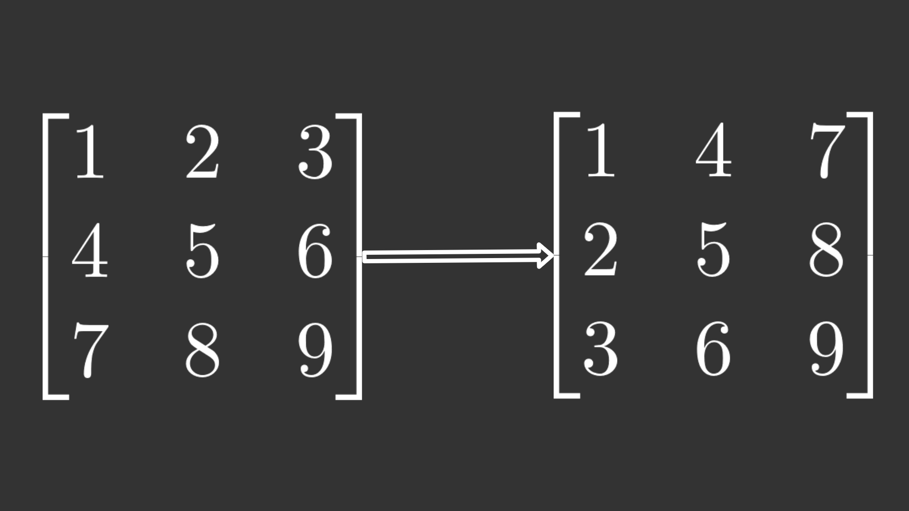

Creating complex neural networks with different architectures in Python should be a standard practice for any machine learning engineer or data scientist. But a genuine understanding of how a neural network works is equally valuable. In this article, learn the fundamentals of how you can build neural networks without the help of the frameworks that might make it easier to use.

While reading the article, you can open the notebook on [GitHub](https://github.com/casperbh96/Neural-Network-From-Scratch) and run the code at the same time.

## Prerequisites

In this article, I explain how to make a basic deep neural network by implementing the forward and backward pass (backpropagation). This requires some specific knowledge about the functions of neural networks, which I discuss in this [introduction to neural networks](https://mlfromscratch.com/neural-networks-explained/).

It's also important to know the fundamentals of linear algebra to be able to understand why I perform certain operations in this article. I have a [series of articles](https://mlfromscratch.com/tag/linear-algebra/) where you can learn some of these fundamentals. However, my best recommendation is to watch 3Blue1Brown's series [Essence of linear algebra](http://www.youtube.com/playlist?list=PLZHQObOWTQDPD3MizzM2xVFitgF8hE_ab).

## NumPy

In this article, I build a *basic* deep neural network with 4 layers: 1 input layer, 2 hidden layers, and 1 output layer. All of the layers are fully connected. I'm trying to classify digits from 0 - 9 using a data set called [MNIST](http://yann.lecun.com/exdb/mnist/). This data set consists of 70,000 images that are 28 by 28 pixels each. The data set contains one label for each image that specifies the digit that I see in each image. I say that there are 10 classes because I have 10 labels.


_10 examples of the digits from the MNIST data set, scaled up 2x_

For training the neural network, I use stochastic gradient descent, which means I put one image through the neural network at a time.

Let's try to define the layers in an exact way. To be able to classify digits, you must end up with the probabilities of an image belonging to a certain class after running the neural network because then you can quantify how well your neural network performed.

1. Input layer: In this layer, I input my data set consisting of 28x28 images. I _flatten_ these images into one array with 28×28=78428×28=784 elements. This means that the input layer will have 784 nodes.

1. Hidden layer 1: In this layer, I reduce the number of nodes from 784 in the input layer to 128 nodes. This creates a challenge when you are going forward in the neural network (I'll explain this later).

1. Hidden layer 2: In this layer, I decide to go with 64 nodes, from the 128 nodes in the first hidden layer. This is no new challenge because I've already reduced the number in the first layer.

1. Output layer: In this layer, I reduce the 64 nodes to a total of 10 nodes so that I can evaluate the nodes against the label. This label is received in the form of an array with 10 elements, where one of the elements is 1 while the rest are 0.

You probably realize that the number of nodes in each layer decreases from 784 nodes to 128 nodes to 64 nodes to 10 nodes. This is based on [empirical observations](https://www.heatonresearch.com/2017/06/01/hidden-layers.html) that this yields better results because we're not overfitting nor underfitting, only trying to get just the right number of nodes. The specific number of nodes chosen for this article were chosen at random, although decreasing to avoid overfitting. In most real-life scenarios, you would want to optimize these parameters by brute force or good guesses, usually by grid search or random search, but this is outside the scope of this article.


### Imports and data set

For the entire NumPy part, I specifically wanted to share the imports used. Note that I use libraries other than NumPy to more easily load the data set, but they are not used for any of the actual neural networks.

```
from sklearn.datasets import fetch_openml
from keras.utils.np_utils import to_categorical
import numpy as np
from sklearn.model_selection import train_test_split
import time

```

Now, I must load the data set and preprocess it so that I can use it in NumPy. I do normalization by dividing all images by 255 and make it such that all images have values between 0 - 1 because this removes some of the numerical stability issues with activation functions later on. I use one-hot encoded labels because I can more easily subtract these labels from the output of the neural network. I also choose to load the inputs as flattened arrays of 28 * 28 = 784 elements because that is what the input layer requires.

```
x, y = fetch_openml('mnist_784', version=1, return_X_y=True)
x = (x/255).astype('float32')
y = to_categorical(y)

x_train, x_val, y_train, y_val = train_test_split(x, y, test_size=0.15, random_state=42)
```

### Initialization

The initialization of weights in the neural network is a little more difficult to think about. To really understand how and why the following approach works, you need a grasp of linear algebra, specifically dimensionality when using the dot product operation.

The specific problem that arises when trying to implement the feedforward neural network is that we are trying to transform from 784 nodes to 10 nodes. When instantiating the `DeepNeuralNetwork` class, I pass in an array of sizes that defines the number of activations for each layer.

```
dnn = DeepNeuralNetwork(sizes=[784, 128, 64, 10])
```

This initializes the `DeepNeuralNetwork` class by the `init` function.

```
def __init__(self, sizes, epochs=10, l_rate=0.001):
    self.sizes = sizes
    self.epochs = epochs
    self.l_rate = l_rate

    # we save all parameters in the neural network in this dictionary
    self.params = self.initialization()
```

Let's look at how the sizes affect the parameters of the neural network when calling the `initialization()` function. I am preparing *m x n* matrices that are *"dot-able"* so that I can do a forward pass, while shrinking the number of activations as the layers increase. I can only use the dot product operation for two matrices M1 and M2, where *m* in M1 is equal to *n* in M2, or where *n* in M1 is equal to *m* in M2.

With this explanation, you can see that I initialize the first set of weights W1 with m=128m=128 and n=784n=784, while the next weights W2 are m=64m=64 and n=128n=128. The number of activations in the input layer A0 is equal to 784, as explained earlier, and when I dot W1 by the activations A0, the operation is successful.

```
def initialization(self):
    # number of nodes in each layer
    input_layer=self.sizes[0]
    hidden_1=self.sizes[1]
    hidden_2=self.sizes[2]
    output_layer=self.sizes[3]

    params = {
        'W1':np.random.randn(hidden_1, input_layer) * np.sqrt(1. / hidden_1),
        'W2':np.random.randn(hidden_2, hidden_1) * np.sqrt(1. / hidden_2),
        'W3':np.random.randn(output_layer, hidden_2) * np.sqrt(1. / output_layer)
    }

    return params
```

### Feedforward

The forward pass consists of the dot operation in NumPy, which turns out to be just matrix multiplication. As described in the [Introduction to neural networks](https://mlfromscratch.com/neural-networks-explained/) article, I must multiply the weights by the activations of the previous layer. Then, I must apply the activation function to the outcome.

To get through each layer, I sequentially apply the dot operation followed by the sigmoid activation function. In the last layer, I use the `softmax` activation function because I want to have probabilities of each class so that I can measure how well the current forward pass performs.

**Note**: I chose a numerically stable version of the `softmax` function. You can read more from the course at Stanford called [CS231n](http://cs231n.github.io/linear-classify/#softmax).

```
def forward_pass(self, x_train):
    params = self.params

    # input layer activations becomes sample
    params['A0'] = x_train

    # input layer to hidden layer 1
    params['Z1'] = np.dot(params["W1"], params['A0'])
    params['A1'] = self.sigmoid(params['Z1'])

    # hidden layer 1 to hidden layer 2
    params['Z2'] = np.dot(params["W2"], params['A1'])
    params['A2'] = self.sigmoid(params['Z2'])

    # hidden layer 2 to output layer
    params['Z3'] = np.dot(params["W3"], params['A2'])
    params['A3'] = self.softmax(params['Z3'])

    return params['A3']
```

The following code shows the activation functions used for this article. As can be observed, I provide a derivative version of the sigmoid because I need that later on when backpropagating through the neural network.

```
def sigmoid(self, x, derivative=False):
    if derivative:
        return (np.exp(-x))/((np.exp(-x)+1)**2)
    return 1/(1 + np.exp(-x))

def softmax(self, x):
    # Numerically stable with large exponentials
    exps = np.exp(x - x.max())
    return exps / np.sum(exps, axis=0)
```

### Backpropagation

The backward pass is hard to get right because there are so many sizes and operations that must align for all of the operations to be successful. Here is the full function for the backward pass. I go through each weight update below.

```
def backward_pass(self, y_train, output):
    '''
        This is the backpropagation algorithm, for calculating the updates
        of the neural network's parameters.
    '''
    params = self.params
    change_w = {}

    # Calculate W3 update
    error = output - y_train
    change_w['W3'] = np.dot(error, params['A3'])

    # Calculate W2 update
    error = np.multiply( np.dot(params['W3'].T, error), self.sigmoid(params['Z2'], derivative=True) )
    change_w['W2'] = np.dot(error, params['A2'])

    # Calculate W1 update
    error = np.multiply( np.dot(params['W2'].T, error), self.sigmoid(params['Z1'], derivative=True) )
    change_w['W1'] = np.dot(error, params['A1'])

    return change_w
```

#### W3 update

The update for `W3` can be calculated by subtracting the ground truth array with labels called `y_train` from the output of the forward pass called `output`. This operation is successful because `len(y_train)` is 10 and `len(output)` is also 10. An example of `y_train` might be the following code, where the 1 is corresponding to the label of the `output`.

```
y_train = np.array([0, 0, 1, 0, 0, 0, 0, 0, 0, 0])
```

An example of `output` is shown in the following code, where the numbers are probabilities corresponding to the classes of `y_train`.

```
output = np.array([0.2, 0.2, 0.5, 0.3, 0.6, 0.4, 0.2, 0.1, 0.3, 0.7])
```

If you subtract them, you get the following.

```
>>> output - y_train
array([ 0.2,  0.2, -0.5,  0.3,  0.6,  0.4,  0.2,  0.1,  0.3,  0.7])
```

The next operation is the dot operation that dots the error (which I just calculated) with the activations of the last layer.

```
error = output - y_train
change_w['W3'] = np.dot(error, params['A3'])
```

#### W2 update

Next is updating the weights `W2`. More operations are involved for success. First, there is a slight mismatch in shapes because `W3` has the shape `(10, 64)` and `error` has `(10, 64)`, that is, the exact same dimensions. Therefore, I can use a [transpose operation](https://docs.scipy.org/doc/numpy/reference/generated/numpy.transpose.html#numpy.transpose) on the `W3` parameter by the `.T` such that the array has its dimensions permuted and the shapes now align up for the dot operation.



_An example of the transpose operation. Left: The original matrix. Right: The permuted matrix_

`W3` now has shape `(64, 10)` and `error` has shape `(10, 64)`, which are compatible with the dot operation. The result is [multiplied element-wise](https://docs.scipy.org/doc/numpy/reference/generated/numpy.multiply.html) (also called Hadamard product) with the outcome of the derivative of the sigmoid function of `Z2`. Finally, I dot the error with the activations of the previous layer.

```
error = np.multiply( np.dot(params['W3'].T, error), self.sigmoid(params['Z2'], derivative=True) )
change_w['W2'] = np.dot(error, params['A2'])
```

#### W1 update

Likewise, the code for updating `W1` is using the parameters of the neural network one step earlier. Except for other parameters, the code is equivalent to the W2 update.

```
error = np.multiply( np.dot(params['W2'].T, error), self.sigmoid(params['Z1'], derivative=True) )
change_w['W1'] = np.dot(error, params['A1'])
```

### Training (stochastic gradient descent)

I have defined a forward and backward pass, but how can I start using them? I must make a training loop and use stochastic gradient descent (SGD) as the optimizer to update the parameters of the neural network. There are two main loops in the training function. One loop for the number of epochs, which is the number of times I run through the entire data set, and a second loop for running through each observation one by one.

For each observation, I do a forward pass with `x`, which is one image in an array with the length 784, as explained earlier. The `output` of the forward pass is used along with `y`, which are the one-hot encoded labels (the ground truth) in the backward pass. This gives me a dictionary of updates to the weights in the neural network.

```
def train(self, x_train, y_train, x_val, y_val):
    start_time = time.time()
    for iteration in range(self.epochs):
        for x,y in zip(x_train, y_train):
            output = self.forward_pass(x)
            changes_to_w = self.backward_pass(y, output)
            self.update_network_parameters(changes_to_w)

        accuracy = self.compute_accuracy(x_val, y_val)
        print('Epoch: {0}, Time Spent: {1:.2f}s, Accuracy: {2}'.format(
            iteration+1, time.time() - start_time, accuracy
        ))
```

The `update_network_parameters()` function has the code for the SGD update rule, which just needs the gradients for the weights as input. And to be clear, SGD involves calculating the gradient using backpropagation from the backward pass, not just updating the parameters. They seem separate, and they should be thought of separately because the two algorithms are different.

```
def update_network_parameters(self, changes_to_w):
    '''
        Update network parameters according to update rule from
        Stochastic Gradient Descent.

        θ = θ - η * ∇J(x, y),
            theta θ:            a network parameter (e.g. a weight w)
            eta η:              the learning rate
            gradient ∇J(x, y):  the gradient of the objective function,
                                i.e. the change for a specific theta θ
    '''

    for key, value in changes_to_w.items():
        for w_arr in self.params[key]:
            w_arr -= self.l_rate * value
```

After having updated the parameters of the neural network, I can measure the accuracy on a validation set that I prepared earlier to validate how well the network performs after each iteration over the whole data set.

The following code uses some of the same pieces as the training function. To start, it does a forward pass then finds the prediction of the network and checks for equality with the label. After that, I sum over the predictions and divide by 100 to find the accuracy. Next, I average out the accuracy of each class.

```
def compute_accuracy(self, x_val, y_val):
    '''
        This function does a forward pass of x, then checks if the indices
        of the maximum value in the output equals the indices in the label
        y. Then it sums over each prediction and calculates the accuracy.
    '''
    predictions = []

    for x, y in zip(x_val, y_val):
        output = self.forward_pass(x)
        pred = np.argmax(output)
        predictions.append(pred == y)

    summed = sum(pred for pred in predictions) / 100.0
    return np.average(summed)
```

Finally, I can call the training function after knowing what will happen. I use the training and validation data as input to the training function, and then wait.

```
dnn.train(x_train, y_train, x_val, y_val)
```

Note that the results might vary a lot depending on how the weights are initialized. My results range from an accuracy of 0% - 95%.

Following is the full code for an overview of what's happening.

```
from sklearn.datasets import fetch_openml
from keras.utils.np_utils import to_categorical
import numpy as np
from sklearn.model_selection import train_test_split
import time

x, y = fetch_openml('mnist_784', version=1, return_X_y=True)
x = (x/255).astype('float32')
y = to_categorical(y)

x_train, x_val, y_train, y_val = train_test_split(x, y, test_size=0.15, random_state=42)

class DeepNeuralNetwork():
    def __init__(self, sizes, epochs=10, l_rate=0.001):
        self.sizes = sizes
        self.epochs = epochs
        self.l_rate = l_rate

        # we save all parameters in the neural network in this dictionary
        self.params = self.initialization()

    def sigmoid(self, x, derivative=False):
        if derivative:
            return (np.exp(-x))/((np.exp(-x)+1)**2)
        return 1/(1 + np.exp(-x))

    def softmax(self, x):
        # Numerically stable with large exponentials
        exps = np.exp(x - x.max())
        return exps / np.sum(exps, axis=0)

    def initialization(self):
        # number of nodes in each layer
        input_layer=self.sizes[0]
        hidden_1=self.sizes[1]
        hidden_2=self.sizes[2]
        output_layer=self.sizes[3]

        params = {
            'W1':np.random.randn(hidden_1, input_layer) * np.sqrt(1. / hidden_1),
            'W2':np.random.randn(hidden_2, hidden_1) * np.sqrt(1. / hidden_2),
            'W3':np.random.randn(output_layer, hidden_2) * np.sqrt(1. / output_layer)
        }

        return params

    def forward_pass(self, x_train):
        params = self.params

        # input layer activations becomes sample
        params['A0'] = x_train

        # input layer to hidden layer 1
        params['Z1'] = np.dot(params["W1"], params['A0'])
        params['A1'] = self.sigmoid(params['Z1'])

        # hidden layer 1 to hidden layer 2
        params['Z2'] = np.dot(params["W2"], params['A1'])
        params['A2'] = self.sigmoid(params['Z2'])

        # hidden layer 2 to output layer
        params['Z3'] = np.dot(params["W3"], params['A2'])
        params['A3'] = self.softmax(params['Z3'])

        return params['A3']

    def backward_pass(self, y_train, output):
        '''
            This is the backpropagation algorithm, for calculating the updates
            of the neural network's parameters.

            Note: There is a stability issue that causes warnings. This is
                  caused  by the dot and multiply operations on the huge arrays.

                  RuntimeWarning: invalid value encountered in true_divide
                  RuntimeWarning: overflow encountered in exp
                  RuntimeWarning: overflow encountered in square
        '''
        params = self.params
        change_w = {}

        # Calculate W3 update
        error = output - y_train
        change_w['W3'] = np.dot(error, params['A3'])

        # Calculate W2 update
        error = np.multiply( np.dot(params['W3'].T, error), self.sigmoid(params['Z2'], derivative=True) )
        change_w['W2'] = np.dot(error, params['A2'])

        # Calculate W1 update
        error = np.multiply( np.dot(params['W2'].T, error), self.sigmoid(params['Z1'], derivative=True) )
        change_w['W1'] = np.dot(error, params['A1'])

        return change_w

    def update_network_parameters(self, changes_to_w):
        '''
            Update network parameters according to update rule from
            Stochastic Gradient Descent.

            θ = θ - η * ∇J(x, y),
                theta θ:            a network parameter (e.g. a weight w)
                eta η:              the learning rate
                gradient ∇J(x, y):  the gradient of the objective function,
                                    i.e. the change for a specific theta θ
        '''

        for key, value in changes_to_w.items():
            for w_arr in self.params[key]:
                w_arr -= self.l_rate * value

    def compute_accuracy(self, x_val, y_val):
        '''
            This function does a forward pass of x, then checks if the indices
            of the maximum value in the output equals the indices in the label
            y. Then it sums over each prediction and calculates the accuracy.
        '''
        predictions = []

        for x, y in zip(x_val, y_val):
            output = self.forward_pass(x)
            pred = np.argmax(output)
            predictions.append(pred == y)

        summed = sum(pred for pred in predictions) / 100.0
        return np.average(summed)

    def train(self, x_train, y_train, x_val, y_val):
        start_time = time.time()
        for iteration in range(self.epochs):
            for x,y in zip(x_train, y_train):
                output = self.forward_pass(x)
                changes_to_w = self.backward_pass(y, output)
                self.update_network_parameters(changes_to_w)

            accuracy = self.compute_accuracy(x_val, y_val)
            print('Epoch: {0}, Time Spent: {1:.2f}s, Accuracy: {2}'.format(
                iteration+1, time.time() - start_time, accuracy
            ))

dnn = DeepNeuralNetwork(sizes=[784, 128, 64, 10])
dnn.train(x_train, y_train, x_val, y_val)
```

### Good exercises in NumPy

You might have noticed that the code is very readable, but it takes up a lot of space and could be optimized to run in loops. Here is a chance to optimize and improve it. If you're new to this topic, the difficulties of the following exercises are easy to hard, where the last exercise is the hardest.

1. Easy: Implement the ReLU activation function or any other activation function from this [overview of activation functions](https://mlfromscratch.com/activation-functions-explained/). Check how the sigmoid functions are implemented for reference, and remember to implement the derivative as well. Use the ReLU activation function in place of the sigmoid function.

1. Easy: Initialize biases and add them to Z before the activation function in the forward pass, and update them in the backward pass. Be careful of the dimensions of the arrays when you try to add biases.

1. Medium: Optimize the forward and backward pass such that they run in a `for` loop in each function. This makes the code easier to modify and possibly easier to maintain.
    * Optimize the initialization function that makes weights for the neural network such that you can modify the `sizes=[]` argument without the neural network failing.
    
1. Medium: Implement mini-batch gradient descent, replacing stochastic gradient descent. Instead of making an update to a parameter for each sample, make an update based on the average value of the sum of the gradients accumulated from each sample in the mini-batch. The size of the mini-batch is usually below 64.

1. Hard: Implement the Adam optimizer, described in this [overview of optimizers](https://mlfromscratch.com/optimizers-explained). This should be implemented in the training function.
    1. Implement Momentum by adding the extra term
    1. Implement an adaptive learning rate, based on the AdaGrad optimizer
    1. Combine step 1 and 2 to implement Adam

My belief is that if you complete these exercises, you will have a good foundation. The next step is implementing convolutions, filters, and more, but that is left for a future article.

*As a disclaimer, there are no solutions to these exercises.*

## PyTorch

Now that I've shown how to implement these calculations for the feedforward neural network with backpropagation, let's see how easy and how much time PyTorch saves us in comparison to NumPy.

### Loading MNIST data set

One of the things that seems more complicated or harder to understand than it should be is loading data sets with PyTorch.

You start by defining the transformation of the data, specifying that it should be a tensor and that it should be normalized. Then, you use the `DataLoader` in combination with the data sets `import` to load a data set. This is all you need. You'll see how to unpack the values from these loaders later.

```
import torch
from torchvision import datasets, transforms

transform = transforms.Compose([
                transforms.ToTensor(),
                transforms.Normalize((0.1307,), (0.3081,))
            ])

train_loader = torch.utils.data.DataLoader(
    datasets.MNIST('data', train=True, download=True, transform=transform))

test_loader = torch.utils.data.DataLoader(
    datasets.MNIST('data', train=False, transform=transform))
```

### Training

I have defined a class called `Net` that is similar to the `DeepNeuralNetwork` class written in NumPy earlier. This class has some of the same methods, but you can clearly see that I don't need to think about initializing the network parameters nor the backward pass in PyTorch because those functions are gone, along with the function for computing accuracy.

```
import time
import torch.nn as nn
import torch.optim as optim
import torch.nn.functional as F

class Net(nn.Module):
    def __init__(self, epochs=10):
        super(Net, self).__init__()
        self.linear1 = nn.Linear(784, 128)
        self.linear2 = nn.Linear(128, 64)
        self.linear3 = nn.Linear(64, 10)

        self.epochs = epochs

    def forward_pass(self, x):
        x = self.linear1(x)
        x = torch.sigmoid(x)
        x = self.linear2(x)
        x = torch.sigmoid(x)
        x = self.linear3(x)
        x = torch.softmax(x, dim=0)
        return x

    def one_hot_encode(self, y):
        encoded = torch.zeros([10], dtype=torch.float64)
        encoded[y[0]] = 1.
        return encoded

    def train(self, train_loader, optimizer, criterion):
        start_time = time.time()
        loss = None

        for iteration in range(self.epochs):
            for x,y in train_loader:
                y = self.one_hot_encode(y)
                optimizer.zero_grad()
                output = self.forward_pass(torch.flatten(x))
                loss = criterion(output, y)
                loss.backward()
                optimizer.step()

            print('Epoch: {0}, Time Spent: {1:.2f}s, Loss: {2}'.format(
                iteration+1, time.time() - start_time, loss
            ))
```

When reading this class, notice that PyTorch has implemented all of the relevant activation functions for us, along with different types of layers. You don't even have to think about it. You can just define some layers like `nn.Linear()` for a fully connected layer.

I have imported optimizers earlier, and now I specify which optimizer I want to use, along with the criterion for the loss. I pass both the optimizer and criterion into the training function, and PyTorch starts running through the examples just like in NumPy. I could even include a metric for measuring accuracy, but that is left out in favor of measuring the loss instead.

```
model = Net()

optimizer = optim.SGD(model.parameters(), lr=0.001)
criterion = nn.BCEWithLogitsLoss()

model.train(train_loader, optimizer, criterion)
```

## TensorFlow 2.0 with Keras

For the TensorFlow/Keras version of the neural network, I chose to use a simple approach, minimizing the number of lines of code. That means I am not defining any class, but instead using the high-level API of Keras to make a neural network with just a few lines of code. If you are just starting to learn about neural networks, you will find that the bar to entry is the lowest when using Keras. Therefore, I recommend it.

I start by importing all of the functions I need for later.

```
import tensorflow as tf
from tensorflow.keras.datasets import mnist
from tensorflow.keras.utils import to_categorical
from tensorflow.keras.layers import Flatten, Dense
from tensorflow.keras.losses import BinaryCrossentropy
```

I can load the data set and preprocess it with just these few lines of code. Note that I only preprocess the training data because I'm not planning on using the validation data for this approach. Later, I explain how we can use the validation data.

```
(x_train, y_train), (x_val, y_val) = mnist.load_data()

x_train = x_train.astype('float32') / 255
y_train = to_categorical(y_train)
```

The next step is defining the model. In Keras, this is extremely simple after you know which layers you want to apply to your data. In this case, I'm going for the fully connected layers, as in the NumPy example. In Keras, this is done by the `Dense()` function.

After I have defined the layers of the model, I compile the model and define the optimizer, loss function, and metric. Finally, I can tell Keras to fit to the training data for 10 epochs, just like in the other examples.

```
model = tf.keras.Sequential([
    Flatten(input_shape=(28, 28)),
    Dense(128, activation='sigmoid'),
    Dense(64, activation='sigmoid'),
    Dense(10)
])

model.compile(optimizer='SGD',
              loss=BinaryCrossentropy(),
              metrics=['accuracy'])

model.fit(x_train, y_train, epochs=10)
```

If you want to use the validation data, you could pass it in using the `validation_data` parameter of the fit function:

```
model.fit(x_train, y_train, epochs=10, validation_data=(x_val, y_val))
```

## Conclusion

This article gave you the fundamentals of how you can build neural networks without the help of the frameworks that might make it easier to use. I built a *basic* deep neural network with 4 layers, and I explained how to make a basic deep neural network by implementing the forward and backward pass (backpropagation).