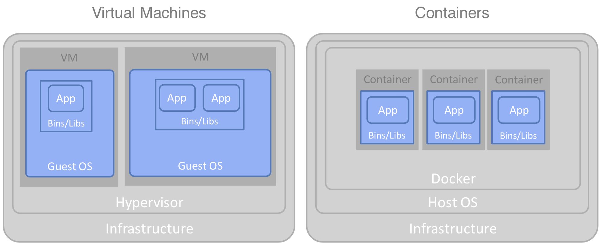

---
also_found_in:
- learningpaths/get-started-containers/
authors: ''
check_date: '2021-09-01'
completed_date: '2019-06-14'
components:
- kubernetes
draft: false
excerpt: Containerization should not be treated as just an infrastructure upgrade
  focused on resource optimization. The potential benefits are greater.
last_updated: '2020-09-10'
meta_description: Containerization should not be treated as just an infrastructure
  upgrade focused on resource optimization. The potential benefits of containers are
  greater.
meta_keywords: benefits of containers, benefits of containerization, container benefits,
  containerization strategy
meta_title: Container benefits beyond infrastructure and resource optimization
primary_tag: containers
related_content:
- slug: true-benefits-of-moving-to-containers-2
  type: articles
- slug: containerization-of-legacy-applications
  type: articles
- slug: intro-to-openshift-4
  type: articles
subtitle: Understanding the benefits of containerization
tags:
- cloud
- application-modernization
title: The true benefits of moving to containers
---

Most organizations either have or want to have a strategy for moving some part of their IT estate to containers. It is an important subset of a "move to cloud" strategy. The main challenge is that containerization is often viewed simply as an infrastructure upgrade, likened to hardware upgrades of the past, or even compared to the move to virtual machines over the last decade or so. This view of containers often leads to a "lift-and-shift" approach, which misses the whole premise of what containers bring to the table. At the very least, it results in poor execution of the containerization exercise. At worst, it results in the failure of an entire modernization program.

This article discusses the broader potential benefits of containerization. To achieve those benefits, you learn additional actions you must take on top of moving to container infrastructure.

## An over-simplistic understanding of containers results in misunderstanding the potential benefits

Containerization refers to running your components on a container technology such as Docker, and most probably administering those containers using a container orchestration technology such as Kubernetes.

Most enterprises today are running a significant proportion of their estate on virtual machines (VMs). Consider the differences between VMs and containers. A VM image includes of a complete operating system. A container image in contrast assumes most of the operating system capabilities from the host operating system on the machine. The container image needs to contain only the additional pieces, for example the binaries and libraries for the language runtime, and of course the application code itself.

Clearly a container image is much more lightweight in comparison to a VM image. It takes up less space on disk and memory, and it can be started and stopped much more rapidly, because  another operating system is not initiated and started. It is therefore easy to jump to the conclusion that optimized infrastructure is the primary benefit of moving to containers. Worse still, the idea of a "lightweight container" might lead you to the conclusion that containers inherently have better performance. However, these ideas quickly lead to wrong assumptions and missing the bigger picture.

The reality is that if your primary goal is to maximize the performance for a specific application, then a traditional installation directly on the host OS sitting on bare metal almost always provides the best performance, because it removes several layers in the architecture.

Furthermore, infrastructure optimization can only really kick in when you can place multiple heterogeneous workloads onto the same resources, so quiet times for one workload are balanced against busy times for another. You could make the same argument for virtual machine infrastructure, too. Therefore, if you already have a well-established virtual machine environment handling a large collection of different workloads, a basic "lift and shift" of that workload to containers is unlikely to result in significant optimization efficiencies, unless combined with additional actions.

To ensure success in a containerization initiative, you need to look at the wider benefits of containerization, how it can transform the way organizations develop and build solutions, and what additional actions you need to take beyond the "lift-and-shift" approach.

## What are the potential benefits of a broad containerization strategy?

If the right approach is taken, and a move to containers is recognized as an opportunity for
modernization, it can provide much broader benefits across the following areas:

1. Agility and productivity: accelerated development, improved consistency across environments, empowered autonomous teams improving productivity and quality.

1. Fine-grained resilience: independent deployment of highly available components to remove single points of failure.

1. Scalability and infrastructure optimization: fine-grained dynamic scaling and maximized component/resource density to make best use of infrastructure resources.

1. Operational consistency: homogeneous administration of heterogeneous components, reducing the range of skillsets required to operate the environments.

1. Component portability: portability across nodes, environments, and clouds, ensuring choice when selecting platforms.

The following sections go through each one of these areas in detail.

## Benefit 1. Agility and productivity

The lightweight nature of container deployment can dramatically change the speed at which teams can move new code or artifacts reliably from development through to production. However, this approach relies on changes to the granularity and make-up of components, and changes to the build and deployment processes of the components. It also requires that the development teams can move at a faster pace.

Container technology in itself provides some immediate benefits to productivity, notably in terms of the speed for provisioning new resources and deploying the code. For example, consider how much faster it is to provision, start up, and scale a new container image: typically a matter of seconds. Compare that to provisioning a new virtual machine, which often take hours, possibly days, or even weeks, due to complex organization procedures and controls around allocation of resources. However, this container technology itself is only part of the story, if you want to gain the full benefits.

Large silos of code need to be broken down into fine-grained components. There is physically much less code to be built, tested, and deployed in any given release cycle, and if designed well, there are few dependencies on other components, too. The build is then simpler, faster, and easier to understand. You can test changes more quickly, diagnose problems faster, and deliver fixes more quickly.

With this increased number of components, container orchestration platforms such as Kubernetes clearly become all the more essential so they can be handled in aggregate rather than individually.

Through organizational decentralization, teams completely own their code, which enables them to map requirements into that component more quickly. They build their components as free from dependencies as possible. They can deploy independently, knowing that they won't affect any other components. They don't need to schedule with other teams around deployments, share environments, or worry about versions of shared software libraries.

Deployment based on images significantly increases the consistency and quality of what is delivered. Any important dependencies between the code and the version of its runtime language and operating system are effectively burned into the image. This structure dramatically reduces issues from configuration differences that occur in traditional, shared server environments.

Of course, no amount of technology delivers functionality faster into production unless the processes are suitably streamlined, too. An agile development methodology must be in place, reducing hand-offs and dependencies between teams.

Agile methodologies go hand in hand with pipeline automation to enable continuous integration and deployment (CI/CD), because they need an efficient mechanism to build and deploy their regular iterations of code.

In summary, you can gain the following benefits in terms of agility and productivity. But, in addition to a move to container infrastructure, you also need to embrace organizational decentralization, repackage into fine-grained components, manage them using container orchestration, and move to an agile development methodology that is reinforced by an automated pipeline and image-based deployment. With these approaches in place, you see the following benefits:

* Higher build velocity
* Faster maintenance cycles
* Consistency across environments
* Independent component deployment
* Simplified testing of isolated components
* Heterogeneous runtime versions
* Standardized build pipeline
* Standardized deployment mechanism
* Self-service provisioning of resources
* Team autonomy through decentralization of control
* Clear component scope and ownership
* Technology freedom of choice

## Benefit 2. Fine-grained resilience

Simply moving a siloed application into a container provides little in terms of additional resilience. A memory leak in one function could still bring down the entire application. With fine-grained components, you have the opportunity to provide resilience more discretely. You can safely deploy a new function, or a change, to an existing one without any risk of affecting another function. Should a component fail, it need not affect other components. Furthermore, fine-grained components contain much less code and libraries, so their re-start times are significantly faster.

You can simply use this rapid re-instatement to provide high availability, without wasting any resources on separate dedicated warm or cold servers. To provide that re-instatement in anything other than a very rudimentary fashion requires of course a container orchestration capability, which enables more sophisticated reinstatement policies, including locational restrictions where needed, and ensuring that sets of replicas are well distributed across physical nodes and regions.

For the orchestration capability to be able to implement clean re-instatement, the containers must be implemented as disposable components such that they can be stopped, started, and re-located at will.

Therefore, to gain all the following benefits of fine-grained resilience, you must break your applications up into fine-grained components, managed through container orchestration of disposable components.

* Rapid re-start, enabling reinstatement rather than high availability (HA) pairs.
* Safe independent deployment, removing risk of destabilizing existing components.
* Disposable components enabling rapid start/stop for simple HA and scaling.
* Discrete topologies that are fit for purpose.
* Implicit high availability based on replication policy and built-in re-instatement.
* Fine-grained roll-out using rolling upgrades, canary releases, and A/B testing.

## Benefit 3. Operational consistency

With containers you have a uniform type of component to administer at run time. Containers from the outside all look largely the same.

No longer do you need to know intricate details about the command-line tools specific to products or runtime environments to perform builds and deployments. You don't need to create and maintain the complex runtime specific topologies required for load balancing and availability. Regardless of the functionality within the container, the way you build, deploy, upgrade, and provide high availability, scaling is all accomplished in exactly the same way. This is what operational consistency means. You no longer need to be a product or runtime specialist to monitor and administer the runtime environment. You just need to know how a generic container orchestration platform such as Kubernetes works.

To be effective, you need a completely new approach to the way you handle deployment. Image-based deployment makes it possible to encapsulate everything required to instantiate and run a component into a single lightweight image -- both the function itself, and the runtime environment on which it runs. Given this fully encapsulated component, a platform such as Kubernetes can rapidly create, start, and scale a container  based on any image, and on any node in its cluster, without knowing anything about the runtime environment or code inside.

Having your topological configuration closely bound to the container (infrastructure as code), ensures that the operators don't need to understand the subtle characteristics of the topology (such as availability, scaling, node affinity) in order to be able to deploy it. The infrastructural requirements embedded in the Helm Charts, for example, enable the container orchestration platform to set up a topology that provides the required nonfunctional characteristics in a standardized way.

Designing disposable components is essential so the container orchestration platform can efficiently re-instate containers for availability, introduce new ones for elastics scalability, and perform clean upgrades and roll-backs. In turn, the operator uses standard mechanisms for all these actions rather than unique techniques for each runtime environment.

Using a container orchestration platform leverages image-based deployment for consistent build and deployment, provides infrastructure as code alongside our container to consistently create and automatically maintain the topology, and ensures that you design disposable components to enable standardized scaling and high availability. Therefore, you achieve the following benefits in terms of operational consistency.

* Standardized container platform-based deployment, load balancing, high availability, scaling, rolling upgrades and rollbacks, logging, monitoring, usage metrics, endpoint exposure, inter-component security, and more.
* Homogeneous administration of heterogeneous nodes.
* One infrastructure platform skill set across all deployed products and runtime environments.
* A simpler process for transferring skills from one runtime environment to another.
* Easier attainment of the skills required for end-to-end DevOps.
* Improved consistency across environments.
* Automation of build, deployment, and topology administration.

## Benefit 4. Scalability and infrastructure optimization

Virtual machines require starting an entire operating system before any work can be processed. Containers are started and stopped within a running operating system, meaning that their lightweight nature enables them to be created or destroyed in seconds. This structure lends itself to dynamic scalability, making it possible to react to workload changes in real time.

Container orchestration platforms such as Kubernetes allow you to specify replication policies, then scale the containers up and down as required. As a result, each container only uses the resources it needs, freeing up any spare resource for other containers on the platform.

Only by breaking that application down into fine-grained components do you see the short start-up times needed to make elastic scaling a valuable reality. Furthermore, fine-grained components also enable the container platform to scale up only the functions that are under-load, rather than replicating the entire application and all its resources.

Furthermore, what's running in the containers needs to be designed as disposable components, so that the orchestration platform can introduce and remove containers at will, without side effects.

In summary, components moved to containers can only be efficiently scaled by the platform if they are designed as disposable components. Furthermore, they continue to scale with the same inefficiency of resources as they do in their current form unless they are broken down into fine-grained components to get true differential scaling. The scaling and optimization itself is of course primarily provided by the essential container orchestration. You see the following benefits:

* Fine-grained scaling of individual functionality.
* Maximized component/resource density.
* Lower overheads for isolation than with virtual machines.
* Dynamic and elastic provisioning of resources (CPU, memory, persistent volumes).

## Benefit 5. Component portability

Portability refers to the ease with which a component can be moved to a different platform. However, "move" could mean copy or rebuild, and these are two very different forms of portability with very different intents.

Portability by copy means that components can be run unchanged in another destination. After a container image is created, a container platform can trivially copy it to any node on the platform and start it up to create a container. However, just running your existing software in containers doesn't necessarily enable this portability. Fundamentally, to gain portability by copy means moving to image-based deployment, treating container images as the unit of deployment.

For the previously described portability to be effective, it relies on small images (to make the file copies faster) and rapid start-up times. You achieve this portability not just by moving to container infrastructure. You achieve it by refactoring to smaller fine-grained components designed as disposable components so that they can be stopped and started at will by the orchestration engine for scaling or redistribution.

The characteristics of the topology also must be specified well through infrastructure as code to ensure that the orchestration engine understands any restrictions on where the containers should be placed. For example, you need to know what the minimum number of replicas must be, whether they must be distributed multi-region for extra resilience, or whether there are any geographic privacy concerns.

There is a caveat to portability by copy with containers, however. Container images can be moved freely across operating systems of the same type (for example, between similar varieties of Linux, or variations of Microsoft Windows) and hardware if based on the same core architecture (for example, moving between x86 based architecture, or across AMD). This approach typically suffices for cloud platforms where you can choose that all nodes in all environments that have similar-enough types. However, if moving across those boundaries, the images don't run as-is. Instead, portability is provided by rebuilding the image for the new underlying OS or hardware. The component is still portable because no actual code changes are required for it to run on that new environment after the rebuild. However, it does not have quite the same assurance in terms of consistency, because you are no longer running the exact same image in all environments. The best you can expect in this scenario is to ensure a consistency through an automated pipeline to ensure at least the build process is identical, even if the final image has platform differences.

Containers generally have good portability. However, to really capitalize on those benefits you need to at least move to image-based deployment to simplify the move or copy of containers from one platform to another. If you want to move or copy dynamically you likely want them to be fast, which requires refactoring to fine-grained components to enable smaller image sizes and faster start-up times. You need to design them as disposable components to ensure that they can be removed from their previous locations efficiently. You likely want to use a container orchestration platform to perform the porting of images onto new nodes, in which case an infrastructure-as-code approach makes sure that your container orchestration platform has clear guidance for where the containers can be ported to. Finally, for porting across widely different operating systems or hardware architectures, an automated pipeline helps retain consistency across deployments. If you take all these extra steps over and above the move to a container platform, you see the following benefits:

* Containers can be re-distributed dynamically across nodes within a specific cloud.
* Images can be built and run on any container platform.
* You focus on open containerization standards such as Docker and Kubernetes.
* You enable multicloud scenarios.

## What other actions are needed for containerization to be successful?

In the previous sections, you learned that several additional steps are needed to reap the benefits of containerization. You need to make the following changes alongside the move to a container architecture:

* __Fine-grained components.__ Break your current components down into more fine grained elements that can that can be designed, deployed, scaled and maintained completely independently of one another.
* __Container orchestration.__ As you move to a large number of more fine-grained components, managing them with orchestration platforms like Kubernetes becomes a necessity to automate lifecycle management, scaling, load balancing, resource provisioning, and other details.
* __Disposable components.__ Design containers that are stateless and lightweight and can be stopped instantly so an orchestration platform can look after their lifecycle without needing to know anything about how the containers work on the inside.
* __Pipeline automation.__ Fine-grained containers enable you to make changes more independently and rapidly. By automating the build pipeline you can iterate much more quickly on making changes.
* __Image based deployment.__ Rather than deploying code to a running server, containers are so lightweight that you can deliver an entire stack, including code, the runtime environment, and configuration. This delivery simplifies deployment and management and improves consistency across environments.
* __Infrastructure as code.__ On a container platform, you effectively build out a unique topology for each container deployment. The characteristics of this topology, including scaling, load balancing, distribution across zones, routing, and security are specified declaratively in files. These files must effectively be part of the codebase of the component within the container. This approach ensures that the component is delivered consistently in every environment onto a topology that is specifically suited to its needs.
* __Organizational decentralization.__ The fine-grained deployment and operational consistency provided by a container orchestration platform reduces the entry-level knowledge needed to build and maintain solutions. This approach reduces the need for centralized, technology centric teams. Business teams can now have their own technical teams (shadow IT), increasing time to market for new innovations.
* __Agile development methodology.__ There is a clear synergy between agile methodologies and containers. They both enable empowered (decentralized) teams to achieve rapid change cycles that are more closely aligned with the business.
* __Establish a self-service developer experience.__ We must enable teams to independently and trivially set up the resources they need. Of course, it includes their ability to provision containers on a container orchestration platform, but it also includes team resources such as source code repositories, build automation capabilities, and image repositories.

For the specifics of these additional actions, see [Part 2](/articles/true-benefits-of-moving-to-containers-2/) of this series.

## Summary

Containerization should not be treated as just an infrastructure upgrade and focused on resource optimization. Indeed, a raw "lift-and-shift" approach to containerization rarely offers a valuable outcome. Instead there are a discrete set of actions that you should perform in addition to moving to containers. These actions help you realize a much broader set of benefits.

### Acknowledgements
Many thanks to Brian Petrini, with whom the ideas behind this series of articles were formed.