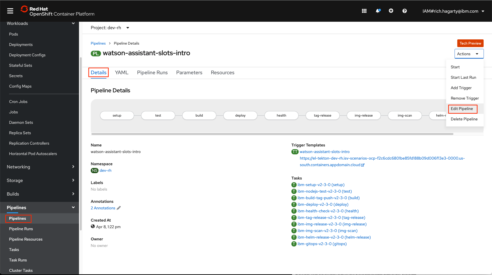
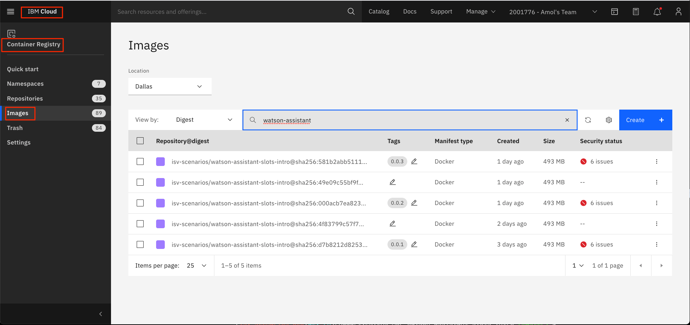

This tutorial demonstrates how to incorporate the [Cloud-Native Toolkit](https://cloudnativetoolkit.dev/) into your application so that you can build, test, and deploy your application on a Red Hat OpenShift cluster. Get hands-on experience using the toolkit to create a pipeline of tasks that will turn your application into a universal application image (UAI). This is a major first step toward meeting the requirements for [Red Hat Container Certification](https://connect.redhat.com/en/partner-with-us/red-hat-container-certification).

This tutorial builds on the concepts discussed in the article [Use the Cloud-Native Toolkit starter kits](/learningpaths/build-images-cloud-native-toolkit/starter-kits/).

Follow the steps in this tutorial to use the toolkit to add the necessary files to your existing GitHub repo so that you can build an OpenShift CI/CD pipeline to manage the deployment of your application.

Changes you make to your GitHub repo will trigger the pipeline to:

* Compile and build the code base
* Run tests, including unit and integration tests defined in the repo, and code quality and security using SonarQube
* Build and scan a UAI
* Deploy the UAI on your OpenShift cluster
* Tag the UAI and GitHub repo with a release version
* Store the UAI in a container registry

This tutorial also covers examples of where your pipeline might fail and steps to resolve those issues.

## Prerequisites

To complete this tutorial, you need access to the following:

* A public [GitHub](https://github.com/) account
* An [IBM Cloud](https://cloud.ibm.com/?cm_sp=ibmdev-_-developer-tutorials-_-cloudreg) account
* A Red Hat OpenShift cluster

You also need to perform these setup tasks:

* Install the Cloud-Native Toolkit on your OpenShift cluster, as described in the tutorial [Install the Cloud-Native Toolkit](/learningpaths/build-images-cloud-native-toolkit/install-toolkit/). Only the administrator of your OpenShift cluster needs to install the toolkit for you to access it.
* Prepare your accounts for the Cloud-Native Toolkit following the instructions found [in the documentation](https://cloudnativetoolkit.dev/getting-started/prereqs/). This involves generating GitHub and IBM access tokens.
* Install the Cloud-Native Toolkit [developer tools](https://cloudnativetoolkit.dev/getting-started/dev-env-setup/) on your machine.
* Install the Cloud-Native Toolkit [Command Line Interface (CLI)](https://cloudnativetoolkit.dev/getting-started/cli).

>**NOTE**: An IBM Cloud account is only required because our example app uses the Watson Assistant service. It is not a requirement of the Cloud-Native Toolkit, which can be used with any supported Kubernetes based cluster, such as Red Hat OpenShift.

## Estimated time

It should take you approximately 60 minutes to complete this tutorial.

## Application to be deployed

The application used in this tutorial is an open source Node.js application -- a pizza-ordering chatbot that is built on the IBM Watson Assistant service created on IBM Cloud.

The application serves as a good example because it has the following properties:

* Source that's maintained in an open source GitHub repository
* A conventional build file that specifies how to install, test, and run the app
* Defined unit and integration tests
* A Dockerfile for building a Docker image

The repository is [https://github.com/IBM/watson-assistant-slots-intro](https://github.com/IBM/watson-assistant-slots-intro), which includes a README that provides instructions for building and running the app.

The app requires the use of the IBM Watson Assistant service to be fully functional. This requires setting up and configuring the Watson service.

Also, if you want to test the app by running it locally, you need to install the Node.js runtime or `npm`.

If you prefer to focus just on the pipeline portion of this tutorial and not bother with any Watson services, this tutorial provides steps to bypass the Watson services content and still end up with a successful deployment.

## Steps

1. [Fork and clone the repo](#1-fork-and-clone-the-repo)
1. [Prepare your project to use the Cloud-Native Toolkit](#2-prepare-your-project-to-use-the-cloud-native-toolkit)
1. [Prepare the GitHub repo](#3-prepare-the-github-repo)
1. [Use the toolkit to create a pipeline](#4-use-the-toolkit-to-create-a-pipeline)
1. [Watch the pipeline in the OpenShift web console](#5-watch-the-pipeline-in-the-openshift-web-console)
1. [Resolve the issue with the **deploy** task](#6-resolve-the-issue-with-the-deploy-task)
1. [Re-run the pipeline](#7-re-run-the-pipeline)
1. [Resolve the issue with the **health** task](#8-resolve-the-issue-with-the-health-task)
1. [Explore the results](#9-explore-the-results)

### 1. Fork and clone the repo

First, fork the repo to your own GitHub account. Then, clone the forked repo to your local machine:

```bash
git clone https://github.com/<your-github-name>/watson-assistant-slots-intro.git
cd watson-assistant-slots-intro
```

Create a branch for your changes. Modifying the `main` branch in a forked repo can cause issues if you ever want to re-sync with the original repo.

Name your branch `dev`:

```bash
git checkout -b dev
```

### 2. Prepare your project to use the Cloud-Native Toolkit

In a terminal, use the `oc` CLI to prepare your project:

```bash
# Use CLI login provided by the OpenShift console
oc login <your-info>
# Create and switch to a new OpenShift project
oc new-project <your-project>
# Sync the project to prepare it for use with the toolkit
oc sync <your-project>
```

_**Note:** All toolkit assets are stored in the OpenShift `tools` project. The `sync` command makes those assets available to your project. It also sets the project that will be used in subsequent commands._

### 3. Prepare the GitHub repo

You need to make the following changes in your repo to integrate your GitHub repo with an OpenShift pipeline.

1. Add the required pipeline files.

    The simplest way to do this is to run the `oc enable` command from the root directory of the repo.

    _**Note:** This example is a Node.js app, so you should select the `nodejs` pipeline._

    ```bash
    $ cd watson-assistant-slots-intro
    $ oc enable
    Looking up pipelines from repository: https://github.com/IBM/ibm-garage-tekton-tasks
    ? Which pipeline should be enabled? nodejs
    piping stream
    ```

    **Here's what happened:**

    1. A listing of available pipelines was retrieved from https://github.com/IBM/ibm-garage-tekton-tasks.
    2. You selected the stable/nodejs@latest pipeline.
    3. The following files were added to your repo:
      - Jenkinsfile
      - chart
      - pipeline.yaml
      - sonar-project.properties

    Don't forget to commit the new files.

    Once added, you should see the following new files in your repo:

       * Jenkinsfile
       * chart/base/.helmignore
       * chart/base/Chart.yaml
       * chart/base/templates/NOTES.txt
       * chart/base/templates/_helpers.tpl
       * chart/base/templates/deployment.yaml
       * chart/base/templates/ingress.yaml
       * chart/base/templates/route.yaml
       * chart/base/templates/service.yaml
       * chart/base/values.yaml
       * pipeline.yaml
       * sonar-project.properties

2. Modify the source directory in the `sonar-project.properties` file.

    Edit the file and modify the source path value for `sonar.sources`. The repo does not contain a source sub-directory, so just point to the root directory. Also, remove the `sonar.test` key.

    Your file should look like the following:

    ```yaml
    sonar.projectKey=ibm:enable-node
    sonar.language=javascript
    sonar.sources=.
    sonar.javascript.lcov.reportPaths=coverage/lcov.info
    sonar.sourceEncoding=UTF-8
    ```

3. Modify the Dockerfile.

    When modifying the Dockerfile, there are two main goals:

      * Use best practices to create a UAI, as described in this [learning path](/learningpaths/universal-application-image/).
      * Build an image that is in compliance with Red Hat Container certification requirements.

    As described in the best practices article, you need to make sure your image is based on a [Universal Base Image](https://www.redhat.com/en/blog/introducing-red-hat-universal-base-image) (UBI). UBI images run in both OpenShift and Kubernetes and can be distributed royalty free.

    This tutorial builds a Node.js (version 14) app, so use the `nodejs-14` UBI.

    To accomplish this, search the [Red Hat Container Catalog](https://catalog.redhat.com/software/containers/explore/) to determine which UBI to build from.

    Search for Node.js 14 in the catalog:

      

    Click on the tile to get the release information:

      

    To use the current version, use the tag `registry.access.redhat.com/ubi8/nodejs-14:1-28` when specifying it in your Dockerfile.

    Your Dockerfile should look like this:

    ```docker
    # Use a standard nodejs v14 image as our base builder image.
    # Here we use an image from Alpine which contains the PhantomJS package
    # required to build the application.
    # Note that this image from Alpine is pulled from Docker Hub, which may
    # limit downloads. If you reach your pull rate limit, try again later.
    FROM node:14.0.0-alpine3.10 AS builder

    WORKDIR /app
    COPY . /app

    # Install dependencies
    RUN npm install

    # Build our deployable image based on UBI
    FROM registry.access.redhat.com/ubi8/nodejs-14:1-28
    WORKDIR /app
    COPY --from=builder /app .

    # Add license file to satisfy requirement for building a certifiable image.
    # Certification requires the files have a proper extension and be placed in
    # a directory named licenses. Our example repo license file is named LICENSE
    # and in the root directory, so we use the following command to comply:
    COPY --from=builder /app/LICENSE /licenses/LICENSE.txt

    # Start app
    EXPOSE 3000

    CMD [ "npm","start"]

    # Add label information that will be associated with our image. This is another
    # requirement for building a certifiable image.
    LABEL name="dev-rh/watson-assistant-slots-intro" \
      vendor="IBM" \
      version="0.0.9" \
      release="" \
      summary="Pizza chatbot" \
      description="This chatbot allows users to order pizza."

    ```

    As you can see above, the `LABEL` tag is required for Red Hat Container certification.

    _**Note:** In the example Dockerfile, you can see that we are hard-coding the version tag. When completing this tutorial, you should bump this value every time you push changes to your GitHub repo. Ideally, this value should come from a variable or parameter._

**Important:** Once you complete all of the above changes, commit and push the files to the `dev` branch of your repo.

### 4. Use the toolkit to create a pipeline

In a terminal, `cd` to your local repo directory.

Then, use the `oc` CLI command to create and run your pipeline, using the following options:

* Use Tekton pipelines
* Skip the image scan
* Use the `nodejs` pipeline

```bash
$ cd watson-assistant-slots-intro
$ oc pipeline --tekton --pipeline ibm-nodejs -p scan-image=false
```

_**Note:** The first time you run the pipeline, you will be prompted for your GitHub username and personal access token. If you missed the step on how to create a token in the Prerequisites section, read the [documentation](https://cloudnativetoolkit.dev/getting-started/prereqs#account-tokens) for instructions._

Here is the sample output. The project name is `dev-rh` and the source repo branch is `dev`:

```bash
$ oc pipeline --tekton --pipeline ibm-nodejs -p scan-image=false
Creating pipeline on openshift cluster in dev-rh namespace
Retrieving git parameters
  Project git repo: https://github.com/rhagarty/watson-assistant-slots-intro.git
? Provide the git username: rhagarty
? Provide the git password or personal access token: [hidden]
  Branch: dev
Retrieving available template pipelines from tools
Copying tasks from tools
Copied Pipeline from tools/ibm-nodejs to dev-rh/watson-assistant-slots-intro
Creating TriggerTemplate for pipeline: watson-assistant-slots-intro
Creating TriggerBinding for pipeline: watson-assistant-slots-intro
Creating/updating TriggerEventListener for pipeline: tekton
  Creating new event listener
  Waiting for event listener rollout: dev-rh/el-tekton
Creating/updating Route for pipeline: tekton
Creating PipelineRun for pipeline: watson-assistant-slots-intro
Creating Github webhook for repo: https://github.com/rhagarty/watson-assistant-slots-intro.git
Warning: Webhook already exists for this trigger in this repository.

Pipeline run started: watson-assistant-slots-intro-1791a553221

Next steps:
  Tekton cli:
    View PipelineRun info - tkn pr describe watson-assistant-slots-intro-1791a553221
    View PipelineRun logs - tkn pr logs -f watson-assistant-slots-intro-1791a553221
  OpenShift console:
    View PipelineRun - https://console-openshift-console.isv-scenarios-ocp-f2c6cdc6801be85fd188b09d006f13e3-0000.us-south.containers.appdomain.cloud/k8s/ns/dev-rh/tekton.dev~v1beta1~PipelineRun/watson-assistant-slots-intro-1791a553221
```

#### GitHub Webhooks

As you can see in the output above, the toolkit creates a webhook in our GitHub repository. In this case, this task was not needed because the webhook already exists.

The purpose of the webhook is to trigger a new run of the pipeline whenever changes are committed to the GitHub branch being tracked. In our example, we did not specify a branch name, so the default is to use the current branch being used at the time when the `oc pipeline` is run, which in this case is the `dev` branch.

It is possible to have webhooks created for multiple branches. In fact, this is a perfect way to set up a production environment. For example, a team can run pipelines for both a `dev` and the `master` branch, which means both branches would have their own webhook. When developers make a change and merge to the `dev` branch, they could verify that their test pipeline completes successfully. They could then submit those changes to the `master` branch, which would kick off the production pipeline. 

#### Image scan

Note that using the option `scan-image=false` means that the `img-scan` scan task that looks for vulnerabilities will be skipped. To avoid having to troubleshoot all potential issues that the scan may find, this tutorial simply assumes that the UBI has no vulnerabilities and moves on to the next task.

_**Note:** Having your image pass the image scan task is a positive step toward getting it certified by Red Hat, but does not guarantee it. This scan task is dependent on how you installed and configured the Cloud Native Toolkit, as well as your cluster environment, so the actual scan tools used during the `img-scan` task may vary, and may not be the same scan tools used during certification._

For more details on preparing your UAI for certification, see the article [Best practices for designing a universal application image](https://developer.ibm.com/learningpaths/universal-application-image/design-universal-image/).

If you would like to try running the pipeline with image scanning turned on, you can always re-run the pipeline command and either use the parameter `scan-image=true`, or remove the parameter and let the pipeline query you for whether or not to run it (the default is "yes").

### 5. Watch the pipeline in the OpenShift web console

Click the `View PipelineRun` link provided at the end of the `oc pipeline` output.  This takes you to the pipeline run in your project in the OpenShift web console:

  

Here is a short description on what each task is doing:

| **Task** | **Description** |
|--------------|-----------------|
| **setup** | Clones the specified branch of the repo and sets up the parameters to be used by the remaining tasks in the pipeline. |
| **test** | Builds the app and then performs integration tests. Runs code coverage and quality tests using [SonarQube](https://www.sonarqube.org/). |
| **build** | Builds the Docker image and pushes it to the OpenShift image registry. |
| **deploy** | Deploys the image and creates a helm chart. Tests to ensure deployment succeeded. |
| **health** | Calls the container `health` endpoint to ensure deployment is up and running. |
| **tag-release** | Tags the release in the GitHub repo with a new unique version number. |
| **img-release** | Tags the image release and pushes it to the container registry. |
| **img-scan** | Performs a scan on the image. |
| **helm-release** | Uses the image tag as part of the filename for the Helm chart. Artifacts are stored in [Artifactory](https://jfrog.com/artifactory/). |
| **gitops** | Using [Argo CD](https://argoproj.github.io/argo-cd/), this task publishes the Helm chart configuration to the provided GitOps repos to trigger downstream deployments. _**Note:** This activity is outside the scope of this tutorial, so we will not configure any GitOps repos. This task will result in no action being taken._ |

### 6. Resolve the issue with the deploy task

From the pipeline panel, you can see that the `deploy` task had an error. If you look at the logs for this task, you will see that it timed-out waiting for the actual deployment of the image to successfully complete. It will not complete because the application fails to start.

To determine what the problem is, look at the deployment logs.

1. From the **Workloads** menu, click **Deployments**:

    

1. Find the **watson-assistant-slots-intro** deployment and select it. Then select the **Pods** tab to see the pod that had the error:

    

1. Click on the problem pod, then click the **Logs** tab to see the problem:

    

In the logs, note that the the `apikey` parameter is missing. This issue was expected since the application requires credentials to access the Watson Assistant service.

There are two ways to solve this:

   * If you don't need your application to be fully functional, you can solve this issue by simply changing the code so that the lack of credentials will not cause the app to exit. The end result is that your application will deploy, but the chatbot will show a warning message.

   * A better approach is to actually generate the Watson Assistant credentials and assign them to the application.

Choose the option below that works best for you:

* [Modify the source code to ignore the credentials](#modify-the-source-code-to-ignore-the-credentials)
* [Generate Watson Assistant credentials and add them to the application](#generate-watson-assistant-credentials-and-add-them-to-the-application)

#### Modify the source code to ignore the credentials

In the root directory of the source repo, modify the `app.js` file to set the variable `failOnMissingCredentials` to false (around line 40). This allows the app to deploy without an error:


The pipeline automatically restarts when you commit and push this change to the `dev` branch of your repo.

#### Generate Watson Assistant credentials and add them to the application

Complete the following steps:

1. From your IBM Cloud account, create and configure a Watson Assistant service as outlined in steps 2 and 3 of the [Run locally](https://github.com/IBM/watson-assistant-slots-intro/blob/master/doc/source/local.md#run-locally) section of the GitHub repo README.

2. Create a `secrets` asset in your OpenShift project.

    To access the OpenShift secrets panel:

    * Select the **Administrator** console.
    * From the **Workloads** menu, select **Secrets**.
    * Click the **Create** drop-down menu and select **From YAML**.
    * From the YAML editor, paste in the following code:
    
    ```yaml
    apiVersion: v1
    kind: Secret
    metadata:
        name: watson-assistant-slots-intro
        namespace: <project-name>
    type: Opaque
    stringData:
        CONVERSATION_APIKEY: <apikey>
        CONVERSATION_URL: <service-url>
        WORKSPACE_ID: <workspace-id>
    ```
    
    The name of the secret is `watson-assistant-slots-intro`.
    
  <ul>
  <li>Add your project name to the `namespace` field.</li>
  <li>Following the README instructions of the cloned repo, cut and paste your Watson Assistant credentials and workspace ID into the YAML file.</li>
  <li>Click **Save** to create the secret.</li>
  </ul>

3. Add your secret to the deployment:

    One way to add your secret to the deployment is from the **Secrets** panel:

      * Select the new secret and click **Details**. Then select the **Add Secret to Workload** button.
      * Select the deployment `watson-assistant-slots-intro` and the `Add secret as Environment Variables` option:
        
      * Click **Save** to add the secret. 
    
    Alternatively, you can add the secret from the **Deployments** panel:
    
      * From the **Workloads** menu, select **Deployments**. Find the `watson-assistant-slots-intro` deployment, then click **Edit Deployment** from the action menu.
        
      * From the **Environment** tab, click **+ Add All From Config Map or Secret** and then select your `watson-assistant-slots-intro` secret.
        
      * Click **Save** to update the deployment.

### 7. Re-run the pipeline

Using webhooks, the pipeline is restarted any time a change is made to the `dev` branch of your GitHub repo.

_**Note:** Specifically, it is the `push` command that triggers the webhook._

This should have happened in the previous step if you chose to modify the `app.js` file. But if you modified the deployment by adding a secret, you need to restart the pipeline manually. You can do this in one of two ways:

1. From the **Pipelines** panel, select the **watson-assistant-slots-intro** pipeline and then click **Start Last Run**:

    

2. Or, from the **Pipeline Runs** panel, select the associated pipeline run and then click **Rerun** from the action menu:

    

### 8. Resolve the issue with the health task

When you start the pipeline back up, the `health` task will fail because your application does not provide a `health` endpoint.

Again, there are several ways to solve this issue. You can modify your application to implement a `health` endpoint, or you can simply remove this task from the pipeline.

The best-practice approach is to add the endpoint, as described in [Implement and deploy a manageable application](https://developer.ibm.com/learningpaths/universal-application-image/deploy-image/#3-implement-a-health-endpoint).

Choose the option below that works best for you:

* [Modify the source code to add the health endpoint](#modify-the-source-code-to-add-the-health-endpoint)
* [Remove the health task from the pipeline](#remove-the-health-task-from-the-pipeline)

#### Modify the source code to add the health endpoint

In the root directory of the source repo, modify the `app.js` file to add the following to the current list of routes:

```javascript
// add health endpoint
app.get('/health', (req, res) => {
  console.log('Health Check called');
  res.send('UP');
});
```

_**Note:** You can first test this route locally by starting the app and then sending a `GET` request with `http://localhost:3000/health`_

The pipeline automatically re-starts when you commit and push this change to the `dev` branch of your repo.

#### Remove the health task from the pipeline

From the **Pipelines** menu, select **Pipelines**. Find the `watson-assistant-slots-intro` pipeline, then click **Edit Pipeline** from the **Actions** menu.



From the **Edit Pipeline** panel, select the **Health** task. From the health task properties panel, click the **Actions** menu and select **Remove Task**.


Click `Confirm` to delete the task from the pipeline, then click `Save` to save the changes.

Because you didn't make any repo changes, you need to restart the pipeline manually.

After re-running the pipeline, you should now see it complete without any errors:


### 9. Explore the results

#### View the running application

To view the deployed application, click the **Developer** console and select **Topologies** from the menu.

* Use the icon in the top-right corner to ensure you are in **Topology View** mode:


If you click on the upper-right icon, it will open a browser tab pointing to your application. In this example, the application is a chatbot for ordering pizza:


#### View the image in the image registry

To view the images created by the pipeline during the `img-release` task, click the **Cloud-Native Toolkit** menu icon and select **Image Registry**:


In the toolkit that's configured for this tutorial, the image registry is stored on the IBM Cloud. From the **Container Registry** panel, you can see the images that have been created along with tags to indicate the release versions:



#### View artifacts in Artifactory

1. To view the artifacts created by the pipeline during the `helm-release` task, click on the **Cloud-Native Toolkit** menu icon and select **Artifactory**:

    

1. When the Artifactory panel is displayed, navigate to the **Artifactory` > `Artifacts** panel. Use the search bar to find the `watson-assistant-slots` artifacts:

    

1. Click one of the versions to navigate to the file view where you can see all the files associated with the release:

    

All of the files listed came directly from the helm chart (`chart/base`) directory in your source repo. The `values.yaml` template file has been updated to include tags and values from the associated release.

#### View code quality results in SonarQube

1. To view the code quality and code security results created during the `test` phase of the pipeline, click on the Cloud-Native toolkit menu icon and select **SonarQube**:

    

1. From the main panel, click **Projects**, then select the **watson-assistant-slots-intro** tile:

    

#### View the tags in the GitHub repo

You will also see that the version tags have been added to your GitHub repository:


## Conclusion

This tutorial walked you through the process of integrating an existing GitHub repo with the Cloud-Native Toolkit to deploy an existing application on a Red Hat OpenShift cluster. The application is an open source Node.js chatbot.

By completing this tutorial, you have gained hands-on experience in:

* Integrating an existing GitHub repo with the Cloud-Native Toolkit.
* Seeing how the toolkit builds pipelines to create universal application image (UAI) deployments.
* Updating a Dockerfile to make it compliant with Red Hat Container Certification.
* Navigating the Red Hat OpenShift console with regards to tasks, pipelines, and deployments.
* Troubleshooting, modifying, and removing pipeline tasks.
* How webhooks integrate pipelines and GitHub source repos.

## Next steps

This tutorial discussed the importance of building an image that meets the requirements for Red Hat certification. If you want to certify your container with Red Hat, check out this article on [Red Hat Container Certification](https://github.ibm.com/TT-ISV-org/images/blob/main/certification/README.md).

Additionally, if you want to see how you can apply the same principles discussed in this tutorial with a more complex real-world application, check out the advanced tutorial [Build a Red Hat OpenShift certifiable image from a complex application](/learningpaths/build-images-cloud-native-toolkit/poly-repo).