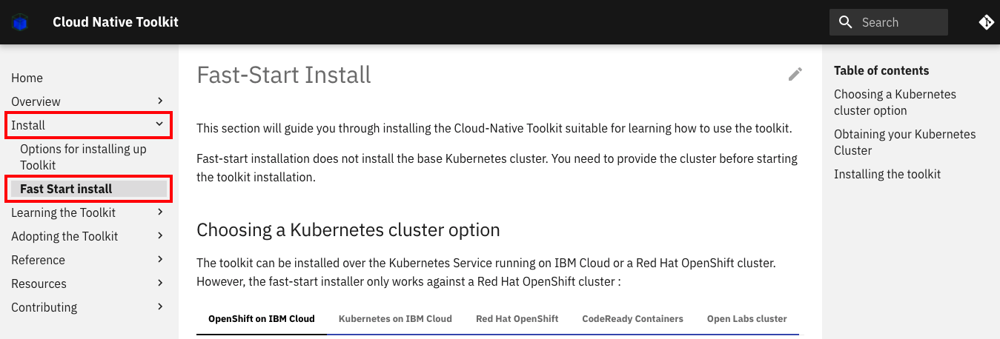

このチュートリアルでは、[Cloud-Native Toolkit](https://cloudnativetoolkit.dev/)をインストールして、イメージのビルドに使用できるようにする方法を紹介します。このツールキットは、開発環境やRed Hat OpenShiftクラスターを管理する人が一度インストールするだけで、グループ全体で使用できるようになります。

インストール後は、以下のチュートリアルを参考に、ツールキットを使ったイメージ構築の方法を学ぶことができます。

1. [Use the Cloud-Native Toolkit to build certifiable container images from starter kits](/learningpaths/build-images-cloud-native-toolkit/starter-kits/)
1. [既存のアプリケーションでCloud-Native Toolkitを使用してOpenShiftの認証可能なイメージを構築する](/learningpaths/build-images-cloud-native-toolkit/existing-application)
1. [Cloud-Native ToolkitとOpenShiftパイプラインを使って複雑なアプリケーションからOpenShift認証可能なイメージを構築する](/learningpaths/build-images-cloud-native-toolkit/poly-repo)

## Toolkitインストールオプション

Fast-Start Installオプションは、ツールキットで達成したい主な作業がイメージの作成で、すでにOpenShiftクラスタを持っている場合に適したオプションです。このチュートリアルでは、Fast Installオプションを使用して、Cloud-Native ToolkitをOpenShiftクラスターにインストールする方法を紹介します。インストールされたツールキットはOpenShiftクラスター内に完全に含まれており、[built-in container image registry](https://docs.openshift.com/container-platform/4.5/registry/registry-options.html#registry-integrated-openshift-registry_registry-options)などのOpenShiftサービスを使用しています。

Fast-Start Installが最適なアプローチではないと思われる場合は、他のインストールオプションをお試しください。
* [**Private Catalog Tiles:**](https://cloudnativetoolkit.dev/adopting/setup/ibmcloud-tile-cluster/) IBM Cloud 内の環境では、アカウント内で他のソフトウェアをインストールするのと同様に、プライベート・カタログのタイルを使用してツールキットをインストールできます。
* [**Iteration Zero:**](https://cloudnativetoolkit.dev/adopting/setup/ibmcloud-iz-cluster/) これは高度にカスタマイズされたインストールで、Terraformスクリプトを使用してIBM Cloud以外の環境にインストールすることもできます。

## 高速インストールの前提条件

Fast-Start Installオプションを使用するには、OpenShiftクラスタへのアクセス権があり、ターミナルで`oc login`コマンドを使用してログインできる必要があります。

### 前提条件

* [OpenShift クラスタへのアクセス](https://cloud.ibm.com/kubernetes/catalog/create?platformType=openshift)
* クラスタの管理者権限
* [OpenShift CLI (oc)](https://docs.openshift.com/container-platform/4.2/cli_reference/openshift_cli/getting-started-cli.html)が必要です。
* Bash または Zsh ターミナル（または同様のもの）。

## インストール手順

以下の手順でFast-Start Installを行います。詳細は、[Cloud-Native Toolkit Guide](https://cloudnativetoolkit.dev/getting-started-day-0/install-toolkit/quick-install/)をご参照ください。

<! -- _**Tip:** ガイドには[ショートビデオ](https://cloudnativetoolkit.dev/getting-started-day-0/install-toolkit/quick-install/)が含まれていますので、Fast Installを試す前に見ることができます。 _ -->

1. ターミナルを開きます。

1. クラスタにログインします。