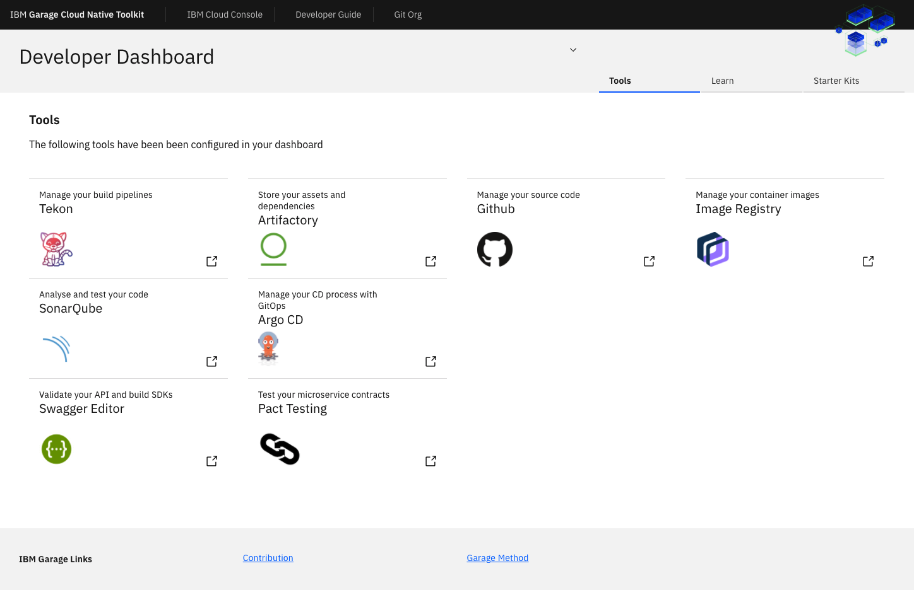

This tutorial shows you how to install the [Cloud-Native Toolkit](https://cloudnativetoolkit.dev/) so you can use it to build images. The toolkit only needs to be installed once by the person who manages your development environment or Red Hat OpenShift cluster, and then your whole group can use it.

After installation, you can learn how to build images with the toolkit by following these tutorials:

1. [Use the Cloud-Native Toolkit to build certifiable container images from starter kits](/learningpaths/build-images-cloud-native-toolkit/starter-kits/)
1. [Use the Cloud-Native Toolkit on an existing application to build an OpenShift certifiable image](/learningpaths/build-images-cloud-native-toolkit/existing-application)
1. [Build an OpenShift certifiable image from a complex application with Cloud-Native Toolkit and OpenShift pipelines](/learningpaths/build-images-cloud-native-toolkit/poly-repo)

## Toolkit installation options

The Fast-Start Install option is a good option if the main task you want to accomplish with the toolkit is to create images and you already have an OpenShift cluster. This tutorial shows you how to install the Cloud-Native Toolkit into an OpenShift cluster using the Fast Install option. The installed toolkit is contained completely within the OpenShift cluster and uses OpenShift services, including its [built-in container image registry](https://docs.openshift.com/container-platform/4.5/registry/registry-options.html#registry-integrated-openshift-registry_registry-options).

[](https://cloudnativetoolkit.dev/setup/fast-start/)

If you think the Fast-Start Install might *not* be the best approach for you, explore one of our other install options:
* [**Private Catalog Tiles:**](https://cloudnativetoolkit.dev/adopting/setup/ibmcloud-tile-cluster/) For environments within IBM Cloud, you can install the toolkit using tiles in a private catalog similar to installing other software within your account.
* [**Iteration Zero:**](https://cloudnativetoolkit.dev/adopting/setup/ibmcloud-iz-cluster/) This is a highly customizable installation that also enables you to install in an environment other than IBM Cloud using Terraform scripts.

## Prerequisites for the Fast Install

To use the Fast-Start Install option, you should have access to your OpenShift cluster and be able to log in using the `oc login` command in a terminal.

### Prerequisites:

* [Access to an OpenShift cluster](https://cloud.ibm.com/kubernetes/catalog/create?platformType=openshift)
* Cluster admin permission
* [The OpenShift CLI (oc)](https://docs.openshift.com/container-platform/4.2/cli_reference/openshift_cli/getting-started-cli.html)
* A Bash or Zsh terminal (or similar)

## Install steps

Follow the steps below to do a Fast-Start Install. If you are looking for more details, refer to the [Cloud-Native Toolkit Guide](https://cloudnativetoolkit.dev/getting-started-day-0/install-toolkit/quick-install/).

<!-- _**Tip:** The guide includes a [short video](https://cloudnativetoolkit.dev/getting-started-day-0/install-toolkit/quick-install/) so you can watch a Fast Install before you try it._  -->

1. Open a terminal.

1. Log in to your cluster:

    ```bash
    oc login
    ```

1. Download and run the install script with the following commands. Note that the command may take 8-15 minutes to run.

    * On Linux or macOS

      ```bash
      curl -sfL get.cloudnativetoolkit.dev | sh -
      ```

    * On Windows

      ```bash
      oc create -f https://raw.githubusercontent.com/ibm-garage-cloud/ibm-garage-iteration-zero/master/install/install-ibm-toolkit.yaml
      sleep 5
      oc wait pod -l job-name=ibm-toolkit --for=condition=Ready -n default
      oc logs job/ibm-toolkit -f -n default
      ```

1. Watch and wait while Terraform sets everything up. When it's finished, you will see a message indicating installation is complete:

    

1. Expose the registry.

    * After a pipeline runs successfully, a tagged image is copied to the registry. With Fast-Start Install, the toolkit is contained completely within the OpenShift cluster and uses OpenShift services, including its [built-in container image registry](https://docs.openshift.com/container-platform/4.6/registry/registry-options.html#registry-integrated-openshift-registry_registry-options). You will want to expose the registry to make it more usable for developers. See [Exposing the registry](https://docs.openshift.com/container-platform/4.6/registry/securing-exposing-registry.html) for how to expose the registry with a route.
    
       _**Note:** With an IBM Cloud Private Catalog, Iteration-Zero, or custom install, you can use an external registry such as IBM Cloud Container Registry (ICCR). When you use ICCR, the registry is already exposed outside of the cluster, and the images created by pipelines will be pushed there._

## A quick tour of what was installed

The following sections provide an brief overview of what was installed.


### The tools project

Use the developer topology view to see what was installed in your tools project. In your OpenShift Web Console:

* Use the drop-down to select the **Developer** perspective in the sidebar.
* Click on **Topology** in the sidebar.
* Select the **tools** project.

### Application launcher links

The tools are added to the application launcher drop-down menu in the top navigation bar (shown above). This dropdown is available in all projects.

### Developer dashboard

Launch the [Developer Dashboard](https://cloudnativetoolkit.dev/reference/dashboard/) for a dashboard that contains tiles for the applications that you saw in the application launcher and more.

From the dashboard, you have access to:
* Tools
* Starter Kit repos
* Learning resources



### Check out the pipelines

You should see that Tekton pipelines have been installed in your tools project:


## Next steps

The Cloud-Native Toolkit is now ready for use. Refer to the following tutorials to use the Cloud-Native Toolkit to create a universal application image from a starter kit or an existing application:

1. [Use the Cloud-Native Toolkit to build certifiable container images from starter kits](/learningpaths/build-images-cloud-native-toolkit/starter-kits/)
1. [Use the Cloud-Native Toolkit on an existing application to build an OpenShift certifiable image](/learningpaths/build-images-cloud-native-toolkit/existing-application)
1. [Build an OpenShift certifiable image from a complex application with Cloud-Native Toolkit and OpenShift pipelines](/learningpaths/build-images-cloud-native-toolkit/poly-repo)