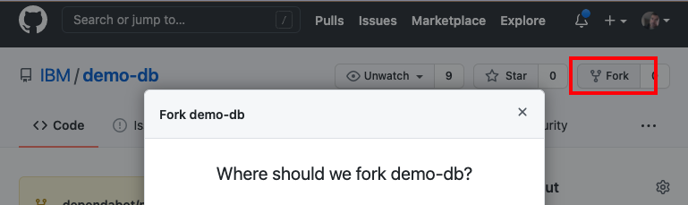
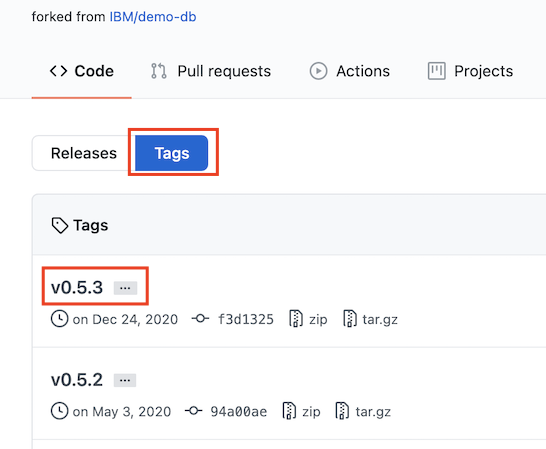

実際のアプリケーションの開発では、必要なデータにアクセスし、エンドユーザーに素晴らしい結果を提供するために、複数のツールやプロセスを統合する必要があることがよくあります。このチュートリアルでは、Cloud-Native Toolkit の Red Hat OpenShift パイプラインとタスクを使用して、オープンソースのデータベースを構築、テスト、コンテナ化、およびデプロイする方法を紹介します。最終的には、ベストプラクティスを実証し、人気のあるオープンソースツールとの統合を提供する、OpenShift 上で実行される CI/CD パイプラインが得られます。このパイプラインは、Red Hat OpenShift認証を受ける準備ができたイメージを生成します。

このチュートリアルは、他のチュートリアルで説明した概念を基にしています。

1. [Cloud-Native Toolkit のインストール](/learningpaths/build-images-cloud-native-toolkit/install-toolkit/)
1. [Cloud-Native Toolkitのスターターキットを使用する](/learningpaths/build-images-cloud-native-toolkit/starter-kits/)
1. [既存のアプリケーションでクラウドネイティブツールキットを使う】(/learningpaths/build-images-cloud-native-toolkit/existing-application/)

よりシンプルなWebアプリを使ってCloud-Native Toolkitをうまく使いこなすためには、まず上記のチュートリアルに目を通すことをお勧めします。入門編とは異なり、このチュートリアルでは、Cloud-Native Toolkitのすぐに使えるパイプラインには簡単には適合しないアプリケーションに焦点を当てます。

このチュートリアルでは、JanusGraphのコピーとJanusGraphのDocker repoから始めます。このプロジェクトは、（スターターキットのような）シンプルなWebアプリの例のようには構成されていませんが、多くのオープンソースプロジェクトのように構成されています。

* このプロジェクトはpoly-repoで、ソースコードとDockerfileを別々のリポジトリで管理しています。
* このプロジェクトは複数のバージョンを管理しているため、ディレクトリとブランチの戦略はスターターキットの例のように単純ではありません。
* このプロジェクトは、通常のデフォルトポートとヘルスエンドポイントを持つウェブアプリではありません。

このケーススタディでは、以下の方法を説明します。

* タスクの変更
* パイプラインにパラメータを追加する
* パイプラインのパラメータをタスクに渡す
* ソースコードの静的解析の実行
* 複数のリポジトリとの連携
* OpenShift上で認証可能なイメージの構築とデプロイ
* イメージの脆弱性をスキャン
* ブランチでのセマンティックバージョニングの使用

最終的な目標は3つのことを達成することです。

1. Red Hat OpenShiftの認証に使用できるアプリケーションイメージを構築する。
1. オープンソースツールを使用して、OpenShift 上で CI/CD パイプラインを使用するベストプラクティスを実証する。
1. このケーススタディを、将来のプロジェクトに役立つ学習課題にする。

<!--
## 使用するアプリケーション
今回のケーススタディでは、まずJanusGraphデータベースのオープンソースレポを使用しました。
* https://github.com/JanusGraph/janusgraph
* https://github.com/JanusGraph/janusgraph-docker
**注：** JanusGraphのリポジトリをフォークして、JanusGraphコミュニティにノイズや混乱を引き起こす可能性がある代わりに（たとえば、誤ったPRやフォークの異常な急増など）、それらのリポジトリのスナップショットであるリポジトリを提供しています。これにより、私たちのコピーと、タグやリリースを作成できるあなた自身のフォークを使って、このケーススタディを歩くことができます。-->

## 前提条件

このチュートリアルを完了するためには、まず以下の前提条件を満たす必要があります。

以下へのアクセスが必要です。

* [GitHub](https://github.com/)アカウント
* Red Hat OpenShift クラスタ

また、以下のセットアップ作業を行う必要があります。

* [Install the Cloud-Native Toolkit](/learningpaths/build-images-cloud-native-toolkit/install-toolkit)の記事で説明されているように、OpenShiftクラスターにCloud-Native Toolkitをインストールします。
* [ドキュメント](https://cloudnativetoolkit.dev/learning/dev-setup/)に記載されている手順に従って、Cloud-Native Toolkit用のアカウントを準備します。これには以下が含まれます。
    * [GitHubアクセストークンの生成](https://cloudnativetoolkit.dev/learning/dev-setup/#github-account)
    * [開発者用マシンへのクラスタ・コマンドライン・ツールのインストール](https://cloudnativetoolkit.dev/learning/dev-setup/#installing-command-line-tools)
    * [Installing the Cloud-Native Toolkit Command Line Interface](https://cloudnativetoolkit.dev/learning/dev-setup/#install-the-cloud-native-toolkit-command-line-interface-cli)

## 見積もり時間

このチュートリアルを完了するには、各パイプラインの実行が完了するのを待たずにすべてのステップを実行した場合、約90分かかると思われます。

ほとんどのステップでは、問題を説明し、その問題を解決する方法を説明し、解決後の結果を示しています。自分のパイプラインがさらに進み、すべての修正を確認することができれば、より満足感が得られますが、先に進めておかないと完了までに何時間もかかってしまいます。時間を節約するために、自分のパイプラインを自分の都合の良いように走らせながらも、先を読み、何度も修正を加え、提供されたスクリーンショットを頼りに、待たなければならなかったエラーを確認することをお勧めします。(_**Note:** 以下の例では、いくつかの実行がスキップされています。_)

## ステップ

1. [ソースレポをフォークする](#step-1-fork-the-source-repo)
2.[Cloud-Native Toolkitを使用するプロジェクトを準備する](#step-2-prepare-project-touse-the-cloud-native-toolkit)
3.[ツールキットを使ってパイプラインを作成する](#step-3-use-the-toolkit-to-create-a-pipeline)
4.[パイプラインをOpenShiftのウェブコンソールで見る](#step-4-watch-the-pipeline-in-the-openshift-web-console)
5.[テストタスクを修正する](#step-5-modify-the-test-task)
6.[SonarQubeのJavaビンパスの修正](#step-6-fix-the-sonarqube-java-bin-path)
7.[Working with a separate repo for Dockerfiles](#step-7-working-with-a-separate-repo-for-dockerfiles)
8.[Helmチャートを使った作業](#step-8-working-with-a-helm-chart)
9.[ヘルスタスクのカスタマイズ](#step-9-customize the-health-task)
10 .[ソースコードにセマンティックバージョニングのタグを付ける](#step-10-tag-the-source-code-with-semantic-versioning)
11 .[タグを使ったビルドとラベル付け](#step-11-build and label-with-tags)
12 .[イメージスキャンの結果を確認する](#step-12-check the image-scan-results)
13 .[Artifactoryへのヘルムリリース](#step-13-helm-release-to-artifactory)
14 .[結果を調べる](#step-14-explore-the-results)

## Step 1.ソースリポジトリをフォークする

今回の例では、オープンソースのグラフデータベースであるJanusGraphをベースにしています。フォークが急増して JanusGraph コミュニティを混乱させたくなかったので (そしておそらく偶発的な PR の乱発も)、彼らのリポジトリを自分たちのスナップショット リポジトリにミラーリングすることにしました。これらのリポジトリから、変更、ブランチ、タグ、リリースを行うことができる自分のリポジトリを作成します。

1. https://github.com/IBM/demo-db にアクセスします。
1. 「**Fork**」ボタンをクリックします。
1. レポの作成が許可されているアカウントまたは組織を選択します。

    

フォークでは、いくつかの点に注意してください。

* フォークの URL は `https://github.com/<your-user>/demo-db` のようになります。`<your-user>` は選択したユーザーまたは組織です。これが、以下で使用するソースレポのURLになります。
* レポには多くのブランチが含まれています。このチュートリアルでは、`v0.5`という名前のブランチに注目します。
* レポには多くのタグがあります。このチュートリアルでは、セマンティックバージョニングを使って、`v0.5`ブランチに新しいタグを自動的に作成します。**タグ**ボタンをクリックすると、どのバージョンから始めているかがわかります。

    

OpenShift用のDockerfileの修正
を行いました。
   。
  

私たちはすでに[Dockerfile-rhos](https://github.com/IBM/demo-db-docker/blob/master/0.5/Dockerfile-rhos)と[docker-entrypoint-rhos.sh](https://github.com/IBM/demo-db-docker/blob/master/0.5/docker-entrypoint-rhos.sh)を提供していますが、これらはjanusgraph-docker repoにあるオリジナルのDockerfileとdocker-entrypoint.shを修正したものです。私たちのリポジトリをそのまま使用することができるはずですが、これは認証を通過できるイメージを作成するための重要な部分なので、私たちが行った変更を確認してみましょう。

Dockerfileを修正する際には、以下の2つの目標を念頭に置いてください。

 <ul> <li
<li>この[記事](https://developer.ibm.com/learningpaths/universal-application-image/design-universal-image/)で説明されているように、Universal Application Image (UAI)を作成するためのベスト・プラクティスを使用する。
</li> <li>Red Hat Container 認証要件に準拠したイメージを構築する。
</ul> </ul

ベストプラクティスの記事で説明されているように、まず必要なことは、イメージがユニバーサルベースイメージ(UBI)をベースにしていることを確認することです。UBIはOpenShiftとKubernetesの両方で動作し、ロイヤリティーフリーで配布することができます。 
 
<strong>Universal Base Image (UBI)

これを実現するために、まず、[Red Hat Container Catalog](https://catalog.redhat.com/software/containers/explore/)から利用可能なオプションを検索して、どのUBIから構築するかを決定しました。
 
今回は、OpenShiftとKubernetesの両方で動作するUBIを構築します。

 
私たちは Java アプリを構築しているので、OpenJDK UBI を探しました。`openjdk`で検索すると、OpenJDK 1.8とOpenJDK 11のUBIイメージが見つかりました： 
 
Javaアプリを構築するので、OpenJDKのUBIを探しました。

 。
 。
   。

  私たちは、リリース情報を得るためにタイルをクリックしました：
 
    
タイルをクリックしてリリース情報を表示しました。
 。
   。

    
現在の最新バージョンを使用するには、タグ `1.3-15` を使用します。私たちのDockerfile-rhosでは、`FROM registry.access.redhat.com/ubi8/openjdk-11:1.3-15`（ここでは8-jre-slim-busterを使用していました）を使用しています。 

前: `FROM openjdk:8-jre-slim-buster`
。

 
後。`FROM registry.access.redhat.com/ubi8/openjdk-11:1.3-15`
。

この`FROM`行の後に、`USER root`を追加する必要があります。この行がないと、その後に続く `chmod` コマンドのいくつかが失敗してしまいます。ただし、コンテナをrootで実行することはありません。パーミッションを設定した後、`USER janusgraph`コマンドを使用します。

コンテナがOpenShift上で動作する際には、プロジェクトに応じて異なるユーザーIDが割り当てられます。このユーザーはrootグループのメンバーになります。以前から想定されていたJanusGraphのユーザーとグループではなく、rootグループでこのユーザーにアクセスできるように、いくつかの修正が加えられています。データベースの実行には特別なユーザーは必要なく、調整が必要なのはファイルのパーミッションの設定だけでした。

Dockerfile-rhosとdocker-entrypoint-rhos.shという名前を使ったのは、オリジナルのバージョンがまだ利用できるようにするためです。これらのファイルを比較することで、すべての変更点を確認することができます。

## Step 2.Cloud-Native Toolkitを使用するためのプロジェクトの準備

ターミナルで`oc`というCLIを使って、プロジェクトを準備します。

_**Note:** すべてのツールキットのアセットは、OpenShift の `tools` プロジェクトに格納されています。`sync`コマンドは、これらのアセットをあなたのプロジェクトで利用できるようにします。

## Step 3.ツールキットを使ってパイプラインを作る

作成したプロジェクトを使用して、リポジトリからTektonのパイプラインを作成します。`oc pipeline`コマンドを実行すると、通常はオプションの入力を求められます。また、あなたのレポ（カレントディレクトリ内）に基づいて、いくつかのオプションを自動的に決定します。この例では、必要なオプションがすでにわかっているので、コマンドラインでリモートのレポ、ブランチ、オプションを指定することができます。

以下の引数を指定して、`oc pipeline`コマンドを使用します。

| オプション | 説明 |
| --- | --- |
| gitUrl#branch-name | パイプラインに登録するリポジトリのGit URLを提供します。ブランチは、`#{branch-name}`を付加することで追加できます。  省略した場合は、GitのURLとブランチはカレントディレクトリから読み込まれます。
| --tekton｜（Jenkins の代わりに）Tekton パイプラインを作成します。|
| --pipeline ibm-java-maven | Maven パイプラインを使用します。|
| -p scan-image=true｜scan-imageパラメータを`true`に設定します。|

ターミナルで以下のコマンドを実行し、パイプラインを作成・実行します。`<your-user>`は実際のユーザーや組織に置き換えてください。なお、ここでは**v0.5**ブランチで作業しています。

          - 名前: git-url
            値: $(params.dockerfile-git-url)
          - 名前: git-revision
            値: メイン

    * 同じセクションで、`deploy`タスクのパラムの既存の値を編集して、`git-url`と`git-revision`を以下のように変更します。