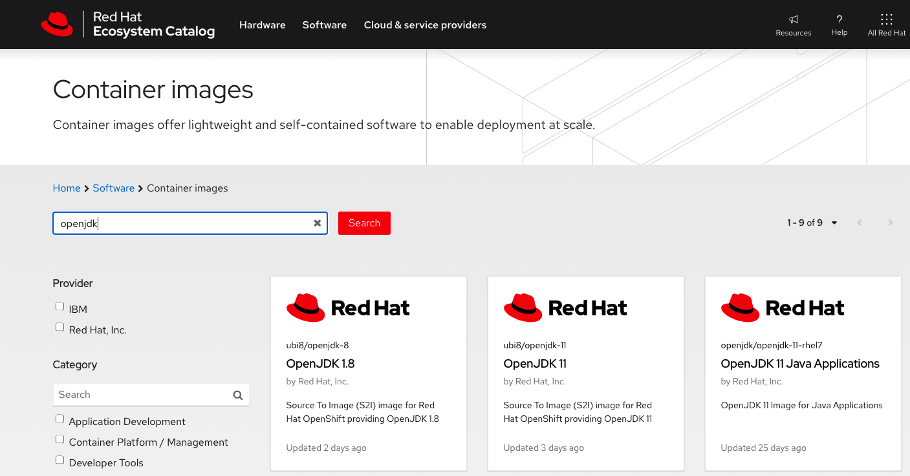
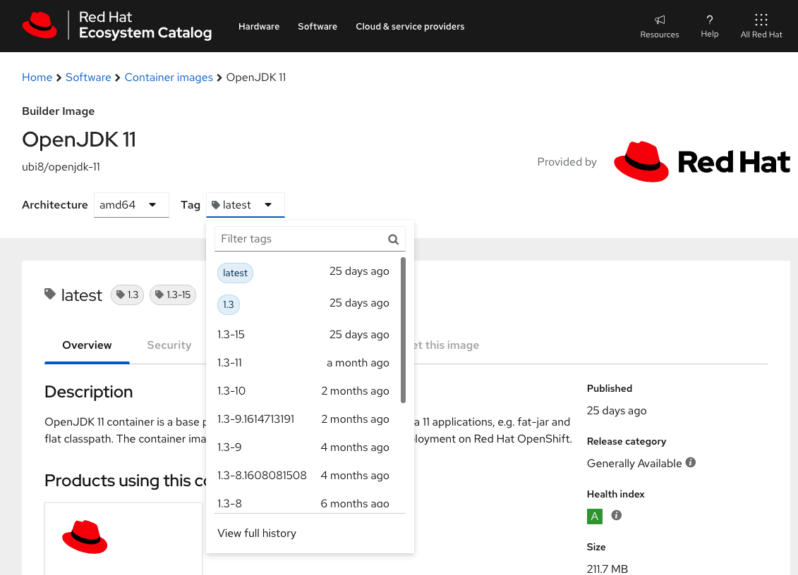
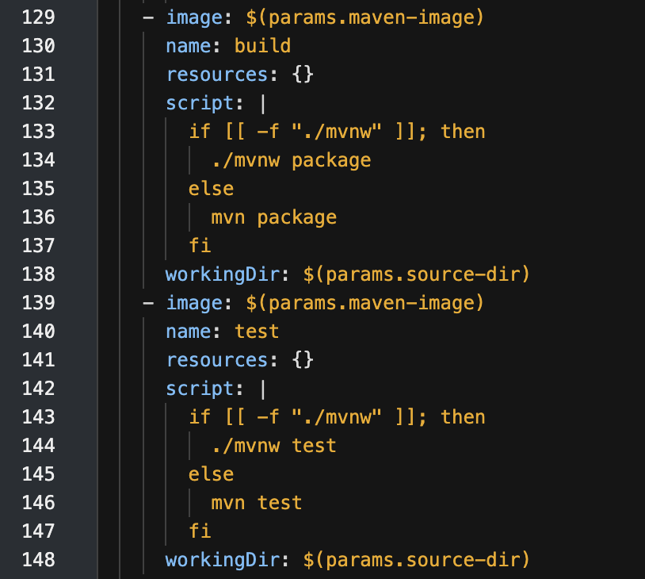
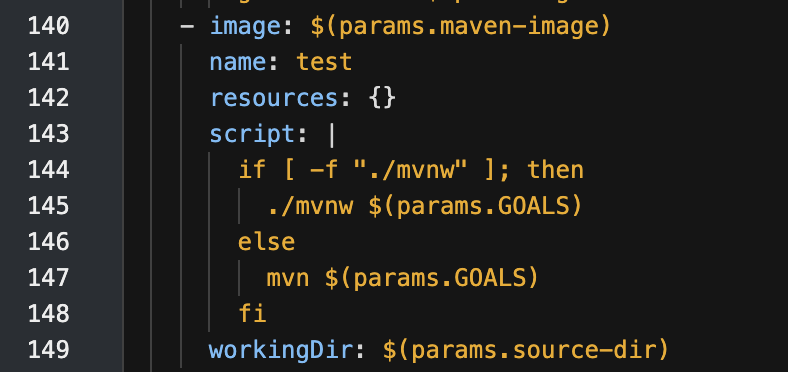
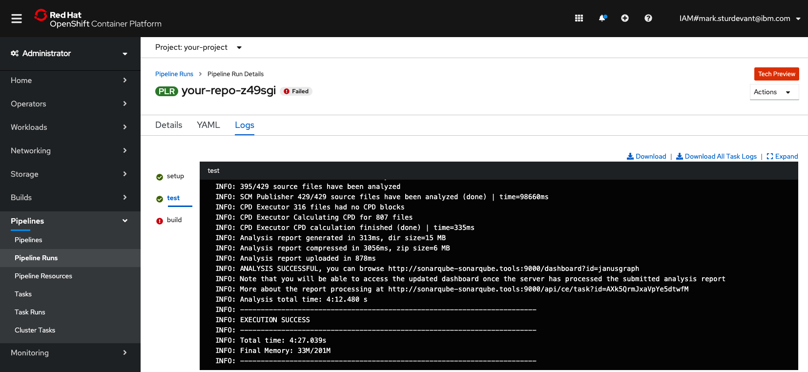
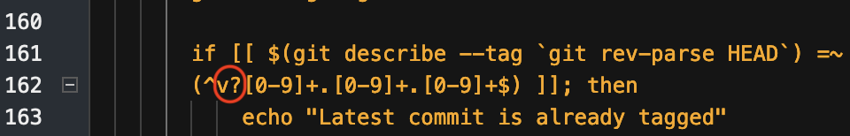
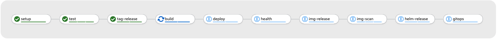

In developing real-world applications, you often have to integrate multiple tools and processes in order to access the data you need and deliver a great result for end users. This tutorial shows you how to build, test, containerize, and deploy an open source database using the Cloud-Native Toolkit's Red Hat OpenShift pipelines and tasks. The end result is a CI/CD pipeline running on OpenShift that demonstrates best practices and provides integrations with popular open source tools. The pipeline produces an image that is ready for Red Hat OpenShift certification.

This tutorial builds on the concepts discussed in other tutorials:

1. [Install the Cloud-Native Toolkit](/learningpaths/build-images-cloud-native-toolkit/install-toolkit/)
1. [Use the Cloud-Native Toolkit starter kits](/learningpaths/build-images-cloud-native-toolkit/starter-kits/)
1. [Use the Cloud-Native Toolkit on an existing application](/learningpaths/build-images-cloud-native-toolkit/existing-application/)

We recommend going through the above tutorials first to get up and running successfully with the Cloud-Native Toolkit using simpler web apps. Unlike the introductory tutorials, this tutorial focuses on an application that is not an easy fit for the Cloud-Native Toolkit's out-of-the-box pipelines.

This tutorial starts with a copy of JanusGraph and the JanusGraph Docker repo. This project is not structured like the simple web app examples (like the starter kits), but it is structured like many open source projects:

* This project is poly-repo -- it uses separate repos for source code and Dockerfiles.
* This project maintains multiple versions, so the directory and branching strategy is not as simple as that of the starter kit examples.
* This isn't a web app with the usual default ports and a health endpoint.

This case study walks you through how to:

* Modify tasks
* Add parameters to a pipeline
* Pass pipeline parameters to tasks
* Run static analysis on source code
* Work with multiple repos
* Build and deploy a certifiable image on OpenShift
* Scan images for vulnerabilities
* Use semantic versioning on branches

The ultimate goal is to accomplish three things:

1. Build an application image that can be used for Red Hat OpenShift certification.
1. Demonstrate best practices using CI/CD pipelines on OpenShift with open source tools.
1. Turn this case study into a learning exercise that will help future projects.

<!--
## Application to be used
For this case study, we started with the JanusGraph database open source repos:
* https://github.com/JanusGraph/janusgraph
* https://github.com/JanusGraph/janusgraph-docker
**Note:** Instead of forking the JanusGraph repos and potentially generating noise and distractions for the JanusGraph community (for example, accidental PRs and abnormal spikes in forks), we are providing repos that are a snapshot of those repos. This will allow you to walk through this case study using our copies and your own fork where you can create tags and releases. -->

## Prerequisites

In order to complete this tutorial, you must first complete the following prerequisites.

You need access to the following:

* A [GitHub](https://github.com/) account
* A Red Hat OpenShift cluster

You also need to perform these setup tasks:

* Install the Cloud-Native Toolkit on your OpenShift cluster, as described in the article [Install the Cloud-Native Toolkit](/learningpaths/build-images-cloud-native-toolkit/install-toolkit).
* Prepare your accounts for the Cloud-Native Toolkit following the instructions found in the [documentation](https://cloudnativetoolkit.dev/learning/dev-setup/). This involves:
    * [Generating GitHub access tokens](https://cloudnativetoolkit.dev/learning/dev-setup/#github-account)
    * [Installing cluster command-line tools on your developer machine](https://cloudnativetoolkit.dev/learning/dev-setup/#installing-command-line-tools)
    * [Installing the Cloud-Native Toolkit Command Line Interface](https://cloudnativetoolkit.dev/learning/dev-setup/#install-the-cloud-native-toolkit-command-line-interface-cli)

## Estimated time

It should take you approximately 90 minutes to complete this tutorial if you go through all the steps without waiting for each pipeline run to complete.

Most of the steps describe a problem, tell you how to fix the problem, and show the result after the fix. It can be more satisfying to see your own pipeline advance further and confirm every fix, but it will take hours to complete if you don't work ahead. To save you time, it is recommended that you let your pipeline run at your convenience, but read ahead, make multiple modifications, and rely on the provided screenshots to see the errors that you would have had to wait for. (_**Note:** Some runs are skipped in the following example._)


## Steps

1. [Fork the source repo](#step-1-fork-the-source-repo)
2. [Prepare project to use the Cloud-Native Toolkit](#step-2-prepare-project-to-use-the-cloud-native-toolkit)
3. [Use the toolkit to create a pipeline](#step-3-use-the-toolkit-to-create-a-pipeline)
4. [Watch the pipeline in the OpenShift web console](#step-4-watch-the-pipeline-in-the-openshift-web-console)
5. [Modify the test task](#step-5-modify-the-test-task)
6. [Fix the SonarQube Java bin path](#step-6-fix-the-sonarqube-java-bin-path)
7. [Working with a separate repo for Dockerfiles](#step-7-working-with-a-separate-repo-for-dockerfiles)
8. [Working with a Helm charts](#step-8-working-with-a-helm-chart)
9. [Customize the health task](#step-9-customize-the-health-task)
10. [Tag the source code with semantic versioning](#step-10-tag-the-source-code-with-semantic-versioning)
11. [Build and label with tags](#step-11-build-and-label-with-tags)
12. [Check the image scan results](#step-12-check-the-image-scan-results)
13. [Helm release to Artifactory](#step-13-helm-release-to-artifactory)
14. [Explore the results](#step-14-explore-the-results)

## Step 1. Fork the source repo

Our example is based on the JanusGraph open source graph database. Since we didn't want to distract the JanusGraph community with a spike in forks (and perhaps a flurry of accidental PRs), we chose to mirror their repos into our own snapshot repos. From these, you will create your own repos where you can make changes, branches, tags, and releases.

1. Browse to https://github.com/IBM/demo-db.
1. Click the **Fork** button.
1. Select an account or organization where you are authorized to create repos.

    

In your fork, take note of a few things:

* The URL of your fork will look like `https://github.com/<your-user>/demo-db` where `<your-user>` is the user or organization that you selected. This will be the source repo URL that you should use below.
* The repo includes many branches. The branch named `v0.5` is the one we focus on in this tutorial.
* The repo has many tags. During this tutorial, you will automatically create new tags on the `v0.5` branch using the semantic versioning. Click on the **Tags** button to see what versions you are starting with:

    

<details><summary>Dockerfile modifications for OpenShift</summary>
  <br />
  
<p>We already provided [Dockerfile-rhos](https://github.com/IBM/demo-db-docker/blob/master/0.5/Dockerfile-rhos) and [docker-entrypoint-rhos.sh](https://github.com/IBM/demo-db-docker/blob/master/0.5/docker-entrypoint-rhos.sh), which are modified versions of the original Dockerfile and docker-entrypoint.sh from the janusgraph-docker repo. You should be able to use our repo as-is, but since this is an important part of creating an image that can pass certification, let's review the changes we made.</p>

<p>When modifying the Dockerfile, keep these 2 goals in mind:</p>

<ul>
<li>Use best practices to create a Universal Application Image (UAI), as described in this [article](https://developer.ibm.com/learningpaths/universal-application-image/design-universal-image/).</li>
<li> Build an image that is in compliance with Red Hat Container certification requirements.</li>
</ul>

<p>As described in the best practices article, the first thing you need to do is make sure your image is based on a Universal Base Image (UBI). UBIs run in both OpenShift and Kubernetes, and can be distributed royalty free.</p>

<p>To accomplish this, we first determined which UBI to build from by searching the available options from the [Red Hat Container Catalog](https://catalog.redhat.com/software/containers/explore/).</p>
<p>Since we are building a Java app, we looked for an OpenJDK UBI. Doing a search on `openjdk`, we found OpenJDK 1.8 and OpenJDK 11 UBI images:</p>

<br />
  
<br />

<p>We then clicked on the tile to get release information:</p>

<br />
  
<br />

<br />
  
<br />

<p>To use the current latest version, we use the tag `1.3-15`. In our Dockerfile-rhos, we use `FROM registry.access.redhat.com/ubi8/openjdk-11:1.3-15` (where it was using 8-jre-slim-buster).</p>

<p>Before: `FROM openjdk:8-jre-slim-buster`</p>
<p>After: `FROM registry.access.redhat.com/ubi8/openjdk-11:1.3-15`</p>

<p>After this `FROM` line, we needed to add `USER root`. Without this line, some of the `chmod` commands that follow would fail. We will not be running the container as root though. After the permissions are set, a `USER janusgraph` command is used.</p>

<p>When the container runs on OpenShift, it will be assigned a different user ID based on the project. This user will be a member of the root group. Some modifications have been made to give access to this user with the root group instead of the JanusGraph user and group that was assumed to be available before. Running the database doesn't really require a special user; it was only the file permission setup that needed some adjustments.</p>

<p>We used the name Dockerfile-rhos and docker-entrypoint-rhos.sh so that the original versions are still available. You can see all the modifications by comparing the files.</p>

</details>

## Step 2. Prepare project to use the Cloud-Native Toolkit

In a terminal, use the `oc` CLI to prepare your project:

```bash
# Use CLI login provided by the OpenShift console
oc login <your-info>
# Create and switch to a new OpenShift project
oc new-project <your-project>
# Sync the project to prepare it for use with the toolkit
oc sync <your-project>
```

_**Note:** All toolkit assets are stored in the OpenShift `tools` project. The `sync` command makes those assets available to your project._

## Step 3. Use the toolkit to create a pipeline

Using the project you created, create a Tekton pipeline from your repo. When you run the `oc pipeline` command, it will normally prompt you with options. It will also automatically determine some options based on your repo (in your current directory). In this example, we already know the options that we want and can specify a remote repo, branch, and options on the command line.

Use the `oc pipeline` command with the following arguments:

| Option | Description |
| --- | --- |
| gitUrl#branch-name | Provides the Git URL for the repository that should be registered in the pipeline. The branch can be added by appending `#{branch-name}`.  If not provided, the Git URL and branch will be read from the current directory.
| --tekton | Create a Tekton pipeline (instead of Jenkins). |
| --pipeline ibm-java-maven | Use the Maven pipeline. |
| -p scan-image=true | Set the scan-image parameter to `true`. |

In a terminal, run the following commands to create and run your pipeline, replacing `<your-user>` with your actual user or organization. Notice that you're working on the **v0.5** branch.

```txt
oc pipeline https://github.com/<your-user>/demo-db#v0.5 --tekton --pipeline ibm-java-maven -p scan-image=true
```

When prompted, provide your GitHub username and the personal access token that you created earlier.

Your output will look similar to this:


_**Warning:** This will create a very long-running pipeline that we expect to fail. So instead of waiting for it to finish, please read ahead to the instructions to stop and fix the pipeline._

## Step 4. Watch the pipeline in the OpenShift web console

Browse to the `View PipelineRun` link provided at the end of the `oc pipeline` output.  This will take you to the pipeline run in your project in the OpenShift web console:

  

Here is a short description on what each task is doing:

| **Task** | **Description** |
|--------------|-----------------|
| **setup** | Clones the specified branch of the repo and sets up the parameters to be used by the remaining tasks in the pipeline. |
| **test** | Builds the app and then performs integration tests. Runs code coverage and quality tests using SonarQube. |
| **build** | Builds the Docker image and pushes it to the OpenShift image registry. |
| **deploy** | Deploys the application to the CI environment for verification using the provided Helm chart. |
| **health** | Calls the container `health` endpoint to ensure deployment is up and running. |
| **tag-release** | Tags the release in the Git repo with a new unique version number. |
| **img-release** | Tags the image release and pushes it to the container registry. |
| **img-scan** | Performs a scan on the image. |
| **helm-release** | Uses the image tag as part of the filename for the Helm chart. Artifacts are stored in Artifactory. |
| **gitops** | Publishes the Helm chart configuration to the provided GitOps repo to trigger downstream deployments. |

## Step 5. Modify the **test** task


From the `Pipeline Run Details` graph, you can see that the `test` task had an error. Click on the task to see the logs for the task.

_**Note:** If your pipeline run is taking too long, you can use the **Actions** drop-down to stop the run. We are expecting it to fail, and in some cases it will take a long time._


The **ibm-java-maven** pipeline uses the **ibm-java-maven-test-v2-5-0 (test)** task to clone the source code repo and use Maven to build (package) and then test the code. After those steps succeed, it runs SonarQube's SonarScanner for static analysis of the code.

In this case study, the Maven tests don't succeed by default in this environment. In order to get through this step *without getting into too many project-specific Maven details*, you can make the following customizations to the test task:

1. Modify the task to add a parameter for Maven command-line goals and options.
1. Modify the pipeline to add a new parameter to pass to the test task.

This allows you to:
   * Run goals "clean package"
   * Only test core projects
   * Skip the Release Audit Tool (RAT) part of this Maven project
   * Suppress the excessive progress logging
   * Continue to the next step even if some tests fail
   * Customize these settings when starting a pipeline

While some of these changes are very project-specific, this is a good general example of how you can take a pipeline and task that was provided by the toolkit and modify it to be a better fit for your project's preferences.

### Edit the pipeline's test task

So far, we've only looked at the "pipeline run." Remember, you used the link provided by `oc pipeline` output to view a specific run of a specific pipeline. In addition to viewing the output and details of a pipeline run, the actions available here include *Stop Run*, *Rerun*, and *Delete Pipeline Run*.

To change the actual pipeline and tasks, navigate from `Pipeline Runs` to `Pipelines`.

1. Navigate to the pipeline:

    * The easy way to get from a pipeline run to the pipeline is to find and click on the `Pipeline` link shown under **Pipeline Run Details**:

      

    * Alternatively, you can always navigate to your pipelines from the sidebar as follows:
      * Use the **Administrator** perspective.
      * In the left sidebar, expand **Pipelines**.
      * Click **Pipelines**.
      * Make sure the **Project** drop-down shows your project.
      * Click on your pipeline (the toolkit uses your repo name for the pipeline name).

1. Navigate to the `test` task:

    * Under the pipeline details, the tasks are shown with links to the task resources.
    * Select the **ibm-java-maven-test-v2-5-0 (test)** task.

      

1. Edit the task YAML.

    _**Note:** Make sure that you only edit the copy of the task **in your project** and **NOT** the original version in the `tools` project (which will be shared with other projects)._

    * Click on the **YAML** tab.

    * Copy the following YAML and add it under spec/params to create a new `GOALS` parameter:

      ```yaml
          - default: package
            description: maven goals and options
            name: GOALS
            type: string
      ```

    * The following screenshot shows what it should look like (if you made it the first parameter):

      

    * Click the **Save** button to save your edits.

    * Copy the following YAML and add it under spec/steps to *replace the build and test steps with a single test step* that runs Maven using the `GOALS` parameter:

      ```bash
        if [ -f "./mvnw" ]; then
          ./mvnw $(params.GOALS)
        else
          mvn $(params.GOALS)
        fi
      ```

    * Refer to the before/after screenshots below. Make sure you replace the 2 steps with 1 step.

      **Before**
      
       
      
      **After**
      
      

    * Click the **Save** button again to save your edits

    _**Note:** In the Maven lifecycle, `package` includes `test`. We are eliminating a redundant step, but the main goal here is to allow passing in whatever Maven goals and options you want._

1. Add a `maven-goals` parameter to the pipeline.

    * Now that the `test` task has a parameter for Maven goals, you need to add a pipeline parameter so that you can pass in options:

    * Go back to your **Pipeline Details** page. Select the **Parameters** tab.

    * Click **+Add Pipeline Parameter**.

    * Fill in the Name, Description, and Default Value (explained in detail later) as follows:
        * **Name**: `maven-test-goals`
        * **Description**: Goals and options for the Maven test task
        * **Default value**: `clean package --no-transfer-progress -Drat.skip=true   -pl=janusgraph-driver,janusgraph-core,janusgraph-test,janusgraph-backend-testutils,janusgraph-inmemory`
      
    * Click **Save** at the bottom of the page:

    

    _**Tip:** Notice that some of the existing default values seem like good defaults, but you will be replacing the `git-url` and `git-revision` with your own URL and v0.5 every time you start the pipeline. So... you might want to just make those values the defaults while you are here._

1. Assign the pipeline parameter to the task parameter:

  * Go to your pipelines **Details** tab.
  * Use the **Actions** drop-down and select **Edit pipeline**.
  * Click **Edit YAML**.
  * Copy the following YAML and add it under spec/tasks in the `test` task params:

    ```yaml
        - name: GOALS
          value: $(params.maven-test-goals)
    ```
    
    
  
  * Select **Save** at the bottom of the page.

1. Start the pipeline:

  * Use the **Actions** drop-down and select **Start**.
  * Provide your **git-url** (for example, `https://github.com/<your-user>/demo-db` for the source code repo).
  * Set **git-revision** to `v0.5` (our Git branch).
  * Use the defaults for **scan-image** and **maven-test-goals**.
  * Select **Start**.

    

  _**Note:** The pipeline can still take a while and fail, so you probably should read ahead while it runs._

1. Take a closer look at our project's Maven default goals:

    While your pipeline is running, let's take a look at the default goals! You may have noticed that we made some very specific choices. In general, this probably would not be a good "default value," but while we are working on this pipeline for this project only, this specific default is handy. Yes, it is lazy -- a better default would probably be "package" or perhaps "clean verify," depending on your Maven preferences, and then you would add options to the default as needed when you start a pipeline.

    Here's an explanation of what you can use to optimize your tests and make them pass:

    * `clean package` is a Maven way of saying: "Start clean and then do all the build and test, but stop before install and deploy."
    * `--no-transfer-progress` turns off the progress logging that makes the log output really long. The progress indicator is nice when you are running on a command line, but not so nice if you have to scroll through the log.
    * `-Drat.skip=true` -- the Apache RAT tests gave us problems on some branches, so we disabled it for now with this handy option that the POM file understands.
    * `-pl=<project-list>` filters the projects. You can do this for speed and to avoid some tests that may not be working for you.

    A couple more options to add:

    * `--fail-never` is good for demo purposes, when you want to continue even if some tests fail.
    * `-DskipTests` can be used if you really want to speed things up for a demo.

    Ideally, you could skip all the tests that fail or run too slow by default or with a flag like the `rat.skip` flag. Getting that done is more about Maven and project-specific decisions, so we avoid that here and move on with our streamlined pipeline.

1. Examine the expected results:

    * Near the top of test log, right after `STEP-TEST`, you should see a the `mvn` command to confirm that your changes have actually been used (as `mvn <maven-test-goals>`). If you examine the logs from the test task, you should see the unit test results at the end of the test step (right before `STEP-SONAR-SCAN`). You should see that you ran hundreds of tests, but only in the projects in the `-pl` list.

    

    * If the test step failed for you, try using the `--fail-never` flag (and/or `-DskipTests`) to get past the `test` step and start the `sonar-scan` step (still in the `test` task).

1. Move on to the next error.

    The above fixes should get you successfully through the `git-clone` and `test` steps of the `test` task, but the `sonar-scan` step (the final step in the `test` task) will fail.

    To save yourself some time, you can read ahead and fix the next problems that we have already encountered. Let the current **pipeline run** continue if you want to see the error result, or stop it to save some resources.

## Step 6. Fix the SonarQube Java bin path


After the Java code is tested and compiled using Maven goals, the pipeline provided by the toolkit uses SonarQube for static analysis of the code. The provided task looks for a single `target` directory. You need to change that to look in the `target` directory of each subdirectory (that is, `*/target`).

The original error after you got past the unit tests looked like this:

```txt
ERROR: Invalid value for sonar.java.binaries
INFO: ------------------------------------------------------------------------
INFO: EXECUTION FAILURE
INFO: ------------------------------------------------------------------------
INFO: Total time: 21.925s
INFO: Final Memory: 17M/201M
INFO: ------------------------------------------------------------------------
ERROR: Error during SonarScanner execution
java.lang.IllegalStateException: No files nor directories matching 'target'
```

The `test` task already has the parameter you need: `$(params.sonarqube-java-bin-path)`. This is used in the task, but is not a pipeline parameter. You can add a parameter to the pipeline again like you did above and pass the parameter value in to the task. Instead, this time, we show you how to make a simpler fix by just changing the default in the task.

1. Navigate to the `test` task again:

    * Under the Pipeline details, the tasks are shown with links to the task resources.
    * Click the `ibm-java-maven-test-v2-5-0 (test)` task.

1. Edit the task YAML.

    * Click the **YAML** tab.
    * Change the `sonarqube-java-bin-path` default to `'*/target'`.

      

1. Start last run!

    Because you didn't add any new pipeline parameters, you can just re-run the last pipeline run:

    * Navigate to your last pipeline run.
    * Use the **Actions** drop-down and select **Rerun**.

    

1. Move on to the next error.

    Expect the `test` task to succeed this time. The `build` task will fail next, and we look at that in the next section. To save yourself some time, you can read ahead and fix the next problems that you have already encountered. Let the current **pipeline run** continue so that you can explore the SonarQube static analysis results after the `test` task completes -- as shown in [Step 14. Explore the results](#step-14-explore-the-results).

## Step 7. Working with a separate repo for Dockerfiles


From the **Pipeline Run Details**, you will see that the `build` task fails.

When you get the error indicator, click the **build** task in the graph shown under **Pipeline Run Details**. This takes you directly to the **Logs** tab and selects the `build` task for you.


The build fails due to not being able to find the Dockerfile. In this case, the `/source` directory is where the build task clones the repo. The Dockerfile is expected to be at the root of the repo.

As is common in many real-world applications, the JanusGraph project is poly-repo. The source code that you built and tested above is in one repo, but the Dockerfiles are in another repo. For applications that maintain multiple versions (all of them?), it is also common to have Dockerfiles in subdirectories.

To allow for some of the variations that are common in poly-repo projects, you should modify the pipeline to allow the following:

* The **Git URL for the Dockerfiles repo** is different from the source code repo.
* The **build context** (directory containing the Dockerfile) is not the repo root directory.
* The **Dockerfile** has a different name (for example, "Dockerfile-rhos").

To address this, modify the pipeline to allow additional parameters and specify which pipeline parameters to pass to each task parameter.

The **ibm-java-maven** pipeline uses the **ibm-build-tag-push-v2-5-0 (build)** task to build, tag, and push a container image using `buildah` with a Dockerfile. If you take a look at the YAML for the **ibm-build-tag-push-v2-5-0 (build)** task, you will see that the task already has the parameters you need for the 3 things listed above (`git-url`, `CONTEXT`, and `DOCKERFILE`).

There is a fourth parameter change that is much less obvious. The pipeline uses the parameter `git-revision`. In our source repo, this was the branch name `v0.5`. The `setup` task takes the git-revision and converts it into a hash ID. The hash ID from our source repo won't work in other repos (even if the branch name is the same), so we need to have a different git-revision for each repo.

1. Add 3 parameters to the pipeline:

    * Go back to your **Pipeline Details** page and select the **Parameters** tab.
    * Click **+ Add Pipeline Parameter** for each of the parameters.
    * Fill in **Name**, **Description**, and **Default Value** as follows:
        * **Parameter 1**
            * **Name**: `dockerfile-git-url`
            * **Description**: The URL of the Git repo containing the Dockerfile
            * **Default value**: https://github.com/IBM/demo-db-docker
        * **Parameter 2**
            * **Name**: `dockerfile-context-path`
            * **Description**: The build context directory
            * **Default value**: 0.5
        * **Parameter 3**  
            * **Name**: `dockerfile-file-name`
            * **Description**: The file name of the Dockerfile to use
            * **Default value**: Dockerfile-rhos
    
    * Click **Save**  at the bottom of the page.

    

1. Assign the pipeline parameters to task parameters:

    * Go to your pipeline's **Details** tab.
    * Use the **Actions** drop-down and select **Edit pipeline**.
    * Click on **Edit YAML**.
    * Copy the following YAML and add it under spec/tasks in the `build` task params:

      ```yaml
          - name: CONTEXT
            value: $(params.dockerfile-context-path)
          - name: DOCKERFILE
            value: $(params.dockerfile-file-name)
      ```

    * In the same section, edit the existing values for the `build` task params to change `git-url` and `git-revision` like this:

      ```yaml
          - name: git-url
            value: $(params.dockerfile-git-url)
          - name: git-revision
            value: main
      ```

    * Click **Save** at the bottom of the page.

      

      _**Note:** If you were using the same branch names in the source and Docker repos, you could pass in `$(params.git-revision)` and use the branch name instead of the hash ID (or add yet another pipeline parameter, if necessary), but in this case the Dockerfiles repo uses the `main` branch for all versions, so you can just set it and forget it._

1. Start the pipeline:

    * Use the **Actions** drop-down and select **Start**.
    * Provide _your_ **git-url** (for example, `https://github.com/<your-user>/demo-db` for the source code repo).
    * Set **git-revision** to `v0.5` (our Git branch).
    * Use the defaults for **scan-image** and **maven-test-goals**.
    * Set **dockerfile-git-url** to `https://github.com/IBM/demo-db-docker` (you can use _our_ repo).
    * Set your **dockerfile-context-path** to `0.5` (our release directory).
    * Set your **dockerfile-file-name** to `Dockerfile-rhos`.
    * Click **Start**.

    

1. Move on to the next error:

    You can expect the `build` task to succeed this time. The `deploy` task will fail next, and we will look at that in the next section. To save yourself some time, you can read ahead and fix the next problems that we have already encountered. Just let the current `pipeline run` continue so that you can explore the results after the `build` task completes.

1. Look at the `build` results:

    After the task completes, you can find the image that you built in your image registry -- as shown in [Step 14. Explore results](#step-14-explore-the-results).

## Step 8. Working with a Helm chart


From the **Pipeline Run Details**, you will see that the `deploy` task fails.

When you get the error indicator, click on the `deploy` task in the graph shown under **Pipeline Run Details**. This will take you directly to the **Logs** tab and select the **deploy** task for you.


The deploy fails because the Helm charts are not found. It is common for projects to keep Helm charts in separate repos, often with other projects. For now, you should put your Helm charts in the same repo as your Dockerfiles, but you will add parameters to the pipeline to make it flexible.

1. Add parameters to the pipeline:

    * Go back to your **Pipeline Details** page and select the **Parameters** tab.
    * Click **+ Add Pipeline Parameter** for each of the parameters.
    * Fill in **Name**, **Description**, and **Default Value** as follows:
        * **Parameter 1**
            * **Name**: `chart-git-url`
            * **Description**: The URL of the Git repo containing the Helm chart
            * **Default value**: https://github.com/IBM/demo-db-docker
        * **Parameter 2**
            * **Name**: `chart-root`
            * **Description**: The chart root directory
            * **Default value**: chart
    * Click **Save** at the bottom of the page.

    

1. Assign the pipeline parameters to the task parameters:

    * Go to your pipelines **Details** tab.
    * Use the **Actions** drop-down and select **Edit pipeline**.
    * Click **Edit YAML**.
    * Copy the following YAML and add it under spec/tasks in the `deploy` task params:

      ```yaml
          - name: chart-root
            value: $(params.chart-root)
      ```

    * In the same section, edit the existing values for the `deploy` task params to change `git-url` and `git-revision` like this:

      ```yaml
          - name: git-url
            value: $(params.chart-git-url)
          - name: git-revision
            value: main
      ```
    * Select **Save** at the bottom of the page.

1. Navigate to the **deploy** task.

    * Under the **Pipeline Details**, the tasks are shown with links to the task resources.
    * Click on the `ibm-deploy-v2-5-0 (deploy)` task.

      

1. Edit the task YAML.

    _**Note:** You should only edit the task in this project!  Do **not** edit the task in the `tools` project._

    * Click the **YAML** tab.

    * Copy the following YAML and add it under spec/params to create a new `chart-root` parameter:

      ```yaml
          - default: ''
            name: chart-root
            type: string
      ```

    * Click the **Save** button to save your edits

    * Edit the `deploy` script to use the `chart-root` parameter when it is not empty (otherwise, use the existing `find` command):

      ```bash
        CHART_ROOT="$(params.chart-root)"

        if [[ -z "${CHART_ROOT}" ]]; then
          export CHART_ROOT=$(find . -name chart)
        fi

        FILE_NUM=$(find ${CHART_ROOT} -name 'Chart*.yaml' |wc -l)

        if [[ "${FILE_NUM}" -gt 1 ]]; then
          echo "Error: Found >1 Chart*.yaml"
          exit 1
        fi

        echo "CHART_ROOT: $CHART_ROOT"

        export CHART=$(find ${CHART_ROOT} -name 'Chart*.yaml')

        echo "CHART: $CHART"
      ```

    * Refer to the before/after screenshots below.

      **Before**
      
       
      
      **After**
      
       

    * Click the **Save** button again to save your edits.

1. Fix the `helm-release` task, too!

    * The `helm-release` task requires the exact same changes, using the same parameters that you used here:
      * Assign the pipeline parameters to the `helm-release task` parameters.
      * Edit the `helm-release` task YAML.
      * CHART_ROOT is set twice in this task, so either make the modification in both places or comment out the second assignment.

1. Start the pipeline:

    * Use the **Actions** drop-down and select **Start**.
    * Provide your **git-url** (for example, `https://github.com/<your-user>/demo-db.git` for the source code repo).
    * Set **git-revision** to `v0.5` (our Git branch).
    * Use the defaults for **scan-image** and **maven-test-goals**.
    * Set the **dockerfile-git-url** to `https://github.com/IBM/demo-db-docker.git`.
    * Set your **dockerfile-context-path** to `0.5` (our release directory).
    * Set your **dockerfile-file-name** to `Dockerfile-rhos`.
    * Set the **chart-git-url** to `https://github.com/IBM/demo-db-docker.git`.
    * Use the default for **chart-root** (chart).
    * Select **Start**.

1. Move on to the next error:

    Expect the **deploy** task to succeed this time. The **health** task will fail next, and we'll look at that in the next section. To save yourself some time, you can read ahead and fix the next problems that we have already encountered. Just let the current **pipeline run** continue so that you can explore the results after the `deploy` task completes.

1. Look at the `deploy` results:

    After the task completes, you should have a running application -- as shown in [Step 14. Explore the results](#step-14-explore-the-results).

## Step 9. Customize the **health** task


The health task fails because JanusGraph does not have a `/health` endpoint. You can customize the task to test with a Gremlin script.

1. Assign the pipeline parameters to the task parameters:

    * Go to your pipeline's **Details** tab.
    * Use the **Actions** drop-down and select **Edit pipeline**.
    * Click **Edit YAML**.
    * Edit the existing value for the `health` task params to change the `health-endpoint` like this:

      ```yaml
          - name: health-endpoint
            value: '?gremlin=888-111'
      ```
    * Refer to the before/after screenshots below:
      
      **Before**
        
         
        
     **After**
     
     
    
    * Click the **Save** button to save your edits.

    _**Note:** In order to allow this, you enabled HTTP in your JanusGraph deployment. This allows you to send a gremlin script. Your test script is 888 minus 111. If you try it, you should find the result value is 777 (wrapped in JSON)._

1. Start last run!

    Since you didn't add any new pipeline parameters, you can just re-run the last pipeline run:

    * Navigate to your last pipeline run:
    * Use the **Actions** drop-down and select **Rerun**.

## Step 10. Tag the source code with semantic versioning


The `tag-release` and `img-release` tasks will succeed, but it is worth taking some time to look at how tagging works and fixing a problem that you won't notice on your first run.

The `tag-release` task provided by the Cloud-Native Toolkit checks your source repo for tags. If the latest commit on your branch is *not* already tagged, [`release-it`](https://www.npmjs.com/package/release-it) is used to determine the next tag value. A tag and release will be created in your Git repo. If the last commit *is* already tagged, then the existing tag is used.

`release-it` uses the latest Git tag and understands normal versioning practices to increment the version. For example, 0.1.0 would be followed by 0.1.1, and v0.5.0 would be followed by v0.5.1. Since the latest version is determined based on the git-revision (for example, branch), you can run pipelines on each branch and the releases should be incremented as you would expect. For additional capabilities, refer to the [`release-it` documentation](https://github.com/release-it/release-it#readme).

In our case study, we found that we needed one small change to the script in the `tag-release` task. The provided task checks for a specific tag pattern, `^[0-9]+.[0-9]+.[0-9]+$`, which is very common for semantic versioning. However, another common practice is to start the tag with the character `v` (for example, `v1.2.3`). The scripted pattern match does not work in that case. Let's fix that!

_**Note:** The problem only occurs when the last commit is tagged in this style. If the last commit is not yet tagged, you won't notice this problem. The fix will prevent the same commit from getting additional incremental tags._

### Edit the pipeline's tag-release task

1. Navigate back to the pipeline.
1. Navigate to the `tag-release` task.

      

1. Edit the task YAML:

    * Click the **YAML** tab.
    * Add `v?` after the caret symbol (`^`) to allow the script to work with an optional `v` before the version numbers.
    * Refer to the before/after screenshots below and the highlighted change.
    * Click the **Save** button to save your edits.

    **Before**
     
    
    **After**
    

    _**Note:** When the latest revision already has a recognizable version tag, that tag is used instead of creating a new one. If you want to create a new tag/release, you should have at least one commit since the last tag. This fix prevents tags that start with 'v' from being ignored by this check._

    After the task completes, you will see that the version tags have been added to your GitHub repository -- as shown in [Step 14. Explore the results](#step-14-explore-the-results). This tag is also used later.

1. Continue on to the next step to build and label using tagged source code.

## Step 11. Build and label with tags



Red Hat Container Certification requires that an image must contain these 6 pieces of information as labels in the image:

* name: Name of the image
* vendor: Company name
* version: Version of the image
* release: A number used to identify the specific build for this image
* summary: A short overview of the application or component in this image
* description: A long description of the application or component in this image

If you look at the [Dockerfile-rhos](https://github.com/IBM/demo-db-docker/blob/main/0.5/Dockerfile-rhos), you will see that we already have a `LABEL` statement to set those.

```bash
ARG JANUS_VERSION=0.5

LABEL name="DemoDB" \
      maintainer="developer@example.com" \
      vendor="IBM" \
      version=${JANUS_VERSION} \
      release="1" \
      summary="A demo database" \
      description="A demo database for OpenShift certification"
```

So far, however, this results in the version being set to `0.5`, which is the default set in the file. We'd like to improve that by using the same version that we used for tagging the source code. To do this *without manually editing the Dockerfile*, we need to make the `tag-release` task run before the `build` task and make the pipeline pass the result tag (the release) to the `build` task.

While making this change, we can fix a second issue that we've been ignoring so far. In the original JanusGraph Dockerfile, pre-built artifacts were downloaded using release tags. Since we have been building before tagging, we've been using the branch name to build the latest v0.5 source. If the code on that branch changes during the pipeline run, it is possible that the code we test and tag won't be the same as the code we build and release. By passing build arguments into the `build` task, we are also able to make sure that we build and release the same code that we test and tag.

### Add build args to the build task

1. Navigate back to the pipeline:

    * Under the **Pipeline Details**, the tasks are shown with links to the task resources.
    * Click on the **ibm-build-tag-push-v2-5-0 (build)** task.

      

1. Edit the task YAML:

    * Click on the **YAML** tab.
    * Copy the following YAML and add it under spec/params to create a new `BUILDARGS` parameter:

      ```yaml
          - default: ''
            description: build args
            name: BUILDARGS
            type: string
      ```

    * This screenshot shows what it should look like (if you made it the first parameter):

      

    * Click the **Save** button to save your edits.

    * Add `$(params.BUILDARGS)` to the `build` task's script. Add this as a parameter to the `buildah bud` command -- right after the word `bud`.

    * Refer to the below before/after screenshots.

    **Before**
    
    
    **After**
    

    * Click the **Save** button again to save your edits.

### Move the pipeline's tag-release task

1. Navigate back to the pipeline.
1. Change the task order by editing the `runAfter` value for 3 tasks:

    * Set the `build` `runAfter` to `tag-release`.
    * Set the `tag-release` `runAfter` to `test`.
    * Set the `img-release` `runAfter` to `health`.
    * Hit **Save** at the bottom of the page.

1. Go back to your pipeline's **Details** tab to make sure that you still have a connected line of tasks (mistakes can create pipeline forks).


### Pass in build args

1. Assign a value to the task parameter:

    * Go to your pipeline's **Details** tab.
    * Use the **Actions** drop-down and select **Edit pipeline**.
    * Click on **Edit YAML**.
    * Copy the following YAML and add it under spec/tasks in the `build` task params:
      ```yaml
          - name: BUILDARGS
            value: '--build-arg JANUS_VERSION=$(tasks.tag-release.results.tag) --build-arg GIT_REVISION=$(tasks.setup.results.git-revision)'
      ```
    * Hit **Save** at the bottom of the page. It may be automatically formatted for multi-line style like this:
      

1. Start the pipeline:

    * Use the **Actions** drop-down and select **Start**.
    * Provide your **git-url** (for example,`https://github.com/<your-user>/demo-db.git` for the source code repo).
    * Set **git-revision** to `v0.5` (our git branch).
    * Use the defaults for **scan-image** and **maven-test-goals**.
    * Set the **dockerfile-git-url** to `https://github.com/IBM/demo-db-docker.git`.
    * Set your **dockerfile-context-path** to `0.5` (our release directory).
    * Set your **dockerfile-file-name** to `Dockerfile-rhos`.
    * Set the **chart-git-url** to `https://github.com/IBM/demo-db-docker.git`.
    * Use the default for **chart-root** (chart).
    * Hit **Start**.

## Step 12. Check the image scan results


We don't expect the `img-scan` to fail today, but vulnerabilities are continuously found so your pipeline might detect one.

The pipeline task provided by the toolkit automatically determines whether to run the image scan with Trivy or IBM Vulnerability Advisor, and fails the build when issues are found.

The following screenshot is from the original Dockerfile before it was converted to use a UBI. One of the benefits of building on top of a UBI is the frequency of vulnerability fixes.


Including the image scan in your pipeline is important to ensure that you are creating images that are free of vulnerabilities. If you need to temporarily skip the image scan, recall that the original pipeline was created with a `-p scan-image=true` parameter. You have probably also noticed that the `scan-image` parameter is available to set (true or false) when you start the pipeline.

## Step 13. Helm release to Artifactory


1. The `helm-release` task needs the same modifications that were required in the `deploy` task. If you did not make those fixes in [Step 8. Working with a Helm chart](#step-8-working-with-a-helm-chart), then go back and apply the fixes to the `helm-release` task:

    * Assign the same pipeline parameters to the `helm-release` task parameters.
    * Edit the `helm-release` task YAML.
    * `CHART_ROOT` is set twice in this task, so you should either make the modification in both places or comment out the second assignment.

    

1. If you found and fixed this problem, **Rerun** your last pipeline run.

## Step 14. Explore the results


### View the running application

You can view the deployed application by selecting the **Developer** perspective and then clicking **Topology** in the sidebar.


### View the image in the image registry

#### OpenShift internal registry

If your Cloud-Native Toolkit is set up with the internal container registry (for example, you used the toolkit's Fast Install), then you can find your image as follows:

* Go to the OpenShift Web Console sidebar.
* Navigate to **Builds** > **Image Streams**.
* Select your image stream (named after the source repo).
* Use the **Details** tab or the **History** tab to see the images that were pushed and tagged.
* Click on an image stream tag (IST) to see the IST details page which includes image details and labels.


#### IBM Cloud Container Registry

If your cluster is configured to use an IBM Cloud Container Registry, to view the images created by the pipeline during the `img-release` task, click on the **Cloud-Native Toolkit** menu icon and select **Image Registry**:


From the **Container Registry** panel, you can see the images that have been created, along with a tag to indicate the release version:


### View artifacts in Artifactory

To view the artifacts created by our pipeline during `helm-release` task, click on the **Cloud-Native Toolkit** menu icon and select **Artifactory**:


When the Artifactory panel is displayed, navigate to the **Artifactory** > **Artifacts** panel. Expand **generic-local** to find your project name. Expand your project to see your artifacts.

You can expand an artifact `.tgz` file to see the contents. All of the files listed come directly from the Helm chart (`chart/base`) directory in our source repo. The `values.yaml` template file has been updated to include tags and values from the associated release.


### View code quality results in SonarQube

To view the code quality and code security results created during the `test` phase of our pipeline, click on the **Cloud-Native Toolkit** menu icon and select **SonarQube**:


From the main panel, click on **Projects**, then click on the project named after your repo. Explore the potential bugs, vulnerabilities, security hotspots, technical debt, code smells, and more.


### View the tags in the GitHub repo

After the task completes, you will see that the version tags have been added to your GitHub repository. This tag is also used later.


## Conclusion

This tutorial walked you through the process of building a CI/CD pipeline on OpenShift for a complex poly-repo application with the Cloud-Native Toolkit. By completing this tutorial, you have gained hands-on experience in:

* Updating a Dockerfile to make it compliant with Red Hat Container Certification.
* Using a poly-repo application with an OpenShift pipeline and tasks from the Cloud-Native Toolkit.
* Seeing how the toolkit provides pipelines and tasks to create universal application image deployments.
* Customizing OpenShift pipelines and tasks.
* Navigating the Red Hat OpenShift console with regards to tasks, pipelines, and deployments.

## Next steps

In this tutorial, we discussed the importance of building an image that meets the requirements for Red Hat certification, but we never went through the actual steps to verify this. If you would like to see how this is done, please check out this article on [Red Hat Container Certification](https://github.ibm.com/TT-ISV-org/images/blob/main/certification/README.md).