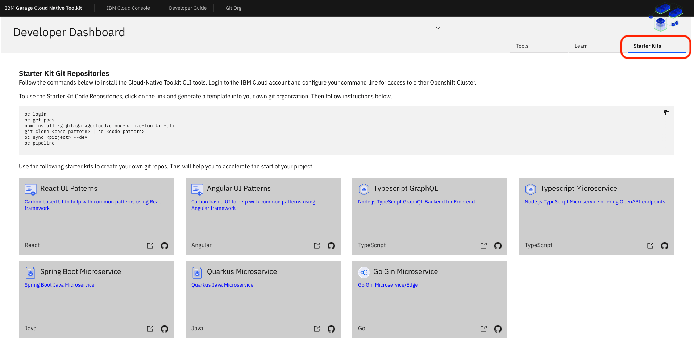
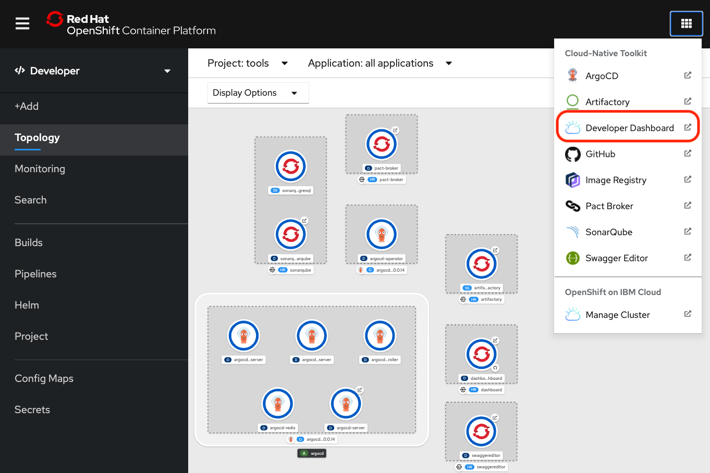

オープンソースのCloud-Native Toolkitは、KubernetesやRed Hat OpenShift、その他のコンテナ・オーケストレーターでうまく動作する、よくできたコンテナ・イメージの作成プロセスを簡素化します。このチュートリアルでは、Cloud-Native Toolkitのスターターキットを使用してイメージを構築する方法を紹介します。

これらのスターターキットは、コンテナとしてデプロイされる本番品質のクラウド・ネイティブ・アプリケーションやマイクロサービスを作成するのに役立ちます。スターターキットには、Build-to-Manageアプリケーションのベストプラクティスが含まれており、KubernetesとOpenShiftでテストされています。Cloud-Native Toolkitを使い始めるにあたり、まずはスターターキットから始めることを強くお勧めします。成功し、ツールがどのように連携するかを学んだ後は、Bring-Your-Own-Codeアプローチに移行できます。

下の図は、Developer DashboardにあるスターターキットのGitリポジトリのリストです。

以下のセクションでは、以下の内容を紹介します。

* ツールキットの使用に関する基本情報
* 一般的なフレームワークのテンプレートレポ
* Tektonのパイプラインとタスク
* ベストプラクティスのための追加ツール。
  * テストツールおよびコード解析
  * 脆弱性スキャン
  * アーティファクト管理
  * GitOps継続的デリバリー

この画像は、Typescript Microserviceスターターキットを選択した際に作成されるパイプラインです。

## 前提条件

1. ****ツールキットをインストールします。

    ツールキットを使用してイメージを構築する前に、ツールキット環境にアクセスする必要があります。つまり、ユーザーまたは管理者がツールキットをすでにインストールしている必要があります。詳細は、[クラウドネイティブツールキットのインストール](/learningpaths/build-images-cloud-native-toolkit/install-toolkit)を参照してください。

    ツールキットをインストールすると、OpenShift Web Consoleのトップナビゲーションバーにあるアプリケーションランチャーのドロップダウンメニューに、ツールキットのツールと[Developer Dashboard](https://cloudnativetoolkit.dev/getting-started-day-1/dashboard/)が追加されます（下図）。スターターキットは、[Developer Dashboard]からアクセスできます。

    

1. **Cloud-Native Toolkitを使用したOpenShiftクラスタ**。

    ツールキットがインストールされているOpenShiftクラスターにアクセスする必要があります。ツールキットのインストール方法については、[Install the Cloud-Native Toolkit](https://developer.ibm.com/learningpaths/build-images-cloud-native-toolkit/install-toolkit/)を参照してください。

    管理者があなたのためにOpenShiftにツールキット環境をすでにインストールしている場合は、それにアクセスするためのWebコンソールのURLが必要です。また、レジストリにアクセスするためのURLも必要になります。

1. **GitHubアカウントへのアクセス**。

    [GitHubアカウントでパーソナルアクセストークンを設定](https://cloudnativetoolkit.dev/learning/dev-setup/#github-account)します。このトークンを保存しておくと、[アプリケーションをDevOpsパイプラインに登録する](https://cloudnativetoolkit.dev/learning/fast-ci/#5-register-the-application-in-a-devops-pipeline)際に「Gitパスワードまたはパーソナル・アクセストークンの提供」を求められたときに使用できます。パイプラインが GitHub レポにアクセスするには、このトークンが必要です。

## イージーパスのためのヒント

「Continuous Integration - fast start」ガイドに従いながら、以下の推奨事項に従うことで簡単な道を歩むことができます。

* [デモンストレーション・ビデオ](https://cloudnativetoolkit.dev/getting-started-day-1/deploy-app)を見てから、自分で手順を試してみてください。
* [開発ツール](https://cloudnativetoolkit.dev/getting-started/dev-env-setup)がセットアップされていることを確認してください。
* **Typescript Microservice**スターターキットを選択する。
* [Tekton](https://tekton.dev/)または[Jenkins](https://www.jenkins.io/)のプロンプトが表示されたら、"Tekton "を選択します。

## Follow the "Continuous Integration - fast start" tutorial

ツールキットのガイド(**Learning the Toolkit > Basics > Continuous Integration**)の[Continuous Integration - fast start](https://cloudnativetoolkit.dev/learning/fast-ci/)ページにアクセスします。そこには、次のステップを案内するハンズオンのチュートリアルがあります。

1. コマンドラインから開発クラスタにログインします。
2.開発用のネームスペースを作成します。
3.開発者ダッシュボードを開きます。
4.Gitでアプリを作成します。
5.アプリをDevOpsパイプラインに登録します。
6.アプリケーションのパイプラインを見る
7.アプリケーション・アーティファクトの確認
8.実行中のアプリケーションにアクセスできます。
9.Webコンソールでアプリを探します。
10 .コードのクローンを作成します。
11 .アプリケーションをローカルで実行します。
12 .Webhookをテストします。

パイプラインが正常に完了すると、作成されたことが確認できます。

* コンテナ・イメージ
* Helmチャート
* GitHubでのタグ付きリリース

このイメージとHelmチャートは、アプリのデプロイに必要なものすべてです。実際に、パイプラインがアプリのデプロイに使用したものです。このイメージとチャートを別の環境（ツールキットがインストールされていない本番環境など）に移動して、そこでのアプリのデプロイに使用することができます。

## まとめ

Cloud-Native ToolkitのCIパイプラインを使えば、Red Hat Container Certificationに必要なアーティファクトと、イメージをデプロイするためのHelmチャートを簡単に構築することができます。自分でイメージを構築する方法を学ぶ必要はありません -- ツールキット（とパイプライン/ツール）を使うだけです。ツールキットがイメージを構築してくれます。

[スターターキット](https://cloudnativetoolkit.dev/reference/starter-kit/starter-kit/)を使って新しいアプリを作ることができます。スターターキットには、ソリューションに必要なコードの作成を開始するための主要なコンポーネント、構成、フレームワークがすべて含まれています。このような始め方は、KubernetesやRed Hat OpenShiftをベースにした環境でも全く同じです。