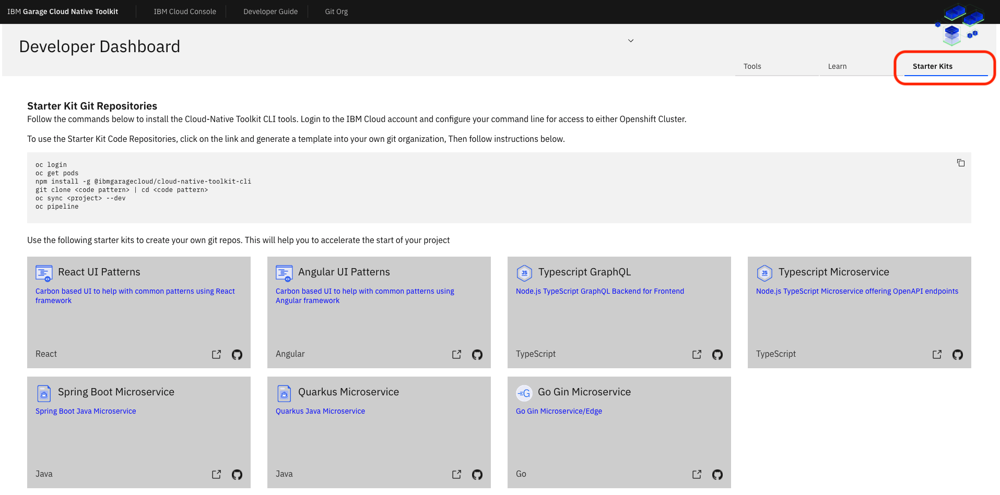
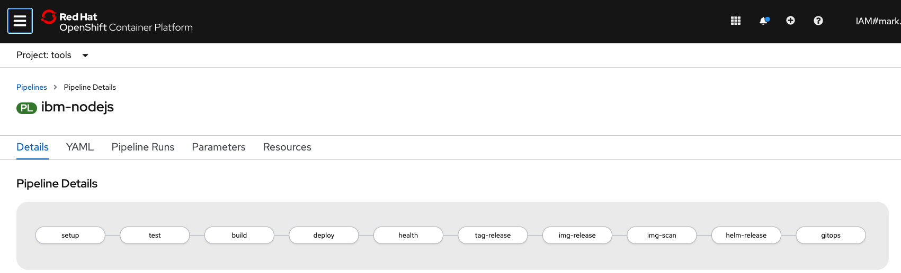
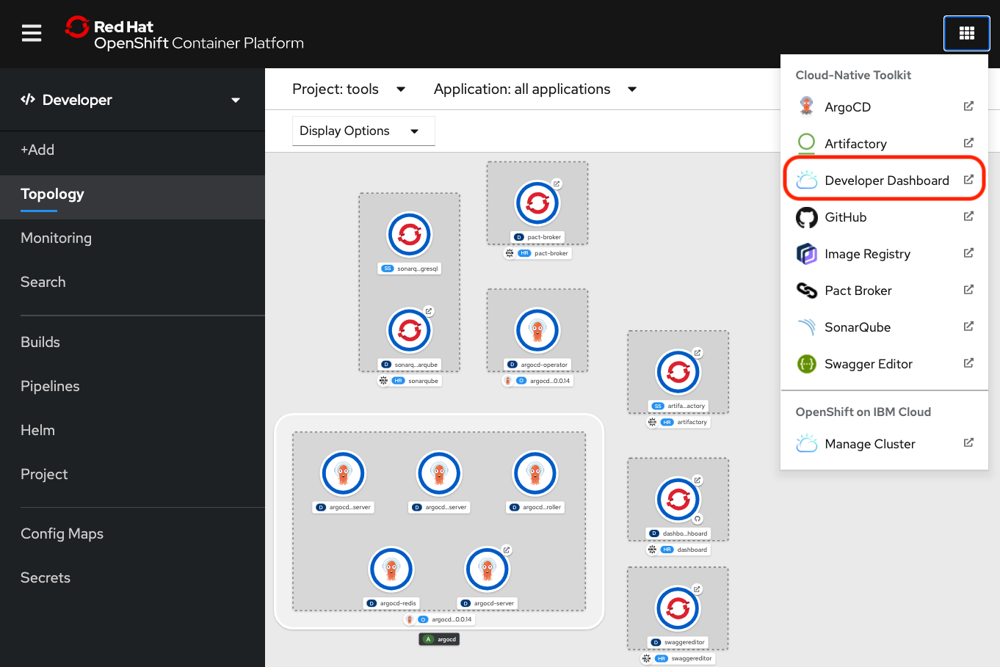

The open source Cloud-Native Toolkit simplifies the process of creating well-built container images that run well in Kubernetes, Red Hat OpenShift, or other container orchestrators. This tutorial shows you how to build an image using a Cloud-Native Toolkit starter kit.

These starter kits help you create production-quality, cloud-native applications and microservices that are deployed as containers. They include best practices for build-to-manage applications and are tested on Kubernetes and OpenShift. As you begin to work with the Cloud-Native Toolkit, it is highly recommended that you start with a starter kit. After you are successful and learn how the tools work together, you can move on to a bring-your-own-code approach.

The image below shows the Developer Dashboard list of available starter kit Git repositories:

The following sections introduce you to:

* Basic information about using the toolkit
* Template repos for popular frameworks
* Tekton pipelines and tasks
* Additional tools for best practices, such as:
  * Test tools and code analysis
  * Vulnerability scan
  * Artifact management
  * GitOps continuous delivery

This image shows the pipeline that's created when you choose the Typescript Microservice starter kit:

## Prerequisites

1. **Install the toolkit**

    Before you can use the toolkit to build images, you need to have access to a toolkit environment, which means you or an administrator should have already installed the toolkit. See [Install the Cloud-Native Toolkit](/learningpaths/build-images-cloud-native-toolkit/install-toolkit) for details.

    After you install the toolkit, the toolkit's tools and a [Developer Dashboard](https://cloudnativetoolkit.dev/getting-started-day-1/dashboard/) are added to the application launcher drop-down menu in the top navigation bar of your OpenShift Web Console (shown below). You can access the starter kits from the Developer Dashboard.

    

1. **An OpenShift cluster with the Cloud-Native Toolkit**

    You need access to an OpenShift cluster where the toolkit is installed. See the [Install the Cloud-Native Toolkit](https://developer.ibm.com/learningpaths/build-images-cloud-native-toolkit/install-toolkit/) for instructions on installing the toolkit.

    If an administrator has already installed a toolkit environment in OpenShift for you, you'll need the Web Console URL to access it. You'll also need the URL for accessing the registry.

1.  **GitHub account access**

    [Configure a personal access token](https://cloudnativetoolkit.dev/learning/dev-setup/#github-account) in your GitHub account. Save this token to use when prompted to "provide the Git password or personal access token" when you [register the application in a DevOps Pipeline](https://cloudnativetoolkit.dev/learning/fast-ci/#5-register-the-application-in-a-devops-pipeline). Your pipeline needs this token to access the GitHub repo.

## Tips for an easy path

While following the "Continuous Integration - fast start" guide, stay on the easy path by following these recommendations:

* Watch the [demonstration videos](https://cloudnativetoolkit.dev/getting-started-day-1/deploy-app) before trying the steps yourself.
* Make sure you have set up your [development tools](https://cloudnativetoolkit.dev/getting-started/dev-env-setup).
* Choose the **Typescript Microservice** starter kit.
* Select "Tekton" when prompted for [Tekton](https://tekton.dev/) or [Jenkins](https://www.jenkins.io/).

## Follow the "Continuous Integration - fast start" tutorial

Go to the [Continuous Integration - fast start](https://cloudnativetoolkit.dev/learning/fast-ci/) page of the Toolkit's guide (under **Learning the Toolkit > Basics > Continuous Integration**). There you will find a hands-on tutorial to guide you through the following steps:

1. Log into your development cluster from the command line.
2. Create the development namespace.
3. Open the Developer Dashboard.
4. Create your app in Git.
5. Register the application in a DevOps pipeline.
6. View your application pipeline.
7. View your application artifacts.
8. Access the running app.
9. Locate the app in the web console.
10. Clone your code.
11. Run the application locally.
12. Test the webhook.

When the pipeline completes successfully, you'll see that it has created:

* A container image
* A Helm chart
* A tagged release in GitHub

This image and Helm chart are everything you need to deploy your app. In fact, it's what the pipeline used to deploy your app. You could move this image and chart to another environment -- such as a production environment that doesn't have the toolkit installed -- and use them to deploy your app there.

## Summary

The CI pipeline in the Cloud-Native Toolkit makes it simple to build the artifacts you need for Red Hat Container Certification and a Helm chart to deploy your image. You don't need to learn how to build your own images -- just use the toolkit (and pipelines/tools). It builds your images for you.

You can create a new app using one of the [starter kits](https://cloudnativetoolkit.dev/reference/starter-kit/starter-kit/). They have been created to include all the key components, configurations, and frameworks to get you started creating the code you need for your solutions. This approach for getting started is exactly the same for an environment based on Kubernetes or Red Hat OpenShift.