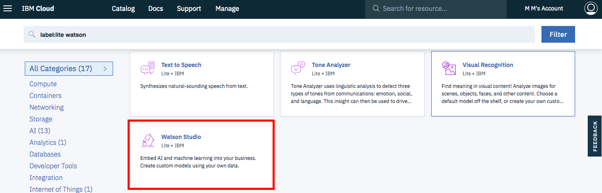

## Python overview

You might think that Python is only for developers and people with computer science degrees. However, Python is great for beginners, even those with little coding experience because it's free, open source, and runs on any platform. The Python packages documentation is great, and after an <a href="https://cognitiveclass.ai/learn/data-science-with-python" target="_blank" rel="noopener noreferrer">introductory course</a>, you have a good foundation to build on.

Python is a general purpose and high-level programming language that is used for more than working with data. For example, it's good for developing desktop GUI applications, websites, and web applications. However, this tutorial focuses on the data and only goes through getting started with data.

## Unstructured versus structured data

Data is broadly classified into unstructured and structured data. Unstructured data refers to data that is mostly free form with information that does not have consistent data types. Hand-written notes by doctors and movie reviews collected from blogs are two examples of unstructured data. On the other hand, structured data is information that is available in an organized format so that it is easily readable. Examples of structured data are tables with variables as columns and records as rows or key-value pairs in a noSQL database.

## Introduction to pandas

pandas is an open source Python Library that provides high-performance data manipulation and analysis. With the combination of Python and pandas, you can accomplish five typical steps in the processing and analysis of data, regardless of the origin of data: load, prepare, manipulate, model, and analyze.

There are many options when working with the data using pandas. The following list shows some of the things that can be done using pandas.

* Cleaning data by removing or replacing missing values
* Converting data formats
* Sorting rows
* Deleting or adding rows and columns
* Merging or joining DataFrames
* Summarizing data by pivoting or reshaping
* Creating visualizations

This list is far from complete. See the <a href="https://pandas.pydata.org/docs/" target="_blank" rel="noopener noreferrer">pandas documentation</a> for more of what you can do.

This tutorial walks you though some of the most interesting features of pandas using structured data that contains information about the boroughs in London. You can download the data used in the tutorial from <a href="https://data.gov.uk/dataset/248f5f04-23cf-4470-9216-0d0be9b877a8/london-borough-profiles-and-atlas" target="_blank" rel="noopener noreferrer">data.gov.uk</a>.

## Getting started with Jupyter Notebooks

Instead of writing code in a text file and then running the code with a Python command in the terminal, you can do all of your data analysis in one place. Code, output, tables, and charts can all be edited and viewed in one window in any web browser with <a href="https://jupyter.org/" target="_blank" rel="noopener noreferrer">Jupyter Notebooks</a>. As the name suggests, this is a notebook to keep all of your ideas and data explorations in one place. In this tutorial, you use <a href="https://dataplatform.cloud.ibm.com/docs/content/wsj/getting-started/overview-ws.html?cm_sp=ibmdev-_-developer-tutorials-_-cloudreg" target="_blank" rel="noopener noreferrer">IBM Watson Studio</a> to run a notebook. For this, you need a free IBM Cloud account. The following steps show you how sign up and get started. When you have the notebook up and running, you can go through the notebook.

## Prerequisites

To complete this tutorial, you need:

* An <a href="https://cloud.ibm.com?cm_sp=ibmdev-_-developer-tutorials-_-cloudreg" target="_blank" rel="noopener noreferrer">IBM Cloud</a>
* <a href="https://dataplatform.cloud.ibm.com/docs/content/wsj/getting-started/overview-ws.html?cm_sp=ibmdev-_-developer-tutorials-_-cloudreg" target="_blank" rel="noopener noreferrer">IBM Watson Studio</a>

## Steps

### Set up

1. Sign up or log in to IBM Cloud.

1. Click **Create Resource** at the top of the Resources page. You'll see the resources under the hamburger menu at the upper left.

    

1. Search for **Watson Studio**, and click that tile.

    

1. Select the Lite plan, and click **Create**.
1. Go back to the Resources list, click your Watson Studio service, and then click **Get Started**.

    

    You should now be in Watson Studio.

1. Click either **Create a project** or **New project**.
1. Select **Create an empty project**.
1. Give the project a name.
1. Choose an existing Object Storage service instance or create a new one. This is used to store the notebooks and data. Note: Don't forget to click refresh when returning to the Project page.
1. Click **Create**.  

### Load and run a notebook

1. Click **Add to project**, then click **Notebook** to add a new notebook.

    

1. Download the [notebook](static/Working-with-structured-data-in-Python-using-Pandas.ipynb).
1. Choose new notebook **From File**.
1. Select the downloaded notebook.
1. Select the default runtime.
1. Click **Create Notebook**. The notebook loads.
1. Run the notebook. In the open notebook, click **Run** to run the cells one at a time.

## Notebook overview

The following list shows some of the capabilities within pandas that are covered in this tutorial.

* Data exploration (loading data, Series, and DataFrames)
* Data transformation (cleaning data, selecting data, merging data, and grouping data)
* Data visualization

The [notebook](static/Working-with-structured-data-in-Python-using-Pandas.ipynb) associated with this tutorial displays more elaborate functions of pandas.

### Data exploration

#### Loading data

As long as the data is formatted consistently and has multiple records with numbers, text, or dates, you can typically read the data with pandas. For example, a comma-separated text file that is saved from a table in Excel can be loaded into a notebook with the following command.

```python
import pandas as pd
df = pd.read_csv('data.csv')
```

You can load <a href="https://pandas.pydata.org/pandas-docs/stable/user_guide/io.html" target="_blank" rel="noopener noreferrer">other</a> formats of data files such as HTML, JSON, or Apache Parquet a similar way.

#### Series and DataFrames

A `Series` is a one-dimensional labeled array that can contain data of any type (for example, integer, string, float, or Python objects).

```
s = pd.Series([1, 3, 5, np.nan, 6, 8])
s
```

A DataFrame is a two-dimensional data structure. The data consists of rows and columns that you can create in various ways. For example, you can load a file or use a NumPy array and a date for the index. <a href="https://numpy.org/" target="_blank" rel="noopener noreferrer">NumPy</a> is a Python library for working with multidimensional arrays and matrices with a large collection of mathematical functions to operate on these arrays.

The following code is an example of a DataFrame `df1` with dates as the index, a 6x4 array of random numbers as values, and column names A, B, C, and D.

```
dates = pd.date_range('20200101', periods=6)
numbers = np.random.randn(6, 4)
df1 = pd.DataFrame(numbers, index=dates, columns=['A', 'B', 'C', 'D'])
df1
```

Running the previous code generates an output similar to the following image. The notebook shows a few more ways of creating a DataFrame.


#### Selecting data

To select data, you access a single row or groups of rows and columns with labels using `.loc[]`. (This only works for the column that was set to the index.) Or, you select data by a position with `.iloc[]`.  

```
boroughs = df.copy()
boroughs = boroughs.set_index(['Code'])
boroughs.loc['E09000001', 'Inland_Area_(Hectares)']
```


```
boroughs.iloc[0]
```


```
boroughs.iloc[:,1]
```


Selecting rows based on a certain condition can be done with boolean indexing. This uses the actual values of the data in the DataFrame as opposed to the row and column labels or index positions. You can combine different columns using `&`, `|`, and `==` operators.

### Data transformation

#### Cleaning data

When exploring data, there are always transformations needed to get it in the format that you need for your analysis, visualization, or model. The best way to learn is to find a data set and try to answer questions with the data. Some things to check when cleaning data are:

* Is the data tidy, such as each variable forms a column, each observation forms a row, and each type of observational unit forms a table?
* Are all columns in the right data format?
* Are there missing values?
* Are there unrealistic outliers?

The following code shows how to add and drop a column that might not be required from the data set using pandas.

```
boroughs['new'] = 1
boroughs.head()
```


```
boroughs = boroughs.drop(columns='new')
boroughs.head()
```


#### Merging data

pandas has several different options to combine or merge data. The <a href="https://pandas.pydata.org/pandas-docs/stable/user_guide/merging.html" target="_blank" rel="noopener noreferrer">documentation</a> covers these examples. In this notebook, you create two new DataFrames to explore how to merge data. Then, you use `append()` to combine these DataFrames.

```
data = {'city':       ['London','Manchester','Birmingham','Leeds','Glasgow'],
        'population': [9787426,  2553379,     2440986,    1777934,1209143],
        'area':       [1737.9,   630.3,       598.9,      487.8,  368.5 ]}
cities = pd.DataFrame(data)

data2 = {'city':       ['Liverpool','Southampton'],
        'population': [864122,  855569],
        'area':       [199.6,   192.0]}
cities2 = pd.DataFrame(data2)

cities = cities.append(cities2)
cities
```


#### Grouping data

Grouping data is a quick way to calculate values for classes in your DataFrame.

```
boroughs.groupby(['Inner/Outer']).mean()
```


When you have multiple categorical variables, you can create a nested index.

```
boroughs.groupby(['Inner/Outer','Political control']).sum().head(8)
```


### Data visualization

Visualization in pandas uses the Matplotlib library. This plotting library uses an object-oriented API to embed plots into applications. Some of the examples are line plot, histograms, scatter plot, image plot, and 3D plot. In this tutorial, we use matplotlib.pyplot, which is a collection of command-style functions that make matplotlib work like MATLAB.

The following example shows a visualization of the employment rate through a histogram. You can change the number of bins to get the wanted output on your histogram.

```
%matplotlib inline

import matplotlib.pyplot as plt

boroughs = boroughs.reset_index()

boroughs['Employment_rate_(%)_(2015)'].plot.hist(bins=10);
```


## Conclusion

This tutorial walked you through the steps to get IBM Cloud, Watson Studio, and a Jupyter Notebook installed. It gave you an overview of the ways of analyzing data using pandas and a notebook that you can run to try it yourself.