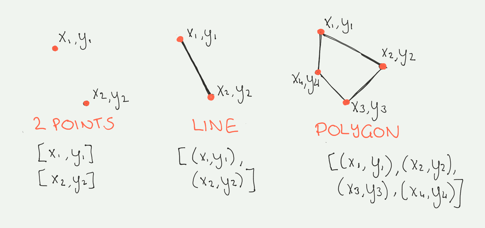
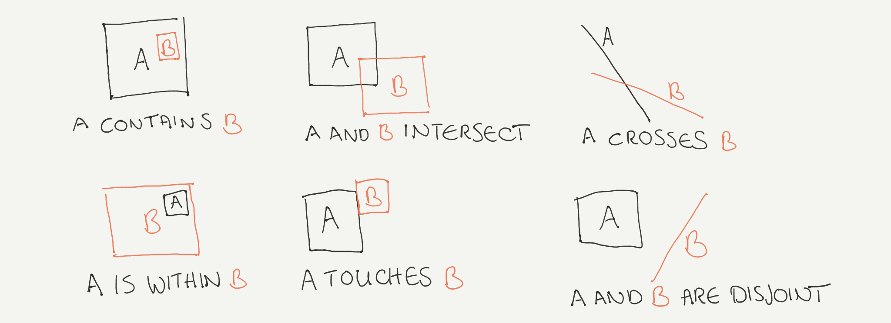

##  地理空間データ

地理空間データとは、他の特徴に加えてレコードの地理的な位置に関する情報を含むデータセットのことです。例えば、いくつかの都市とその人口規模に関する情報を含み、さらに緯度と経度の座標を示す2つの列を含むデータセットは、地理空間データとみなされます。地理空間情報は、都市間の距離を調べたり、近隣の平均世帯収入を計算したり、地図を作成するなど、多くの余分な情報を推論するのに役立ちます。

一般的に、地理空間データは、ベクターデータとラスターデータの2つの方法で表現されます。この記事では、それぞれの表現方法の詳細と、適したアプリケーションについて掘り下げて説明します。

### ベクトルデータ

 ベクトルデータとは、空間要素を x 座標と y 座標で表現したものです。ベクトルデータの最も基本的な形は _point_ です。2つ以上の点は _line_ を、3つ以上の線は _polygon_ を形成します。次の図は、それぞれのベクトルデータとその配列を示したものです。

例として、都市の位置を点（xとyの座標）で定義することができますが、実際には都市の形状にはもっと多くの情報が含まれています。線で表現できる道路があり、線の始点と終点を表す2つの点で構成されています。また、建物や地域、都市の境界線など、あらゆる形の形状を表すポリゴンもたくさんあります。

#### データ表現

ベクターデータは、さまざまな形式で表現することができます。最も単純な形式は、その地理空間座標を定義するテーブルに1つ以上の追加カラムを含めることです。また、[GeoJSON](https://geojson.org/)のようなより正式なエンコーディングフォーマットも便利です。GeoJSON は、<a href="https://www.json.org/json-en.html" target="_blank" rel="noopener noreferrer">JSON</a> データ形式の拡張で、Point、LineString、Polygon、MultiPoint、MultiLineString、MultiPolygon のいずれかを指定できる _geometry feature_ を含みます。地理空間データを表現するためのライブラリは他にもいくつかありますが、それらはすべてGeospatial Data Abstraction Library（<a href="https://gdal.org/" target="_blank" rel="noopener noreferrer">GDAL</a>）で説明されています。

また、Pythonでの地理空間データの取り扱いを容易にするために、いくつかのGDAL互換のPythonパッケージが開発されています。点、線、多角形は、<a href="https://shapely.readthedocs.io/" target="_blank" rel="noopener noreferrer">Shapely</a>でオブジェクトとして記述することもできます。これらのShapelyオブジェクトを使って、次の図のように、_contains, intersects, overlaps_, _touches_などの空間関係を探ることができます。

Pythonを使って地理空間データを扱うにはいくつかの方法があります。例えば、<a href="https://pypi.org/project/Fiona/" target="_blank" rel="noopener noreferrer">Fiona</a>を使ってジオメトリデータを読み込み、それをShapelyオブジェクトに渡すことができます。これは、<a href="https://geopandas.org/" target="_blank" rel="noopener noreferrer">GeoPandas</a>が使っているものです。GeoPandasは、Pandasを使って表形式のデータを扱うのと同じような感覚でベクトルデータを扱うことができるパッケージです。

GeoPandasに地理空間データを含むファイルタイプ（csv、geojson、またはshapeファイル）を指定すると、Fionaを使ってGDALから正しいフォーマットを取得します。以下のコードでデータを読み込むと、PandasのDataFrameの機能に加えて、最も近い点を探したり、ポリゴン内の面積や点の数を計算したりといった地理空間機能をすべて備えたGeoDataFrameができあがります。

詳しくは、<a href="https://geopandas.org/" target="_blank" rel="noopener noreferrer">GeoPandas documentation</a>をご参照ください。

### ラスターデータ

ラスターデータは、地理空間データのもう一つの種類です。ラスターデータは、ある範囲の空間情報を観測する場合に使用します。ラスターデータは、行と列のマトリックスで構成されており、各セルに何らかの情報が関連付けられています。ラスターデータの例としては、ある都市の衛星画像が、各セルに気象情報を含んだマトリックスで表現されています。傘が必要かどうかを確認するために雨雲レーダーをチェックするのは、このタイプのデータを見ていることになります。

#### データの表現

Pythonでラスターデータを扱うにはいくつかの方法があります。最近のパッケージで使い勝手が良いのは、<a href="http://xarray.pydata.org/en/stable/" target="_blank" rel="noopener noreferrer">xarray</a>で、これは<a href="https://www.unidata.ucar.edu/software/netcdf/docs/faq.html#What-Is-netCDF" target="_blank" rel="noopener noreferrer">netcdf</a>ファイルを読みます。これは、複数の配列、変数名のメタデータ、座標系、ラスタサイズ、データの作者などからなるバイナリデータ形式です。ファイルを`DataArray`として読み込んだ後は、PandasやGeoPandasと同様に、たった1つのコマンドで地図を作成することができます（以下のコードを参照）。

他のファイルフォーマットについては、<a href="https://rasterio.readthedocs.io/en/latest/intro.html" target="_blank" rel="noopener noreferrer">rasterio</a>をお試しください。このソフトを使うと、さまざまな種類のラスターデータファイルを読み込むことができます。

## 座標系

いずれの地理空間データにおいても、座標系について知っておくことが重要です。地図は規則的な格子状の座標で表現されていますが、地球は平らな長方形ではありません。3次元の地球から2次元の地図へのデータの変換は様々な方法で行われており、そのプロセスは<a href="https://en.wikipedia.org/wiki/Map_projection" target="_blank" rel="noopener noreferrer">地図投影</a>として知られています。よく使われる<a href="https://en.wikipedia.org/wiki/Mercator_projection" target="_blank" rel="noopener noreferrer">メルカトル図法</a>と<a href="https://en.wikipedia.org/wiki/Mollweide_projection" target="_blank" rel="noopener noreferrer">モルワイデ図法</a>では見え方が違います。

複数のデータセットでGeoPandasを扱う際には、すべてのデータセットで投影が同じであるかどうかを確認することが重要です。これは、以下のコードで行うことができます。

ラスターデータを扱う際には、その場所に依存した値に注意しなければなりません。使用する投影法によって、赤道では極地よりも大きくなることもあれば、逆になることもあります。

## 地理空間データサンプル

地理空間データのソースの一部を紹介します。

* <a href="https://www.naturalearthdata.com/downloads/50m-cultural-vectors/50m-admin-0-countries-2/" target="_blank" rel="noopener noreferrer">Natural Earth</a>の全世界の国のポリゴン。
* <a href="https://datacatalog.worldbank.org/dataset/major-rivers-world" target="_blank" rel="noopener noreferrer">The World Bank</a>からの世界の河川。
* <a href="https://crudata.uea.ac.uk/cru/data/hrg/" target="_blank" rel="noopener noreferrer">CRU</a>からの世界の過去の気温データ
* <a href="https://firms.modaps.eosdis.nasa.gov/active_fire/#firms-shapefile" target="_blank" rel="noopener noreferrer">NASA</a>の衛星データからのアクティブな火災マップ
* <a href="https://modis.gsfc.nasa.gov/data/dataprod/mod12.php" target="_blank" rel="noopener noreferrer">NASA</a>からの土地被覆データ

小さなプロジェクトでデータを探索することは、より深く学ぶための最良の方法です。これらのデータセットに関する質問に答えることで、データを探索してみましょう。例えば、どの国に最も多くの川があるのかを探ったり、変化の地図やこれらの地域の時系列プロットを作成することで、気温が最も上昇した場所を特定しようとします。

## まとめ

この記事では、地理空間データの概要とその種類、ベクターとラスターについて説明しました。また、Pythonを使って地理空間データを扱う方法についても簡単に説明しました。このシリーズの後続のチュートリアルでは、Pythonを使ってベクターデータやラスターデータを扱う方法について、より詳しく説明します。サンプルの地理空間データセットは、データの探索を始め、データを通してより多くのことを学ぶための方法として提供されています。