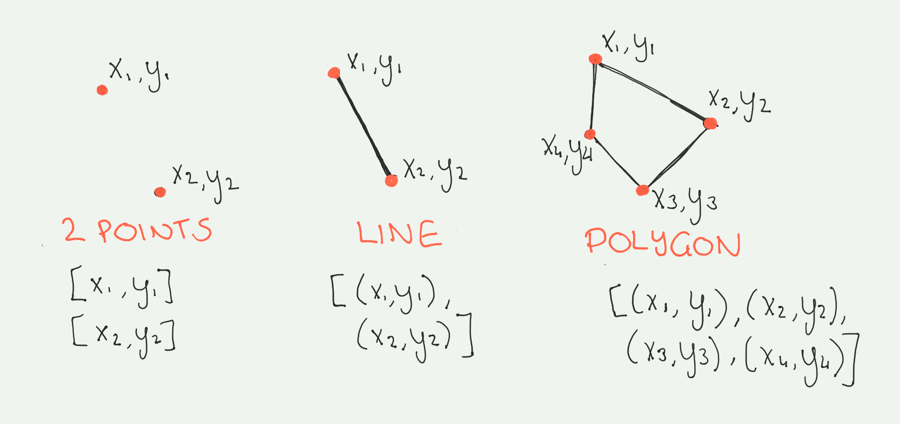

## Geospatial data

Geospatial data refers to any data set that includes information about the geographic location of the record in addition to other features. For example, a data set that contains information about several cities with their population size that also includes two extra columns with the latitude and longitude coordinates is considered geospatial data. Geospatial information is helpful with inferring a lot of extra information, for example, to find the distance between cities, calculate average household incomes by neighborhood, and to create maps.

Typically, geospatial data is represented in two ways: vector data and raster data. The rest of this article dives deeper into the details of each of these representations and their suitable applications.

### Vector data

 _Vector data_ is a representation of a spatial element through its x and y coordinates. The most basic form of vector data is a _point_. Two or more points form a _line_, and three or more lines form a _polygon_. The following image shows each type of vector data along with its array representation.



As an example, you can define the location of a city by a point (x and y coordinates), but in reality the shape of the city contains much more information. There are roads that can be represented by lines, which consist of the two points that represent the start and the end of the line. Also, there are many polygons that represent shapes of any form such as buildings, regions, and city boundaries.

#### Data representation

Vector data can be represented in various formats. The simplest form is to include one or more extra columns in the table that defines its geospatial coordinates. More formal encoding formats such as [GeoJSON](https://geojson.org/) also come in handy. GeoJSON, an extension to the <a href="https://www.json.org/json-en.html" target="_blank" rel="noopener noreferrer">JSON</a> data format, contains a _geometry feature_ that can be a Point, LineString, Polygon, MultiPoint, MultiLineString, or MultiPolygon. There are several other libraries available for representing geospatial data that are all described in the Geospatial Data Abstraction Library (<a href="https://gdal.org/" target="_blank" rel="noopener noreferrer">GDAL</a>).

Several GDAL-compatible Python packages have also been developed to make working with geospatial data in Python easier. Points, lines, and polygons can also be described as objects with <a href="https://shapely.readthedocs.io/" target="_blank" rel="noopener noreferrer">Shapely</a>. With these Shapely objects, you can explore spatial relationships such as _contains, intersects, overlaps_, and _touches_, as shown in the following figure.


There are several ways to work with geospatial data using Python. For example, you can use <a href="https://pypi.org/project/Fiona/" target="_blank" rel="noopener noreferrer">Fiona</a> to load the geometry data and then pass it to Shapely objects. This is what <a href="https://geopandas.org/" target="_blank" rel="noopener noreferrer">GeoPandas</a> uses. GeoPandas is a package that makes working with vector data a similar experience to working with tabular data using Pandas.

After you specify the file type (csv, geojson, or a shape file) that contains the geospatial data to GeoPandas, it uses Fiona to get the right format from GDAL. After reading the data using the following code, you have a GeoDataFrame that has all of the geospatial features such as finding the closest point or calculating areas and counting points within a polygon, in addition to the functions of a Pandas DataFrame.

```
geopandas.read_file()
```

The <a href="https://geopandas.org/" target="_blank" rel="noopener noreferrer">GeoPandas documentation</a> is a great place to learn more.

### Raster data

Raster data is the other type of geospatial data. Raster data is used when spatial information across an area is observed. It consists of a matrix of rows and columns with some information associated with each cell. An example of raster data is a satellite image of a city represented by a matrix that contains the weather information in each of its cells. When you check the rain radar to see whether you need an umbrella, you are looking at this type of data.

#### Data representation

There are several ways that you can work with raster data in Python. One recent package that is user-friendly is <a href="http://xarray.pydata.org/en/stable/" target="_blank" rel="noopener noreferrer">xarray</a>, which reads <a href="https://www.unidata.ucar.edu/software/netcdf/docs/faq.html#What-Is-netCDF" target="_blank" rel="noopener noreferrer">netcdf</a> files. This is a binary data format consisting of multiple arrays, metadata of the variable names, coordinate systems, raster size, and author of the data. After you load a file as a `DataArray`, you can create a map with just one command (see the following code), similar to Pandas and GeoPandas.

```
da.plot()
```

For other file formats, try <a href="https://rasterio.readthedocs.io/en/latest/intro.html" target="_blank" rel="noopener noreferrer">rasterio</a>, which lets you read many different kinds of raster data files.

## Coordinate systems

For both types of geospatial data, it's important that you be aware of the coordinate system. Maps are represented on a regular grid of coordinates, but the earth is not a flat rectangle. The transformation of data from the 3-dimensional earth to the 2-dimensional maps is done in many ways, and the process is known as <a href="https://en.wikipedia.org/wiki/Map_projection" target="_blank" rel="noopener noreferrer">map projection</a>. The frequently used <a href="https://en.wikipedia.org/wiki/Mercator_projection" target="_blank" rel="noopener noreferrer">Mercator projection</a> looks different from the <a href="https://en.wikipedia.org/wiki/Mollweide_projection" target="_blank" rel="noopener noreferrer">Mollweide projection</a>.

When working with GeoPandas across multiple data sets, it's important to check whether the projection is the same for all of them. You can do this with the following code.

```
geodf.crs

```

When working with raster data, you must be aware of the values that depend on the location of it, which can be either larger at the equator than the poles or the other way around, depending on the projection used.

## Geospatial data samples

Some sources of geospatial data are:

* Polygons of all countries from <a href="https://www.naturalearthdata.com/downloads/50m-cultural-vectors/50m-admin-0-countries-2/" target="_blank" rel="noopener noreferrer">Natural Earth</a>
* Global rivers from <a href="https://datacatalog.worldbank.org/dataset/major-rivers-world" target="_blank" rel="noopener noreferrer">The World Bank</a>
* Global historical temperature data from <a href="https://crudata.uea.ac.uk/cru/data/hrg/" target="_blank" rel="noopener noreferrer">CRU</a>
* Active fire maps from satellite data from <a href="https://firms.modaps.eosdis.nasa.gov/active_fire/#firms-shapefile" target="_blank" rel="noopener noreferrer">NASA</a>
* Land cover data from <a href="https://modis.gsfc.nasa.gov/data/dataprod/mod12.php" target="_blank" rel="noopener noreferrer">NASA</a>

Exploring data in a small project is the best way to learn more. Try to explore these data sets by answering questions about them. For instance, explore which country has the most rivers, or try to determine where the temperature has increased the most by creating a map of the changes and Time Series plots for these regions.

## Summary

This article gives you a short overview of geospatial data and its types, vector and raster. It also briefly discusses how to work with geospatial data using Python. Subsequent tutorials in this series will go more in-depth on working with vector data and raster data using Python. Sample geospatial data sets were provided as a way to begin exploring data and learn more through it.