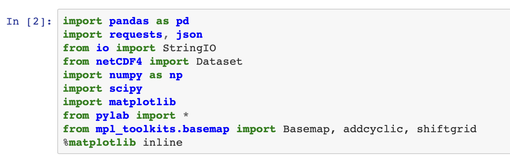
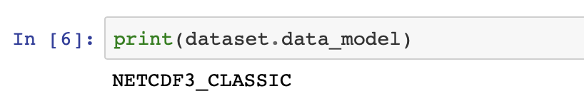
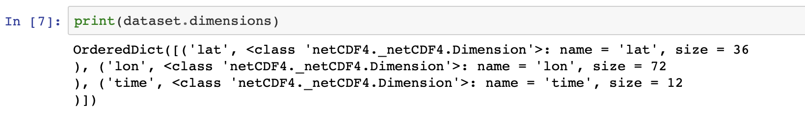
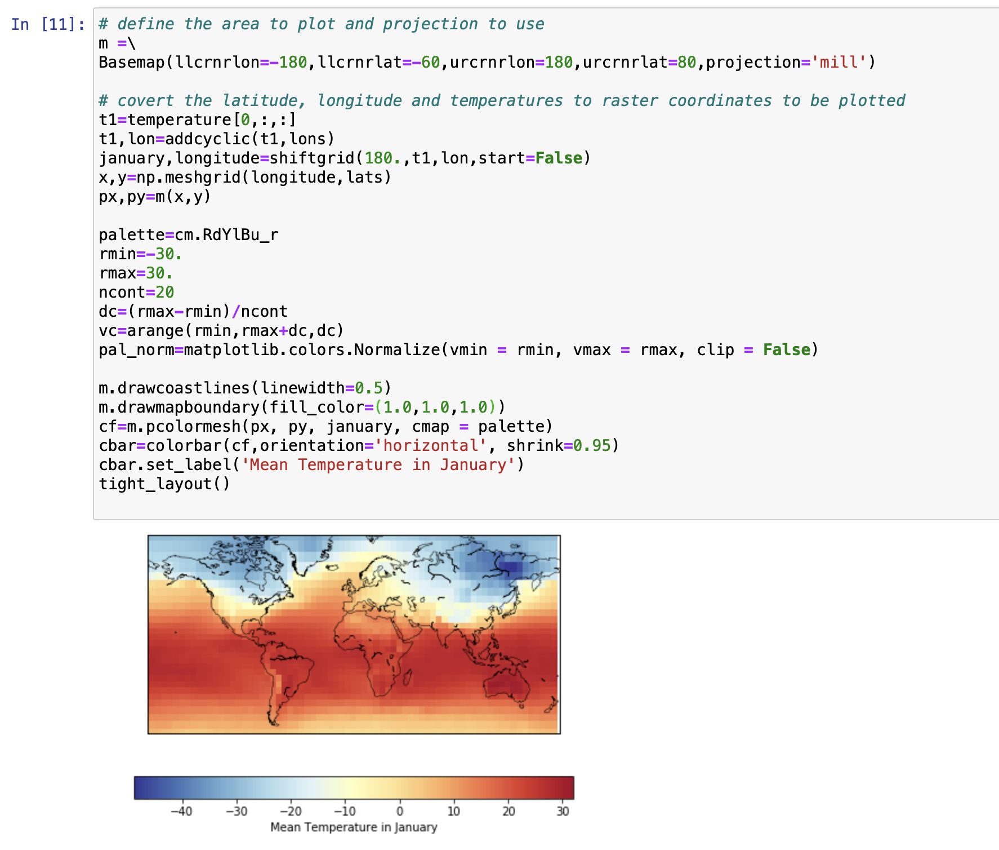
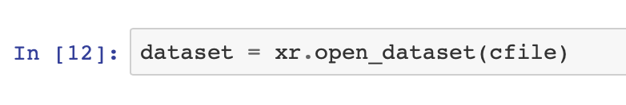
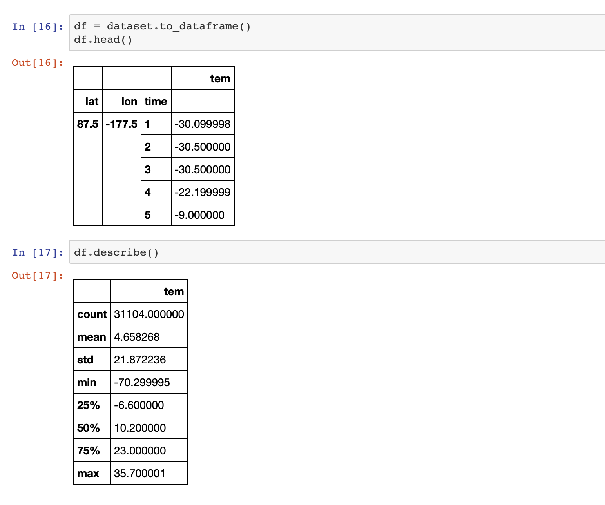
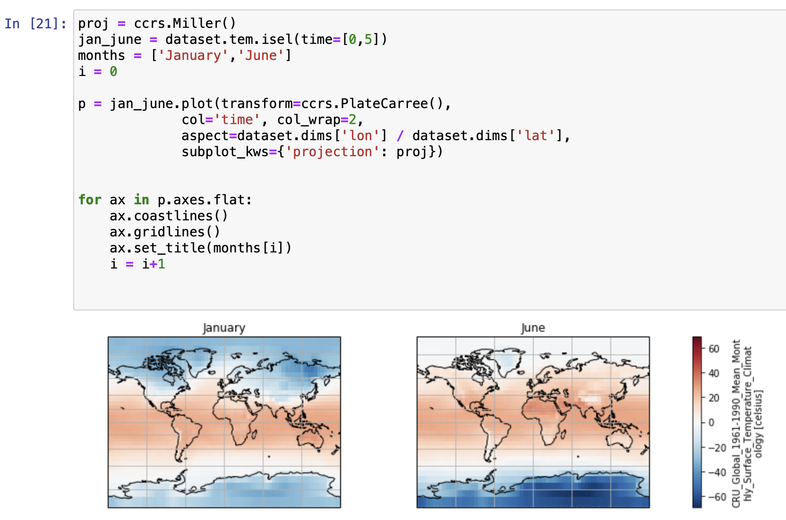

ラスターデータとは、地理空間データの一種で、幾何学的な位置に関する情報を格子や行列の形で格納したものです。これらの行列は、属性の種類と数に応じて、各次元が特徴を表し、その中の各ピクセルが特徴を表す値を含む多次元になります。例えば、ある都市の気象情報を多次元配列で表現したデータセットには、気温、相対湿度、風速などの情報が含まれます。衛星画像など、地理的な位置を表す画像もラスタデータの一種です。

netCDF、PNG、JPEG、TIFF、バイナリファイルは、ラスターデータの一例です。データタイプの広範なリストは、<a href="https://www.igismap.com/raster-data-file-format/" target="_blank" rel="noopener noreferrer">ラスターデータファイルフォーマット</a>のリストにあります。ラスターデータと、Pythonを使ってラスターデータを表現しアクセスするさまざまな方法についての詳細は、「[Introduction to geospatial data using Python](/learningpaths/data-analysis-using-python/introduction-togeospatial-data-using-python/)」の記事に記載されています。このチュートリアルでは、Pythonでラスターデータを扱う方法を説明するコード例を提供します。

## 前提条件

このチュートリアルを完了するには、以下のものが必要です。

* <a href="https://cloud.ibm.com?cm_sp=ibmdev-_-developer-tutorials-_-cloudreg" target="_blank" rel="noopener noreferrer">IBM Cloud</a> のアカウントが必要です。
* <a href="https://dataplatform.cloud.ibm.com/docs/content/wsj/getting-started/overview-ws.html?cm_sp=ibmdev-_-developer-tutorials-_-cloudreg" target="_blank" rel="noopener noreferrer">Watson Studio</a> が必要です。

## ステップ

### セットアップ

1. IBM Cloud にサインアップまたはログインします。

1. 「リソース」ページの上部にある「**Create resource**」をクリックします。リソースは、左上のハンバーガー・メニューの下にあります。

    

1. 「**Watson Studio**」を検索して、そのタイルをクリックします。

    

1. Lite プランを選択して、**Create** をクリックします。
1. リソースリストに戻り、Watson Studio サービスをクリックして、**Get Started**をクリックします。

    

    これで Watson Studio になっているはずです。

1. **Create a project** または **New project** のいずれかをクリックします。
1. **Create an empty project**（空のプロジェクトの作成）を選択します。
1. プロジェクトに名前を付けます。
1. 既存のObject Storageサービスインスタンスを選択するか、新しいインスタンスを作成します。これはノートブックとデータを保存するために使用されます。注：「プロジェクト」ページに戻るときは、「更新」を忘れずにクリックしてください。
1. **Create**をクリックします。

### プロジェクトの作成 アクセストークン

ノートブックにデータを読み込むには、アクセストークンが必要です。

1. プロジェクトの上部にある「設定」タブを開き、スクロールダウンして「**アクセストークン**」を選択します。
1. 「**New token**」をクリックします。
1. 新しいトークンに名前を付け、**Editor**を選択し、**Create**をクリックします。

    

    これは、ノートブックの後半で必要になります。

### カスタムPython環境の作成

デフォルトのPython環境には必要なライブラリがインストールされていないため、`conda create`を使ってカスタマイズした環境を作成する必要があります。ただし、この環境はIBM Cloud上で動作するため、いくつかの手順があります。

1. プロジェクトの上部にある環境タブに移動します。
1. **新しい環境定義**をクリックします。

    

1. 新しい環境に名前を付けます。
1. デフォルトのまま、フリーのハードウェア構成 **Free - 1 vCPU and 4 GB RAM**、 **Default Python 3.6** を選択して、 **Create** をクリックします。

    

1. 新しい環境をカスタマイズします。スクロールダウンして、Customizationの下にある**Create**リンクをクリックします。

    

1. 編集可能なテキストフィールドが表示されます。テキストをすべて削除し、以下のコードをコピーしてテキストフィールドに貼り付けます。

1. 「**Apply**」をクリックします。

これで、この新しい環境を使ってノートブックを実行することができます。

## ノートブックの読み込みと実行

新しいノートブックを追加するには

1. **Add to project**をクリックして、**Notebook**を選択します。

    

1. 「**New notebook from URL**」を選択します。
1. ノートブックに名前を付け、URL <a href="https://github.com/IBM/data-analysis-using-python/blob/master/notebooks/raster-data-using-python.ipynb" target="_blank" rel="noopener noreferrer">https://github.com/IBM/data-analysis-using-python/blob/master/notebooks/raster-data-using-python.ipynb</a> をコピーします。
1. 作成した**カスタムランタイム環境**を選択し、**ノートブックの作成**をクリックします。

ノートブックがロードされます。ノートブックの指示に従って、すべてのセルを実行してください。その後、このチュートリアルに戻ります。

## ノートブックの概要

### データセットについて

<a href="https://crudata.uea.ac.uk/cru/data/temperature/#datdow" target="_blank" rel="noopener noreferrer">data set</a>には、1961年から1990年までの絶対温度を5&deg;×5&deg;のグリッドで収録しています。データは<a href="https://pro.arcgis.com/en/pro-app/help/data/multidimensional/what-is-netcdf-data.htm" target="_blank" rel="noopener noreferrer">NetCDF</a>形式で表現されています。

## netCDF4 と matplotlib

### netCDFを使ったデータ解析

このチュートリアルの前半では、Pythonの<a href="hhttps://github.com/Unidata/netcdf4-python" target="_blank" rel="noopener noreferrer">GnetCDF4</a>モジュールを使って、データセットからデータを抽出する方法を見ました。次のコードサンプルでは、このノートブック全体で使用したインポートの明示的なリストを示しています。

まず、前のステップで作成したプロジェクト・トークンを使用するヘルパー関数でデータセットをインポートします。

次に、netCDF4の*Dictionary*コレクションを使用して、データとnetCDFファイルを構成するフィールド間の関係を分析します。

netCDFファイルのデータモデルバージョンを抽出するには、`data_model`変数を使用します。データモデルは、NETCDF3_CLASSIC, NETCDF4, NETCDF4_CLASSIC, NETCDF3_64BIT_OFFSET, NETCDF3_63BIT_DATAのいずれかのデータモデルバージョンである。

`dimensions`は、`Dimensions`クラスのインスタンスにマッピングされたデータセットからの変数名を持つ辞書を返します。これは、変数の名前とそのサイズを提供します。

`variables` は、データセットからの変数名を `Variable` クラスのインスタンスにマッピングした辞書を返します。

次のコード例では、`variables`コードサンプルで返された辞書のキーとして、データセットから変数にアクセスする方法を示しています。

### matplotlibを使った作図

では、matplotlibとその拡張機能を使って、Pythonで2Dマップをプロットする方法を見てみましょう。ここでは、matplotlibの<a href="https://matplotlib.org/basemap/users/intro.html" target="_blank" rel="noopener noreferrer">basemap</a>ツールキットを使用します。点を2Dの表面にマッピングするために、`basemap`クラスは24種類の<a href="https://matplotlib.org/basemap/users/mapsetup.html" target="_blank" rel="noopener noreferrer">投影</a>をサポートしています。この例では、<a href="https://matplotlib.org/basemap/users/mill.html" target="_blank" rel="noopener noreferrer">Miller Cylindrical Projections</a>を使用していますが、これは一般的に航海用の地図ではなく壁掛け用の地図に使用されます。`elcrnrlon`と`llcrnrlat`は、希望する地図領域の左下隅の経度と緯度を指します（度）。  `urcrnrlon` と `urcrnrlat` は目的の地図領域の右下隅の経度と緯度（度）を表します。

`addcyclic` はデータセットに経度の列を追加します。コードを見ると、温度のエントリを含む配列に経度の配列が追加されています。`shiftgrid`は、すべての経度とデータを東か西に移動させます。`meshgrid`メソッドは，1次元の座標配列から座標行列を返すものである．コードでは，`meshgrid`を用いて，経度と緯度の配列を_x_と_y_の座標配列に変換しています．

## xarray と Cartopy

### xarrayを使ったデータ解析

チュートリアルのこのパートでは、<a href="http://xarray.pydata.org/en/stable/" target="_blank" rel="noopener noreferrer">xarray</a>を使ってnetCDFデータを処理する方法を見ていきます。`xarray`は多次元配列の分析に便利で、pandasとNumPyの関数を共有しています。`xarray`は、netCDFファイルを扱うための堅牢なライブラリであることが証明されています。

以下のコード例は，ノートブックを実行するために必要なインポートを示している。

次に、`xarray`を使ってデータセットを開き、ロードします。

`xarray`は以下のデータ構造をサポートしている。

* `DataArray`, 多次元配列である。
* `Dataset`, 複数のDataArrayオブジェクトからなる辞書

netCDFのデータは、`xarray`のDatasetとして表現される。

`values`はデータセット内の値を表すn次元の配列を返す。このデータセットにはlat, lon, timeの3つの座標が含まれていることがわかる。また、データ変数であるtemperatureは浮動小数点数である。

`dims`は、_x_, _y_, _z_座標の値を返します。

`coords` は、`values` 変数から、座標部分だけを返します。

`xarray`はpandasの拡張機能であるため、データセットをDataFrameに変換するメソッドが用意されています。

### xarrayを使った作図

`xarray`では、matplotlibライブラリを拡張することで、プロッティング機能もサポートしています。DataArrayオブジェクトは、`xarray`ライブラリを使ってプロットすることができます。Datasetオブジェクトをプロットするには、関連するDataArrayまたはdimensionにアクセスする必要があります。

### カートピーを使った作図

<a href="https://scitools.org.uk/cartopy/docs/latest/" target="_blank" rel="noopener noreferrer">Cartopy</a>は、`xarray`と互換性のあるいくつかのプロッティング・アプリケーションの一つです。他のアプリケーションとしては、Seaborn、HoloViews、GeoViewsなどがあります。

以下の例は、cartopyを使って視覚化を行う簡単な例です。<a href="https://scitools.org.uk/cartopy/docs/latest/crs/projections.html#mollweide" target="_blank" rel="noopener noreferrer">Molleweide projection</a>とMiller Cylindrical Projectionsを比較しています。<a href="https://scitools.org.uk/cartopy/docs/latest/crs/projections.html" target="_blank" rel="noopener noreferrer">Cartopy projection list</a>では、投影の完全なリストを提供しています。

次の例は、1月と6月の気温の強弱を比較したヒートマップです。

## Conclusion

このチュートリアルでは、地理空間ラスターデータの基本を説明しました。また、2つのPythonライブラリを使用したNetCDFデータの解析方法の概要を説明しました。最初の例では、データの抽出にnetCFF4 Pythonライブラリを使用し、可視化にmatplotlibを使用する方法を示しました。2つ目の例では、データを扱うために `xarray` を、グラフをプロットするために Cartopy を使用する方法を示しました。