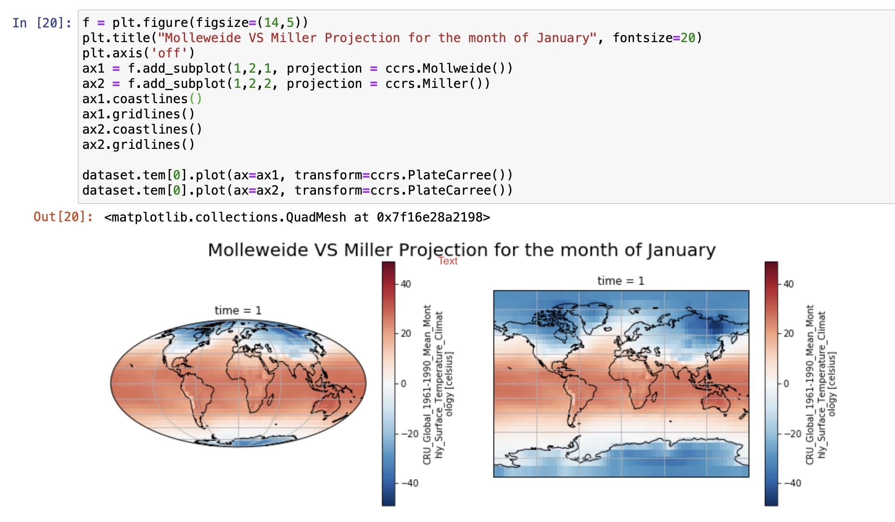

Raster data is a type of geospatial data that contains information about the geometric location in the form grids and matrices. Depending on the type and number of attributes, these matrices can be multidimensional, with each dimension representing a feature and each pixel within it containing a value that represents a feature. For example, a data set that contains weather information for a city represented as a multidimensional array can include details about temperature, relative humidity, and wind velocity. Satellite images or any images representing geographical locations are forms of raster data.


netCDF, PNG, JPEG, TIFF, and binary files are examples of raster data types. An extensive list of the data types can be found <a href="https://www.igismap.com/raster-data-file-format/" target="_blank" rel="noopener noreferrer">raster data file formats</a> list. More information on raster data and the different ways of representing and accessing raster data using Python is described in the "[Introduction to geospatial data using Python](/learningpaths/data-analysis-using-python/introduction-to-geospatial-data-using-python/)" article. In this tutorial, we provide code examples to explain how to work with raster data in Python.

## Prerequisites

To complete this tutorial, you need:

* An <a href="https://cloud.ibm.com?cm_sp=ibmdev-_-developer-tutorials-_-cloudreg" target="_blank" rel="noopener noreferrer">IBM Cloud</a> account
* <a href="https://dataplatform.cloud.ibm.com/docs/content/wsj/getting-started/overview-ws.html?cm_sp=ibmdev-_-developer-tutorials-_-cloudreg" target="_blank" rel="noopener noreferrer">Watson Studio</a>

## Steps

### Set up

1. Sign up or log in to IBM Cloud.

1. Click **Create resource** at the top of the Resources page. You can find the resources under the hamburger menu at the upper left.

    

1. Search for **Watson Studio**, and click that tile.

    

1. Select the Lite plan, and click **Create**.
1. Go back to the Resources list, click your Watson Studio service, and then click **Get Started**.

    

    You should now be in Watson Studio.

1. Click either **Create a project** or **New project**.
1. Select **Create an empty project**.
1. Give the project a name.
1. Choose an existing Object Storage service instance or create a new one. This is used to store the notebooks and data. Note: Don't forget to click refresh when returning to the Project page.
1. Click **Create**.

### Create a project Access token

To load data into a notebook, you need an Access token.

1. Go the Settings tab at the top of the project and scroll down to **Access tokens**.
1. Click **New token**.
1. Name the new token, select **Editor**, and click **Create**.

    

    You will need this later in the notebook.

### Create a custom Python environment

Because the required libraries are not installed in the default Python environment, you must create a customized environment by using `conda create`. However, because the environment is running in IBM Cloud, there are a few steps to go through.

1. Go to the environments tab at the top of your project.
1. Click **New environment definition**.

    

1. Name your new environment.
1. Keep the default, select the free hardware configuration **Free - 1 vCPU and 4 GB RAM**, **Default Python 3.6**, and click **Create**.

    

1. Customize the new environment. Scroll down, and click **Create** link under Customization

    

1. A text field opens that you can edit. Delete all of the text, and copy and paste the following code into the text field.

    ```
    channels:
    - defaults
    - conda-forge

    # Please add conda packages here
    dependencies:
    - mapclassify==1.0.1
    - netcdf4
    - xarray
    - numpy=1.16.4
    - tensorboard=1.13.0
    - basemap=1.2.1
    - cartopy

    # Please add pip packages here
    # To add pip packages, please comment out the next line
    #- pip:
    ```
1. Click **Apply**.

Now you can use this new environment to run notebooks

## Load and run a notebook

To add a new notebook:

1. Click **Add to project**, and choose **Notebook**.

    

1. Choose **New notebook from URL**.
1. Name your notebook, and copy the URL <a href="https://github.com/IBM/data-analysis-using-python/blob/master/notebooks/raster-data-using-python.ipynb" target="_blank" rel="noopener noreferrer">https://github.com/IBM/data-analysis-using-python/blob/master/notebooks/raster-data-using-python.ipynb</a>.
1. Select the **Custom runtime environment** that you created, and click **Create Notebook**.

The notebook loads. Follow the instructions in the notebook, and run all cells. Then, return to this tutorial.

## Notebook overview

### About the data set

The <a href="https://crudata.uea.ac.uk/cru/data/temperature/#datdow" target="_blank" rel="noopener noreferrer">data set</a> contains a 5&deg; by 5&deg; grid with absolute temperatures for the years 1961 - 1990. The data is represented in a <a href="https://pro.arcgis.com/en/pro-app/help/data/multidimensional/what-is-netcdf-data.htm" target="_blank" rel="noopener noreferrer">NetCDF</a> format.

## netCDF4 and matplotlib

### Data analysis using netCDF

In the first half of this tutorial, you see how to use Python's <a href="hhttps://github.com/Unidata/netcdf4-python" target="_blank" rel="noopener noreferrer">GnetCDF4</a> module to extract data from the data set. The following code sample shows the explicit list of imports that we used throughout this notebook.


First, we import the data set with a helper function that uses the project token created in the previous steps.


Then, we use the netCDF4 *Dictionary* collection to analyze the data and its relations between the fields that constitute the netCDF file.


To extract the data model version of the netCDF file, we use the `data_model` variable. The data model can be one of NETCDF3_CLASSIC, NETCDF4, NETCDF4_CLASSIC, NETCDF3_64BIT_OFFSET OR NETCDF3_63BIT_DATA data model versions.


`dimensions` returns a dictionary with variables names from the data set mapped to instances of the `Dimensions` class. It provides the name of the variable along with its size.


`variables` returns a dictionary that maps the variables names from the data set as instances of the `Variable` class.


The following code example shows how variables from the data set can be accessed as keys of the dictionary returned in the `variables` code sample.


### Plotting using matplotlib

Now, let's look at how matplotlib and its extensions can be used to plot 2D maps in Python. Here, we use the matplotlib <a href="https://matplotlib.org/basemap/users/intro.html" target="_blank" rel="noopener noreferrer">basemap</a> toolkit. To map the points on a 2D surface, the `basemap` class supports 24 different types of <a href="https://matplotlib.org/basemap/users/mapsetup.html" target="_blank" rel="noopener noreferrer">projections</a>. In this example, we use <a href="https://matplotlib.org/basemap/users/mill.html" target="_blank" rel="noopener noreferrer">Miller Cylindrical Projections</a>, which are generally used for wall maps rather than navigational maps. `llcrnrlon` and `llcrnrlat` refer to the longitude and latitude of the lower-left corner of the wanted map domain (degrees).  `urcrnrlon` and `urcrnrlat` refer to the longitude and latitude of the lower-right corner of the wanted map domain (degrees).


`addcyclic` adds a longitude column to a set of data. In the code, you see that the longitude array is added to an array containing temperature entries. `shiftgrid` moves all longitudes and data east or west. The `meshgrid` method returns coordinate matrices from one-dimensional coordinate arrays. In the code, we use `meshgrid` to convert longitude and latitude arrays into _x_ and _y_ coordinate arrays.

## xarray and Cartopy

### Data analysis using xarray

This part of the tutorial looks at how to use <a href="http://xarray.pydata.org/en/stable/" target="_blank" rel="noopener noreferrer">xarray</a> to process the netCDF data. `xarray` is useful with analyzing multidimensional arrays and shares functions from pandas and NumPy. `xarray` has proven to be a robust library to handle netCDF files.

The following code example shows the required imports that must be done to be able to run the notebook.


We then open and load the data set using `xarray`.


`xarray` supports the following data structures:

* `DataArray`, a multidimensional array
* `Dataset`, a dictionary of multiple DataArray objects

netCDF data is represented as a Dataset in `xarray`.

`values` returns an n-dimensional array that represents the values in the data set. You can see that this data set contains three coordinates, lat, lon, and time. It also contains a data variable temperature that is a float value.


`dims` returns the value of the _x_, _y_, and _z_ coordinates.


`coords` returns just the coordinates section from the `values` variable.


Because `xarray` is an extension to pandas, it offers a method that lets you convert the data set to a DataFrame.


### Plotting using xarray

`xarray` also supports plotting functions by extending the matplotlib library. DataArray objects can be plotted using `xarray` libraries. To plot Dataset objects, the relevant DataArrays or dimensions need to be accessed.


### Plotting using Cartopy

<a href="https://scitools.org.uk/cartopy/docs/latest/" target="_blank" rel="noopener noreferrer">Cartopy</a> is one of several plotting applications that are compatible with `xarray`. Other applications are Seaborn, HoloViews, and GeoViews.

The following example is a simple example of using cartopy to create visualizations. We compare the <a href="https://scitools.org.uk/cartopy/docs/latest/crs/projections.html#mollweide" target="_blank" rel="noopener noreferrer">Molleweide projection</a>[]() versus the Miller Cylindrical Projections. The <a href="https://scitools.org.uk/cartopy/docs/latest/crs/projections.html" target="_blank" rel="noopener noreferrer">Cartopy projection list</a> provides a complete list of projections.



The following example is a heat map that compares the intensity of temperatures between the months of January and June.


## Conclusion

This tutorial walked you through the basics of geospatial raster data. It gave you an overview of how to analyze NetCDF data using two sets of Python libraries. In the first example, it showed how to use the netCFF4 Python library for extracting data and matplotlib for visualization. In the second example, it showed how to use `xarray` for handling data and Cartopy for plotting graphs.