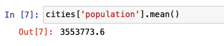
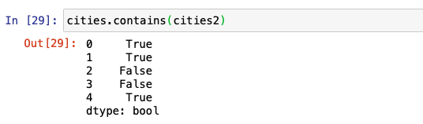
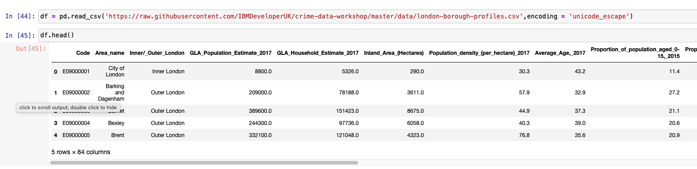
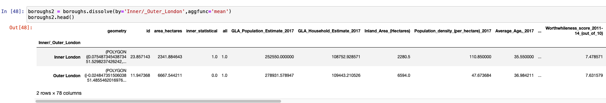

ベクターデータは、地理的な位置に関する情報を座標の形で含む地理空間データの一種です。これらの座標は、点、線、多角形のいずれかです。ベクトルデータは、地理的な情報を推測するのに役立ちます。例えば、2つの異なる都市の緯度と経度があれば、その都市間の距離を計算することができます。

ベクトルデータと、Pythonを使用してベクトルデータを表現しアクセスするさまざまな方法については、[Introduction to geospatial data using Python](/learningpaths/data-analysis-using-python/introduction-togeospatial-data-using-python/)の記事で詳しく説明しています。このチュートリアルでは、コードスニペットを使って、ベクトルデータの扱い方を説明します。

## 前提条件

このチュートリアルを完了するには、以下のものが必要です。

* <a href="https://cloud.ibm.com?cm_sp=ibmdev-_-developer-tutorials-_-cloudreg" target="_blank" rel="noopener noreferrer">IBM Cloud</a> のアカウントが必要です。
* <a href="https://dataplatform.cloud.ibm.com/docs/content/wsj/getting-started/overview-ws.html?cm_sp=ibmdev-_-developer-tutorials-_-cloudreg" target="_blank" rel="noopener noreferrer">Watson Studio</a> が必要です。

## ステップ

### セットアップ

1. IBM Cloud にサインアップまたはログインします。

1. 「リソース」ページの上部にある「**Create resource**」をクリックします。リソースは、左上のハンバーガー・メニューの下にあります。

    

1. 「**Watson Studio**」を検索し、そのタイルをクリックします。

    

1. Lite プランを選択して、**Create** をクリックします。
1. リソースリストに戻り、Watson Studio サービスをクリックして、**Get Started**をクリックします。

    
    これで Watson Studio になっているはずです。

1. **Create a project** または **New project** のいずれかをクリックします。
1. **Create an empty project**（空のプロジェクトの作成）を選択します。
1. プロジェクトに名前を付けます。
1. 既存のObject Storageサービスインスタンスを選択するか、新しいインスタンスを作成します。これはノートブックとデータを保存するために使用されます。注：「プロジェクト」ページに戻るときは、「更新」を忘れずにクリックしてください。
1. **Create**をクリックします。

### プロジェクトの作成 アクセストークン

ノートブックにデータを読み込むには、アクセストークンが必要です。

1. プロジェクトの上部にある「設定」タブを開き、スクロールダウンして「**アクセストークン**」を選択します。
1. 「**New token**」をクリックします。
1. 新しいトークンに名前を付け、**Editor**を選択し、**Create**をクリックします。

    
    これは、ノートブックの後半で必要になります。

### カスタムPython環境の作成

デフォルトのPython環境には必要なライブラリがインストールされていないため、`conda create`を使ってカスタマイズした環境を作成する必要があります。ただし、この環境はIBM Cloud上で動作するため、いくつかの手順があります。

1. プロジェクトの上部にある環境タブに移動します。
1. **新しい環境定義**をクリックします。

    

1. 新しい環境に名前を付けます。
1. デフォルトのまま、フリーのハードウェア構成 **Free - 1 vCPU and 4 GB RAM**、 **Default Python 3.6** を選択し、 **Create** をクリックします。

    

1. 新しい環境をカスタマイズします。スクロールダウンして、Customizationの下にある**Create**リンクをクリックします。

    

1. 編集可能なテキストフィールドが表示されます。テキストをすべて削除し、以下のコードをコピーしてテキストフィールドに貼り付けます。

1. 「**Apply**」をクリックします。

これで、この新しい環境を使ってノートブックを実行できるようになりました。

## ノートブックの読み込みと実行

新しいノートブックを追加するには

1. **Add to project**をクリックして、**Notebook**を選択します。

    

1. 「**New notebook from URL**」を選択します。
1. ノートブックに名前を付け、URL <a href="https://github.com/IBM/data-analysis-using-python/blob/master/notebooks/vector-data-using-geopandas.ipynb" target="_blank" rel="noopener noreferrer">https://github.com/IBM/data-analysis-using-python/blob/master/notebooks/vector-data-using-geopandas.ipynb</a> をコピーします。
1. 作成した**カスタムランタイム環境**を選択し、**ノートブックの作成**をクリックします。

ノートブックがロードされます。ノートブックの指示に従って、すべてのセルを実行してください。その後、このチュートリアルに戻ります。

## ノートブックの概要

### データセットについて

はじめに、イギリスの5つの都市の情報を含む単純なベクトルデータセットを作成します。基本的な内容を経て、ロンドンの区に関する情報を含むデータセットを使用します。その後、<a href="https://www.openstreetmap.org/about" target="_blank" rel="noopener noreferrer">Open Street Map(OSM)</a>のベクトルデータの分析に移ります。

以下のリストは、PythonでGeoPandasを使って探索するベクトルデータの機能の一部です。

* 属性とメソッド
* 点と線とポリゴン
* オーバーレイ
* バッファ
* 空間的な関係（含まれる、含まれない、交差する、交差する、分離する）
* ディゾルブ
* ジョイン

このチュートリアルに関連する<a href="https://github.com/IBM/data-analysis-using-python/blob/master/notebooks/vector-data-using-geopandas.ipynb" target="_blank" rel="noopener noreferrer">ノートブック</a>には、GeoPandasのこれらの機能が表示されています。

### GeoDataFrame の初期化

pandasの拡張機能である<a href="https://geopandas.org" target="_blank" rel="noopener noreferrer">GeoPandas</a>を使用するだけでなく、幾何学的なオブジェクトを定義するために[Shapely](https://shapely.readthedocs.io/en/latest/)を使用し、その特徴の一部を視覚化するために<a href="https://matplotlib.org" target="_blank" rel="noopener noreferrer">matplotlib</a>を使用します。次の図は、使用した `import` のリストです。

まず、pandasを使って簡単なDataFrameを作成します。次の画像は、各都市の緯度と経度の情報を含むベクターデータのサンプルです。

次に、先に定義したDataFrameから経度と緯度の列を組み合わせた*point*という名前の追加の列を作成します。この列のエントリは、Shapelyを使って初期化することで、`Point`オブジェクトに変換されます。この列の名前は *geometry* です。

#### GeoSeriesとGeoDataFrame

GeoPandasでは、主要なデータ構造であるGeoSeriesとGeoDataFrameの2つをpandasから拡張しています。GeoSeriesは、pandas Seriesのように、各エントリが行に対応する1つまたは複数の図形を表すベクトルです。GeoDataFrameは、pandasのDataFrameと同様に、GeoSeriesの列とその他の情報を持つ2次元のデータ構造です。GeoDataFrame内のGeoSeries列は、*geometry*と呼ばれています。

次の図は、既存のDataFrameを拡張してGeoDataFrameを作成する方法を示したコードスニペットです。点列はもはや必要ないため、現在は削除しています。

### 属性とメソッド

この新しいGeoDataFrameには、pandas DataFrameと同じ属性とメソッドが定義されています。例えば、次の図のコードでは、人口欄の平均値と面積欄の最小値を算出しています。

次の画像は、人口と面積を使って密度を計算する方法を説明するコードです。このGeoDataFrameは、pandas DataFrameという性質上、今のところ何も変わっていません。

しかし、このGeoDataFrameには、いくつかの追加属性やメソッドがあります。メソッドや属性が適用されるときは、*geometry*列に適用されます。関数の完全なリストは、<a href="https://geopandas.org/reference.html" target="_blank" rel="noopener noreferrer">API Reference</a>に記載されています。まず、人気のある組み込み属性をいくつか見てみましょう。それは `area`, `bounds`, `total_bounds`, `geom_type` です。

cities DataFrameにはPointしか含まれていないので、`area`は0のGeoSeriesを返します。

`total_bounds`は、DataFrameのエントリ全体のxおよびy座標の最小値と最大値の境界を返します。

`geom_type` は、各エントリのジオメトリタイプを返します。GeoDataFrameは、複数のジオメトリタイプを持つことができます。

次の例では、`distance`によって、ロンドンから他の4つの都市のそれぞれの距離を計算することができます。

次に、元の都市データセットのサブセットである別のGeoDataFrameを作成します。元のデータセットから2つの行を削除して、他の属性やメソッドをいくつか試してみて、GeoPandasの機能をさらに理解してみましょう。

`area`は、前回見たものと同様のDataSeriesを返します。

`bounds`は、`total-bounds`（上記参照）とは異なり、`bounds`はDataFrameの各エントリのxとyのminとmaxの配列を返すのに対し、`total-bounds`はDataFrame全体の1つのセットを返すという意味です。

`geom-type`は、先ほどの「city」データセットの場合と同じです。

`centroid`メソッドは、各ジオメトリの中心点をGeoSeriesで返します。Pointの場合は、その点自体が削除されます。ただし、LineやPolygonのジオメトリの場合は、動作が異なります。

`representative-point`メソッドは、ジオメトリ内にあることが保証された点を返します。これはセントロイドである可能性もありますが、必ずしもそうではありません。centroidと同様に、Pointジオメトリの場合は、その点自体が返されます。

### 点と線と多角形

事前にShapelyを使って、citiesのGeoDataFrameにPointを定義しているので、`squeeze`メソッドを使って、各都市を代表するポイントを抽出することができます。以下の画像は、そのためのコードです。

2つのポイントを組み合わせて、Shapelyの`LineString`オブジェクトを適用すると、ラインを表すGeoSeriesが構築されます。次のコードスニペットは、このメソッドを使って都市間にいくつかのラインが構築される様子を示しています。

3つ以上の点を同様の方法で組み合わせて、ポリゴンを形成することができます。Shapelyには、このポリゴンを定義し、GeoSeriesを作成するためのPolygonインターフェースがあります。

前の画像で示したグラフでは、各都市を結ぶ線が異なる色で表示され、3つの都市を結んでできる2つのポリゴンが表示されています。このグラフを表現するのに、組み込みの `plot` メソッドを使用しています。

### オーバーレイ

複数のデータセット間の相互作用を観察するには、オーバーレイライブラリを使用します。演算としては、`union`, `difference`, `symmetrical difference`, `intersection` などがあります。

次の図は、前のグラフで表示された2つのポリゴンの結合を示しています。

### バッファ

バッファとは、対象物の周囲に緩衝材を加えて領域を特定する方法です。バッファの単位や尺度は、ユースケースによって異なります。バッファは、点、線、ポリゴンのいずれにも適用でき、結果は常にポリゴンになります。

以下のコードでは、同じエントリに対して毎回提供される距離に基づいてバッファサイズがどのように変化するかを示すために、1行だけのDataFrameを作成しています。

次のグラフでは、内側の赤い点が実際のポイントを表しています。この点を中心とした3つの同心円は、異なるバッファサイズを表しています。バッファを適用する例としては、ウイルスの震源地からどの程度の範囲を隔離する必要があるかを特定することが挙げられます。

### 空間的な関係

GeoPandasには、2つのデータセットの関係を理解するためにGeoDataFrameに適用できるいくつかのバイナリ述語があります。例えば、このチュートリアルで設定した2つのデータセット、citiesとcities2を考えてみましょう。次の図は、結果をよりよく視覚化するのに役立ちます。

`contains`は、最もよく使われる関係性のテスト方法の1つです。ここでは、地理的特徴や幾何学的形状の間の関係を見つけるために使用できる、4つの異なる`contains`の例を提供します。

cities2のどのポイントがcitiesデータセットに存在するかを計算するために、以下のコードを使用します。

cities2データセット内のどのジオメトリがロンドンを含むかを調べるには、次のコードを使用します。

前のクエリのエントリを表示するには、以下のようにエントリを呼び出します。

次の図は、どのエントリにManchesterデータポイントが含まれているかを調べるための同様のコードです。

`within`は別の関係性テストで、ある点が別の点の中にあるかどうかを調べるのに使われます。以下の図は、`within`がどのように使われるかを示す入出力の例である。以下に示すように、 `intersects`, `crosses`, `disjoint` も同様に使用することができます。

### ディゾルブ

同じデータセット内の1つまたは複数の行の地理情報を結合するには、`dissolve`メソッドを使用します。これは、サブセットまたはデータセット全体の幾何学的オブジェクトのマクロレベルのビューを得るのに役立ちます。`dissolve`がどのように機能するかを示すために、URLからJSONファイルをロードして以下のGeoDataFrameを作成します。

次に、行政区をプロットして、溶解する前の行政区の様子を表示します。

すべての行が1つの行に集約されるように、*all*という名前の列を作成し、それを1に設定します。集約関数のパラメータである `aggfunc` には、*first*, *last*, *min*, *max*, *sum*, *mean*, *median* のいずれかを指定して、数値フィールドをどのように集約するのかを示します。次の例では、すべての行の情報を追加する必要があることを示しています。

個々のポリゴンがすべて1つのマルチポリゴンにまとめられていることに注目してください。グラフに示されているように、それぞれの行政区を分けていた細い線は、グラフには存在していません。軸ラベルをオフにして、プロットのサイズを大きくして、もう少しわかりやすくしています。

### Join

`join`は、複数のデータセットの行を1つにまとめるのに使います。

まず、.csvファイルをインポートして、pandasのDataFrameを作成します。このDataFrameでは、行数が5、列数が84となっていることに注目してください。元のboroughs DataFrameには6列しかありません。

インデックスカラムを*code*に設定し、`join`を適用すると、新しいGeoDataFrameには同じ数の行（5）が含まれていますが、カラムは89になっており、これは両方のDataFrameのカラムが追加されたものであることがわかります。

次のコードは、ロンドンの内側と外側のBoroughsを分類して視覚化しています。これは、*Inner/_Outer_London*列にdissolveを適用し、集約関数としてmeanを使用しています。

次の例では、平均的な男女間賃金格差のマップを作成します。この例では、平均的な賃金格差を格納する*paygap*という名前の列を作成します。次に、給与格差の情報を行政区のプロットにプロットします。

### オープンストリートマップデータ

Open Street Map(OSM)は、マッパーのコミュニティによって投稿されたオープンソースの地図情報です。<a href="https://github.com/IBM/data-analysis-using-python/blob/master/notebooks/vector-data-using-geopandas.ipynb" target="_blank" rel="noopener noreferrer">ノートブック</a>の最後のセクションでは、OSMのデータのうち、ロンドン周辺のPOI（Point of Interest）の情報を使用しています。この情報と、前のセクションの行政区データセットを組み合わせることで、興味深い推論がなされ、視覚的なマップが構築されます。ノートブックのこのセクションを実行して、ベクトル地理空間データの練習をすることをお勧めします。

## 結論

このチュートリアルでは、地理空間のベクトルデータの基本を説明しました。PythonでGeoPandas、Shapely、matplotlibを使ってデータを分析する方法の概要を説明しました。また、Shapelyオブジェクトを定義し、さまざまな属性やメソッドを使用するためのコードスニペットも紹介しました。オーバーレイ、バッファ、空間的関係、`dissolve`と`join`について説明しました。最後に、OSMデータがノートブックでどのように使用されるかの概要を説明しました。